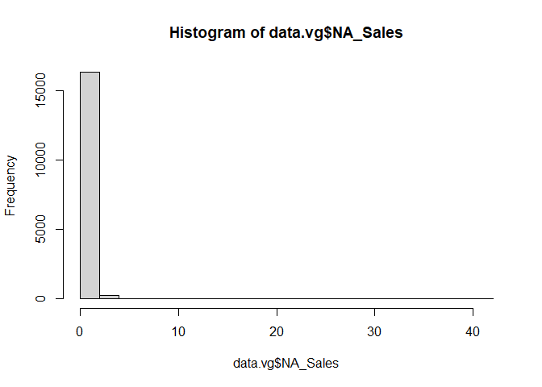
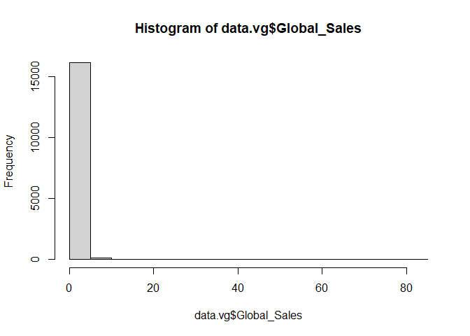
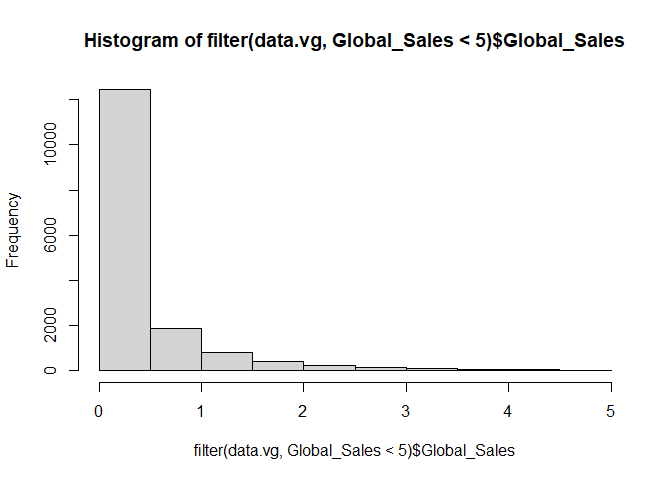
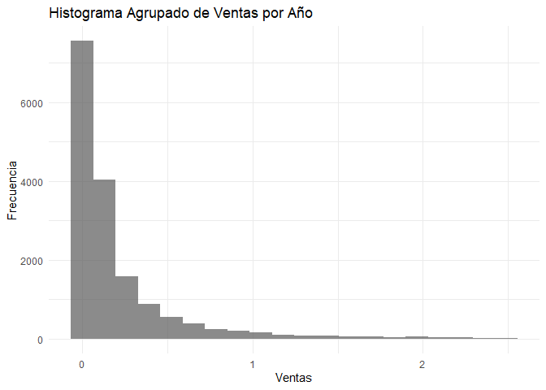

Basic Example
================
Ruben Cabrera
2025-10-01

# Librerias

``` r
#library(mrgsolve)
library(ggplot2)

library(dplyr)
```

    ## 
    ## Attaching package: 'dplyr'

    ## The following objects are masked from 'package:stats':
    ## 
    ##     filter, lag

    ## The following objects are masked from 'package:base':
    ## 
    ##     intersect, setdiff, setequal, union

# Letura de datos

``` r
data_path <- file.path("C://Users/HP/Projects/est_4/unidad_1/010_practica_simple")
data_file <- file.path(data_path, "vgsales.csv")
data.vg.raw <- read.csv(data_file,
                 stringsAsFactors = F,na.strings = ".",header = T,sep=",")
head(data.vg.raw)
```

    ##   Rank                     Name Platform Year        Genre Publisher NA_Sales
    ## 1    1               Wii Sports      Wii 2006       Sports  Nintendo    41.49
    ## 2    2        Super Mario Bros.      NES 1985     Platform  Nintendo    29.08
    ## 3    3           Mario Kart Wii      Wii 2008       Racing  Nintendo    15.85
    ## 4    4        Wii Sports Resort      Wii 2009       Sports  Nintendo    15.75
    ## 5    5 Pokemon Red/Pokemon Blue       GB 1996 Role-Playing  Nintendo    11.27
    ## 6    6                   Tetris       GB 1989       Puzzle  Nintendo    23.20
    ##   EU_Sales JP_Sales Other_Sales Global_Sales
    ## 1    29.02     3.77        8.46        82.74
    ## 2     3.58     6.81        0.77        40.24
    ## 3    12.88     3.79        3.31        35.82
    ## 4    11.01     3.28        2.96        33.00
    ## 5     8.89    10.22        1.00        31.37
    ## 6     2.26     4.22        0.58        30.26

``` r
str(data.vg.raw)
```

    ## 'data.frame':    16598 obs. of  11 variables:
    ##  $ Rank        : int  1 2 3 4 5 6 7 8 9 10 ...
    ##  $ Name        : chr  "Wii Sports" "Super Mario Bros." "Mario Kart Wii" "Wii Sports Resort" ...
    ##  $ Platform    : chr  "Wii" "NES" "Wii" "Wii" ...
    ##  $ Year        : chr  "2006" "1985" "2008" "2009" ...
    ##  $ Genre       : chr  "Sports" "Platform" "Racing" "Sports" ...
    ##  $ Publisher   : chr  "Nintendo" "Nintendo" "Nintendo" "Nintendo" ...
    ##  $ NA_Sales    : num  41.5 29.1 15.8 15.8 11.3 ...
    ##  $ EU_Sales    : num  29.02 3.58 12.88 11.01 8.89 ...
    ##  $ JP_Sales    : num  3.77 6.81 3.79 3.28 10.22 ...
    ##  $ Other_Sales : num  8.46 0.77 3.31 2.96 1 0.58 2.9 2.85 2.26 0.47 ...
    ##  $ Global_Sales: num  82.7 40.2 35.8 33 31.4 ...

``` r
summary(data.vg.raw)
```

    ##       Rank           Name             Platform             Year          
    ##  Min.   :    1   Length:16598       Length:16598       Length:16598      
    ##  1st Qu.: 4151   Class :character   Class :character   Class :character  
    ##  Median : 8300   Mode  :character   Mode  :character   Mode  :character  
    ##  Mean   : 8301                                                           
    ##  3rd Qu.:12450                                                           
    ##  Max.   :16600                                                           
    ##     Genre            Publisher            NA_Sales          EU_Sales      
    ##  Length:16598       Length:16598       Min.   : 0.0000   Min.   : 0.0000  
    ##  Class :character   Class :character   1st Qu.: 0.0000   1st Qu.: 0.0000  
    ##  Mode  :character   Mode  :character   Median : 0.0800   Median : 0.0200  
    ##                                        Mean   : 0.2647   Mean   : 0.1467  
    ##                                        3rd Qu.: 0.2400   3rd Qu.: 0.1100  
    ##                                        Max.   :41.4900   Max.   :29.0200  
    ##     JP_Sales         Other_Sales        Global_Sales    
    ##  Min.   : 0.00000   Min.   : 0.00000   Min.   : 0.0100  
    ##  1st Qu.: 0.00000   1st Qu.: 0.00000   1st Qu.: 0.0600  
    ##  Median : 0.00000   Median : 0.01000   Median : 0.1700  
    ##  Mean   : 0.07778   Mean   : 0.04806   Mean   : 0.5374  
    ##  3rd Qu.: 0.04000   3rd Qu.: 0.04000   3rd Qu.: 0.4700  
    ##  Max.   :10.22000   Max.   :10.57000   Max.   :82.7400

# Limpieza de datos

``` r
data.vg <- data.vg.raw 
data.vg$Platform <- factor(data.vg$Platform)
data.vg$Year <- as.numeric(data.vg$Year)
```

    ## Warning: NAs introduced by coercion

``` r
summary(data.vg)
```

    ##       Rank           Name              Platform         Year     
    ##  Min.   :    1   Length:16598       DS     :2163   Min.   :1980  
    ##  1st Qu.: 4151   Class :character   PS2    :2161   1st Qu.:2003  
    ##  Median : 8300   Mode  :character   PS3    :1329   Median :2007  
    ##  Mean   : 8301                      Wii    :1325   Mean   :2006  
    ##  3rd Qu.:12450                      X360   :1265   3rd Qu.:2010  
    ##  Max.   :16600                      PSP    :1213   Max.   :2020  
    ##                                     (Other):7142   NA's   :271   
    ##     Genre            Publisher            NA_Sales          EU_Sales      
    ##  Length:16598       Length:16598       Min.   : 0.0000   Min.   : 0.0000  
    ##  Class :character   Class :character   1st Qu.: 0.0000   1st Qu.: 0.0000  
    ##  Mode  :character   Mode  :character   Median : 0.0800   Median : 0.0200  
    ##                                        Mean   : 0.2647   Mean   : 0.1467  
    ##                                        3rd Qu.: 0.2400   3rd Qu.: 0.1100  
    ##                                        Max.   :41.4900   Max.   :29.0200  
    ##                                                                           
    ##     JP_Sales         Other_Sales        Global_Sales    
    ##  Min.   : 0.00000   Min.   : 0.00000   Min.   : 0.0100  
    ##  1st Qu.: 0.00000   1st Qu.: 0.00000   1st Qu.: 0.0600  
    ##  Median : 0.00000   Median : 0.01000   Median : 0.1700  
    ##  Mean   : 0.07778   Mean   : 0.04806   Mean   : 0.5374  
    ##  3rd Qu.: 0.04000   3rd Qu.: 0.04000   3rd Qu.: 0.4700  
    ##  Max.   :10.22000   Max.   :10.57000   Max.   :82.7400  
    ## 

``` r
str(data.vg.raw)
```

    ## 'data.frame':    16598 obs. of  11 variables:
    ##  $ Rank        : int  1 2 3 4 5 6 7 8 9 10 ...
    ##  $ Name        : chr  "Wii Sports" "Super Mario Bros." "Mario Kart Wii" "Wii Sports Resort" ...
    ##  $ Platform    : chr  "Wii" "NES" "Wii" "Wii" ...
    ##  $ Year        : chr  "2006" "1985" "2008" "2009" ...
    ##  $ Genre       : chr  "Sports" "Platform" "Racing" "Sports" ...
    ##  $ Publisher   : chr  "Nintendo" "Nintendo" "Nintendo" "Nintendo" ...
    ##  $ NA_Sales    : num  41.5 29.1 15.8 15.8 11.3 ...
    ##  $ EU_Sales    : num  29.02 3.58 12.88 11.01 8.89 ...
    ##  $ JP_Sales    : num  3.77 6.81 3.79 3.28 10.22 ...
    ##  $ Other_Sales : num  8.46 0.77 3.31 2.96 1 0.58 2.9 2.85 2.26 0.47 ...
    ##  $ Global_Sales: num  82.7 40.2 35.8 33 31.4 ...

``` r
unique(data.vg.raw$Year)
```

    ##  [1] "2006" "1985" "2008" "2009" "1996" "1989" "1984" "2005" "1999" "2007"
    ## [11] "2010" "2013" "2004" "1990" "1988" "2002" "2001" "2011" "1998" "2015"
    ## [21] "2012" "2014" "1992" "1997" "1993" "1994" "1982" "2003" "1986" "2000"
    ## [31] "N/A"  "1995" "2016" "1991" "1981" "1987" "1980" "1983" "2020" "2017"

``` r
head(filter(data.vg.raw, Year=="N/A"))
```

    ##   Rank                       Name Platform Year    Genre
    ## 1  180            Madden NFL 2004      PS2  N/A   Sports
    ## 2  378           FIFA Soccer 2004      PS2  N/A   Sports
    ## 3  432 LEGO Batman: The Videogame      Wii  N/A   Action
    ## 4  471 wwe Smackdown vs. Raw 2006      PS2  N/A Fighting
    ## 5  608             Space Invaders     2600  N/A  Shooter
    ## 6  625                  Rock Band     X360  N/A     Misc
    ##                                Publisher NA_Sales EU_Sales JP_Sales Other_Sales
    ## 1                        Electronic Arts     4.26     0.26     0.01        0.71
    ## 2                        Electronic Arts     0.59     2.36     0.04        0.51
    ## 3 Warner Bros. Interactive Entertainment     1.86     1.02     0.00        0.29
    ## 4                                    N/A     1.57     1.02     0.00        0.41
    ## 5                                  Atari     2.36     0.14     0.00        0.03
    ## 6                        Electronic Arts     1.93     0.34     0.00        0.21
    ##   Global_Sales
    ## 1         5.23
    ## 2         3.49
    ## 3         3.17
    ## 4         3.00
    ## 5         2.53
    ## 6         2.48

``` r
unique(data.vg$Platform)
```

    ##  [1] Wii  NES  GB   DS   X360 PS3  PS2  SNES GBA  3DS  PS4  N64  PS   XB   PC  
    ## [16] 2600 PSP  XOne GC   WiiU GEN  DC   PSV  SAT  SCD  WS   NG   TG16 3DO  GG  
    ## [31] PCFX
    ## 31 Levels: 2600 3DO 3DS DC DS GB GBA GC GEN GG N64 NES NG PC PCFX PS ... XOne

``` r
filter(data.vg, Name=="FIFA 15")
```

    ##   Rank    Name Platform Year  Genre       Publisher NA_Sales EU_Sales JP_Sales
    ## 1  125 FIFA 15      PS4 2014 Sports Electronic Arts     0.79     4.29     0.05
    ## 2  220 FIFA 15      PS3 2014 Sports Electronic Arts     0.57     3.14     0.04
    ## 3  450 FIFA 15     X360 2014 Sports Electronic Arts     0.78     2.02     0.00
    ## 4  762 FIFA 15     XOne 2014 Sports Electronic Arts     0.60     1.41     0.00
    ## 5 2477 FIFA 15      PSV 2014 Sports Electronic Arts     0.13     0.48     0.04
    ## 6 2718 FIFA 15      Wii 2014 Sports Electronic Arts     0.24     0.46     0.00
    ## 7 4370 FIFA 15      3DS 2014 Sports Electronic Arts     0.09     0.33     0.00
    ## 8 5913 FIFA 15       PC 2014 Sports Electronic Arts     0.00     0.27     0.00
    ##   Other_Sales Global_Sales
    ## 1        1.47         6.59
    ## 2        1.07         4.82
    ## 3        0.30         3.11
    ## 4        0.14         2.15
    ## 5        0.19         0.84
    ## 6        0.06         0.76
    ## 7        0.03         0.45
    ## 8        0.03         0.30

``` r
hist(data.vg$NA_Sales )
```

<!-- -->

Calculemos la proporcion de los datos missings Esto nos ayudará a
decidir la estrategia (borrar vs. llenar)

``` r
# Contar NA por columna
na_por_columna <- colSums(is.na(data.vg))
print("NA por columna:")
```

    ## [1] "NA por columna:"

``` r
print(na_por_columna)
```

    ##         Rank         Name     Platform         Year        Genre    Publisher 
    ##            0            0            0          271            0            0 
    ##     NA_Sales     EU_Sales     JP_Sales  Other_Sales Global_Sales 
    ##            0            0            0            0            0

``` r
# Porcentaje de NA por columna
porcentaje_na <- colMeans(is.na(data.vg)) * 100
print("Porcentaje de NA por columna:")
```

    ## [1] "Porcentaje de NA por columna:"

``` r
print(round(porcentaje_na, 2))
```

    ##         Rank         Name     Platform         Year        Genre    Publisher 
    ##         0.00         0.00         0.00         1.63         0.00         0.00 
    ##     NA_Sales     EU_Sales     JP_Sales  Other_Sales Global_Sales 
    ##         0.00         0.00         0.00         0.00         0.00

``` r
unique(data.vg$Publisher)
```

    ##   [1] "Nintendo"                              
    ##   [2] "Microsoft Game Studios"                
    ##   [3] "Take-Two Interactive"                  
    ##   [4] "Sony Computer Entertainment"           
    ##   [5] "Activision"                            
    ##   [6] "Ubisoft"                               
    ##   [7] "Bethesda Softworks"                    
    ##   [8] "Electronic Arts"                       
    ##   [9] "Sega"                                  
    ##  [10] "SquareSoft"                            
    ##  [11] "Atari"                                 
    ##  [12] "505 Games"                             
    ##  [13] "Capcom"                                
    ##  [14] "GT Interactive"                        
    ##  [15] "Konami Digital Entertainment"          
    ##  [16] "Sony Computer Entertainment Europe"    
    ##  [17] "Square Enix"                           
    ##  [18] "LucasArts"                             
    ##  [19] "Virgin Interactive"                    
    ##  [20] "Warner Bros. Interactive Entertainment"
    ##  [21] "Universal Interactive"                 
    ##  [22] "Eidos Interactive"                     
    ##  [23] "RedOctane"                             
    ##  [24] "Vivendi Games"                         
    ##  [25] "Enix Corporation"                      
    ##  [26] "Namco Bandai Games"                    
    ##  [27] "Palcom"                                
    ##  [28] "Hasbro Interactive"                    
    ##  [29] "THQ"                                   
    ##  [30] "Fox Interactive"                       
    ##  [31] "Acclaim Entertainment"                 
    ##  [32] "MTV Games"                             
    ##  [33] "Disney Interactive Studios"            
    ##  [34] "N/A"                                   
    ##  [35] "Majesco Entertainment"                 
    ##  [36] "Codemasters"                           
    ##  [37] "Red Orb"                               
    ##  [38] "Level 5"                               
    ##  [39] "Arena Entertainment"                   
    ##  [40] "Midway Games"                          
    ##  [41] "JVC"                                   
    ##  [42] "Deep Silver"                           
    ##  [43] "989 Studios"                           
    ##  [44] "NCSoft"                                
    ##  [45] "UEP Systems"                           
    ##  [46] "Parker Bros."                          
    ##  [47] "Maxis"                                 
    ##  [48] "Imagic"                                
    ##  [49] "Tecmo Koei"                            
    ##  [50] "Valve Software"                        
    ##  [51] "ASCII Entertainment"                   
    ##  [52] "Mindscape"                             
    ##  [53] "Infogrames"                            
    ##  [54] "Unknown"                               
    ##  [55] "Square"                                
    ##  [56] "Valve"                                 
    ##  [57] "Activision Value"                      
    ##  [58] "Banpresto"                             
    ##  [59] "D3Publisher"                           
    ##  [60] "Oxygen Interactive"                    
    ##  [61] "Red Storm Entertainment"               
    ##  [62] "Video System"                          
    ##  [63] "Hello Games"                           
    ##  [64] "Global Star"                           
    ##  [65] "Gotham Games"                          
    ##  [66] "Westwood Studios"                      
    ##  [67] "GungHo"                                
    ##  [68] "Crave Entertainment"                   
    ##  [69] "Hudson Soft"                           
    ##  [70] "Coleco"                                
    ##  [71] "Rising Star Games"                     
    ##  [72] "Atlus"                                 
    ##  [73] "TDK Mediactive"                        
    ##  [74] "ASC Games"                             
    ##  [75] "Zoo Games"                             
    ##  [76] "Accolade"                              
    ##  [77] "Sony Online Entertainment"             
    ##  [78] "3DO"                                   
    ##  [79] "RTL"                                   
    ##  [80] "Natsume"                               
    ##  [81] "Focus Home Interactive"                
    ##  [82] "Alchemist"                             
    ##  [83] "Black Label Games"                     
    ##  [84] "SouthPeak Games"                       
    ##  [85] "Mastertronic"                          
    ##  [86] "Ocean"                                 
    ##  [87] "Zoo Digital Publishing"                
    ##  [88] "Psygnosis"                             
    ##  [89] "City Interactive"                      
    ##  [90] "Empire Interactive"                    
    ##  [91] "Success"                               
    ##  [92] "Compile"                               
    ##  [93] "Russel"                                
    ##  [94] "Taito"                                 
    ##  [95] "Agetec"                                
    ##  [96] "GSP"                                   
    ##  [97] "Microprose"                            
    ##  [98] "Play It"                               
    ##  [99] "Slightly Mad Studios"                  
    ## [100] "Tomy Corporation"                      
    ## [101] "Sammy Corporation"                     
    ## [102] "Koch Media"                            
    ## [103] "Game Factory"                          
    ## [104] "Titus"                                 
    ## [105] "Marvelous Entertainment"               
    ## [106] "Genki"                                 
    ## [107] "Mojang"                                
    ## [108] "Pinnacle"                              
    ## [109] "CTO SpA"                               
    ## [110] "TalonSoft"                             
    ## [111] "Crystal Dynamics"                      
    ## [112] "SCi"                                   
    ## [113] "Quelle"                                
    ## [114] "mixi, Inc"                             
    ## [115] "Rage Software"                         
    ## [116] "Ubisoft Annecy"                        
    ## [117] "Scholastic Inc."                       
    ## [118] "Interplay"                             
    ## [119] "Mystique"                              
    ## [120] "ChunSoft"                              
    ## [121] "Square EA"                             
    ## [122] "20th Century Fox Video Games"          
    ## [123] "Avanquest Software"                    
    ## [124] "Hudson Entertainment"                  
    ## [125] "Nordic Games"                          
    ## [126] "Men-A-Vision"                          
    ## [127] "Nobilis"                               
    ## [128] "Big Ben Interactive"                   
    ## [129] "Touchstone"                            
    ## [130] "Spike"                                 
    ## [131] "Jester Interactive"                    
    ## [132] "Nippon Ichi Software"                  
    ## [133] "LEGO Media"                            
    ## [134] "Quest"                                 
    ## [135] "Illusion Softworks"                    
    ## [136] "Tigervision"                           
    ## [137] "Funbox Media"                          
    ## [138] "Rocket Company"                        
    ## [139] "Metro 3D"                              
    ## [140] "Mattel Interactive"                    
    ## [141] "IE Institute"                          
    ## [142] "Rondomedia"                            
    ## [143] "Sony Computer Entertainment America"   
    ## [144] "Universal Gamex"                       
    ## [145] "Ghostlight"                            
    ## [146] "Wizard Video Games"                    
    ## [147] "BMG Interactive Entertainment"         
    ## [148] "PQube"                                 
    ## [149] "Trion Worlds"                          
    ## [150] "Laguna"                                
    ## [151] "Ignition Entertainment"                
    ## [152] "Takara"                                
    ## [153] "Kadokawa Shoten"                       
    ## [154] "Destineer"                             
    ## [155] "Enterbrain"                            
    ## [156] "Xseed Games"                           
    ## [157] "Imagineer"                             
    ## [158] "System 3 Arcade Software"              
    ## [159] "CPG Products"                          
    ## [160] "Aruze Corp"                            
    ## [161] "Gamebridge"                            
    ## [162] "Midas Interactive Entertainment"       
    ## [163] "Jaleco"                                
    ## [164] "Answer Software"                       
    ## [165] "XS Games"                              
    ## [166] "Activision Blizzard"                   
    ## [167] "Pack In Soft"                          
    ## [168] "Rebellion"                             
    ## [169] "Xplosiv"                               
    ## [170] "Ultravision"                           
    ## [171] "GameMill Entertainment"                
    ## [172] "Wanadoo"                               
    ## [173] "NovaLogic"                             
    ## [174] "Telltale Games"                        
    ## [175] "Epoch"                                 
    ## [176] "BAM! Entertainment"                    
    ## [177] "Knowledge Adventure"                   
    ## [178] "Mastiff"                               
    ## [179] "Tetris Online"                         
    ## [180] "Harmonix Music Systems"                
    ## [181] "ESP"                                   
    ## [182] "TYO"                                   
    ## [183] "Telegames"                             
    ## [184] "Mud Duck Productions"                  
    ## [185] "Screenlife"                            
    ## [186] "Pioneer LDC"                           
    ## [187] "Magical Company"                       
    ## [188] "Mentor Interactive"                    
    ## [189] "Kemco"                                 
    ## [190] "Human Entertainment"                   
    ## [191] "Avanquest"                             
    ## [192] "Data Age"                              
    ## [193] "Electronic Arts Victor"                
    ## [194] "Black Bean Games"                      
    ## [195] "Jack of All Games"                     
    ## [196] "989 Sports"                            
    ## [197] "Takara Tomy"                           
    ## [198] "Media Rings"                           
    ## [199] "Elf"                                   
    ## [200] "Kalypso Media"                         
    ## [201] "Starfish"                              
    ## [202] "Zushi Games"                           
    ## [203] "Jorudan"                               
    ## [204] "Destination Software, Inc"             
    ## [205] "New"                                   
    ## [206] "Brash Entertainment"                   
    ## [207] "ITT Family Games"                      
    ## [208] "PopCap Games"                          
    ## [209] "Home Entertainment Suppliers"          
    ## [210] "Ackkstudios"                           
    ## [211] "Starpath Corp."                        
    ## [212] "P2 Games"                              
    ## [213] "BPS"                                   
    ## [214] "Gathering of Developers"               
    ## [215] "NewKidCo"                              
    ## [216] "Storm City Games"                      
    ## [217] "CokeM Interactive"                     
    ## [218] "CBS Electronics"                       
    ## [219] "Magix"                                 
    ## [220] "Marvelous Interactive"                 
    ## [221] "Nihon Falcom Corporation"              
    ## [222] "Wargaming.net"                         
    ## [223] "Angel Studios"                         
    ## [224] "Arc System Works"                      
    ## [225] "Playmates"                             
    ## [226] "SNK Playmore"                          
    ## [227] "Hamster Corporation"                   
    ## [228] "From Software"                         
    ## [229] "Nippon Columbia"                       
    ## [230] "Nichibutsu"                            
    ## [231] "Little Orbit"                          
    ## [232] "Conspiracy Entertainment"              
    ## [233] "DTP Entertainment"                     
    ## [234] "Hect"                                  
    ## [235] "Mumbo Jumbo"                           
    ## [236] "Pacific Century Cyber Works"           
    ## [237] "Indie Games"                           
    ## [238] "Liquid Games"                          
    ## [239] "NEC"                                   
    ## [240] "Axela"                                 
    ## [241] "ArtDink"                               
    ## [242] "Sunsoft"                               
    ## [243] "Gust"                                  
    ## [244] "SNK"                                   
    ## [245] "NEC Interchannel"                      
    ## [246] "FuRyu"                                 
    ## [247] "Xing Entertainment"                    
    ## [248] "ValuSoft"                              
    ## [249] "Victor Interactive"                    
    ## [250] "Detn8 Games"                           
    ## [251] "American Softworks"                    
    ## [252] "Nordcurrent"                           
    ## [253] "Bomb"                                  
    ## [254] "Falcom Corporation"                    
    ## [255] "AQ Interactive"                        
    ## [256] "CCP"                                   
    ## [257] "Milestone S.r.l."                      
    ## [258] "Sears"                                 
    ## [259] "JoWood Productions"                    
    ## [260] "Seta Corporation"                      
    ## [261] "On Demand"                             
    ## [262] "NCS"                                   
    ## [263] "Aspyr"                                 
    ## [264] "Gremlin Interactive Ltd"               
    ## [265] "Agatsuma Entertainment"                
    ## [266] "Compile Heart"                         
    ## [267] "Culture Brain"                         
    ## [268] "Mad Catz"                              
    ## [269] "Shogakukan"                            
    ## [270] "Merscom LLC"                           
    ## [271] "Rebellion Developments"                
    ## [272] "Nippon Telenet"                        
    ## [273] "TDK Core"                              
    ## [274] "bitComposer Games"                     
    ## [275] "Foreign Media Games"                   
    ## [276] "Astragon"                              
    ## [277] "SSI"                                   
    ## [278] "Kadokawa Games"                        
    ## [279] "Idea Factory"                          
    ## [280] "Performance Designed Products"         
    ## [281] "Asylum Entertainment"                  
    ## [282] "Core Design Ltd."                      
    ## [283] "PlayV"                                 
    ## [284] "UFO Interactive"                       
    ## [285] "Idea Factory International"            
    ## [286] "Playlogic Game Factory"                
    ## [287] "Essential Games"                       
    ## [288] "Adeline Software"                      
    ## [289] "Funcom"                                
    ## [290] "Panther Software"                      
    ## [291] "Blast! Entertainment Ltd"              
    ## [292] "Game Life"                             
    ## [293] "DSI Games"                             
    ## [294] "Avalon Interactive"                    
    ## [295] "Popcorn Arcade"                        
    ## [296] "Neko Entertainment"                    
    ## [297] "Vir2L Studios"                         
    ## [298] "Aques"                                 
    ## [299] "Syscom"                                
    ## [300] "White Park Bay Software"               
    ## [301] "System 3"                              
    ## [302] "Vatical Entertainment"                 
    ## [303] "Daedalic"                              
    ## [304] "EA Games"                              
    ## [305] "Media Factory"                         
    ## [306] "Vic Tokai"                             
    ## [307] "The Adventure Company"                 
    ## [308] "Game Arts"                             
    ## [309] "Broccoli"                              
    ## [310] "Acquire"                               
    ## [311] "General Entertainment"                 
    ## [312] "Excalibur Publishing"                  
    ## [313] "Imadio"                                
    ## [314] "Swing! Entertainment"                  
    ## [315] "Sony Music Entertainment"              
    ## [316] "Aqua Plus"                             
    ## [317] "Paradox Interactive"                   
    ## [318] "Hip Interactive"                       
    ## [319] "DreamCatcher Interactive"              
    ## [320] "Tripwire Interactive"                  
    ## [321] "Sting"                                 
    ## [322] "Yacht Club Games"                      
    ## [323] "SCS Software"                          
    ## [324] "Bigben Interactive"                    
    ## [325] "Havas Interactive"                     
    ## [326] "Slitherine Software"                   
    ## [327] "Graffiti"                              
    ## [328] "Funsta"                                
    ## [329] "Telstar"                               
    ## [330] "U.S. Gold"                             
    ## [331] "DreamWorks Interactive"                
    ## [332] "Data Design Interactive"               
    ## [333] "MTO"                                   
    ## [334] "DHM Interactive"                       
    ## [335] "FunSoft"                               
    ## [336] "SPS"                                   
    ## [337] "Bohemia Interactive"                   
    ## [338] "Reef Entertainment"                    
    ## [339] "Tru Blu Entertainment"                 
    ## [340] "Moss"                                  
    ## [341] "T&E Soft"                              
    ## [342] "O-Games"                               
    ## [343] "Aksys Games"                           
    ## [344] "NDA Productions"                       
    ## [345] "Data East"                             
    ## [346] "Time Warner Interactive"               
    ## [347] "Gainax Network Systems"                
    ## [348] "Daito"                                 
    ## [349] "O3 Entertainment"                      
    ## [350] "Gameloft"                              
    ## [351] "Xicat Interactive"                     
    ## [352] "Simon & Schuster Interactive"          
    ## [353] "Valcon Games"                          
    ## [354] "PopTop Software"                       
    ## [355] "TOHO"                                  
    ## [356] "HMH Interactive"                       
    ## [357] "5pb"                                   
    ## [358] "Cave"                                  
    ## [359] "CDV Software Entertainment"            
    ## [360] "Microids"                              
    ## [361] "PM Studios"                            
    ## [362] "Paon"                                  
    ## [363] "Micro Cabin"                           
    ## [364] "GameTek"                               
    ## [365] "Benesse"                               
    ## [366] "Type-Moon"                             
    ## [367] "Enjoy Gaming ltd."                     
    ## [368] "Asmik Corp"                            
    ## [369] "Interplay Productions"                 
    ## [370] "Asmik Ace Entertainment"               
    ## [371] "inXile Entertainment"                  
    ## [372] "Image Epoch"                           
    ## [373] "Phantom EFX"                           
    ## [374] "Evolved Games"                         
    ## [375] "responDESIGN"                          
    ## [376] "Culture Publishers"                    
    ## [377] "Griffin International"                 
    ## [378] "Hackberry"                             
    ## [379] "Hearty Robin"                          
    ## [380] "Nippon Amuse"                          
    ## [381] "Origin Systems"                        
    ## [382] "Seventh Chord"                         
    ## [383] "Mitsui"                                
    ## [384] "Milestone"                             
    ## [385] "Abylight"                              
    ## [386] "Flight-Plan"                           
    ## [387] "Glams"                                 
    ## [388] "Locus"                                 
    ## [389] "Warp"                                  
    ## [390] "Daedalic Entertainment"                
    ## [391] "Alternative Software"                  
    ## [392] "Myelin Media"                          
    ## [393] "Mercury Games"                         
    ## [394] "Irem Software Engineering"             
    ## [395] "Sunrise Interactive"                   
    ## [396] "Elite"                                 
    ## [397] "Evolution Games"                       
    ## [398] "Tivola"                                
    ## [399] "Global A Entertainment"                
    ## [400] "Edia"                                  
    ## [401] "Athena"                                
    ## [402] "Aria"                                  
    ## [403] "Gamecock"                              
    ## [404] "Tommo"                                 
    ## [405] "Altron"                                
    ## [406] "Happinet"                              
    ## [407] "iWin"                                  
    ## [408] "Media Works"                           
    ## [409] "Fortyfive"                             
    ## [410] "Revolution Software"                   
    ## [411] "Imax"                                  
    ## [412] "Crimson Cow"                           
    ## [413] "10TACLE Studios"                       
    ## [414] "Groove Games"                          
    ## [415] "Pack-In-Video"                         
    ## [416] "Insomniac Games"                       
    ## [417] "Ascaron Entertainment GmbH"            
    ## [418] "Asgard"                                
    ## [419] "Ecole"                                 
    ## [420] "Yumedia"                               
    ## [421] "Phenomedia"                            
    ## [422] "HAL Laboratory"                        
    ## [423] "Grand Prix Games"                      
    ## [424] "DigiCube"                              
    ## [425] "Creative Core"                         
    ## [426] "Kaga Create"                           
    ## [427] "WayForward Technologies"               
    ## [428] "LSP Games"                             
    ## [429] "ASCII Media Works"                     
    ## [430] "Coconuts Japan"                        
    ## [431] "Arika"                                 
    ## [432] "Ertain"                                
    ## [433] "Marvel Entertainment"                  
    ## [434] "Prototype"                             
    ## [435] "TopWare Interactive"                   
    ## [436] "Phantagram"                            
    ## [437] "1C Company"                            
    ## [438] "The Learning Company"                  
    ## [439] "TechnoSoft"                            
    ## [440] "Vap"                                   
    ## [441] "Misawa"                                
    ## [442] "Tradewest"                             
    ## [443] "Team17 Software"                       
    ## [444] "Yeti"                                  
    ## [445] "Pow"                                   
    ## [446] "Navarre Corp"                          
    ## [447] "MediaQuest"                            
    ## [448] "Max Five"                              
    ## [449] "Comfort"                               
    ## [450] "Monte Christo Multimedia"              
    ## [451] "Pony Canyon"                           
    ## [452] "Riverhillsoft"                         
    ## [453] "Summitsoft"                            
    ## [454] "Milestone S.r.l"                       
    ## [455] "Playmore"                              
    ## [456] "MLB.com"                               
    ## [457] "Kool Kizz"                             
    ## [458] "Flashpoint Games"                      
    ## [459] "49Games"                               
    ## [460] "Legacy Interactive"                    
    ## [461] "Alawar Entertainment"                  
    ## [462] "CyberFront"                            
    ## [463] "Cloud Imperium Games Corporation"      
    ## [464] "Societa"                               
    ## [465] "Virtual Play Games"                    
    ## [466] "Interchannel"                          
    ## [467] "Sonnet"                                
    ## [468] "Experience Inc."                       
    ## [469] "Zenrin"                                
    ## [470] "Iceberg Interactive"                   
    ## [471] "Ivolgamus"                             
    ## [472] "2D Boy"                                
    ## [473] "MC2 Entertainment"                     
    ## [474] "Kando Games"                           
    ## [475] "Just Flight"                           
    ## [476] "Office Create"                         
    ## [477] "Mamba Games"                           
    ## [478] "Fields"                                
    ## [479] "Princess Soft"                         
    ## [480] "Maximum Family Games"                  
    ## [481] "Berkeley"                              
    ## [482] "Fuji"                                  
    ## [483] "Dusenberry Martin Racing"              
    ## [484] "imageepoch Inc."                       
    ## [485] "Big Fish Games"                        
    ## [486] "Her Interactive"                       
    ## [487] "Kamui"                                 
    ## [488] "ASK"                                   
    ## [489] "Headup Games"                          
    ## [490] "KSS"                                   
    ## [491] "Cygames"                               
    ## [492] "KID"                                   
    ## [493] "Quinrose"                              
    ## [494] "Sunflowers"                            
    ## [495] "dramatic create"                       
    ## [496] "TGL"                                   
    ## [497] "Encore"                                
    ## [498] "Extreme Entertainment Group"           
    ## [499] "Intergrow"                             
    ## [500] "G.Rev"                                 
    ## [501] "Sweets"                                
    ## [502] "Kokopeli Digital Studios"              
    ## [503] "Number None"                           
    ## [504] "Nexon"                                 
    ## [505] "id Software"                           
    ## [506] "BushiRoad"                             
    ## [507] "Tryfirst"                              
    ## [508] "Strategy First"                        
    ## [509] "7G//AMES"                              
    ## [510] "GN Software"                           
    ## [511] "Yuke's"                                
    ## [512] "Easy Interactive"                      
    ## [513] "Licensed 4U"                           
    ## [514] "FuRyu Corporation"                     
    ## [515] "Lexicon Entertainment"                 
    ## [516] "Paon Corporation"                      
    ## [517] "Kids Station"                          
    ## [518] "GOA"                                   
    ## [519] "Graphsim Entertainment"                
    ## [520] "King Records"                          
    ## [521] "Introversion Software"                 
    ## [522] "Minato Station"                        
    ## [523] "Devolver Digital"                      
    ## [524] "Blue Byte"                             
    ## [525] "Gaga"                                  
    ## [526] "Yamasa Entertainment"                  
    ## [527] "Plenty"                                
    ## [528] "Views"                                 
    ## [529] "fonfun"                                
    ## [530] "NetRevo"                               
    ## [531] "Codemasters Online"                    
    ## [532] "Quintet"                               
    ## [533] "Phoenix Games"                         
    ## [534] "Dorart"                                
    ## [535] "Marvelous Games"                       
    ## [536] "Focus Multimedia"                      
    ## [537] "Imageworks"                            
    ## [538] "Karin Entertainment"                   
    ## [539] "Aerosoft"                              
    ## [540] "Technos Japan Corporation"             
    ## [541] "Gakken"                                
    ## [542] "Mirai Shounen"                         
    ## [543] "Datam Polystar"                        
    ## [544] "Saurus"                                
    ## [545] "HuneX"                                 
    ## [546] "Revolution (Japan)"                    
    ## [547] "Giza10"                                
    ## [548] "Visco"                                 
    ## [549] "Alvion"                                
    ## [550] "Mycom"                                 
    ## [551] "Giga"                                  
    ## [552] "Warashi"                               
    ## [553] "System Soft"                           
    ## [554] "Sold Out"                              
    ## [555] "Lighthouse Interactive"                
    ## [556] "Masque Publishing"                     
    ## [557] "RED Entertainment"                     
    ## [558] "Michaelsoft"                           
    ## [559] "Media Entertainment"                   
    ## [560] "New World Computing"                   
    ## [561] "Genterprise"                           
    ## [562] "Interworks Unlimited, Inc."            
    ## [563] "Boost On"                              
    ## [564] "Stainless Games"                       
    ## [565] "EON Digital Entertainment"             
    ## [566] "Epic Games"                            
    ## [567] "Naxat Soft"                            
    ## [568] "Ascaron Entertainment"                 
    ## [569] "Piacci"                                
    ## [570] "Nitroplus"                             
    ## [571] "Paradox Development"                   
    ## [572] "Otomate"                               
    ## [573] "Ongakukan"                             
    ## [574] "Commseed"                              
    ## [575] "Inti Creates"                          
    ## [576] "Takuyo"                                
    ## [577] "Interchannel-Holon"                    
    ## [578] "Rain Games"                            
    ## [579] "UIG Entertainment"

``` r
filter(data.vg, Publisher==" ")
```

    ##  [1] Rank         Name         Platform     Year         Genre       
    ##  [6] Publisher    NA_Sales     EU_Sales     JP_Sales     Other_Sales 
    ## [11] Global_Sales
    ## <0 rows> (or 0-length row.names)

A año le faltan 271 valores (aprox 1,63%). Dado que este porcentajee es
muy pequeño, la estrategia más segura y sencilla es eliminar estas
filas. Intentar ‘adivinar’ (imputar) el año o la editorial podría
generar interferencias y llevar a conclusiones incorrectas. Queremos que
nuestro análisis se base en datos completos y precisos. Usaremos
.dropna() para eliminar las filas que contienen valores NaN en las
columnas especificadas.

``` r
# DataFrame de ejemplo con missing values

print("DataFrame original:")
```

    ## [1] "DataFrame original:"

``` r
print(head(data.vg))
```

    ##   Rank                     Name Platform Year        Genre Publisher NA_Sales
    ## 1    1               Wii Sports      Wii 2006       Sports  Nintendo    41.49
    ## 2    2        Super Mario Bros.      NES 1985     Platform  Nintendo    29.08
    ## 3    3           Mario Kart Wii      Wii 2008       Racing  Nintendo    15.85
    ## 4    4        Wii Sports Resort      Wii 2009       Sports  Nintendo    15.75
    ## 5    5 Pokemon Red/Pokemon Blue       GB 1996 Role-Playing  Nintendo    11.27
    ## 6    6                   Tetris       GB 1989       Puzzle  Nintendo    23.20
    ##   EU_Sales JP_Sales Other_Sales Global_Sales
    ## 1    29.02     3.77        8.46        82.74
    ## 2     3.58     6.81        0.77        40.24
    ## 3    12.88     3.79        3.31        35.82
    ## 4    11.01     3.28        2.96        33.00
    ## 5     8.89    10.22        1.00        31.37
    ## 6     2.26     4.22        0.58        30.26

``` r
cat("Filas originales:", nrow(data.vg), "\n\n")
```

    ## Filas originales: 16598

``` r
# Método 1: na.omit() - Elimina filas con cualquier NA
df_sin_na <- na.omit(data.vg)
print("Con na.omit():")
```

    ## [1] "Con na.omit():"

``` r
print(head(df_sin_na))
```

    ##   Rank                     Name Platform Year        Genre Publisher NA_Sales
    ## 1    1               Wii Sports      Wii 2006       Sports  Nintendo    41.49
    ## 2    2        Super Mario Bros.      NES 1985     Platform  Nintendo    29.08
    ## 3    3           Mario Kart Wii      Wii 2008       Racing  Nintendo    15.85
    ## 4    4        Wii Sports Resort      Wii 2009       Sports  Nintendo    15.75
    ## 5    5 Pokemon Red/Pokemon Blue       GB 1996 Role-Playing  Nintendo    11.27
    ## 6    6                   Tetris       GB 1989       Puzzle  Nintendo    23.20
    ##   EU_Sales JP_Sales Other_Sales Global_Sales
    ## 1    29.02     3.77        8.46        82.74
    ## 2     3.58     6.81        0.77        40.24
    ## 3    12.88     3.79        3.31        35.82
    ## 4    11.01     3.28        2.96        33.00
    ## 5     8.89    10.22        1.00        31.37
    ## 6     2.26     4.22        0.58        30.26

``` r
cat("Filas después de na.omit():", nrow(df_sin_na), "\n\n")
```

    ## Filas después de na.omit(): 16327

``` r
# Método 2: complete.cases() - Más control
df_completo <- data.vg[complete.cases(data.vg), ]
print("Con complete.cases():")
```

    ## [1] "Con complete.cases():"

``` r
print(head(df_completo))
```

    ##   Rank                     Name Platform Year        Genre Publisher NA_Sales
    ## 1    1               Wii Sports      Wii 2006       Sports  Nintendo    41.49
    ## 2    2        Super Mario Bros.      NES 1985     Platform  Nintendo    29.08
    ## 3    3           Mario Kart Wii      Wii 2008       Racing  Nintendo    15.85
    ## 4    4        Wii Sports Resort      Wii 2009       Sports  Nintendo    15.75
    ## 5    5 Pokemon Red/Pokemon Blue       GB 1996 Role-Playing  Nintendo    11.27
    ## 6    6                   Tetris       GB 1989       Puzzle  Nintendo    23.20
    ##   EU_Sales JP_Sales Other_Sales Global_Sales
    ## 1    29.02     3.77        8.46        82.74
    ## 2     3.58     6.81        0.77        40.24
    ## 3    12.88     3.79        3.31        35.82
    ## 4    11.01     3.28        2.96        33.00
    ## 5     8.89    10.22        1.00        31.37
    ## 6     2.26     4.22        0.58        30.26

``` r
cat("Filas después de complete.cases():", nrow(df_completo), "\n")
```

    ## Filas después de complete.cases(): 16327

``` r
data.vg <- data.vg[complete.cases(data.vg),]
dim(data.vg)
```

    ## [1] 16327    11

``` r
summary(data.vg$Global_Sales)
```

    ##    Min. 1st Qu.  Median    Mean 3rd Qu.    Max. 
    ##  0.0100  0.0600  0.1700  0.5402  0.4800 82.7400

``` r
hist(data.vg$Global_Sales)
```

<!-- -->

``` r
hist(filter(data.vg, Global_Sales < 5)$Global_Sales)
```

<!-- -->

``` r
set.seed(13)
N <- dim(data.vg)[1]
indices_muestra <- sample(1:N, 200, replace = TRUE)
data.muestra <- data.vg[indices_muestra,];data.muestra
```

    ##         Rank
    ## 14002  14003
    ## 16400  16402
    ## 9296    9297
    ## 6079    6080
    ## 14121  14122
    ## 726      727
    ## 4939    4940
    ## 954      955
    ## 8215    8216
    ## 2728    2729
    ## 10726  10727
    ## 8547    8548
    ## 9357    9358
    ## 4404    4405
    ## 6225    6226
    ## 7625    7626
    ## 7151    7152
    ## 6084    6085
    ## 7688    7689
    ## 12018  12019
    ## 9124    9125
    ## 3118    3119
    ## 11843  11844
    ## 1861    1862
    ## 5768    5769
    ## 7988    7989
    ## 2103    2104
    ## 14077  14078
    ## 5322    5323
    ## 8889    8890
    ## 11524  11525
    ## 10333  10334
    ## 11231  11232
    ## 3903    3904
    ## 2664    2665
    ## 7143    7144
    ## 13611  13612
    ## 3453    3454
    ## 577      577
    ## 5571    5572
    ## 6892    6893
    ## 15315  15317
    ## 14439  14441
    ## 6961    6962
    ## 9294    9295
    ## 11250  11251
    ## 9851    9852
    ## 5262    5263
    ## 15479  15481
    ## 12025  12026
    ## 3943    3944
    ## 9845    9846
    ## 4801    4802
    ## 16514  16516
    ## 1411    1412
    ## 13584  13585
    ## 9670    9671
    ## 6054    6055
    ## 15534  15536
    ## 6466    6467
    ## 16440  16442
    ## 4856    4857
    ## 3437    3438
    ## 8445    8446
    ## 6701    6702
    ## 13539  13540
    ## 3274    3275
    ## 5684    5685
    ## 9475    9476
    ## 11975  11976
    ## 1479    1480
    ## 2977    2978
    ## 7964    7965
    ## 10693  10694
    ## 10291  10292
    ## 12352  12353
    ## 12931  12932
    ## 14245  14247
    ## 13220  13221
    ## 9964    9965
    ## 2656    2657
    ## 13344  13345
    ## 12927  12928
    ## 11573  11574
    ## 14281  14283
    ## 6083    6084
    ## 13106  13107
    ## 10823  10824
    ## 4629    4630
    ## 15575  15577
    ## 12474  12475
    ## 10192  10193
    ## 11846  11847
    ## 1745    1746
    ## 4797    4798
    ## 7268    7269
    ## 3939    3940
    ## 11350  11351
    ## 6379    6380
    ## 7165    7166
    ## 6900    6901
    ## 1659    1660
    ## 8146    8147
    ## 7560    7561
    ## 153      153
    ## 2822    2823
    ## 8473    8474
    ## 6164    6165
    ## 13320  13321
    ## 8849    8850
    ## 6177    6178
    ## 13340  13341
    ## 14658  14660
    ## 3038    3039
    ## 12446  12447
    ## 12054  12055
    ## 13570  13571
    ## 525      525
    ## 11609  11610
    ## 6892.1  6893
    ## 8945    8946
    ## 7807    7808
    ## 4990    4991
    ## 12735  12736
    ## 1101    1102
    ## 12452  12453
    ## 4484    4485
    ## 6289    6290
    ## 13792  13793
    ## 11891  11892
    ## 7477    7478
    ## 2192    2193
    ## 11615  11616
    ## 8324    8325
    ## 12792  12793
    ## 8234    8235
    ## 4563    4564
    ## 10345  10346
    ## 13423  13424
    ## 9224    9225
    ## 7957    7958
    ## 15020  15022
    ## 14150  14151
    ## 3501    3502
    ## 8899    8900
    ## 1870    1871
    ## 10762  10763
    ## 2835    2836
    ## 12190  12191
    ## 7958    7959
    ## 5595    5596
    ## 13950  13951
    ## 6211    6212
    ## 6329    6330
    ## 10870  10871
    ## 11379  11380
    ## 14620  14622
    ## 11567  11568
    ## 8873    8874
    ## 14629  14631
    ## 6922    6923
    ## 7788    7789
    ## 4094    4095
    ## 7736    7737
    ## 1867    1868
    ## 1519    1520
    ## 4513    4514
    ## 11152  11153
    ## 11768  11769
    ## 14458  14460
    ## 6155    6156
    ## 10165  10166
    ## 989      990
    ## 9284    9285
    ## 130      130
    ## 13017  13018
    ## 15199  15201
    ## 6142    6143
    ## 8623    8624
    ## 9856    9857
    ## 1767    1768
    ## 2381    2382
    ## 13845  13846
    ## 7487    7488
    ## 3072    3073
    ## 5734    5735
    ## 7384    7385
    ## 5211    5212
    ## 16362  16364
    ## 9932    9933
    ## 12652  12653
    ## 7336    7337
    ## 1919    1920
    ## 5629    5630
    ## 10487  10488
    ## 1776    1777
    ## 6609    6610
    ## 3600    3601
    ## 5796    5797
    ## 7058    7059
    ##                                                                              Name
    ## 14002                                                Age of Mythology: The Titans
    ## 16400                                                            The Technomancer
    ## 9296                                                         Let's Play Ballerina
    ## 6079            Penguin no Mondai: Saikyou Penguin Densetsu! A Penguin's Troubles
    ## 14121                                                           Radiant Silvergun
    ## 726                                                             New Super Luigi U
    ## 4939                                            Dancing with the Stars: We Dance!
    ## 954                                                                  Namco Museum
    ## 8215                                          Yu-Gi-Oh! Zexal World Duel Carnival
    ## 2728                                                     Final Fantasy Legend III
    ## 10726                         The Land Before Time: Great Valley Racing Adventure
    ## 8547                                                    Shadow Man: 2econd Coming
    ## 9357                                                                      NHL 2K9
    ## 4404                                                   Scooby-Doo! Mystery Mayhem
    ## 6225                                           Transformers: Cybertron Adventures
    ## 7625                                                               Snowboard Kids
    ## 7151                                                                      Reactor
    ## 6084                                                                    Wappy Dog
    ## 7688                                                Forgotten Realms: Demon Stone
    ## 12018                                                                Cut the Rope
    ## 9124                                            Naruto RPG 2: Chidori vs Rasengan
    ## 3118                                                            SingStar Pop Hits
    ## 11843                                                                    G Darius
    ## 1861                                                                     F-Zero X
    ## 5768                                           Shrek's Carnival Craze Party Games
    ## 7988                                    Star Wars: The Clone Wars & Tetris Worlds
    ## 2103                                                       Farming Simulator 2013
    ## 14077                                                  A Game of Thrones: Genesis
    ## 5322                                                                    MotoGP 08
    ## 8889                                                       All-Star Baseball 2003
    ## 11524                                                              Lost Dimension
    ## 10333                                                                    The BIGS
    ## 11231                                    Cartoon Network: Punch Time Explosion XL
    ## 3903                                                    Fire Emblem: Radiant Dawn
    ## 2664                                                                Madden NFL 25
    ## 7143                                                       Spartan: Total Warrior
    ## 13611                                   BeatMania IIDX 16: Empress + Premium Best
    ## 3453                                      The Legend of Spyro: Dawn of the Dragon
    ## 577                                                  Midnight Club: Street Racing
    ## 5571                                                    Major League Baseball 2K6
    ## 6892                                                           Samurai Warriors 4
    ## 15315                                                          Aquanaut's Holiday
    ## 14439                                                              Bad Apple Wars
    ## 6961                                                                  Love Plus +
    ## 9294                                                       World Tour Soccer 2002
    ## 11250  Shin Megami Tensei: Devil Summoner - Raidou Kuzunoha vs. The Soulless Army
    ## 9851                    4 Game Fun Pack: Monopoly / Boggle / Yahtzee / Battleship
    ## 5262                                               Formula 1 Championship Edition
    ## 15479                                                              Kazoku Keikaku
    ## 12025                                                              IA/VT Colorful
    ## 3943                                                             Guitar Hero Live
    ## 9845                                                                      Slayers
    ## 4801                                                                 Thief (2014)
    ## 16514                                                             Deal or No Deal
    ## 1411                                                   Dave Mirra Freestyle BMX 2
    ## 13584                                     Naruto Shippuuden: Shinobi Retsuden III
    ## 9670                                     High Velocity: Mountain Racing Challenge
    ## 6054                     SD Gundam Gaiden: Knight Gundam Monogatari: Ooinaru Isan
    ## 15534                                   Shrek / Shark Tale Game Boy Advance Video
    ## 6466                                                    Skylanders: SuperChargers
    ## 16440                                                Shin Sangoku Musou 4 Special
    ## 4856                                         Mystery Dungeon: Shiren the Wanderer
    ## 3437                                                           Doom 3 BFG Edition
    ## 8445                                                         Dragon Ball: Fusions
    ## 6701                                                            Caesars Palace II
    ## 13539                                                              B's-LOG Party♪
    ## 3274                                                               Rocksmith 2014
    ## 5684                                            Romance of the Three Kingdoms VII
    ## 9475                                                                 Drakengard 2
    ## 11975                                       Harry Potter and the Sorcerer's Stone
    ## 1479                                            Final Fantasy X / X-2 HD Remaster
    ## 2977                                                               The Last Story
    ## 7964                                                                 R-Type Final
    ## 10693                             Warhammer 40,000: Dawn of War II - Chaos Rising
    ## 10291                                            Akiba's Trip: Undead & Undressed
    ## 12352                                                                    Robotica
    ## 12931                          Teenage Mutant Ninja Turtles: Mutants in Manhattan
    ## 14245                                                         Rugby League Live 3
    ## 13220                                                         Super Jinsei Game 2
    ## 9964                                                            NHL Powerplay '96
    ## 2656                                                              NBA ShootOut 98
    ## 13344                                                               Galaxy Racers
    ## 12927                                                                Domino Rally
    ## 11573                                                            Evolution Worlds
    ## 14281                                                  Mame Goma: Honobo no Nikki
    ## 6083                                                                          SAW
    ## 13106                                                      Super Robot Taisen Neo
    ## 10823                                                                   Neo Atlas
    ## 4629                                                   Wolfenstein: The Old Blood
    ## 15575                                                   7 Roses: A Darkness Rises
    ## 12474                                                         Crazy Chicken Tales
    ## 10192                                   Kouchuu Ouja Mushi King: Super Collection
    ## 11846                                    Mucha Lucha! Mascaritas of the Lost Code
    ## 1745                                           Midnight Club 3: DUB Edition Remix
    ## 4797                                                                     Defender
    ## 7268                                                     Hasbro Family Game Night
    ## 3939                                                                  NBA Ballers
    ## 11350                                              Jikkyou Powerful Pro Yakyuu 12
    ## 6379                                        Final Fantasy XI: Ultimate Collection
    ## 7165                                                Hatsune Miku: Project Mirai 2
    ## 6900                                                          Hello Kitty Seasons
    ## 1659                                    Dragon Quest IV: Michibikareshi Monotachi
    ## 8146                                              Atari Anniversary Edition Redux
    ## 7560                                                  Marvel: Ultimate Alliance 2
    ## 153                                                                      Tekken 2
    ## 2822                                                                          SSX
    ## 8473                                                        Hot Wheels Velocity X
    ## 6164                                                             Jackass the Game
    ## 13320                                                     Frogger: Ancient Shadow
    ## 8849                          Pokémon: Johto Photo Finish: Game Boy Advance Video
    ## 6177                                        Mission: Impossible - Operation Surma
    ## 13340                                                     NightCaster II: Equinox
    ## 14658                                                         Mega Minis Volume 2
    ## 3038                                                                Crafting Mama
    ## 12446                                                 Chevrolet Camaro: Wild Ride
    ## 12054                                                       Tournament of Legends
    ## 13570                                                Little Battlers eXperience W
    ## 525                                            WWE SmackDown! Here Comes the Pain
    ## 11609                                                              Dawn of Heroes
    ## 6892.1                                                         Samurai Warriors 4
    ## 8945                                    Yu-Gi-Oh! Nightmare Troubadour (US sales)
    ## 7807                                                   Major League Baseball 2K12
    ## 4990                                                   Looney Tunes: Acme Arsenal
    ## 12735                                  Dungeon Explorer: Warriors of Ancient Arts
    ## 1101                                                                          SSX
    ## 12452                                                       Shining Force Feather
    ## 4484                                             Mobile Suit Gundam: One Year War
    ## 6289                                                   Dragon Ball GT: Final Bout
    ## 13792                                                       CSI: Fatal Conspiracy
    ## 11891                                                                    Eiken DS
    ## 7477                                                             NCAA Football 10
    ## 2192                                                              Tony Hawk: RIDE
    ## 11615                                                               Cosmic Family
    ## 8324                                                        Thief: Deadly Shadows
    ## 12792                                                                    Coraline
    ## 8234                                                                Project Spark
    ## 4563                                                        Skylanders: Trap Team
    ## 10345                                          Cabela's North American Adventures
    ## 13423                                                            World Fantasista
    ## 9224                                                                   Doukyuusei
    ## 7957                                           The Scorpion King: Sword of Osiris
    ## 15020                                      Cross Channel: In Memory of All People
    ## 14150                                                  Cabela's Dangerous Hunts 2
    ## 3501                                             Ratchet & Clank: Quest for Booty
    ## 8899                                                                        Geist
    ## 1870                                        Lightning Returns: Final Fantasy XIII
    ## 10762                                                             Red Bull BC One
    ## 2835                                                               Dead to Rights
    ## 12190                                                       Army Men: Green Rogue
    ## 7958                                                                     Bubsy 3D
    ## 5595                                                Momotarou Dentetsu 20-Shuunen
    ## 13950                                                                  DT Carnage
    ## 6211                             Danganronpa Another Episode: Ultra Despair Girls
    ## 6329                                                       Ty the Tasmanian Tiger
    ## 10870                                 Field & Stream: Total Outdoorsman Challenge
    ## 11379                                       Iron Man / X-O Manowar in Heavy Metal
    ## 14620                                   Triple Pack: Xbox Live Arcade Compilation
    ## 11567                                                                   The Voice
    ## 8873                                                     Odin Sphere: Leifthrasir
    ## 14629                                                                    Whiteout
    ## 6922                                                                 Game & Wario
    ## 7788                                                                New Love Plus
    ## 4094                                      Yu-Gi-Oh! Forbidden Memories (JP sales)
    ## 7736                                                                DiRT Showdown
    ## 1867                                                           Tales of Symphonia
    ## 1519                                                                SingStar '80s
    ## 4513                                                                     Bionicle
    ## 11152                                            Digimon World Re:Digitize Decode
    ## 11768                                                      Super Ghouls 'n Ghosts
    ## 14458                                  S.L.A.I.: Steel Lancer Arena International
    ## 6155                                                                Kung Fu Chaos
    ## 10165                                                   The Spiderwick Chronicles
    ## 989                                                                  WWF Attitude
    ## 9284                                                                    Nitrobike
    ## 130                                                          Halo: Combat Evolved
    ## 13017                                                  TNA iMPACT: Cross the Line
    ## 15199                                                                  Darksiders
    ## 6142                                               Assassin's Creed II: Discovery
    ## 8623                                     Family Party: 30 Great Games Outdoor Fun
    ## 9856                                                          Ultimate Card Games
    ## 1767                                                                      Kaboom!
    ## 2381                                                    Gold's Gym: Dance Workout
    ## 13845                                                              PopStar Guitar
    ## 7487                                                LEGO Ninjago: Shadow of Ronin
    ## 3072                                        Street Fighter Anniversary Collection
    ## 5734                                                      The Matrix: Path of Neo
    ## 7384                                                            NOëL: NOT DiGITAL
    ## 5211                                               World's Scariest Police Chases
    ## 16362                                                           Act of Aggression
    ## 9932                                                     Spider-Man: Edge of Time
    ## 12652                                                     Brave: A Warrior's Tale
    ## 7336                                                    Pro Evolution Soccer 2012
    ## 1919                                                              Doko Demo Issyo
    ## 5629                                          Prince of Persia: The Sands of Time
    ## 10487                                                        Road Rash: Jailbreak
    ## 1776                                                                 Donkey Konga
    ## 6609                                                 Secret Weapons Over Normandy
    ## 3600                                                     Hamtaro: Ham-Hams Unite!
    ## 5796                                                         NCAA Final Four 2002
    ## 7058                                                                  NBA Live 15
    ##        Platform Year        Genre                              Publisher
    ## 14002        PC 2003     Strategy                 Microsoft Game Studios
    ## 16400        PC 2016 Role-Playing                 Focus Home Interactive
    ## 9296         DS 2010       Sports                            Deep Silver
    ## 6079         DS 2008    Adventure           Konami Digital Entertainment
    ## 14121       SAT 1998      Shooter                                    ESP
    ## 726        WiiU 2013     Platform                               Nintendo
    ## 4939        Wii 2008         Misc                             Activision
    ## 954         PS2 2001         Misc                     Namco Bandai Games
    ## 8215        3DS 2013         Misc           Konami Digital Entertainment
    ## 2728         GB 1991 Role-Playing                             SquareSoft
    ## 10726        PS 2001       Racing                         TDK Mediactive
    ## 8547        PS2 2002    Adventure                  Acclaim Entertainment
    ## 9357        PS3 2008       Sports                   Take-Two Interactive
    ## 4404        PS2 2004       Action                                    THQ
    ## 6225        Wii 2010       Action                             Activision
    ## 7625        N64 1996       Sports                                  Atlus
    ## 7151       2600 1981       Action                           Parker Bros.
    ## 6084         DS 2011   Simulation                             Activision
    ## 7688        PS2 2004       Action                                  Atari
    ## 12018       3DS 2014       Puzzle                             Activision
    ## 9124         DS 2005 Role-Playing                       Tomy Corporation
    ## 3118        PS2 2007         Misc            Sony Computer Entertainment
    ## 11843        PS 1997      Shooter                                    THQ
    ## 1861        N64 1998       Racing                               Nintendo
    ## 5768        Wii 2008         Misc                             Activision
    ## 7988         XB 2002         Misc                 Microsoft Game Studios
    ## 2103         PC 2012   Simulation                 Focus Home Interactive
    ## 14077        PC 2011     Strategy                 Focus Home Interactive
    ## 5322       X360 2008       Racing                                 Capcom
    ## 8889        GBA 2002       Sports                  Acclaim Entertainment
    ## 11524       PS3 2014 Role-Playing                   Nippon Ichi Software
    ## 10333       PSP 2007       Sports                   Take-Two Interactive
    ## 11231       Wii 2011     Fighting                    Crave Entertainment
    ## 3903        Wii 2007     Strategy                               Nintendo
    ## 2664       XOne 2013       Sports                        Electronic Arts
    ## 7143        PS2 2005       Action                                   Sega
    ## 13611       PS2 2009   Simulation           Konami Digital Entertainment
    ## 3453        Wii 2008     Platform                          Vivendi Games
    ## 577         PS2 2000       Racing                   Take-Two Interactive
    ## 5571         XB 2006       Sports                   Take-Two Interactive
    ## 6892        PS4 2014       Action                             Tecmo Koei
    ## 15315        PS 1995    Adventure            Sony Computer Entertainment
    ## 14439       PSV 2015       Action                           Idea Factory
    ## 6961         DS 2010   Simulation           Konami Digital Entertainment
    ## 9294        PS2 2001       Sports            Sony Computer Entertainment
    ## 11250       PS2 2006 Role-Playing                             Tecmo Koei
    ## 9851         DS 2005         Misc                                  Atari
    ## 5262         PS 1997       Racing                              Psygnosis
    ## 15479       PSP 2010    Adventure                             CyberFront
    ## 12025       PSV 2015         Misc                Marvelous Entertainment
    ## 3943       XOne 2015         Misc                             Activision
    ## 9845       SNES 1994 Role-Playing                              Banpresto
    ## 4801        PS3 2014       Action                            Square Enix
    ## 16514        PC 2006         Misc                 Focus Home Interactive
    ## 1411        PS2 2001       Sports                  Acclaim Entertainment
    ## 13584        DS 2009       Action                            Takara Tomy
    ## 9670        SAT 1995       Racing                                  Atlus
    ## 6054       SNES 1991 Role-Playing                          Angel Studios
    ## 15534       GBA 2006         Misc                     Hasbro Interactive
    ## 6466        Wii 2015       Action                             Activision
    ## 16440      X360 2005       Action                             Tecmo Koei
    ## 4856       SNES 1995 Role-Playing                               ChunSoft
    ## 3437        PS3 2012      Shooter                     Bethesda Softworks
    ## 8445        3DS 2016 Role-Playing                     Namco Bandai Games
    ## 6701         PS 1998         Misc                              Interplay
    ## 13539       PSP 2010    Adventure                           Idea Factory
    ## 3274        PS4 2014         Misc                                Ubisoft
    ## 5684        PS2 2000     Strategy                             Tecmo Koei
    ## 9475        PS2 2005 Role-Playing                                Ubisoft
    ## 11975        XB 2003       Action                        Electronic Arts
    ## 1479        PS3 2013 Role-Playing                            Square Enix
    ## 2977        Wii 2011 Role-Playing                               Nintendo
    ## 7964        PS2 2003      Shooter                               Metro 3D
    ## 10693        PC 2010     Strategy                                    THQ
    ## 10291       PS3 2013       Action                   Nippon Ichi Software
    ## 12352       SAT 1994      Shooter                                   Sega
    ## 12931       PS3 2016       Action                             Activision
    ## 14245       PS3 2015       Action                  Tru Blu Entertainment
    ## 13220      SNES 1995         Misc                                 Takara
    ## 9964         PS 1996       Sports                     Virgin Interactive
    ## 2656         PS 1998       Sports            Sony Computer Entertainment
    ## 13344        DS 2010       Racing                                Ubisoft
    ## 12927       Wii 2007       Action                            Nordcurrent
    ## 11573        GC 2002 Role-Playing                                Ubisoft
    ## 14281        DS 2007   Simulation                               TDK Core
    ## 6083       X360 2009       Action           Konami Digital Entertainment
    ## 13106       Wii 2009     Strategy                     Namco Bandai Games
    ## 10823        PS 1998     Strategy                                ArtDink
    ## 4629        PS4 2015       Action                     Bethesda Softworks
    ## 15575        PC 2015         Misc                     Avanquest Software
    ## 12474       Wii 2009       Action               Conspiracy Entertainment
    ## 10192        DS 2007       Action                                   Sega
    ## 11846       GBA 2003     Fighting                                Ubisoft
    ## 1745        PS2 2006       Racing                   Take-Two Interactive
    ## 4797        PS2 2002         Misc                           Midway Games
    ## 7268         DS 2009       Puzzle                        Electronic Arts
    ## 3939         XB 2004       Sports                           Midway Games
    ## 11350        GC 2005       Sports           Konami Digital Entertainment
    ## 6379       X360 2009 Role-Playing                            Square Enix
    ## 7165        3DS 2013       Action                                   Sega
    ## 6900        Wii 2010    Adventure                     Namco Bandai Games
    ## 1659         PS 2001 Role-Playing                       Enix Corporation
    ## 8146         PS 2000         Misc                             Infogrames
    ## 7560         DS 2009 Role-Playing                             Activision
    ## 153          PS 1996     Fighting            Sony Computer Entertainment
    ## 2822       X360 2012       Sports                        Electronic Arts
    ## 8473        GBA 2002       Racing                                    THQ
    ## 6164        PS2 2007       Action                     Empire Interactive
    ## 13320        GC 2005     Platform           Konami Digital Entertainment
    ## 8849        GBA 2004         Misc                                    N/A
    ## 6177        PS2 2003     Platform                                  Atari
    ## 13340        XB 2002       Action                                 Jaleco
    ## 14658       PSP 2011         Misc            Sony Computer Entertainment
    ## 3038         DS 2010   Simulation                              505 Games
    ## 12446       Wii 2010       Racing                       Storm City Games
    ## 12054       Wii 2010     Fighting                                   Sega
    ## 13570       PSV 2012 Role-Playing                                Level 5
    ## 525         PS2 2003     Fighting                                    THQ
    ## 11609        DS 2010 Role-Playing                  Majesco Entertainment
    ## 6892.1      PS4 2014       Action                             Tecmo Koei
    ## 8945         DS 2005       Action           Konami Digital Entertainment
    ## 7807        PS3 2012       Sports                   Take-Two Interactive
    ## 4990        PS2 2007       Action Warner Bros. Interactive Entertainment
    ## 12735        DS 2007 Role-Playing                      Rising Star Games
    ## 1101        PS2 2000       Sports                        Electronic Arts
    ## 12452        DS 2009     Strategy                                   Sega
    ## 4484        PS2 2005       Action                     Namco Bandai Games
    ## 6289         PS 1997     Fighting                     Namco Bandai Games
    ## 13792        PC 2010    Adventure                                Ubisoft
    ## 11891        DS 2007         Misc                         Rocket Company
    ## 7477        PSP 2009       Sports                        Electronic Arts
    ## 2192        Wii 2009       Sports                             Activision
    ## 11615       Wii 2007         Misc                                Ubisoft
    ## 8324         XB 2004       Action                      Eidos Interactive
    ## 12792       Wii 2009       Action                            D3Publisher
    ## 8234       XOne 2014         Misc                 Microsoft Game Studios
    ## 4563        PS4 2014       Action                             Activision
    ## 10345      X360 2010       Sports                             Activision
    ## 13423       PS2 2002       Sports                             SquareSoft
    ## 9224       TG16 1995    Adventure                                    NEC
    ## 7957        GBA 2002       Action                          Vivendi Games
    ## 15020      X360 2011    Adventure                             CyberFront
    ## 14150        GC 2005       Sports                             Activision
    ## 3501        PS3 2008     Platform            Sony Computer Entertainment
    ## 8899         GC 2005    Adventure                               Nintendo
    ## 1870        PS3 2013 Role-Playing                            Square Enix
    ## 10762        DS 2008         Misc                 Playlogic Game Factory
    ## 2835         XB 2002      Shooter                        Electronic Arts
    ## 12190        PS 2001       Action                                    3DO
    ## 7958         PS 1996     Platform                               Accolade
    ## 5595         DS 2008         Misc                            Hudson Soft
    ## 13950       PSP 2009       Racing                                 Agetec
    ## 6211        PSV 2014       Action                   Nippon Ichi Software
    ## 6329         GC 2002     Platform                        Electronic Arts
    ## 10870      X360 2010       Sports                              505 Games
    ## 11379        PS 1996     Platform                  Acclaim Entertainment
    ## 14620      X360 2011         Misc                 Microsoft Game Studios
    ## 11567      X360 2014       Action                             Activision
    ## 8873        PSV 2016 Role-Playing                   Nippon Ichi Software
    ## 14629        XB 2002       Racing           Konami Digital Entertainment
    ## 6922       WiiU 2013         Misc                               Nintendo
    ## 7788        3DS 2012   Simulation           Konami Digital Entertainment
    ## 4094         PS 1999 Role-Playing           Konami Digital Entertainment
    ## 7736        PS3 2012       Racing                            Codemasters
    ## 1867         GC 2003 Role-Playing                               Nintendo
    ## 1519        PS2 2005         Misc            Sony Computer Entertainment
    ## 4513        PS2 2003       Action                        Electronic Arts
    ## 11152       3DS 2013 Role-Playing                     Namco Bandai Games
    ## 11768       GBA 2002     Platform                                 Capcom
    ## 14458       PS2 2005   Simulation           Konami Digital Entertainment
    ## 6155         XB 2003     Fighting                 Microsoft Game Studios
    ## 10165      X360 2008       Action                          Vivendi Games
    ## 989          PS 1998     Fighting                  Acclaim Entertainment
    ## 9284        Wii 2008       Racing                                Ubisoft
    ## 130          XB 2001      Shooter                 Microsoft Game Studios
    ## 13017       PSP 2010     Fighting                        SouthPeak Games
    ## 15199       PS3 2010       Action                                    THQ
    ## 6142         DS 2009       Action                                Ubisoft
    ## 8623        Wii 2009         Misc                            D3Publisher
    ## 9856        GBA 2003         Misc                              Telegames
    ## 1767       2600 1980         Misc                             Activision
    ## 2381        Wii 2010       Sports                                Ubisoft
    ## 13845       PS2 2008         Misc                               XS Games
    ## 7487        3DS 2015       Action Warner Bros. Interactive Entertainment
    ## 3072        PS2 2004     Fighting                                 Capcom
    ## 5734         XB 2005       Action                                  Atari
    ## 7384         PS 1996    Adventure                            Pioneer LDC
    ## 5211         PS 2001       Racing                             Activision
    ## 16362        PC 2015     Strategy                 Focus Home Interactive
    ## 9932        3DS 2011       Action                             Activision
    ## 12652      X360 2009       Action                        SouthPeak Games
    ## 7336        Wii 2011       Action           Konami Digital Entertainment
    ## 1919         PS 1999         Misc            Sony Computer Entertainment
    ## 5629         GC 2003       Action                                Ubisoft
    ## 10487       GBA 2003       Racing                 Zoo Digital Publishing
    ## 1776         GC 2003         Misc                               Nintendo
    ## 6609         XB 2003   Simulation                              LucasArts
    ## 3600         GB 2001 Role-Playing                               Nintendo
    ## 5796        PS2 2001       Sports            Sony Computer Entertainment
    ## 7058        PS4 2014       Sports                        Electronic Arts
    ##        NA_Sales EU_Sales JP_Sales Other_Sales Global_Sales
    ## 14002      0.01     0.02     0.00        0.00         0.04
    ## 16400      0.00     0.01     0.00        0.00         0.01
    ## 9296       0.13     0.00     0.00        0.01         0.14
    ## 6079       0.00     0.00     0.29        0.00         0.29
    ## 14121      0.00     0.00     0.03        0.00         0.03
    ## 726        1.27     0.62     0.18        0.16         2.22
    ## 4939       0.36     0.00     0.00        0.03         0.39
    ## 954        1.73     0.07     0.00        0.02         1.82
    ## 8215       0.00     0.08     0.08        0.01         0.17
    ## 2728       0.00     0.00     0.76        0.00         0.76
    ## 10726      0.05     0.04     0.00        0.01         0.10
    ## 8547       0.08     0.06     0.00        0.02         0.16
    ## 9357       0.11     0.01     0.00        0.01         0.13
    ## 4404       0.22     0.17     0.00        0.06         0.45
    ## 6225       0.15     0.10     0.00        0.03         0.28
    ## 7625       0.16     0.04     0.00        0.00         0.20
    ## 7151       0.21     0.01     0.00        0.00         0.22
    ## 6084       0.27     0.00     0.00        0.02         0.29
    ## 7688       0.10     0.08     0.00        0.03         0.20
    ## 12018      0.06     0.00     0.00        0.01         0.07
    ## 9124       0.00     0.00     0.14        0.00         0.14
    ## 3118       0.00     0.50     0.00        0.15         0.65
    ## 11843      0.04     0.03     0.00        0.00         0.07
    ## 1861       0.45     0.33     0.29        0.03         1.10
    ## 5768       0.28     0.00     0.00        0.02         0.31
    ## 7988       0.14     0.04     0.00        0.01         0.19
    ## 2103       0.00     0.80     0.00        0.18         0.99
    ## 14077      0.00     0.03     0.00        0.01         0.04
    ## 5322       0.11     0.20     0.00        0.04         0.35
    ## 8889       0.11     0.04     0.00        0.00         0.15
    ## 11524      0.05     0.01     0.00        0.01         0.08
    ## 10333      0.10     0.00     0.00        0.01         0.11
    ## 11231      0.07     0.01     0.00        0.01         0.09
    ## 3903       0.28     0.03     0.17        0.03         0.51
    ## 2664       0.67     0.05     0.00        0.05         0.77
    ## 7143       0.11     0.09     0.00        0.03         0.22
    ## 13611      0.00     0.00     0.04        0.00         0.04
    ## 3453       0.35     0.18     0.00        0.05         0.58
    ## 577        2.00     0.47     0.02        0.14         2.63
    ## 5571       0.24     0.07     0.00        0.01         0.33
    ## 6892       0.08     0.07     0.06        0.03         0.24
    ## 15315      0.01     0.01     0.00        0.00         0.02
    ## 14439      0.00     0.00     0.03        0.00         0.03
    ## 6961       0.00     0.00     0.23        0.00         0.23
    ## 9294       0.07     0.05     0.00        0.02         0.14
    ## 11250      0.00     0.00     0.09        0.00         0.09
    ## 9851       0.11     0.00     0.00        0.01         0.12
    ## 5262       0.06     0.04     0.23        0.02         0.36
    ## 15479      0.00     0.00     0.02        0.00         0.02
    ## 12025      0.00     0.00     0.07        0.00         0.07
    ## 3943       0.29     0.17     0.00        0.05         0.51
    ## 9845       0.00     0.00     0.12        0.00         0.12
    ## 4801       0.10     0.20     0.02        0.08         0.40
    ## 16514      0.00     0.01     0.00        0.00         0.01
    ## 1411       0.67     0.53     0.00        0.18         1.38
    ## 13584      0.00     0.00     0.04        0.00         0.04
    ## 9670       0.00     0.00     0.12        0.00         0.12
    ## 6054       0.00     0.00     0.29        0.00         0.29
    ## 15534      0.01     0.00     0.00        0.00         0.02
    ## 6466       0.05     0.19     0.00        0.02         0.26
    ## 16440      0.00     0.00     0.01        0.00         0.01
    ## 4856       0.00     0.00     0.40        0.00         0.40
    ## 3437       0.26     0.22     0.00        0.10         0.59
    ## 8445       0.00     0.00     0.17        0.00         0.17
    ## 6701       0.14     0.09     0.00        0.02         0.25
    ## 13539      0.00     0.00     0.04        0.00         0.04
    ## 3274       0.34     0.17     0.00        0.11         0.62
    ## 5684       0.08     0.06     0.16        0.02         0.32
    ## 9475       0.06     0.05     0.00        0.02         0.13
    ## 11975      0.05     0.02     0.00        0.00         0.07
    ## 1479       0.43     0.40     0.32        0.18         1.33
    ## 2977       0.32     0.13     0.18        0.04         0.68
    ## 7964       0.09     0.07     0.00        0.02         0.19
    ## 10693      0.08     0.01     0.00        0.01         0.10
    ## 10291      0.05     0.01     0.04        0.01         0.11
    ## 12352      0.00     0.00     0.06        0.00         0.06
    ## 12931      0.01     0.03     0.00        0.01         0.05
    ## 14245      0.00     0.03     0.00        0.00         0.03
    ## 13220      0.00     0.00     0.05        0.00         0.05
    ## 9964       0.06     0.04     0.00        0.01         0.12
    ## 2656       0.43     0.29     0.00        0.05         0.78
    ## 13344      0.04     0.00     0.00        0.00         0.05
    ## 12927      0.05     0.00     0.00        0.00         0.05
    ## 11573      0.06     0.02     0.00        0.00         0.08
    ## 14281      0.00     0.00     0.03        0.00         0.03
    ## 6083       0.13     0.12     0.00        0.03         0.29
    ## 13106      0.00     0.00     0.05        0.00         0.05
    ## 10823      0.00     0.00     0.09        0.01         0.09
    ## 4629       0.09     0.25     0.02        0.06         0.42
    ## 15575      0.00     0.02     0.00        0.00         0.02
    ## 12474      0.06     0.00     0.00        0.00         0.06
    ## 10192      0.00     0.00     0.11        0.00         0.11
    ## 11846      0.05     0.02     0.00        0.00         0.07
    ## 1745       0.97     0.04     0.00        0.16         1.16
    ## 4797       0.20     0.15     0.00        0.05         0.40
    ## 7268       0.01     0.19     0.00        0.02         0.22
    ## 3939       0.37     0.11     0.00        0.02         0.51
    ## 11350      0.00     0.00     0.08        0.00         0.08
    ## 6379       0.25     0.00     0.00        0.02         0.27
    ## 7165       0.00     0.00     0.22        0.00         0.22
    ## 6900       0.16     0.06     0.00        0.02         0.24
    ## 1659       0.00     0.00     1.20        0.01         1.21
    ## 8146       0.10     0.07     0.00        0.01         0.18
    ## 7560       0.16     0.03     0.00        0.02         0.20
    ## 153        2.26     1.89     1.36        0.23         5.74
    ## 2822       0.38     0.28     0.00        0.06         0.72
    ## 8473       0.12     0.04     0.00        0.00         0.16
    ## 6164       0.14     0.11     0.00        0.04         0.28
    ## 13320      0.04     0.01     0.00        0.00         0.05
    ## 8849       0.11     0.04     0.00        0.00         0.15
    ## 6177       0.14     0.11     0.00        0.04         0.28
    ## 13340      0.03     0.01     0.00        0.00         0.05
    ## 14658      0.00     0.02     0.00        0.01         0.03
    ## 3038       0.40     0.21     0.01        0.05         0.67
    ## 12446      0.06     0.00     0.00        0.00         0.06
    ## 12054      0.04     0.02     0.00        0.01         0.07
    ## 13570      0.00     0.00     0.04        0.00         0.04
    ## 525        1.32     1.06     0.04        0.38         2.80
    ## 11609      0.07     0.00     0.00        0.00         0.08
    ## 6892.1     0.08     0.07     0.06        0.03         0.24
    ## 8945       0.15     0.00     0.00        0.00         0.15
    ## 7807       0.18     0.00     0.00        0.01         0.19
    ## 4990       0.19     0.15     0.00        0.05         0.38
    ## 12735      0.05     0.00     0.00        0.00         0.06
    ## 1101       0.78     0.61     0.06        0.20         1.66
    ## 12452      0.00     0.00     0.06        0.00         0.06
    ## 4484       0.00     0.00     0.44        0.00         0.44
    ## 6289       0.02     0.02     0.22        0.02         0.27
    ## 13792      0.00     0.03     0.00        0.01         0.04
    ## 11891      0.00     0.00     0.07        0.00         0.07
    ## 7477       0.19     0.00     0.00        0.02         0.21
    ## 2192       0.70     0.17     0.00        0.08         0.95
    ## 11615      0.07     0.00     0.00        0.01         0.08
    ## 8324       0.13     0.04     0.00        0.01         0.17
    ## 12792      0.05     0.00     0.00        0.00         0.06
    ## 8234       0.11     0.05     0.00        0.02         0.17
    ## 4563       0.18     0.17     0.00        0.07         0.43
    ## 10345      0.10     0.00     0.00        0.01         0.11
    ## 13423      0.00     0.00     0.05        0.00         0.05
    ## 9224       0.00     0.00     0.14        0.00         0.14
    ## 7957       0.13     0.05     0.00        0.00         0.19
    ## 15020      0.00     0.00     0.02        0.00         0.02
    ## 14150      0.03     0.01     0.00        0.00         0.03
    ## 3501       0.00     0.53     0.00        0.04         0.58
    ## 8899       0.11     0.03     0.00        0.00         0.15
    ## 1870       0.31     0.22     0.45        0.12         1.10
    ## 10762      0.09     0.00     0.00        0.01         0.10
    ## 2835       0.53     0.17     0.00        0.03         0.72
    ## 12190      0.04     0.02     0.00        0.00         0.07
    ## 7958       0.10     0.07     0.00        0.01         0.19
    ## 5595       0.00     0.00     0.32        0.00         0.32
    ## 13950      0.03     0.00     0.00        0.00         0.04
    ## 6211       0.10     0.03     0.12        0.04         0.28
    ## 6329       0.21     0.05     0.00        0.01         0.27
    ## 10870      0.09     0.00     0.00        0.01         0.09
    ## 11379      0.05     0.03     0.00        0.01         0.08
    ## 14620      0.03     0.00     0.00        0.00         0.03
    ## 11567      0.07     0.00     0.00        0.01         0.08
    ## 8873       0.02     0.03     0.08        0.02         0.15
    ## 14629      0.02     0.01     0.00        0.00         0.03
    ## 6922       0.06     0.06     0.11        0.01         0.24
    ## 7788       0.00     0.00     0.19        0.00         0.19
    ## 4094       0.00     0.00     0.45        0.03         0.48
    ## 7736       0.02     0.13     0.00        0.04         0.19
    ## 1867       0.54     0.21     0.31        0.04         1.10
    ## 1519       0.27     0.02     0.00        1.02         1.30
    ## 4513       0.21     0.17     0.00        0.06         0.43
    ## 11152      0.00     0.00     0.09        0.00         0.09
    ## 11768      0.05     0.02     0.00        0.00         0.07
    ## 14458      0.01     0.01     0.00        0.00         0.03
    ## 6155       0.21     0.06     0.00        0.01         0.28
    ## 10165      0.09     0.01     0.00        0.01         0.11
    ## 989        1.27     0.42     0.00        0.07         1.76
    ## 9284       0.11     0.01     0.00        0.01         0.14
    ## 130        4.98     1.30     0.08        0.07         6.43
    ## 13017      0.05     0.00     0.00        0.00         0.05
    ## 15199      0.01     0.01     0.00        0.00         0.02
    ## 6142       0.15     0.11     0.00        0.03         0.28
    ## 8623       0.14     0.01     0.00        0.01         0.16
    ## 9856       0.09     0.03     0.00        0.00         0.12
    ## 1767       1.07     0.07     0.00        0.01         1.15
    ## 2381       0.71     0.11     0.00        0.06         0.87
    ## 13845      0.02     0.01     0.00        0.00         0.04
    ## 7487       0.05     0.10     0.04        0.01         0.21
    ## 3072       0.32     0.25     0.00        0.08         0.66
    ## 5734       0.23     0.07     0.00        0.01         0.31
    ## 7384       0.00     0.00     0.20        0.01         0.21
    ## 5211       0.20     0.14     0.00        0.02         0.36
    ## 16362      0.00     0.01     0.00        0.00         0.01
    ## 9932       0.08     0.03     0.00        0.01         0.12
    ## 12652      0.05     0.01     0.00        0.00         0.06
    ## 7336       0.08     0.08     0.03        0.02         0.21
    ## 1919       0.00     0.00     1.00        0.07         1.07
    ## 5629       0.25     0.06     0.00        0.01         0.32
    ## 10487      0.07     0.03     0.00        0.00         0.10
    ## 1776       0.50     0.16     0.46        0.03         1.15
    ## 6609       0.19     0.05     0.00        0.01         0.25
    ## 3600       0.00     0.00     0.56        0.00         0.56
    ## 5796       0.15     0.12     0.00        0.04         0.31
    ## 7058       0.15     0.04     0.00        0.04         0.23

``` r
summary(data.muestra$Global_Sales)
```

    ##    Min. 1st Qu.  Median    Mean 3rd Qu.    Max. 
    ##   0.010   0.070   0.185   0.386   0.365   6.430

# Tendencia Central

``` r
unique(data.vg$Platform)
```

    ##  [1] Wii  NES  GB   DS   X360 PS3  PS2  SNES GBA  3DS  PS4  N64  PS   XB   PC  
    ## [16] 2600 PSP  XOne GC   WiiU GEN  DC   PSV  SAT  SCD  WS   NG   TG16 3DO  GG  
    ## [31] PCFX
    ## 31 Levels: 2600 3DO 3DS DC DS GB GBA GC GEN GG N64 NES NG PC PCFX PS ... XOne

Graficos

``` r
df <- filter(data.vg,NA_Sales<2.5)
# Histograma agrupado por categoría
ggplot( df , aes(x = NA_Sales)) +
  geom_histogram(position = "dodge", alpha = 0.7, bins = 20) +
  labs(title = "Histograma Agrupado de Ventas por Año",
       x = "Ventas",
       y = "Frecuencia") +
  theme_minimal()
```

<!-- -->
