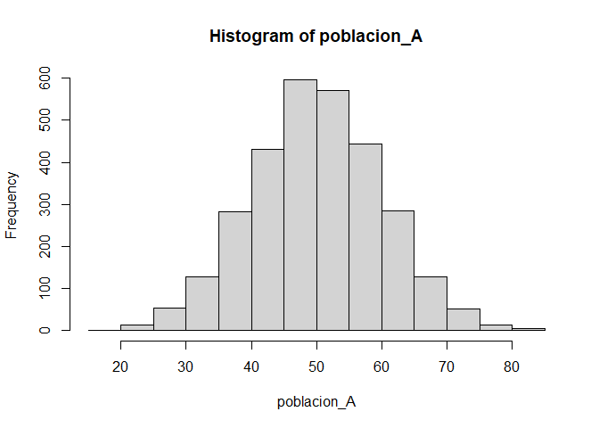
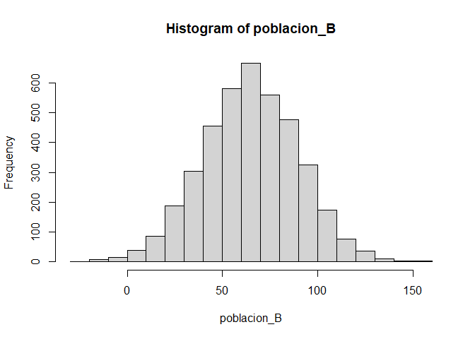
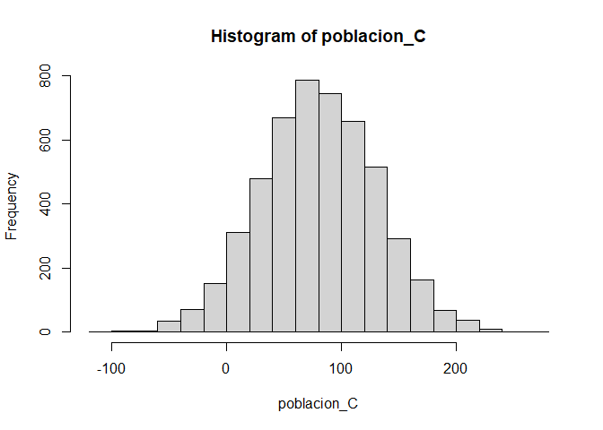

Basic Example
================
Ruben Cabrera
2025-11-06

# Librerias

``` r
library(ggplot2)
library(dplyr)
```

    ## 
    ## Attaching package: 'dplyr'

    ## The following objects are masked from 'package:stats':
    ## 
    ##     filter, lag

    ## The following objects are masked from 'package:base':
    ## 
    ##     intersect, setdiff, setequal, union

Poblacion

``` r
# Definir los datos de los estratos manualmente
stratum <- c("A", "B", "C")
Nh <- c(3000, 4000, 5000)  # Tamaños de población por estrato
Sh <- c(48, 79, 76)        # Desviaciones estándar por estrato

# Combinar en un data frame para mejor manejo
strata_data <- data.frame(stratum, Nh, Sh)
strata_data
```

    ##   stratum   Nh Sh
    ## 1       A 3000 48
    ## 2       B 4000 79
    ## 3       C 5000 76

``` r
strata_data <- strata_data %>% mutate(peso = Nh/sum(Nh)) %>% 
                  mutate(nh = round(400*peso,0)) %>%
                  mutate(peso_optimo = Nh*Sh) %>% 
                  mutate(nh_optimo = round(400*peso_optimo/sum(peso_optimo),0))  
strata_data               
```

    ##   stratum   Nh Sh      peso  nh peso_optimo nh_optimo
    ## 1       A 3000 48 0.2500000 100      144000        69
    ## 2       B 4000 79 0.3333333 133      316000       150
    ## 3       C 5000 76 0.4166667 167      380000       181

``` r
set.seed(123)
# Parámetros poblacionales
N_A <- 3000; mu_A <- 50; sigma_A <- 10; poblacion_A <- 
  rnorm(N_A, mean = mu_A, sd = sigma_A)
N_B <- 4000; mu_B <- 65; sigma_B <- 25; poblacion_B <- 
  rnorm(N_B, mean = mu_B, sd = sigma_B)
N_C <- 5000; mu_C <- 80; sigma_C <- 50; poblacion_C <- 
  rnorm(N_C, mean = mu_C, sd = sigma_C)
 
N_total <- sum(N_A, N_B, N_C)
```

``` r
df <- data.frame(
  estrato = c("A","A","A","B","B","C"),
  x = c(10,20,15,20,30,35)
)
df
```

    ##   estrato  x
    ## 1       A 10
    ## 2       A 20
    ## 3       A 15
    ## 4       B 20
    ## 5       B 30
    ## 6       C 35

``` r
temp <- c(poblacion_A,poblacion_B) 
df_A <- data.frame(x = poblacion_A, estrato = "A")
df_B <- data.frame(x = poblacion_B, estrato = "B")
df_C <- data.frame(x = poblacion_C, estrato = "C")

df <- bind_rows(df_A,df_B,df_C)
```

``` r
df <- data.frame(mi_var = c(poblacion_A,poblacion_B,poblacion_C),
                 estrato = c(rep("Estrato A",N_A),
                  rep("Estrato B",N_B),rep("Estrato C",N_C)))
df
```

    ##              mi_var   estrato
    ## 1       44.39524353 Estrato A
    ## 2       47.69822511 Estrato A
    ## 3       65.58708314 Estrato A
    ## 4       50.70508391 Estrato A
    ## 5       51.29287735 Estrato A
    ## 6       67.15064987 Estrato A
    ## 7       54.60916206 Estrato A
    ## 8       37.34938765 Estrato A
    ## 9       43.13147148 Estrato A
    ## 10      45.54338030 Estrato A
    ## 11      62.24081797 Estrato A
    ## 12      53.59813827 Estrato A
    ## 13      54.00771451 Estrato A
    ## 14      51.10682716 Estrato A
    ## 15      44.44158865 Estrato A
    ## 16      67.86913137 Estrato A
    ## 17      54.97850478 Estrato A
    ## 18      30.33382843 Estrato A
    ## 19      57.01355902 Estrato A
    ## 20      45.27208592 Estrato A
    ## 21      39.32176294 Estrato A
    ## 22      47.82025085 Estrato A
    ## 23      39.73995552 Estrato A
    ## 24      42.71108771 Estrato A
    ## 25      43.74960732 Estrato A
    ## 26      33.13306689 Estrato A
    ## 27      58.37787044 Estrato A
    ## 28      51.53373118 Estrato A
    ## 29      38.61863063 Estrato A
    ## 30      62.53814921 Estrato A
    ## 31      54.26464221 Estrato A
    ## 32      47.04928517 Estrato A
    ## 33      58.95125661 Estrato A
    ## 34      58.78133488 Estrato A
    ## 35      58.21581082 Estrato A
    ## 36      56.88640254 Estrato A
    ## 37      55.53917654 Estrato A
    ## 38      49.38088289 Estrato A
    ## 39      46.94037336 Estrato A
    ## 40      46.19528999 Estrato A
    ## 41      43.05293021 Estrato A
    ## 42      47.92082722 Estrato A
    ## 43      37.34603648 Estrato A
    ## 44      71.68955965 Estrato A
    ## 45      62.07961998 Estrato A
    ## 46      38.76891417 Estrato A
    ## 47      45.97115165 Estrato A
    ## 48      45.33344646 Estrato A
    ## 49      57.79965118 Estrato A
    ## 50      49.16630934 Estrato A
    ## 51      52.53318514 Estrato A
    ## 52      49.71453245 Estrato A
    ## 53      49.57129543 Estrato A
    ## 54      63.68602284 Estrato A
    ## 55      47.74229014 Estrato A
    ## 56      65.16470604 Estrato A
    ## 57      34.51247196 Estrato A
    ## 58      55.84613750 Estrato A
    ## 59      51.23854244 Estrato A
    ## 60      52.15941569 Estrato A
    ## 61      53.79639483 Estrato A
    ## 62      44.97676547 Estrato A
    ## 63      46.66792616 Estrato A
    ## 64      39.81424617 Estrato A
    ## 65      39.28208774 Estrato A
    ## 66      53.03528641 Estrato A
    ## 67      54.48209779 Estrato A
    ## 68      50.53004227 Estrato A
    ## 69      59.22267468 Estrato A
    ## 70      70.50084686 Estrato A
    ## 71      45.08968834 Estrato A
    ## 72      26.90831124 Estrato A
    ## 73      60.05738524 Estrato A
    ## 74      42.90799237 Estrato A
    ## 75      43.11991384 Estrato A
    ## 76      60.25571370 Estrato A
    ## 77      47.15226993 Estrato A
    ## 78      37.79282288 Estrato A
    ## 79      51.81303480 Estrato A
    ## 80      48.61108638 Estrato A
    ## 81      50.05764186 Estrato A
    ## 82      53.85280401 Estrato A
    ## 83      46.29339968 Estrato A
    ## 84      56.44376549 Estrato A
    ## 85      47.79513438 Estrato A
    ## 86      53.31781964 Estrato A
    ## 87      60.96839013 Estrato A
    ## 88      54.35181491 Estrato A
    ## 89      46.74068414 Estrato A
    ## 90      61.48807618 Estrato A
    ## 91      59.93503856 Estrato A
    ## 92      55.48396960 Estrato A
    ## 93      52.38731735 Estrato A
    ## 94      43.72093924 Estrato A
    ## 95      63.60652449 Estrato A
    ## 96      43.99740413 Estrato A
    ## 97      71.87332993 Estrato A
    ## 98      65.32610626 Estrato A
    ## 99      47.64299641 Estrato A
    ## 100     39.73579100 Estrato A
    ## 101     42.89593436 Estrato A
    ## 102     52.56883709 Estrato A
    ## 103     47.53308122 Estrato A
    ## 104     46.52457401 Estrato A
    ## 105     40.48381433 Estrato A
    ## 106     49.54972275 Estrato A
    ## 107     42.15095531 Estrato A
    ## 108     33.32058063 Estrato A
    ## 109     46.19773480 Estrato A
    ## 110     59.18996609 Estrato A
    ## 111     44.24653037 Estrato A
    ## 112     56.07964322 Estrato A
    ## 113     33.82117292 Estrato A
    ## 114     49.44438034 Estrato A
    ## 115     55.19407204 Estrato A
    ## 116     53.01153362 Estrato A
    ## 117     51.05676194 Estrato A
    ## 118     43.59293992 Estrato A
    ## 119     41.50295654 Estrato A
    ## 120     39.75871209 Estrato A
    ## 121     51.17646597 Estrato A
    ## 122     40.52525386 Estrato A
    ## 123     45.09442556 Estrato A
    ## 124     47.43907808 Estrato A
    ## 125     68.43862005 Estrato A
    ## 126     43.48050098 Estrato A
    ## 127     52.35386572 Estrato A
    ## 128     50.77960850 Estrato A
    ## 129     40.38143366 Estrato A
    ## 130     49.28691914 Estrato A
    ## 131     64.44550858 Estrato A
    ## 132     54.51504053 Estrato A
    ## 133     50.41232922 Estrato A
    ## 134     45.77503168 Estrato A
    ## 135     29.46752778 Estrato A
    ## 136     61.31337213 Estrato A
    ## 137     35.39359929 Estrato A
    ## 138     57.39947511 Estrato A
    ## 139     69.09103569 Estrato A
    ## 140     35.56106839 Estrato A
    ## 141     57.01784335 Estrato A
    ## 142     47.37802511 Estrato A
    ## 143     34.27855841 Estrato A
    ## 144     34.85332346 Estrato A
    ## 145     33.98463826 Estrato A
    ## 146     44.69093478 Estrato A
    ## 147     35.38244415 Estrato A
    ## 148     56.87916773 Estrato A
    ## 149     71.00108941 Estrato A
    ## 150     37.12969524 Estrato A
    ## 151     57.87738847 Estrato A
    ## 152     57.69042241 Estrato A
    ## 153     53.32202579 Estrato A
    ## 154     39.91623392 Estrato A
    ## 155     48.80547393 Estrato A
    ## 156     47.19604665 Estrato A
    ## 157     55.62989533 Estrato A
    ## 158     46.27561244 Estrato A
    ## 159     59.76973387 Estrato A
    ## 160     46.25419142 Estrato A
    ## 161     60.52711466 Estrato A
    ## 162     39.50822993 Estrato A
    ## 163     37.39844755 Estrato A
    ## 164     82.41039935 Estrato A
    ## 165     45.83142412 Estrato A
    ## 166     52.98227592 Estrato A
    ## 167     56.36569674 Estrato A
    ## 168     45.16219374 Estrato A
    ## 169     55.16862044 Estrato A
    ## 170     53.68964527 Estrato A
    ## 171     47.84619492 Estrato A
    ## 172     50.65293034 Estrato A
    ## 173     49.65932746 Estrato A
    ## 174     71.28451899 Estrato A
    ## 175     42.58663904 Estrato A
    ## 176     39.04003733 Estrato A
    ## 177     50.37788399 Estrato A
    ## 178     53.10480749 Estrato A
    ## 179     54.36523479 Estrato A
    ## 180     45.41634667 Estrato A
    ## 181     39.36673866 Estrato A
    ## 182     62.63185176 Estrato A
    ## 183     46.50349612 Estrato A
    ## 184     41.34487137 Estrato A
    ## 185     47.63720431 Estrato A
    ## 186     48.02824106 Estrato A
    ## 187     61.09920290 Estrato A
    ## 188     50.84737292 Estrato A
    ## 189     57.54053785 Estrato A
    ## 190     45.00707983 Estrato A
    ## 191     52.14445310 Estrato A
    ## 192     46.75314089 Estrato A
    ## 193     50.94583528 Estrato A
    ## 194     41.04636642 Estrato A
    ## 195     36.89198467 Estrato A
    ## 196     69.97213385 Estrato A
    ## 197     56.00708824 Estrato A
    ## 198     37.48728638 Estrato A
    ## 199     43.88834083 Estrato A
    ## 200     38.14519915 Estrato A
    ## 201     71.98810349 Estrato A
    ## 202     63.12412976 Estrato A
    ## 203     47.34854943 Estrato A
    ## 204     55.43194059 Estrato A
    ## 205     45.85660052 Estrato A
    ## 206     45.23753105 Estrato A
    ## 207     42.11397162 Estrato A
    ## 208     44.05382733 Estrato A
    ## 209     66.50907467 Estrato A
    ## 210     49.45971875 Estrato A
    ## 211     51.19245236 Estrato A
    ## 212     52.43687430 Estrato A
    ## 213     62.32475878 Estrato A
    ## 214     44.83936169 Estrato A
    ## 215     40.07492850 Estrato A
    ## 216     66.75696932 Estrato A
    ## 217     45.58836783 Estrato A
    ## 218     42.76934030 Estrato A
    ## 219     37.63726881 Estrato A
    ## 220     37.15284278 Estrato A
    ## 221     44.26026521 Estrato A
    ## 222     56.17985817 Estrato A
    ## 223     61.09848139 Estrato A
    ## 224     57.07588354 Estrato A
    ## 225     46.36342703 Estrato A
    ## 226     50.59749937 Estrato A
    ## 227     42.95403536 Estrato A
    ## 228     42.82781838 Estrato A
    ## 229     58.84650499 Estrato A
    ## 230     39.84407421 Estrato A
    ## 231     69.55293965 Estrato A
    ## 232     49.09680406 Estrato A
    ## 233     52.14538827 Estrato A
    ## 234     42.61472295 Estrato A
    ## 235     44.25611310 Estrato A
    ## 236     36.82983868 Estrato A
    ## 237     48.17074612 Estrato A
    ## 238     54.18982405 Estrato A
    ## 239     53.24304344 Estrato A
    ## 240     42.18463513 Estrato A
    ## 241     42.11378029 Estrato A
    ## 242     44.97801282 Estrato A
    ## 243     64.96060670 Estrato A
    ## 244     38.62696379 Estrato A
    ## 245     48.20948406 Estrato A
    ## 246     69.02361822 Estrato A
    ## 247     48.99025115 Estrato A
    ## 248     36.40159296 Estrato A
    ## 249     43.35230565 Estrato A
    ## 250     54.85459979 Estrato A
    ## 251     46.24397128 Estrato A
    ## 252     44.38123636 Estrato A
    ## 253     46.56082766 Estrato A
    ## 254     50.90496647 Estrato A
    ## 255     65.98508771 Estrato A
    ## 256     49.11434888 Estrato A
    ## 257     60.80799496 Estrato A
    ## 258     56.30754116 Estrato A
    ## 259     48.86360104 Estrato A
    ## 260     34.67097997 Estrato A
    ## 261     44.78882682 Estrato A
    ## 262     45.10129547 Estrato A
    ## 263     50.47154433 Estrato A
    ## 264     63.00198678 Estrato A
    ## 265     72.93078974 Estrato A
    ## 266     65.47581059 Estrato A
    ## 267     48.66849036 Estrato A
    ## 268     32.43472604 Estrato A
    ## 269     46.11220136 Estrato A
    ## 270     50.89207223 Estrato A
    ## 271     58.45013004 Estrato A
    ## 272     59.62527968 Estrato A
    ## 273     56.84309429 Estrato A
    ## 274     36.04725650 Estrato A
    ## 275     58.49643046 Estrato A
    ## 276     45.53442784 Estrato A
    ## 277     51.74802700 Estrato A
    ## 278     50.74551177 Estrato A
    ## 279     54.28166765 Estrato A
    ## 280     50.24674983 Estrato A
    ## 281     33.32524902 Estrato A
    ## 282     57.36495965 Estrato A
    ## 283     53.86026568 Estrato A
    ## 284     47.34348375 Estrato A
    ## 285     51.18144511 Estrato A
    ## 286     51.34038645 Estrato A
    ## 287     52.21019469 Estrato A
    ## 288     66.40846166 Estrato A
    ## 289     47.80949621 Estrato A
    ## 290     51.68065384 Estrato A
    ## 291     61.68383873 Estrato A
    ## 292     60.54181023 Estrato A
    ## 293     61.45263110 Estrato A
    ## 294     44.22531999 Estrato A
    ## 295     70.02482730 Estrato A
    ## 296     50.66700871 Estrato A
    ## 297     68.66851845 Estrato A
    ## 298     36.49097314 Estrato A
    ## 299     50.20983586 Estrato A
    ## 300     62.49914571 Estrato A
    ## 301     42.84757813 Estrato A
    ## 302     42.47311032 Estrato A
    ## 303     40.61461296 Estrato A
    ## 304     39.47486721 Estrato A
    ## 305     45.62840467 Estrato A
    ## 306     53.31179173 Estrato A
    ## 307     29.85789502 Estrato A
    ## 308     52.11980433 Estrato A
    ## 309     62.36675046 Estrato A
    ## 310     70.37574018 Estrato A
    ## 311     63.01175992 Estrato A
    ## 312     57.56774764 Estrato A
    ## 313     32.73269601 Estrato A
    ## 314     43.98493292 Estrato A
    ## 315     46.47953543 Estrato A
    ## 316     57.03523903 Estrato A
    ## 317     48.94328666 Estrato A
    ## 318     37.41351372 Estrato A
    ## 319     66.84435708 Estrato A
    ## 320     59.11391292 Estrato A
    ## 321     52.37430272 Estrato A
    ## 322     62.18108610 Estrato A
    ## 323     36.61225713 Estrato A
    ## 324     56.60820298 Estrato A
    ## 325     44.77087624 Estrato A
    ## 326     56.83745522 Estrato A
    ## 327     49.39178045 Estrato A
    ## 328     56.32960713 Estrato A
    ## 329     63.35517615 Estrato A
    ## 330     50.07290090 Estrato A
    ## 331     60.17558637 Estrato A
    ## 332     38.11565965 Estrato A
    ## 333     42.78395560 Estrato A
    ## 334     65.19217711 Estrato A
    ## 335     53.77387973 Estrato A
    ## 336     29.47777180 Estrato A
    ## 337     36.35962548 Estrato A
    ## 338     47.99218984 Estrato A
    ## 339     58.65779404 Estrato A
    ## 340     48.98116744 Estrato A
    ## 341     56.24187472 Estrato A
    ## 342     59.59005378 Estrato A
    ## 343     66.71054829 Estrato A
    ## 344     50.56016733 Estrato A
    ## 345     49.48018094 Estrato A
    ## 346     32.46762641 Estrato A
    ## 347     50.99327594 Estrato A
    ## 348     44.28149942 Estrato A
    ## 349     40.25990417 Estrato A
    ## 350     48.20093769 Estrato A
    ## 351     60.14943173 Estrato A
    ## 352     30.07251511 Estrato A
    ## 353     45.72720713 Estrato A
    ## 354     51.16637284 Estrato A
    ## 355     41.06792430 Estrato A
    ## 356     53.33902942 Estrato A
    ## 357     54.11429921 Estrato A
    ## 358     49.66963841 Estrato A
    ## 359     25.34101806 Estrato A
    ## 360     75.71458146 Estrato A
    ## 361     47.94700743 Estrato A
    ## 362     56.51193282 Estrato A
    ## 363     52.73766491 Estrato A
    ## 364     60.24673235 Estrato A
    ## 365     58.17659446 Estrato A
    ## 366     47.90206829 Estrato A
    ## 367     53.78167772 Estrato A
    ## 368     40.54591169 Estrato A
    ## 369     58.56923011 Estrato A
    ## 370     45.38961661 Estrato A
    ## 371     74.16773354 Estrato A
    ## 372     33.48951104 Estrato A
    ## 373     45.36012757 Estrato A
    ## 374     58.25379863 Estrato A
    ## 375     55.10132547 Estrato A
    ## 376     44.10518961 Estrato A
    ## 377     40.03219258 Estrato A
    ## 378     51.44475705 Estrato A
    ## 379     49.85692587 Estrato A
    ## 380     32.09718763 Estrato A
    ## 381     50.34551067 Estrato A
    ## 382     51.90230316 Estrato A
    ## 383     51.74726397 Estrato A
    ## 384     39.44982957 Estrato A
    ## 385     54.76133278 Estrato A
    ## 386     63.78570137 Estrato A
    ## 387     54.56236403 Estrato A
    ## 388     38.64411530 Estrato A
    ## 389     45.64354530 Estrato A
    ## 390     53.46103620 Estrato A
    ## 391     43.52954369 Estrato A
    ## 392     28.42353665 Estrato A
    ## 393     58.84250820 Estrato A
    ## 394     41.70522388 Estrato A
    ## 395     44.26439729 Estrato A
    ## 396     65.03900609 Estrato A
    ## 397     42.25855070 Estrato A
    ## 398     58.45731540 Estrato A
    ## 399     37.39317121 Estrato A
    ## 400     46.45457597 Estrato A
    ## 401     49.26443981 Estrato A
    ## 402     38.31348576 Estrato A
    ## 403     43.65251735 Estrato A
    ## 404     49.71158447 Estrato A
    ## 405     56.70695969 Estrato A
    ## 406     33.49453457 Estrato A
    ## 407     46.50245761 Estrato A
    ## 408     57.56406439 Estrato A
    ## 409     44.61190840 Estrato A
    ## 410     52.27291922 Estrato A
    ## 411     54.92228570 Estrato A
    ## 412     52.67835015 Estrato A
    ## 413     56.53257679 Estrato A
    ## 414     48.77291339 Estrato A
    ## 415     45.86323486 Estrato A
    ## 416     23.56851048 Estrato A
    ## 417     49.07058982 Estrato A
    ## 418     54.30284696 Estrato A
    ## 419     55.35398841 Estrato A
    ## 420     44.44721649 Estrato A
    ## 421     67.79502910 Estrato A
    ## 422     52.86424420 Estrato A
    ## 423     51.26315858 Estrato A
    ## 424     62.72266779 Estrato A
    ## 425     42.81533779 Estrato A
    ## 426     45.49661376 Estrato A
    ## 427     73.97452480 Estrato A
    ## 428     50.11129187 Estrato A
    ## 429     66.33568421 Estrato A
    ## 430     35.61493355 Estrato A
    ## 431     48.09483198 Estrato A
    ## 432     53.78423904 Estrato A
    ## 433     53.00038545 Estrato A
    ## 434     39.94363740 Estrato A
    ## 435     50.19259275 Estrato A
    ## 436     39.22579347 Estrato A
    ## 437     57.12703325 Estrato A
    ## 438     60.84775090 Estrato A
    ## 439     27.75012304 Estrato A
    ## 440     62.35693462 Estrato A
    ## 441     37.58955503 Estrato A
    ## 442     54.54769269 Estrato A
    ## 443     56.59902638 Estrato A
    ## 444     48.00110172 Estrato A
    ## 445     43.54886043 Estrato A
    ## 446     51.65321021 Estrato A
    ## 447     54.38818701 Estrato A
    ## 448     58.83302820 Estrato A
    ## 449     29.47663016 Estrato A
    ## 450     33.63620732 Estrato A
    ## 451     64.30402341 Estrato A
    ## 452     60.46628847 Estrato A
    ## 453     54.35288949 Estrato A
    ## 454     57.15178407 Estrato A
    ## 455     59.17174918 Estrato A
    ## 456     23.39077202 Estrato A
    ## 457     61.10277097 Estrato A
    ## 458     45.15012403 Estrato A
    ## 459     52.30616831 Estrato A
    ## 460     47.04842199 Estrato A
    ## 461     58.71964954 Estrato A
    ## 462     46.51527551 Estrato A
    ## 463     55.18503766 Estrato A
    ## 464     46.09315021 Estrato A
    ## 465     39.07212791 Estrato A
    ## 466     62.10010510 Estrato A
    ## 467     57.40900011 Estrato A
    ## 468     67.24262239 Estrato A
    ## 469     50.65153933 Estrato A
    ## 470     61.25002746 Estrato A
    ## 471     69.75419054 Estrato A
    ## 472     47.18517885 Estrato A
    ## 473     36.77048887 Estrato A
    ## 474     47.60648433 Estrato A
    ## 475     47.85958760 Estrato A
    ## 476     51.51680505 Estrato A
    ## 477     67.12304977 Estrato A
    ## 478     46.73856107 Estrato A
    ## 479     53.73004656 Estrato A
    ## 480     47.72315935 Estrato A
    ## 481     50.20450709 Estrato A
    ## 482     53.14057664 Estrato A
    ## 483     63.28214696 Estrato A
    ## 484     51.21318377 Estrato A
    ## 485     57.12842320 Estrato A
    ## 486     57.78860030 Estrato A
    ## 487     59.14773271 Estrato A
    ## 488     44.25605448 Estrato A
    ## 489     66.26881214 Estrato A
    ## 490     46.19043261 Estrato A
    ## 491     48.94215832 Estrato A
    ## 492     64.04050268 Estrato A
    ## 493     62.94083906 Estrato A
    ## 494     39.10008128 Estrato A
    ## 495     41.26929000 Estrato A
    ## 496     36.41920941 Estrato A
    ## 497     51.81847193 Estrato A
    ## 498     51.64840868 Estrato A
    ## 499     53.64114687 Estrato A
    ## 500     55.52157714 Estrato A
    ## 501     43.98107154 Estrato A
    ## 502     40.06301409 Estrato A
    ## 503     60.26785056 Estrato A
    ## 504     57.51061303 Estrato A
    ## 505     34.90833463 Estrato A
    ## 506     49.04852549 Estrato A
    ## 507     41.04052177 Estrato A
    ## 508     29.29248929 Estrato A
    ## 509     51.50120131 Estrato A
    ## 510     49.20788291 Estrato A
    ## 511     49.02630732 Estrato A
    ## 512     52.16152542 Estrato A
    ## 513     58.82465164 Estrato A
    ## 514     52.05597504 Estrato A
    ## 515     43.83564157 Estrato A
    ## 516     42.65200748 Estrato A
    ## 517     48.68197207 Estrato A
    ## 518     53.10016987 Estrato A
    ## 519     39.60319647 Estrato A
    ## 520     48.15691131 Estrato A
    ## 521     59.67267260 Estrato A
    ## 522     48.91719909 Estrato A
    ## 523     43.01579332 Estrato A
    ## 524     47.24054832 Estrato A
    ## 525     61.14648545 Estrato A
    ## 526     55.50043961 Estrato A
    ## 527     62.36675800 Estrato A
    ## 528     51.39097857 Estrato A
    ## 529     54.10275096 Estrato A
    ## 530     44.41543088 Estrato A
    ## 531     56.05370669 Estrato A
    ## 532     44.93666458 Estrato A
    ## 533     35.79434495 Estrato A
    ## 534     51.27992966 Estrato A
    ## 535     69.45851218 Estrato A
    ## 536     58.00914340 Estrato A
    ## 537     61.65253390 Estrato A
    ## 538     53.58855723 Estrato A
    ## 539     43.91442822 Estrato A
    ## 540     47.97759145 Estrato A
    ## 541     47.26751893 Estrato A
    ## 542     45.31300220 Estrato A
    ## 543     57.04167284 Estrato A
    ## 544     38.02636498 Estrato A
    ## 545     58.66366132 Estrato A
    ## 546     58.64152486 Estrato A
    ## 547     38.01377641 Estrato A
    ## 548     56.39491998 Estrato A
    ## 549     74.30226652 Estrato A
    ## 550     44.42784518 Estrato A
    ## 551     58.44904241 Estrato A
    ## 552     42.17798154 Estrato A
    ## 553     61.10711418 Estrato A
    ## 554     52.49824720 Estrato A
    ## 555     66.51915392 Estrato A
    ## 556     35.41029271 Estrato A
    ## 557     49.48702114 Estrato A
    ## 558     44.73074824 Estrato A
    ## 559     48.02735131 Estrato A
    ## 560     43.70421257 Estrato A
    ## 561     41.66156419 Estrato A
    ## 562     55.78722375 Estrato A
    ## 563     39.12419286 Estrato A
    ## 564     64.84030932 Estrato A
    ## 565     38.13793415 Estrato A
    ## 566     51.01079151 Estrato A
    ## 567     55.32989287 Estrato A
    ## 568     55.86735339 Estrato A
    ## 569     46.98253336 Estrato A
    ## 570     50.79501995 Estrato A
    ## 571     59.61264152 Estrato A
    ## 572     35.43534083 Estrato A
    ## 573     42.18260288 Estrato A
    ## 574     53.20402314 Estrato A
    ## 575     45.55218022 Estrato A
    ## 576     63.70003994 Estrato A
    ## 577     56.73253863 Estrato A
    ## 578     50.72166752 Estrato A
    ## 579     34.92242682 Estrato A
    ## 580     50.26100225 Estrato A
    ## 581     46.83584132 Estrato A
    ## 582     48.97653486 Estrato A
    ## 583     38.18440773 Estrato A
    ## 584     54.98658044 Estrato A
    ## 585     39.61043560 Estrato A
    ## 586     47.73778019 Estrato A
    ## 587     53.81425829 Estrato A
    ## 588     42.16484211 Estrato A
    ## 589     55.82991406 Estrato A
    ## 590     36.83489598 Estrato A
    ## 591     21.90225321 Estrato A
    ## 592     54.64967991 Estrato A
    ## 593     58.40539827 Estrato A
    ## 594     47.14154576 Estrato A
    ## 595     55.04126255 Estrato A
    ## 596     38.44083475 Estrato A
    ## 597     48.72851393 Estrato A
    ## 598     30.58481624 Estrato A
    ## 599     61.81180891 Estrato A
    ## 600     68.59910862 Estrato A
    ## 601     60.74012260 Estrato A
    ## 602     49.72653034 Estrato A
    ## 603     49.66669658 Estrato A
    ## 604     34.83932377 Estrato A
    ## 605     57.90385344 Estrato A
    ## 606     47.89265819 Estrato A
    ## 607     43.43257075 Estrato A
    ## 608     35.87974207 Estrato A
    ## 609     47.00237503 Estrato A
    ## 610     41.50938865 Estrato A
    ## 611     46.02969480 Estrato A
    ## 612     37.82400012 Estrato A
    ## 613     66.87589483 Estrato A
    ## 614     49.83997473 Estrato A
    ## 615     60.74945077 Estrato A
    ## 616     23.98300330 Estrato A
    ## 617     45.46802170 Estrato A
    ## 618     43.24517708 Estrato A
    ## 619     37.77073821 Estrato A
    ## 620     65.46609154 Estrato A
    ## 621     35.84718080 Estrato A
    ## 622     53.18390260 Estrato A
    ## 623     58.46436286 Estrato A
    ## 624     51.78190188 Estrato A
    ## 625     41.24744523 Estrato A
    ## 626     59.41165807 Estrato A
    ## 627     51.70588082 Estrato A
    ## 628     39.36502094 Estrato A
    ## 629     36.11950952 Estrato A
    ## 630     70.86717434 Estrato A
    ## 631     43.21496855 Estrato A
    ## 632     31.44428346 Estrato A
    ## 633     55.33259363 Estrato A
    ## 634     53.10230256 Estrato A
    ## 635     36.46165664 Estrato A
    ## 636     30.57043586 Estrato A
    ## 637     48.83697483 Estrato A
    ## 638     61.39396292 Estrato A
    ## 639     56.36124035 Estrato A
    ## 640     45.07062576 Estrato A
    ## 641     41.65811768 Estrato A
    ## 642     52.71066757 Estrato A
    ## 643     51.57353347 Estrato A
    ## 644     56.29711747 Estrato A
    ## 645     46.04202050 Estrato A
    ## 646     58.99354053 Estrato A
    ## 647     41.69188473 Estrato A
    ## 648     46.69455300 Estrato A
    ## 649     57.40814524 Estrato A
    ## 650     59.89971609 Estrato A
    ## 651     30.61495299 Estrato A
    ## 652     51.07190407 Estrato A
    ## 653     56.08779012 Estrato A
    ## 654     35.49175687 Estrato A
    ## 655     54.80625600 Estrato A
    ## 656     41.71825730 Estrato A
    ## 657     60.20253012 Estrato A
    ## 658     55.38482032 Estrato A
    ## 659     57.69052295 Estrato A
    ## 660     51.20719329 Estrato A
    ## 661     58.63648434 Estrato A
    ## 662     63.80514528 Estrato A
    ## 663     69.66248015 Estrato A
    ## 664     49.71604945 Estrato A
    ## 665     27.50948910 Estrato A
    ## 666     50.31526005 Estrato A
    ## 667     52.05561208 Estrato A
    ## 668     48.44654653 Estrato A
    ## 669     55.68288621 Estrato A
    ## 670     60.10677965 Estrato A
    ## 671     44.82017570 Estrato A
    ## 672     47.05904673 Estrato A
    ## 673     53.97842209 Estrato A
    ## 674     44.49776259 Estrato A
    ## 675     50.91267383 Estrato A
    ## 676     30.38292401 Estrato A
    ## 677     38.80100279 Estrato A
    ## 678     36.72244524 Estrato A
    ## 679     41.46376303 Estrato A
    ## 680     43.06695472 Estrato A
    ## 681     53.82305143 Estrato A
    ## 682     59.82113003 Estrato A
    ## 683     42.72616471 Estrato A
    ## 684     40.03161018 Estrato A
    ## 685     39.58311141 Estrato A
    ## 686     45.85411274 Estrato A
    ## 687     47.60970932 Estrato A
    ## 688     54.83617534 Estrato A
    ## 689     46.78675158 Estrato A
    ## 690     29.21510731 Estrato A
    ## 691     49.08565724 Estrato A
    ## 692     61.87186811 Estrato A
    ## 693     61.91601269 Estrato A
    ## 694     42.11036782 Estrato A
    ## 695     34.52223456 Estrato A
    ## 696     74.58060492 Estrato A
    ## 697     48.37578058 Estrato A
    ## 698     49.02548750 Estrato A
    ## 699     54.20574189 Estrato A
    ## 700     33.85960543 Estrato A
    ## 701     42.71780889 Estrato A
    ## 702     34.59557595 Estrato A
    ## 703     43.06905386 Estrato A
    ## 704     51.18849433 Estrato A
    ## 705     36.35290542 Estrato A
    ## 706     55.89982679 Estrato A
    ## 707     52.89344029 Estrato A
    ## 708     40.95784974 Estrato A
    ## 709     52.26324942 Estrato A
    ## 710     57.48081162 Estrato A
    ## 711     60.61095253 Estrato A
    ## 712     47.87151721 Estrato A
    ## 713     49.06363206 Estrato A
    ## 714     49.13285865 Estrato A
    ## 715     64.41461756 Estrato A
    ## 716     61.25071892 Estrato A
    ## 717     58.34401568 Estrato A
    ## 718     47.12659200 Estrato A
    ## 719     53.73241434 Estrato A
    ## 720     54.03290331 Estrato A
    ## 721     39.58326706 Estrato A
    ## 722     32.71695485 Estrato A
    ## 723     56.41830028 Estrato A
    ## 724     34.70689469 Estrato A
    ## 725     50.01683688 Estrato A
    ## 726     52.50247821 Estrato A
    ## 727     55.63867390 Estrato A
    ## 728     51.89426238 Estrato A
    ## 729     42.67146194 Estrato A
    ## 730     59.86365860 Estrato A
    ## 731     67.38633767 Estrato A
    ## 732     58.81178809 Estrato A
    ## 733     30.56349099 Estrato A
    ## 734     63.99576185 Estrato A
    ## 735     49.43944054 Estrato A
    ## 736     55.24914279 Estrato A
    ## 737     56.22033236 Estrato A
    ## 738     49.03313927 Estrato A
    ## 739     49.24736802 Estrato A
    ## 740     60.19157069 Estrato A
    ## 741     57.11601922 Estrato A
    ## 742     59.90262246 Estrato A
    ## 743     73.82926695 Estrato A
    ## 744     56.64415864 Estrato A
    ## 745     52.07381157 Estrato A
    ## 746     27.89366889 Estrato A
    ## 747     76.91714003 Estrato A
    ## 748     45.17323178 Estrato A
    ## 749     73.74734715 Estrato A
    ## 750     53.74643568 Estrato A
    ## 751     65.38430199 Estrato A
    ## 752     48.90289679 Estrato A
    ## 753     55.11470755 Estrato A
    ## 754     52.13957980 Estrato A
    ## 755     48.13879301 Estrato A
    ## 756     48.79606175 Estrato A
    ## 757     60.12834336 Estrato A
    ## 758     47.98541853 Estrato A
    ## 759     29.62317506 Estrato A
    ## 760     48.04110751 Estrato A
    ## 761     55.39790606 Estrato A
    ## 762     56.16455716 Estrato A
    ## 763     56.16567817 Estrato A
    ## 764     33.07898479 Estrato A
    ## 765     53.68742058 Estrato A
    ## 766     59.67859210 Estrato A
    ## 767     62.76578681 Estrato A
    ## 768     47.75038729 Estrato A
    ## 769     46.78107414 Estrato A
    ## 770     64.87837832 Estrato A
    ## 771     33.32071954 Estrato A
    ## 772     45.63170023 Estrato A
    ## 773     54.57462079 Estrato A
    ## 774     33.82226235 Estrato A
    ## 775     52.79627862 Estrato A
    ## 776     68.77864021 Estrato A
    ## 777     49.95939347 Estrato A
    ## 778     47.21545975 Estrato A
    ## 779     54.74911714 Estrato A
    ## 780     47.20927829 Estrato A
    ## 781     58.13400374 Estrato A
    ## 782     59.04435464 Estrato A
    ## 783     50.02691661 Estrato A
    ## 784     38.23307842 Estrato A
    ## 785     36.81779273 Estrato A
    ## 786     44.07002634 Estrato A
    ## 787     57.97380501 Estrato A
    ## 788     30.41794825 Estrato A
    ## 789     31.13674841 Estrato A
    ## 790     43.46220175 Estrato A
    ## 791     53.94394848 Estrato A
    ## 792     40.86433952 Estrato A
    ## 793     58.86749037 Estrato A
    ## 794     53.33369970 Estrato A
    ## 795     48.29360382 Estrato A
    ## 796     58.18828137 Estrato A
    ## 797     53.88365163 Estrato A
    ## 798     45.54064973 Estrato A
    ## 799     52.31114934 Estrato A
    ## 800     56.47513358 Estrato A
    ## 801     53.56283345 Estrato A
    ## 802     43.41989792 Estrato A
    ## 803     58.55202205 Estrato A
    ## 804     61.52936226 Estrato A
    ## 805     52.76274557 Estrato A
    ## 806     51.44104662 Estrato A
    ## 807     49.24374919 Estrato A
    ## 808     71.61415846 Estrato A
    ## 809     52.76315532 Estrato A
    ## 810     48.41705971 Estrato A
    ## 811     24.92082198 Estrato A
    ## 812     34.34718235 Estrato A
    ## 813     49.22326799 Estrato A
    ## 814     52.06294045 Estrato A
    ## 815     52.76872459 Estrato A
    ## 816     58.21506780 Estrato A
    ## 817     48.05847591 Estrato A
    ## 818     62.14588794 Estrato A
    ## 819     40.78483957 Estrato A
    ## 820     37.91557280 Estrato A
    ## 821     37.71013822 Estrato A
    ## 822     57.42297024 Estrato A
    ## 823     49.17080058 Estrato A
    ## 824     57.89817922 Estrato A
    ## 825     47.32293578 Estrato A
    ## 826     44.08107898 Estrato A
    ## 827     46.31647425 Estrato A
    ## 828     31.47383176 Estrato A
    ## 829     38.30384740 Estrato A
    ## 830     35.57965354 Estrato A
    ## 831     60.54322272 Estrato A
    ## 832     44.02669909 Estrato A
    ## 833     57.89459853 Estrato A
    ## 834     65.16490602 Estrato A
    ## 835     48.08225191 Estrato A
    ## 836     52.83878906 Estrato A
    ## 837     32.48932481 Estrato A
    ## 838     41.81330222 Estrato A
    ## 839     50.56214849 Estrato A
    ## 840     52.99086903 Estrato A
    ## 841     42.40601883 Estrato A
    ## 842     76.84858999 Estrato A
    ## 843     45.41609861 Estrato A
    ## 844     50.64243557 Estrato A
    ## 845     56.49791867 Estrato A
    ## 846     49.73981365 Estrato A
    ## 847     43.56432613 Estrato A
    ## 848     60.45305664 Estrato A
    ## 849     66.15545323 Estrato A
    ## 850     49.70306029 Estrato A
    ## 851     55.62267345 Estrato A
    ## 852     49.02587501 Estrato A
    ## 853     60.16455218 Estrato A
    ## 854     38.43832606 Estrato A
    ## 855     73.20860224 Estrato A
    ## 856     43.96468752 Estrato A
    ## 857     35.41150586 Estrato A
    ## 858     46.49082173 Estrato A
    ## 859     51.46708484 Estrato A
    ## 860     66.23621208 Estrato A
    ## 861     59.11209677 Estrato A
    ## 862     51.42458432 Estrato A
    ## 863     36.10516476 Estrato A
    ## 864     41.33962255 Estrato A
    ## 865     48.36715068 Estrato A
    ## 866     75.53026113 Estrato A
    ## 867     31.39772426 Estrato A
    ## 868     61.31054652 Estrato A
    ## 869     44.72765743 Estrato A
    ## 870     66.65990900 Estrato A
    ## 871     38.60799360 Estrato A
    ## 872     51.43623235 Estrato A
    ## 873     39.00449058 Estrato A
    ## 874     59.03516426 Estrato A
    ## 875     64.83779489 Estrato A
    ## 876     69.50721006 Estrato A
    ## 877     57.97600658 Estrato A
    ## 878     68.43266255 Estrato A
    ## 879     62.46423909 Estrato A
    ## 880     48.68125088 Estrato A
    ## 881     54.77037238 Estrato A
    ## 882     40.28005789 Estrato A
    ## 883     48.14797831 Estrato A
    ## 884     62.20963708 Estrato A
    ## 885     55.41284143 Estrato A
    ## 886     54.57357332 Estrato A
    ## 887     39.61868960 Estrato A
    ## 888     43.95486770 Estrato A
    ## 889     42.35393986 Estrato A
    ## 890     53.95295870 Estrato A
    ## 891     40.09492370 Estrato A
    ## 892     55.62041390 Estrato A
    ## 893     38.83583588 Estrato A
    ## 894     68.28530458 Estrato A
    ## 895     54.60591349 Estrato A
    ## 896     42.98996388 Estrato A
    ## 897     52.41045933 Estrato A
    ## 898     46.47546801 Estrato A
    ## 899     53.71147960 Estrato A
    ## 900     52.43532719 Estrato A
    ## 901     39.85885827 Estrato A
    ## 902     42.08686121 Estrato A
    ## 903     52.99593685 Estrato A
    ## 904     66.39051909 Estrato A
    ## 905     60.84617009 Estrato A
    ## 906     43.75432526 Estrato A
    ## 907     58.25922902 Estrato A
    ## 908     49.51431647 Estrato A
    ## 909     53.01313652 Estrato A
    ## 910     52.60361491 Estrato A
    ## 911     75.75449764 Estrato A
    ## 912     38.14711189 Estrato A
    ## 913     51.00919859 Estrato A
    ## 914     32.20022712 Estrato A
    ## 915     55.89835923 Estrato A
    ## 916     60.96608472 Estrato A
    ## 917     64.45662241 Estrato A
    ## 918     30.74854748 Estrato A
    ## 919     54.12769497 Estrato A
    ## 920     65.93369951 Estrato A
    ## 921     45.85984137 Estrato A
    ## 922     47.87849468 Estrato A
    ## 923     49.63462778 Estrato A
    ## 924     53.65018751 Estrato A
    ## 925     56.65159876 Estrato A
    ## 926     63.17820884 Estrato A
    ## 927     49.04512410 Estrato A
    ## 928     51.96278045 Estrato A
    ## 929     74.87997877 Estrato A
    ## 930     54.31098928 Estrato A
    ## 931     51.88753109 Estrato A
    ## 932     36.57756875 Estrato A
    ## 933     50.02856048 Estrato A
    ## 934     47.78673847 Estrato A
    ## 935     49.88954170 Estrato A
    ## 936     44.24582359 Estrato A
    ## 937     43.13184348 Estrato A
    ## 938     42.79226368 Estrato A
    ## 939     47.85495485 Estrato A
    ## 940     63.68132648 Estrato A
    ## 941     60.49086627 Estrato A
    ## 942     46.40024882 Estrato A
    ## 943     33.14083545 Estrato A
    ## 944     41.55416571 Estrato A
    ## 945     45.42239467 Estrato A
    ## 946     51.03638004 Estrato A
    ## 947     43.37392724 Estrato A
    ## 948     70.06680691 Estrato A
    ## 949     47.27732466 Estrato A
    ## 950     37.86055530 Estrato A
    ## 951     48.58738243 Estrato A
    ## 952     39.94622418 Estrato A
    ## 953     51.56155707 Estrato A
    ## 954     52.33633614 Estrato A
    ## 955     53.55587612 Estrato A
    ## 956     33.78141741 Estrato A
    ## 957     52.20711291 Estrato A
    ## 958     53.10450081 Estrato A
    ## 959     35.78891552 Estrato A
    ## 960     59.55365640 Estrato A
    ## 961     57.84170879 Estrato A
    ## 962     72.99619361 Estrato A
    ## 963     51.56702987 Estrato A
    ## 964     50.46733528 Estrato A
    ## 965     50.96585834 Estrato A
    ## 966     50.69766231 Estrato A
    ## 967     31.51527225 Estrato A
    ## 968     33.28872941 Estrato A
    ## 969     49.22461033 Estrato A
    ## 970     44.18932619 Estrato A
    ## 971     50.54736525 Estrato A
    ## 972     28.88791627 Estrato A
    ## 973     35.01301745 Estrato A
    ## 974     38.98516561 Estrato A
    ## 975     59.86058221 Estrato A
    ## 976     39.01509993 Estrato A
    ## 977     42.00486046 Estrato A
    ## 978     50.79873819 Estrato A
    ## 979     46.77253638 Estrato A
    ## 980     51.46417179 Estrato A
    ## 981     73.05061982 Estrato A
    ## 982     38.75396329 Estrato A
    ## 983     46.94530360 Estrato A
    ## 984     44.83240550 Estrato A
    ## 985     65.12395427 Estrato A
    ## 986     42.30515077 Estrato A
    ## 987     49.17913096 Estrato A
    ## 988     57.87133614 Estrato A
    ## 989     39.41409464 Estrato A
    ## 990     66.55175816 Estrato A
    ## 991     56.75762415 Estrato A
    ## 992     39.25793390 Estrato A
    ## 993     54.54577809 Estrato A
    ## 994     47.86692857 Estrato A
    ## 995     53.13228772 Estrato A
    ## 996     49.10024803 Estrato A
    ## 997     60.70516037 Estrato A
    ## 998     36.48899614 Estrato A
    ## 999     44.77383303 Estrato A
    ## 1000    47.50809322 Estrato A
    ## 1001    40.04201275 Estrato A
    ## 1002    39.60044956 Estrato A
    ## 1003    49.82019759 Estrato A
    ## 1004    48.67824867 Estrato A
    ## 1005    24.50657225 Estrato A
    ## 1006    60.40573456 Estrato A
    ## 1007    52.49725736 Estrato A
    ## 1008    74.16207373 Estrato A
    ## 1009    56.85198238 Estrato A
    ## 1010    45.53040691 Estrato A
    ## 1011    77.97391147 Estrato A
    ## 1012    78.32226024 Estrato A
    ## 1013    37.81288184 Estrato A
    ## 1014    54.69031956 Estrato A
    ## 1015    47.88753081 Estrato A
    ## 1016    51.87051147 Estrato A
    ## 1017    52.27542729 Estrato A
    ## 1018    37.38099537 Estrato A
    ## 1019    52.85589580 Estrato A
    ## 1020    67.49247363 Estrato A
    ## 1021    48.35909996 Estrato A
    ## 1022    48.37073289 Estrato A
    ## 1023    63.98572006 Estrato A
    ## 1024    58.98396241 Estrato A
    ## 1025    33.51505182 Estrato A
    ## 1026    52.28556973 Estrato A
    ## 1027    66.53547235 Estrato A
    ## 1028    64.15276350 Estrato A
    ## 1029    54.19951604 Estrato A
    ## 1030    57.21220807 Estrato A
    ## 1031    38.03064788 Estrato A
    ## 1032    53.00131567 Estrato A
    ## 1033    40.45551065 Estrato A
    ## 1034    45.41981932 Estrato A
    ## 1035    59.35603684 Estrato A
    ## 1036    38.63106888 Estrato A
    ## 1037    52.66918251 Estrato A
    ## 1038    54.28332039 Estrato A
    ## 1039    50.54911970 Estrato A
    ## 1040    68.22188822 Estrato A
    ## 1041    39.77652671 Estrato A
    ## 1042    56.06130261 Estrato A
    ## 1043    49.11069433 Estrato A
    ## 1044    47.39167756 Estrato A
    ## 1045    54.64091234 Estrato A
    ## 1046    39.79599409 Estrato A
    ## 1047    36.86549083 Estrato A
    ## 1048    45.05519125 Estrato A
    ## 1049    67.51757150 Estrato A
    ## 1050    50.55764775 Estrato A
    ## 1051    53.31434398 Estrato A
    ## 1052    48.10153362 Estrato A
    ## 1053    54.70492732 Estrato A
    ## 1054    40.48320457 Estrato A
    ## 1055    61.57910467 Estrato A
    ## 1056    55.84705260 Estrato A
    ## 1057    41.93547177 Estrato A
    ## 1058    50.54553246 Estrato A
    ## 1059    57.16331619 Estrato A
    ## 1060    55.57730982 Estrato A
    ## 1061    64.81934016 Estrato A
    ## 1062    43.87012245 Estrato A
    ## 1063    61.16136615 Estrato A
    ## 1064    60.36548010 Estrato A
    ## 1065    48.37516868 Estrato A
    ## 1066    40.24073307 Estrato A
    ## 1067    39.10854809 Estrato A
    ## 1068    54.57786958 Estrato A
    ## 1069    49.28873266 Estrato A
    ## 1070    67.79102667 Estrato A
    ## 1071    55.35137960 Estrato A
    ## 1072    46.28055125 Estrato A
    ## 1073    39.74457752 Estrato A
    ## 1074    44.17598325 Estrato A
    ## 1075    53.42888393 Estrato A
    ## 1076    45.49065353 Estrato A
    ## 1077    55.14230120 Estrato A
    ## 1078    46.65661948 Estrato A
    ## 1079    48.94440091 Estrato A
    ## 1080    42.69490327 Estrato A
    ## 1081    69.05043585 Estrato A
    ## 1082    53.32621731 Estrato A
    ## 1083    52.30633640 Estrato A
    ## 1084    33.08137585 Estrato A
    ## 1085    56.59791900 Estrato A
    ## 1086    39.76376411 Estrato A
    ## 1087    41.08478426 Estrato A
    ## 1088    59.18341171 Estrato A
    ## 1089    45.47299353 Estrato A
    ## 1090    32.51627720 Estrato A
    ## 1091    67.69904110 Estrato A
    ## 1092    26.22593075 Estrato A
    ## 1093    55.72811530 Estrato A
    ## 1094    60.17249249 Estrato A
    ## 1095    43.69032133 Estrato A
    ## 1096    54.44287051 Estrato A
    ## 1097    54.39130388 Estrato A
    ## 1098    60.40623153 Estrato A
    ## 1099    54.84099388 Estrato A
    ## 1100    47.55116221 Estrato A
    ## 1101    59.15992058 Estrato A
    ## 1102    58.00622357 Estrato A
    ## 1103    40.63430966 Estrato A
    ## 1104    35.99212566 Estrato A
    ## 1105    51.60277540 Estrato A
    ## 1106    47.26037625 Estrato A
    ## 1107    40.14460887 Estrato A
    ## 1108    50.83930680 Estrato A
    ## 1109    36.80003474 Estrato A
    ## 1110    51.61226351 Estrato A
    ## 1111    43.75071612 Estrato A
    ## 1112    59.57164274 Estrato A
    ## 1113    74.24489141 Estrato A
    ## 1114    40.84020756 Estrato A
    ## 1115    60.57664171 Estrato A
    ## 1116    58.25149728 Estrato A
    ## 1117    49.29805776 Estrato A
    ## 1118    45.46353626 Estrato A
    ## 1119    65.75307707 Estrato A
    ## 1120    29.94542182 Estrato A
    ## 1121    43.56805208 Estrato A
    ## 1122    35.63156556 Estrato A
    ## 1123    63.95313439 Estrato A
    ## 1124    48.09296567 Estrato A
    ## 1125    44.75328801 Estrato A
    ## 1126    81.84044474 Estrato A
    ## 1127    49.49962732 Estrato A
    ## 1128    45.56250688 Estrato A
    ## 1129    52.99865250 Estrato A
    ## 1130    34.31575379 Estrato A
    ## 1131    54.90302643 Estrato A
    ## 1132    49.03836799 Estrato A
    ## 1133    54.68525123 Estrato A
    ## 1134    40.17629364 Estrato A
    ## 1135    39.77016158 Estrato A
    ## 1136    43.06585337 Estrato A
    ## 1137    42.32010427 Estrato A
    ## 1138    62.99049967 Estrato A
    ## 1139    65.79145562 Estrato A
    ## 1140    48.43108047 Estrato A
    ## 1141    46.41063439 Estrato A
    ## 1142    46.70961170 Estrato A
    ## 1143    50.69236478 Estrato A
    ## 1144    50.96904234 Estrato A
    ## 1145    52.90034388 Estrato A
    ## 1146    42.53321059 Estrato A
    ## 1147    41.53103611 Estrato A
    ## 1148    61.97077664 Estrato A
    ## 1149    44.51372639 Estrato A
    ## 1150    53.03045695 Estrato A
    ## 1151    49.43029466 Estrato A
    ## 1152    40.42150608 Estrato A
    ## 1153    55.91061909 Estrato A
    ## 1154    51.73104873 Estrato A
    ## 1155    63.99783356 Estrato A
    ## 1156    51.17459585 Estrato A
    ## 1157    46.68454242 Estrato A
    ## 1158    52.78294913 Estrato A
    ## 1159    38.14408351 Estrato A
    ## 1160    41.64105947 Estrato A
    ## 1161    55.10273251 Estrato A
    ## 1162    46.66879099 Estrato A
    ## 1163    49.34039054 Estrato A
    ## 1164    48.84778291 Estrato A
    ## 1165    43.49487381 Estrato A
    ## 1166    29.81311341 Estrato A
    ## 1167    53.48834970 Estrato A
    ## 1168    57.61639508 Estrato A
    ## 1169    37.11283765 Estrato A
    ## 1170    64.82402718 Estrato A
    ## 1171    53.85154824 Estrato A
    ## 1172    63.41640295 Estrato A
    ## 1173    40.42829529 Estrato A
    ## 1174    51.66781288 Estrato A
    ## 1175    48.99986041 Estrato A
    ## 1176    57.68507432 Estrato A
    ## 1177    44.24140432 Estrato A
    ## 1178    49.89902328 Estrato A
    ## 1179    32.21340851 Estrato A
    ## 1180    42.22378557 Estrato A
    ## 1181    51.25033884 Estrato A
    ## 1182    42.93678508 Estrato A
    ## 1183    49.56430514 Estrato A
    ## 1184    45.32074026 Estrato A
    ## 1185    56.06930136 Estrato A
    ## 1186    61.68488309 Estrato A
    ## 1187    41.77498587 Estrato A
    ## 1188    46.92963441 Estrato A
    ## 1189    64.39761258 Estrato A
    ## 1190    28.01076746 Estrato A
    ## 1191    46.80162208 Estrato A
    ## 1192    70.64704284 Estrato A
    ## 1193    71.93590069 Estrato A
    ## 1194    51.56595323 Estrato A
    ## 1195    41.36391049 Estrato A
    ## 1196    51.65457419 Estrato A
    ## 1197    43.47225604 Estrato A
    ## 1198    64.52817282 Estrato A
    ## 1199    41.93517344 Estrato A
    ## 1200    53.72911595 Estrato A
    ## 1201    56.19850075 Estrato A
    ## 1202    42.42489839 Estrato A
    ## 1203    58.51524682 Estrato A
    ## 1204    42.52070029 Estrato A
    ## 1205    56.30239830 Estrato A
    ## 1206    60.96661633 Estrato A
    ## 1207    40.11557078 Estrato A
    ## 1208    61.07995041 Estrato A
    ## 1209    45.10467129 Estrato A
    ## 1210    52.94353388 Estrato A
    ## 1211    52.01837472 Estrato A
    ## 1212    45.72803614 Estrato A
    ## 1213    52.68102870 Estrato A
    ## 1214    37.69569075 Estrato A
    ## 1215    48.63863128 Estrato A
    ## 1216    58.25790832 Estrato A
    ## 1217    28.25875351 Estrato A
    ## 1218    35.12073813 Estrato A
    ## 1219    38.38062442 Estrato A
    ## 1220    34.10910306 Estrato A
    ## 1221    54.19583039 Estrato A
    ## 1222    40.07071650 Estrato A
    ## 1223    28.35452915 Estrato A
    ## 1224    43.62431235 Estrato A
    ## 1225    46.09364749 Estrato A
    ## 1226    58.56785474 Estrato A
    ## 1227    38.96247864 Estrato A
    ## 1228    61.61289256 Estrato A
    ## 1229    53.98362716 Estrato A
    ## 1230    53.62352158 Estrato A
    ## 1231    41.47474330 Estrato A
    ## 1232    69.53667880 Estrato A
    ## 1233    48.35729168 Estrato A
    ## 1234    31.75102416 Estrato A
    ## 1235    47.96143529 Estrato A
    ## 1236    30.65555929 Estrato A
    ## 1237    46.89489884 Estrato A
    ## 1238    45.77772997 Estrato A
    ## 1239    56.81829690 Estrato A
    ## 1240    60.09496186 Estrato A
    ## 1241    42.73895035 Estrato A
    ## 1242    58.06108868 Estrato A
    ## 1243    64.24323110 Estrato A
    ## 1244    42.15855995 Estrato A
    ## 1245    43.47595634 Estrato A
    ## 1246    56.50778363 Estrato A
    ## 1247    51.83047970 Estrato A
    ## 1248    55.48774960 Estrato A
    ## 1249    64.04684295 Estrato A
    ## 1250    53.87083120 Estrato A
    ## 1251    60.51701270 Estrato A
    ## 1252    56.22905462 Estrato A
    ## 1253    54.33620390 Estrato A
    ## 1254    53.86084438 Estrato A
    ## 1255    62.91323304 Estrato A
    ## 1256    39.97740126 Estrato A
    ## 1257    38.94817271 Estrato A
    ## 1258    55.91946003 Estrato A
    ## 1259    48.80310336 Estrato A
    ## 1260    50.74005212 Estrato A
    ## 1261    57.41277377 Estrato A
    ## 1262    57.53295048 Estrato A
    ## 1263    47.37329497 Estrato A
    ## 1264    46.87456131 Estrato A
    ## 1265    50.73598609 Estrato A
    ## 1266    60.63017789 Estrato A
    ## 1267    54.26020487 Estrato A
    ## 1268    64.33007511 Estrato A
    ## 1269    49.92363130 Estrato A
    ## 1270    61.25667605 Estrato A
    ## 1271    58.83002311 Estrato A
    ## 1272    56.12083461 Estrato A
    ## 1273    54.14700707 Estrato A
    ## 1274    47.20117603 Estrato A
    ## 1275    48.90962491 Estrato A
    ## 1276    52.29395496 Estrato A
    ## 1277    50.48888891 Estrato A
    ## 1278    59.43224468 Estrato A
    ## 1279    48.90682877 Estrato A
    ## 1280    49.29623078 Estrato A
    ## 1281    45.15680912 Estrato A
    ## 1282    48.61663671 Estrato A
    ## 1283    49.31234358 Estrato A
    ## 1284    26.86264226 Estrato A
    ## 1285    36.35168303 Estrato A
    ## 1286    49.27513090 Estrato A
    ## 1287    47.34716225 Estrato A
    ## 1288    37.99130672 Estrato A
    ## 1289    30.08461824 Estrato A
    ## 1290    46.45630780 Estrato A
    ## 1291    56.53495766 Estrato A
    ## 1292    67.73238632 Estrato A
    ## 1293    49.61543206 Estrato A
    ## 1294    64.93184841 Estrato A
    ## 1295    50.83022158 Estrato A
    ## 1296    51.15532104 Estrato A
    ## 1297    53.24825313 Estrato A
    ## 1298    41.29422755 Estrato A
    ## 1299    49.48281787 Estrato A
    ## 1300    59.08447699 Estrato A
    ## 1301    42.50274213 Estrato A
    ## 1302    46.78393930 Estrato A
    ## 1303    38.52229250 Estrato A
    ## 1304    53.54352196 Estrato A
    ## 1305    54.24799782 Estrato A
    ## 1306    56.48347351 Estrato A
    ## 1307    37.80189968 Estrato A
    ## 1308    51.07235035 Estrato A
    ## 1309    40.55942308 Estrato A
    ## 1310    49.99615351 Estrato A
    ## 1311    63.42623920 Estrato A
    ## 1312    44.96474713 Estrato A
    ## 1313    57.16683321 Estrato A
    ## 1314    42.50331416 Estrato A
    ## 1315    45.21471790 Estrato A
    ## 1316    54.38721751 Estrato A
    ## 1317    43.20887730 Estrato A
    ## 1318    32.97035165 Estrato A
    ## 1319    62.65168435 Estrato A
    ## 1320    53.60357238 Estrato A
    ## 1321    44.16360559 Estrato A
    ## 1322    30.05921213 Estrato A
    ## 1323    69.02209771 Estrato A
    ## 1324    83.90370821 Estrato A
    ## 1325    52.07480407 Estrato A
    ## 1326    58.49806648 Estrato A
    ## 1327    62.24560312 Estrato A
    ## 1328    42.98195566 Estrato A
    ## 1329    46.48803770 Estrato A
    ## 1330    32.72878963 Estrato A
    ## 1331    42.63421768 Estrato A
    ## 1332    56.22409783 Estrato A
    ## 1333    47.09284011 Estrato A
    ## 1334    47.85788466 Estrato A
    ## 1335    48.87440448 Estrato A
    ## 1336    31.36333018 Estrato A
    ## 1337    58.37629934 Estrato A
    ## 1338    35.56507111 Estrato A
    ## 1339    47.91429838 Estrato A
    ## 1340    45.61436538 Estrato A
    ## 1341    47.81406183 Estrato A
    ## 1342    64.59965945 Estrato A
    ## 1343    44.17940082 Estrato A
    ## 1344    42.16902404 Estrato A
    ## 1345    34.80346005 Estrato A
    ## 1346    41.94301918 Estrato A
    ## 1347    38.33815293 Estrato A
    ## 1348    54.07946196 Estrato A
    ## 1349    41.36995754 Estrato A
    ## 1350    53.04042035 Estrato A
    ## 1351    48.53572512 Estrato A
    ## 1352    35.66437820 Estrato A
    ## 1353    42.09392214 Estrato A
    ## 1354    58.85112455 Estrato A
    ## 1355    59.03076086 Estrato A
    ## 1356    70.05573274 Estrato A
    ## 1357    49.96419692 Estrato A
    ## 1358    35.04173186 Estrato A
    ## 1359    42.31582973 Estrato A
    ## 1360    54.08488505 Estrato A
    ## 1361    69.00136335 Estrato A
    ## 1362    51.10009123 Estrato A
    ## 1363    61.40386825 Estrato A
    ## 1364    57.68081305 Estrato A
    ## 1365    38.31908378 Estrato A
    ## 1366    48.28887348 Estrato A
    ## 1367    63.05261536 Estrato A
    ## 1368    58.76096110 Estrato A
    ## 1369    54.63796142 Estrato A
    ## 1370    54.77114245 Estrato A
    ## 1371    45.08594700 Estrato A
    ## 1372    36.80614687 Estrato A
    ## 1373    62.95425791 Estrato A
    ## 1374    35.79780508 Estrato A
    ## 1375    40.61104080 Estrato A
    ## 1376    56.28964993 Estrato A
    ## 1377    37.37805451 Estrato A
    ## 1378    44.48129587 Estrato A
    ## 1379    38.17200493 Estrato A
    ## 1380    56.20663558 Estrato A
    ## 1381    54.46313017 Estrato A
    ## 1382    54.21884693 Estrato A
    ## 1383    54.42464772 Estrato A
    ## 1384    55.57245746 Estrato A
    ## 1385    56.39356492 Estrato A
    ## 1386    30.31338443 Estrato A
    ## 1387    48.51183639 Estrato A
    ## 1388    51.12463813 Estrato A
    ## 1389    57.24676203 Estrato A
    ## 1390    38.12513924 Estrato A
    ## 1391    45.00399810 Estrato A
    ## 1392    39.26357009 Estrato A
    ## 1393    60.57240213 Estrato A
    ## 1394    62.79072583 Estrato A
    ## 1395    57.87676725 Estrato A
    ## 1396    37.77596617 Estrato A
    ## 1397    54.51952117 Estrato A
    ## 1398    61.50449186 Estrato A
    ## 1399    51.67940981 Estrato A
    ## 1400    44.33890667 Estrato A
    ## 1401    39.13881759 Estrato A
    ## 1402    43.34697204 Estrato A
    ## 1403    57.14848356 Estrato A
    ## 1404    45.68338900 Estrato A
    ## 1405    52.27614940 Estrato A
    ## 1406    62.94945796 Estrato A
    ## 1407    55.78334940 Estrato A
    ## 1408    63.64672781 Estrato A
    ## 1409    32.98420197 Estrato A
    ## 1410    47.19323720 Estrato A
    ## 1411    50.65068019 Estrato A
    ## 1412    55.78589292 Estrato A
    ## 1413    38.30793378 Estrato A
    ## 1414    58.06184855 Estrato A
    ## 1415    53.07390076 Estrato A
    ## 1416    52.63806014 Estrato A
    ## 1417    55.08484792 Estrato A
    ## 1418    48.83641560 Estrato A
    ## 1419    59.25546098 Estrato A
    ## 1420    56.48229774 Estrato A
    ## 1421    48.49790626 Estrato A
    ## 1422    60.40377019 Estrato A
    ## 1423    52.92558685 Estrato A
    ## 1424    56.68751399 Estrato A
    ## 1425    44.05822358 Estrato A
    ## 1426    65.80431837 Estrato A
    ## 1427    49.96011056 Estrato A
    ## 1428    58.47842769 Estrato A
    ## 1429    48.99883474 Estrato A
    ## 1430    47.20370093 Estrato A
    ## 1431    57.84438245 Estrato A
    ## 1432    34.15383355 Estrato A
    ## 1433    54.78366148 Estrato A
    ## 1434    53.93566373 Estrato A
    ## 1435    23.04670631 Estrato A
    ## 1436    53.68377329 Estrato A
    ## 1437    28.31582253 Estrato A
    ## 1438    56.59804377 Estrato A
    ## 1439    45.46086267 Estrato A
    ## 1440    43.05063175 Estrato A
    ## 1441    49.93153697 Estrato A
    ## 1442    63.73052045 Estrato A
    ## 1443    43.64676923 Estrato A
    ## 1444    55.58103294 Estrato A
    ## 1445    53.41157868 Estrato A
    ## 1446    38.20481371 Estrato A
    ## 1447    32.58977983 Estrato A
    ## 1448    30.07414229 Estrato A
    ## 1449    55.51274211 Estrato A
    ## 1450    49.65257938 Estrato A
    ## 1451    68.50571704 Estrato A
    ## 1452    55.73675108 Estrato A
    ## 1453    58.49695891 Estrato A
    ## 1454    63.34383585 Estrato A
    ## 1455    44.99280902 Estrato A
    ## 1456    55.10097928 Estrato A
    ## 1457    58.68793270 Estrato A
    ## 1458    63.69351688 Estrato A
    ## 1459    57.62651146 Estrato A
    ## 1460    54.21147173 Estrato A
    ## 1461    41.31775953 Estrato A
    ## 1462    57.29560361 Estrato A
    ## 1463    55.00265872 Estrato A
    ## 1464    56.34250254 Estrato A
    ## 1465    54.23645046 Estrato A
    ## 1466    47.98161955 Estrato A
    ## 1467    49.23134102 Estrato A
    ## 1468    56.87364113 Estrato A
    ## 1469    51.71631507 Estrato A
    ## 1470    41.69891426 Estrato A
    ## 1471    47.09840880 Estrato A
    ## 1472    36.80874276 Estrato A
    ## 1473    40.32968097 Estrato A
    ## 1474    48.55388930 Estrato A
    ## 1475    32.01867444 Estrato A
    ## 1476    33.11457525 Estrato A
    ## 1477    61.02565199 Estrato A
    ## 1478    44.23381076 Estrato A
    ## 1479    31.48308270 Estrato A
    ## 1480    48.87136761 Estrato A
    ## 1481    63.21069267 Estrato A
    ## 1482    56.62254297 Estrato A
    ## 1483    54.41383198 Estrato A
    ## 1484    61.83745912 Estrato A
    ## 1485    42.28498559 Estrato A
    ## 1486    57.29689191 Estrato A
    ## 1487    44.12914384 Estrato A
    ## 1488    50.00764186 Estrato A
    ## 1489    72.14465319 Estrato A
    ## 1490    59.69434396 Estrato A
    ## 1491    57.68007714 Estrato A
    ## 1492    38.91672088 Estrato A
    ## 1493    42.13764080 Estrato A
    ## 1494    72.84116480 Estrato A
    ## 1495    39.06699236 Estrato A
    ## 1496    52.14479375 Estrato A
    ## 1497    58.92571060 Estrato A
    ## 1498    60.18757972 Estrato A
    ## 1499    60.89112011 Estrato A
    ## 1500    48.36871010 Estrato A
    ## 1501    41.79013303 Estrato A
    ## 1502    46.92742767 Estrato A
    ## 1503    40.97901991 Estrato A
    ## 1504    56.27068743 Estrato A
    ## 1505    61.20355028 Estrato A
    ## 1506    71.27213552 Estrato A
    ## 1507    53.66114383 Estrato A
    ## 1508    41.25218623 Estrato A
    ## 1509    60.24474863 Estrato A
    ## 1510    59.04758894 Estrato A
    ## 1511    47.61751304 Estrato A
    ## 1512    34.42145096 Estrato A
    ## 1513    57.61309895 Estrato A
    ## 1514    61.29144396 Estrato A
    ## 1515    47.04892169 Estrato A
    ## 1516    55.36242818 Estrato A
    ## 1517    47.24109525 Estrato A
    ## 1518    56.82315245 Estrato A
    ## 1519    48.82709285 Estrato A
    ## 1520    46.55324136 Estrato A
    ## 1521    51.11620498 Estrato A
    ## 1522    47.16594685 Estrato A
    ## 1523    44.08982836 Estrato A
    ## 1524    46.84063069 Estrato A
    ## 1525    49.91847848 Estrato A
    ## 1526    52.07495141 Estrato A
    ## 1527    65.32423622 Estrato A
    ## 1528    36.42002169 Estrato A
    ## 1529    48.00380949 Estrato A
    ## 1530    56.31523128 Estrato A
    ## 1531    67.62020903 Estrato A
    ## 1532    54.26014363 Estrato A
    ## 1533    49.86246584 Estrato A
    ## 1534    46.92443090 Estrato A
    ## 1535    54.14308164 Estrato A
    ## 1536    59.89057920 Estrato A
    ## 1537    48.16141689 Estrato A
    ## 1538    51.63761407 Estrato A
    ## 1539    52.16936344 Estrato A
    ## 1540    57.29277634 Estrato A
    ## 1541    61.11380407 Estrato A
    ## 1542    52.79160817 Estrato A
    ## 1543    49.23829328 Estrato A
    ## 1544    63.94663132 Estrato A
    ## 1545    51.64534118 Estrato A
    ## 1546    65.77851979 Estrato A
    ## 1547    49.38077342 Estrato A
    ## 1548    56.13922964 Estrato A
    ## 1549    34.53911406 Estrato A
    ## 1550    48.87608039 Estrato A
    ## 1551    49.78205460 Estrato A
    ## 1552    42.41654583 Estrato A
    ## 1553    39.64107116 Estrato A
    ## 1554    59.48159303 Estrato A
    ## 1555    59.14158734 Estrato A
    ## 1556    37.01268005 Estrato A
    ## 1557    54.24378795 Estrato A
    ## 1558    38.87454680 Estrato A
    ## 1559    39.48926774 Estrato A
    ## 1560    55.25412448 Estrato A
    ## 1561    43.13976000 Estrato A
    ## 1562    59.93479982 Estrato A
    ## 1563    50.38523599 Estrato A
    ## 1564    55.36148976 Estrato A
    ## 1565    44.76373302 Estrato A
    ## 1566    38.48778665 Estrato A
    ## 1567    59.14752241 Estrato A
    ## 1568    52.38071492 Estrato A
    ## 1569    47.60932241 Estrato A
    ## 1570    50.69235327 Estrato A
    ## 1571    63.25908343 Estrato A
    ## 1572    43.01833365 Estrato A
    ## 1573    42.50591556 Estrato A
    ## 1574    43.80384947 Estrato A
    ## 1575    34.15008732 Estrato A
    ## 1576    58.19628138 Estrato A
    ## 1577    51.92369647 Estrato A
    ## 1578    52.07171974 Estrato A
    ## 1579    49.56652646 Estrato A
    ## 1580    44.89839559 Estrato A
    ## 1581    41.76581386 Estrato A
    ## 1582    58.51856403 Estrato A
    ## 1583    35.73815327 Estrato A
    ## 1584    54.40298942 Estrato A
    ## 1585    42.07388349 Estrato A
    ## 1586    52.82310215 Estrato A
    ## 1587    42.59309478 Estrato A
    ## 1588    44.76658317 Estrato A
    ## 1589    67.69365917 Estrato A
    ## 1590    56.68282619 Estrato A
    ## 1591    28.55102976 Estrato A
    ## 1592    51.26412416 Estrato A
    ## 1593    45.48187064 Estrato A
    ## 1594    38.63373812 Estrato A
    ## 1595    52.09785890 Estrato A
    ## 1596    51.29965516 Estrato A
    ## 1597    46.71493427 Estrato A
    ## 1598    69.72703567 Estrato A
    ## 1599    27.51309933 Estrato A
    ## 1600    58.38219387 Estrato A
    ## 1601    47.10976730 Estrato A
    ## 1602    56.56513411 Estrato A
    ## 1603    45.46002299 Estrato A
    ## 1604    44.06135438 Estrato A
    ## 1605    32.89620334 Estrato A
    ## 1606    47.90551572 Estrato A
    ## 1607    74.78745801 Estrato A
    ## 1608    59.89702208 Estrato A
    ## 1609    66.75572156 Estrato A
    ## 1610    59.14965318 Estrato A
    ## 1611    61.44262708 Estrato A
    ## 1612    59.02876414 Estrato A
    ## 1613    54.75392432 Estrato A
    ## 1614    44.17471226 Estrato A
    ## 1615    44.67065263 Estrato A
    ## 1616    33.99160004 Estrato A
    ## 1617    49.94182286 Estrato A
    ## 1618    58.99355676 Estrato A
    ## 1619    60.31922557 Estrato A
    ## 1620    50.95132704 Estrato A
    ## 1621    44.52372383 Estrato A
    ## 1622    82.90517443 Estrato A
    ## 1623    57.36685531 Estrato A
    ## 1624    64.20575305 Estrato A
    ## 1625    46.62319359 Estrato A
    ## 1626    49.62042373 Estrato A
    ## 1627    54.48607098 Estrato A
    ## 1628    66.76522312 Estrato A
    ## 1629    46.88525455 Estrato A
    ## 1630    58.53615667 Estrato A
    ## 1631    29.05185366 Estrato A
    ## 1632    44.92745566 Estrato A
    ## 1633    37.07990923 Estrato A
    ## 1634    61.13362717 Estrato A
    ## 1635    48.35546912 Estrato A
    ## 1636    46.09625918 Estrato A
    ## 1637    63.69099846 Estrato A
    ## 1638    61.16272858 Estrato A
    ## 1639    41.01978797 Estrato A
    ## 1640    54.27866488 Estrato A
    ## 1641    37.71555431 Estrato A
    ## 1642    45.24384976 Estrato A
    ## 1643    66.16577637 Estrato A
    ## 1644    64.50127951 Estrato A
    ## 1645    61.09018755 Estrato A
    ## 1646    44.29096114 Estrato A
    ## 1647    31.18568530 Estrato A
    ## 1648    38.24301816 Estrato A
    ## 1649    59.52556525 Estrato A
    ## 1650    47.09432114 Estrato A
    ## 1651    28.37391854 Estrato A
    ## 1652    48.19812512 Estrato A
    ## 1653    64.10239221 Estrato A
    ## 1654    56.43468641 Estrato A
    ## 1655    41.78741456 Estrato A
    ## 1656    34.54083348 Estrato A
    ## 1657    41.73452774 Estrato A
    ## 1658    50.34527671 Estrato A
    ## 1659    58.88073701 Estrato A
    ## 1660    30.60059845 Estrato A
    ## 1661    60.23201755 Estrato A
    ## 1662    50.05457727 Estrato A
    ## 1663    55.69778970 Estrato A
    ## 1664    33.46744437 Estrato A
    ## 1665    43.33345620 Estrato A
    ## 1666    45.51765811 Estrato A
    ## 1667    60.43891348 Estrato A
    ## 1668    60.28174047 Estrato A
    ## 1669    54.35090459 Estrato A
    ## 1670    66.04212182 Estrato A
    ## 1671    44.84588800 Estrato A
    ## 1672    60.12537194 Estrato A
    ## 1673    49.64059970 Estrato A
    ## 1674    43.32657904 Estrato A
    ## 1675    59.23380038 Estrato A
    ## 1676    63.81100331 Estrato A
    ## 1677    58.78250416 Estrato A
    ## 1678    44.90596545 Estrato A
    ## 1679    45.30212366 Estrato A
    ## 1680    63.77675847 Estrato A
    ## 1681    53.52826406 Estrato A
    ## 1682    58.29573979 Estrato A
    ## 1683    46.61298016 Estrato A
    ## 1684    62.61034936 Estrato A
    ## 1685    41.91244855 Estrato A
    ## 1686    56.25351521 Estrato A
    ## 1687    41.82825034 Estrato A
    ## 1688    25.37424983 Estrato A
    ## 1689    36.57042489 Estrato A
    ## 1690    51.36295199 Estrato A
    ## 1691    58.82922750 Estrato A
    ## 1692    32.48697917 Estrato A
    ## 1693    37.48575531 Estrato A
    ## 1694    67.64545997 Estrato A
    ## 1695    45.66100650 Estrato A
    ## 1696    55.05700132 Estrato A
    ## 1697    44.73064679 Estrato A
    ## 1698    47.01417115 Estrato A
    ## 1699    50.87244207 Estrato A
    ## 1700    50.10961843 Estrato A
    ## 1701    48.07439789 Estrato A
    ## 1702    45.30203515 Estrato A
    ## 1703    19.52139110 Estrato A
    ## 1704    68.68655500 Estrato A
    ## 1705    67.90424208 Estrato A
    ## 1706    38.98918258 Estrato A
    ## 1707    48.31892478 Estrato A
    ## 1708    63.75275305 Estrato A
    ## 1709    59.98290023 Estrato A
    ## 1710    62.76601619 Estrato A
    ## 1711    39.28253082 Estrato A
    ## 1712    75.77268096 Estrato A
    ## 1713    38.66540040 Estrato A
    ## 1714    57.53916342 Estrato A
    ## 1715    51.41275980 Estrato A
    ## 1716    45.96289682 Estrato A
    ## 1717    46.20584202 Estrato A
    ## 1718    40.08603187 Estrato A
    ## 1719    66.22659796 Estrato A
    ## 1720    50.89513228 Estrato A
    ## 1721    52.59217949 Estrato A
    ## 1722    52.09632833 Estrato A
    ## 1723    46.24829247 Estrato A
    ## 1724    38.65978755 Estrato A
    ## 1725    52.53726310 Estrato A
    ## 1726    29.06360550 Estrato A
    ## 1727    35.81433057 Estrato A
    ## 1728    39.23603305 Estrato A
    ## 1729    39.21321137 Estrato A
    ## 1730    51.07188817 Estrato A
    ## 1731    65.98487548 Estrato A
    ## 1732    34.84675856 Estrato A
    ## 1733    54.33676021 Estrato A
    ## 1734    58.99544753 Estrato A
    ## 1735    40.10467798 Estrato A
    ## 1736    49.47200598 Estrato A
    ## 1737    58.23610903 Estrato A
    ## 1738    47.44490897 Estrato A
    ## 1739    47.79315653 Estrato A
    ## 1740    53.07726791 Estrato A
    ## 1741    49.39986747 Estrato A
    ## 1742    44.44347110 Estrato A
    ## 1743    48.61384981 Estrato A
    ## 1744    68.82839792 Estrato A
    ## 1745    58.73668680 Estrato A
    ## 1746    40.85402927 Estrato A
    ## 1747    37.55082378 Estrato A
    ## 1748    46.40017759 Estrato A
    ## 1749    63.28774701 Estrato A
    ## 1750    52.92679118 Estrato A
    ## 1751    42.98494763 Estrato A
    ## 1752    58.82234568 Estrato A
    ## 1753    48.66629611 Estrato A
    ## 1754    38.79321501 Estrato A
    ## 1755    54.61192454 Estrato A
    ## 1756    65.24142810 Estrato A
    ## 1757    54.34468298 Estrato A
    ## 1758    51.92000371 Estrato A
    ## 1759    43.43756872 Estrato A
    ## 1760    55.68398531 Estrato A
    ## 1761    39.29429465 Estrato A
    ## 1762    33.46850976 Estrato A
    ## 1763    49.56647232 Estrato A
    ## 1764    49.65406494 Estrato A
    ## 1765    73.65055532 Estrato A
    ## 1766    37.83652692 Estrato A
    ## 1767    51.70906323 Estrato A
    ## 1768    58.05053094 Estrato A
    ## 1769    60.50592844 Estrato A
    ## 1770    49.89275515 Estrato A
    ## 1771    42.56743859 Estrato A
    ## 1772    49.34215948 Estrato A
    ## 1773    69.39755992 Estrato A
    ## 1774    54.82739008 Estrato A
    ## 1775    29.55522927 Estrato A
    ## 1776    64.23459129 Estrato A
    ## 1777    55.40502661 Estrato A
    ## 1778    49.66428228 Estrato A
    ## 1779    49.82136379 Estrato A
    ## 1780    48.50210280 Estrato A
    ## 1781    52.56559481 Estrato A
    ## 1782    44.96133067 Estrato A
    ## 1783    52.77011252 Estrato A
    ## 1784    40.68643975 Estrato A
    ## 1785    52.00146875 Estrato A
    ## 1786    61.06837421 Estrato A
    ## 1787    55.09206114 Estrato A
    ## 1788    60.33749676 Estrato A
    ## 1789    39.09131238 Estrato A
    ## 1790    50.54792784 Estrato A
    ## 1791    56.17250303 Estrato A
    ## 1792    39.31995132 Estrato A
    ## 1793    65.65814337 Estrato A
    ## 1794    39.65191989 Estrato A
    ## 1795    51.64518709 Estrato A
    ## 1796    51.51832330 Estrato A
    ## 1797    51.21670302 Estrato A
    ## 1798    47.89575416 Estrato A
    ## 1799    54.49936787 Estrato A
    ## 1800    39.68835508 Estrato A
    ## 1801    37.10635812 Estrato A
    ## 1802    43.45431362 Estrato A
    ## 1803    49.42675896 Estrato A
    ## 1804    62.56747820 Estrato A
    ## 1805    65.87454140 Estrato A
    ## 1806    53.19481463 Estrato A
    ## 1807    53.81591623 Estrato A
    ## 1808    47.56355116 Estrato A
    ## 1809    50.48053084 Estrato A
    ## 1810    35.95454139 Estrato A
    ## 1811    52.89933729 Estrato A
    ## 1812    44.64446418 Estrato A
    ## 1813    53.34678773 Estrato A
    ## 1814    46.54018661 Estrato A
    ## 1815    43.38384265 Estrato A
    ## 1816    47.80888623 Estrato A
    ## 1817    46.33095089 Estrato A
    ## 1818    60.94578208 Estrato A
    ## 1819    52.09208082 Estrato A
    ## 1820    54.32491426 Estrato A
    ## 1821    37.59146414 Estrato A
    ## 1822    64.96821710 Estrato A
    ## 1823    51.59370441 Estrato A
    ## 1824    41.43718597 Estrato A
    ## 1825    53.09046645 Estrato A
    ## 1826    58.70434030 Estrato A
    ## 1827    36.16322862 Estrato A
    ## 1828    66.90106970 Estrato A
    ## 1829    48.41969295 Estrato A
    ## 1830    61.21170781 Estrato A
    ## 1831    50.72261319 Estrato A
    ## 1832    46.67577155 Estrato A
    ## 1833    31.65079953 Estrato A
    ## 1834    38.99827781 Estrato A
    ## 1835    49.58659700 Estrato A
    ## 1836    58.27852545 Estrato A
    ## 1837    31.18321346 Estrato A
    ## 1838    63.75441112 Estrato A
    ## 1839    63.98990464 Estrato A
    ## 1840    38.56683744 Estrato A
    ## 1841    54.72300562 Estrato A
    ## 1842    39.66360787 Estrato A
    ## 1843    48.74800021 Estrato A
    ## 1844    59.28662739 Estrato A
    ## 1845    58.68339648 Estrato A
    ## 1846    41.50825396 Estrato A
    ## 1847    46.13363546 Estrato A
    ## 1848    40.23836429 Estrato A
    ## 1849    53.39543660 Estrato A
    ## 1850    34.40924836 Estrato A
    ## 1851    23.70674558 Estrato A
    ## 1852    64.69812282 Estrato A
    ## 1853    72.73472913 Estrato A
    ## 1854    45.44966460 Estrato A
    ## 1855    57.61102487 Estrato A
    ## 1856    49.92497216 Estrato A
    ## 1857    64.74313800 Estrato A
    ## 1858    55.54143933 Estrato A
    ## 1859    52.03663965 Estrato A
    ## 1860    32.00863548 Estrato A
    ## 1861    60.82955681 Estrato A
    ## 1862    46.49146385 Estrato A
    ## 1863    35.96509915 Estrato A
    ## 1864    47.98203335 Estrato A
    ## 1865    48.73221840 Estrato A
    ## 1866    60.59206873 Estrato A
    ## 1867    38.32603968 Estrato A
    ## 1868    44.42356373 Estrato A
    ## 1869    64.88119928 Estrato A
    ## 1870    63.58665769 Estrato A
    ## 1871    61.63214544 Estrato A
    ## 1872    66.61523945 Estrato A
    ## 1873    52.04030980 Estrato A
    ## 1874    44.18116313 Estrato A
    ## 1875    55.55204062 Estrato A
    ## 1876    60.58723126 Estrato A
    ## 1877    74.13633271 Estrato A
    ## 1878    30.35017667 Estrato A
    ## 1879    52.73235703 Estrato A
    ## 1880    56.54794583 Estrato A
    ## 1881    49.45401345 Estrato A
    ## 1882    34.42177752 Estrato A
    ## 1883    57.41500892 Estrato A
    ## 1884    42.20914259 Estrato A
    ## 1885    55.05861499 Estrato A
    ## 1886    59.07551706 Estrato A
    ## 1887    62.83957010 Estrato A
    ## 1888    34.42136203 Estrato A
    ## 1889    60.81741848 Estrato A
    ## 1890    42.43018643 Estrato A
    ## 1891    37.10980526 Estrato A
    ## 1892    63.14320666 Estrato A
    ## 1893    61.46259973 Estrato A
    ## 1894    47.57416732 Estrato A
    ## 1895    57.59540706 Estrato A
    ## 1896    41.39674259 Estrato A
    ## 1897    48.48968421 Estrato A
    ## 1898    49.06276766 Estrato A
    ## 1899    47.19259945 Estrato A
    ## 1900    57.34098736 Estrato A
    ## 1901    65.37327535 Estrato A
    ## 1902    45.44228937 Estrato A
    ## 1903    49.67341548 Estrato A
    ## 1904    66.36757349 Estrato A
    ## 1905    46.70958029 Estrato A
    ## 1906    23.95961829 Estrato A
    ## 1907    55.13983786 Estrato A
    ## 1908    41.13531989 Estrato A
    ## 1909    40.01461594 Estrato A
    ## 1910    64.20816814 Estrato A
    ## 1911    74.47998007 Estrato A
    ## 1912    39.60217459 Estrato A
    ## 1913    60.31025182 Estrato A
    ## 1914    49.05852162 Estrato A
    ## 1915    51.41807459 Estrato A
    ## 1916    62.22236701 Estrato A
    ## 1917    52.13674518 Estrato A
    ## 1918    41.48634646 Estrato A
    ## 1919    45.29591125 Estrato A
    ## 1920    56.86135255 Estrato A
    ## 1921    26.64052668 Estrato A
    ## 1922    60.95244382 Estrato A
    ## 1923    34.32849901 Estrato A
    ## 1924    50.21931063 Estrato A
    ## 1925    48.09641022 Estrato A
    ## 1926    62.93069486 Estrato A
    ## 1927    51.88849315 Estrato A
    ## 1928    51.01939135 Estrato A
    ## 1929    56.98135809 Estrato A
    ## 1930    41.72985444 Estrato A
    ## 1931    48.04101144 Estrato A
    ## 1932    61.77584414 Estrato A
    ## 1933    56.83473621 Estrato A
    ## 1934    37.24503293 Estrato A
    ## 1935    56.37956367 Estrato A
    ## 1936    36.22410375 Estrato A
    ## 1937    44.01689196 Estrato A
    ## 1938    62.10920384 Estrato A
    ## 1939    27.48954825 Estrato A
    ## 1940    32.20985809 Estrato A
    ## 1941    63.01372673 Estrato A
    ## 1942    41.85207216 Estrato A
    ## 1943    62.43707019 Estrato A
    ## 1944    48.31749799 Estrato A
    ## 1945    54.27775678 Estrato A
    ## 1946    58.13278890 Estrato A
    ## 1947    43.48788131 Estrato A
    ## 1948    46.95409077 Estrato A
    ## 1949    45.84902830 Estrato A
    ## 1950    78.16084276 Estrato A
    ## 1951    51.26147069 Estrato A
    ## 1952    54.72800423 Estrato A
    ## 1953    46.59246459 Estrato A
    ## 1954    47.58209357 Estrato A
    ## 1955    63.78754669 Estrato A
    ## 1956    46.61116330 Estrato A
    ## 1957    50.20136303 Estrato A
    ## 1958    53.76962164 Estrato A
    ## 1959    45.68276255 Estrato A
    ## 1960    69.59064156 Estrato A
    ## 1961    35.71540388 Estrato A
    ## 1962    70.11292980 Estrato A
    ## 1963    46.48408111 Estrato A
    ## 1964    63.57119647 Estrato A
    ## 1965    30.00822589 Estrato A
    ## 1966    59.56080621 Estrato A
    ## 1967    58.76431265 Estrato A
    ## 1968    37.28783028 Estrato A
    ## 1969    42.31676122 Estrato A
    ## 1970    51.93524845 Estrato A
    ## 1971    61.43835429 Estrato A
    ## 1972    42.34000696 Estrato A
    ## 1973    47.75874001 Estrato A
    ## 1974    65.71346935 Estrato A
    ## 1975    38.72652759 Estrato A
    ## 1976    59.47793981 Estrato A
    ## 1977    54.48768189 Estrato A
    ## 1978    38.94185471 Estrato A
    ## 1979    43.32132158 Estrato A
    ## 1980    57.83277510 Estrato A
    ## 1981    52.48959433 Estrato A
    ## 1982    64.25098277 Estrato A
    ## 1983    43.98216038 Estrato A
    ## 1984    32.85512304 Estrato A
    ## 1985    60.47826926 Estrato A
    ## 1986    43.91378382 Estrato A
    ## 1987    51.20340527 Estrato A
    ## 1988    67.19041814 Estrato A
    ## 1989    47.49585948 Estrato A
    ## 1990    65.49555327 Estrato A
    ## 1991    39.02860350 Estrato A
    ## 1992    59.25511236 Estrato A
    ## 1993    52.46799212 Estrato A
    ## 1994    42.63228461 Estrato A
    ## 1995    37.19991061 Estrato A
    ## 1996    50.76643664 Estrato A
    ## 1997    52.55164762 Estrato A
    ## 1998    52.77446817 Estrato A
    ## 1999    55.36856022 Estrato A
    ## 2000    45.39514434 Estrato A
    ## 2001    44.88396278 Estrato A
    ## 2002    52.36937879 Estrato A
    ## 2003    44.58410828 Estrato A
    ## 2004    62.19227647 Estrato A
    ## 2005    51.74135875 Estrato A
    ## 2006    43.84731684 Estrato A
    ## 2007    31.93107036 Estrato A
    ## 2008    43.56318894 Estrato A
    ## 2009    70.46018852 Estrato A
    ## 2010    44.39237579 Estrato A
    ## 2011    41.64000694 Estrato A
    ## 2012    56.52947503 Estrato A
    ## 2013    54.41293125 Estrato A
    ## 2014    57.51629057 Estrato A
    ## 2015    47.22024915 Estrato A
    ## 2016    61.22654216 Estrato A
    ## 2017    38.27391140 Estrato A
    ## 2018    49.51123232 Estrato A
    ## 2019    42.95859663 Estrato A
    ## 2020    56.80758638 Estrato A
    ## 2021    51.30006761 Estrato A
    ## 2022    61.09708082 Estrato A
    ## 2023    70.58500869 Estrato A
    ## 2024    51.40655532 Estrato A
    ## 2025    44.65383348 Estrato A
    ## 2026    41.76483273 Estrato A
    ## 2027    47.36966018 Estrato A
    ## 2028    49.30398164 Estrato A
    ## 2029    69.91801915 Estrato A
    ## 2030    38.70890457 Estrato A
    ## 2031    39.06782563 Estrato A
    ## 2032    45.92033310 Estrato A
    ## 2033    55.87559463 Estrato A
    ## 2034    58.21111860 Estrato A
    ## 2035    40.92065301 Estrato A
    ## 2036    51.27038606 Estrato A
    ## 2037    49.57107022 Estrato A
    ## 2038    61.95206470 Estrato A
    ## 2039    60.89192237 Estrato A
    ## 2040    46.87719306 Estrato A
    ## 2041    50.45993767 Estrato A
    ## 2042    56.52722613 Estrato A
    ## 2043    33.46507363 Estrato A
    ## 2044    46.89729035 Estrato A
    ## 2045    55.74872884 Estrato A
    ## 2046    44.76767846 Estrato A
    ## 2047    49.40081799 Estrato A
    ## 2048    49.78992465 Estrato A
    ## 2049    42.76346786 Estrato A
    ## 2050    40.05520164 Estrato A
    ## 2051    48.00132765 Estrato A
    ## 2052    46.52972177 Estrato A
    ## 2053    58.34095066 Estrato A
    ## 2054    65.29882212 Estrato A
    ## 2055    49.88077621 Estrato A
    ## 2056    53.98671992 Estrato A
    ## 2057    49.29584686 Estrato A
    ## 2058    56.01359844 Estrato A
    ## 2059    52.18495462 Estrato A
    ## 2060    52.36595502 Estrato A
    ## 2061    61.12915128 Estrato A
    ## 2062    40.12578851 Estrato A
    ## 2063    64.47864013 Estrato A
    ## 2064    53.49112412 Estrato A
    ## 2065    51.80822011 Estrato A
    ## 2066    44.39758149 Estrato A
    ## 2067    48.36122408 Estrato A
    ## 2068    53.73684804 Estrato A
    ## 2069    29.36285743 Estrato A
    ## 2070    43.98478051 Estrato A
    ## 2071    55.85991612 Estrato A
    ## 2072    47.05518214 Estrato A
    ## 2073    41.99472455 Estrato A
    ## 2074    43.64305469 Estrato A
    ## 2075    52.35749032 Estrato A
    ## 2076    33.65167615 Estrato A
    ## 2077    58.71229241 Estrato A
    ## 2078    28.31065326 Estrato A
    ## 2079    44.96660478 Estrato A
    ## 2080    42.12817521 Estrato A
    ## 2081    37.51399790 Estrato A
    ## 2082    39.22092660 Estrato A
    ## 2083    52.50077354 Estrato A
    ## 2084    48.80225969 Estrato A
    ## 2085    46.99147368 Estrato A
    ## 2086    26.79236224 Estrato A
    ## 2087    36.75679289 Estrato A
    ## 2088    48.68692888 Estrato A
    ## 2089    41.21964847 Estrato A
    ## 2090    42.03231070 Estrato A
    ## 2091    60.49540713 Estrato A
    ## 2092    51.75588349 Estrato A
    ## 2093    39.56155378 Estrato A
    ## 2094    45.31303985 Estrato A
    ## 2095    47.15096518 Estrato A
    ## 2096    43.19704819 Estrato A
    ## 2097    40.35946390 Estrato A
    ## 2098    49.48195918 Estrato A
    ## 2099    57.41194720 Estrato A
    ## 2100    52.26852004 Estrato A
    ## 2101    47.99852987 Estrato A
    ## 2102    53.87820245 Estrato A
    ## 2103    57.93918367 Estrato A
    ## 2104    48.59486042 Estrato A
    ## 2105    54.55805199 Estrato A
    ## 2106    38.54427093 Estrato A
    ## 2107    47.50349312 Estrato A
    ## 2108    45.79701725 Estrato A
    ## 2109    51.95664504 Estrato A
    ## 2110    53.57319514 Estrato A
    ## 2111    48.76382021 Estrato A
    ## 2112    42.33785777 Estrato A
    ## 2113    40.70285783 Estrato A
    ## 2114    52.78520611 Estrato A
    ## 2115    63.56836852 Estrato A
    ## 2116    42.12864405 Estrato A
    ## 2117    46.15201328 Estrato A
    ## 2118    53.30680560 Estrato A
    ## 2119    44.45379550 Estrato A
    ## 2120    51.21572315 Estrato A
    ## 2121    49.52403883 Estrato A
    ## 2122    42.23748409 Estrato A
    ## 2123    58.31441251 Estrato A
    ## 2124    58.46307837 Estrato A
    ## 2125    60.24139507 Estrato A
    ## 2126    62.67996586 Estrato A
    ## 2127    44.93638212 Estrato A
    ## 2128    45.35518103 Estrato A
    ## 2129    52.61218000 Estrato A
    ## 2130    56.30080977 Estrato A
    ## 2131    46.60373844 Estrato A
    ## 2132    45.76655192 Estrato A
    ## 2133    43.81728472 Estrato A
    ## 2134    64.82201891 Estrato A
    ## 2135    24.91833648 Estrato A
    ## 2136    48.32421966 Estrato A
    ## 2137    50.38212877 Estrato A
    ## 2138    39.40390397 Estrato A
    ## 2139    53.85425895 Estrato A
    ## 2140    30.32912316 Estrato A
    ## 2141    59.54968861 Estrato A
    ## 2142    33.36639415 Estrato A
    ## 2143    27.97265120 Estrato A
    ## 2144    42.36436174 Estrato A
    ## 2145    51.62080394 Estrato A
    ## 2146    43.48432835 Estrato A
    ## 2147    44.40713005 Estrato A
    ## 2148    53.33204975 Estrato A
    ## 2149    39.41099079 Estrato A
    ## 2150    49.14150454 Estrato A
    ## 2151    54.97932993 Estrato A
    ## 2152    66.33989657 Estrato A
    ## 2153    54.79451881 Estrato A
    ## 2154    67.14762992 Estrato A
    ## 2155    54.53160034 Estrato A
    ## 2156    49.96758873 Estrato A
    ## 2157    27.43465144 Estrato A
    ## 2158    37.75341448 Estrato A
    ## 2159    46.81037376 Estrato A
    ## 2160    57.12270456 Estrato A
    ## 2161    46.77486427 Estrato A
    ## 2162    55.43648621 Estrato A
    ## 2163    39.36188648 Estrato A
    ## 2164    47.25870283 Estrato A
    ## 2165    52.17006032 Estrato A
    ## 2166    46.40614282 Estrato A
    ## 2167    51.12831695 Estrato A
    ## 2168    43.29251974 Estrato A
    ## 2169    53.74345223 Estrato A
    ## 2170    49.18945107 Estrato A
    ## 2171    49.52950653 Estrato A
    ## 2172    30.51212914 Estrato A
    ## 2173    43.26331419 Estrato A
    ## 2174    35.10355915 Estrato A
    ## 2175    33.94281942 Estrato A
    ## 2176    45.06116899 Estrato A
    ## 2177    48.39201632 Estrato A
    ## 2178    52.83600226 Estrato A
    ## 2179    60.91262650 Estrato A
    ## 2180    54.44400297 Estrato A
    ## 2181    60.12070341 Estrato A
    ## 2182    44.73689712 Estrato A
    ## 2183    46.92159827 Estrato A
    ## 2184    60.85168884 Estrato A
    ## 2185    50.01207184 Estrato A
    ## 2186    33.19755284 Estrato A
    ## 2187    41.53444481 Estrato A
    ## 2188    60.07592060 Estrato A
    ## 2189    43.89262742 Estrato A
    ## 2190    53.33444133 Estrato A
    ## 2191    50.14222696 Estrato A
    ## 2192    45.03642393 Estrato A
    ## 2193    46.49213608 Estrato A
    ## 2194    53.91720548 Estrato A
    ## 2195    52.09578829 Estrato A
    ## 2196    62.34670140 Estrato A
    ## 2197    48.00180216 Estrato A
    ## 2198    40.76791958 Estrato A
    ## 2199    51.65903102 Estrato A
    ## 2200    57.05334553 Estrato A
    ## 2201    72.81966956 Estrato A
    ## 2202    45.36316987 Estrato A
    ## 2203    46.73646428 Estrato A
    ## 2204    58.82493210 Estrato A
    ## 2205    62.81286127 Estrato A
    ## 2206    43.41318143 Estrato A
    ## 2207    56.64570455 Estrato A
    ## 2208    44.34842486 Estrato A
    ## 2209    40.37821730 Estrato A
    ## 2210    56.23360902 Estrato A
    ## 2211    51.06497772 Estrato A
    ## 2212    53.89330878 Estrato A
    ## 2213    44.19496503 Estrato A
    ## 2214    67.94977956 Estrato A
    ## 2215    56.65288009 Estrato A
    ## 2216    46.25597574 Estrato A
    ## 2217    57.02748931 Estrato A
    ## 2218    37.85485616 Estrato A
    ## 2219    48.62249873 Estrato A
    ## 2220    64.03357899 Estrato A
    ## 2221    48.11160688 Estrato A
    ## 2222    59.10490372 Estrato A
    ## 2223    47.78078000 Estrato A
    ## 2224    27.01973600 Estrato A
    ## 2225    41.19787454 Estrato A
    ## 2226    52.22735689 Estrato A
    ## 2227    64.46552711 Estrato A
    ## 2228    44.06597875 Estrato A
    ## 2229    52.75979011 Estrato A
    ## 2230    40.35180711 Estrato A
    ## 2231    39.83543759 Estrato A
    ## 2232    42.22683357 Estrato A
    ## 2233    63.69062067 Estrato A
    ## 2234    59.40310090 Estrato A
    ## 2235    55.93665157 Estrato A
    ## 2236    61.15462553 Estrato A
    ## 2237    45.75575003 Estrato A
    ## 2238    57.59576937 Estrato A
    ## 2239    52.09629278 Estrato A
    ## 2240    39.50899075 Estrato A
    ## 2241    41.68937778 Estrato A
    ## 2242    50.50052932 Estrato A
    ## 2243    52.05630061 Estrato A
    ## 2244    46.78641581 Estrato A
    ## 2245    40.03508756 Estrato A
    ## 2246    29.09108060 Estrato A
    ## 2247    54.25235479 Estrato A
    ## 2248    47.04728291 Estrato A
    ## 2249    55.49160883 Estrato A
    ## 2250    34.54108187 Estrato A
    ## 2251    37.46664065 Estrato A
    ## 2252    48.88668125 Estrato A
    ## 2253    35.87186464 Estrato A
    ## 2254    30.17046149 Estrato A
    ## 2255    57.83595408 Estrato A
    ## 2256    59.00869340 Estrato A
    ## 2257    39.70036358 Estrato A
    ## 2258    47.27942731 Estrato A
    ## 2259    38.66027095 Estrato A
    ## 2260    53.16426917 Estrato A
    ## 2261    49.70321699 Estrato A
    ## 2262    41.30539549 Estrato A
    ## 2263    42.25782456 Estrato A
    ## 2264    39.37918807 Estrato A
    ## 2265    54.36374262 Estrato A
    ## 2266    55.71008848 Estrato A
    ## 2267    53.76474894 Estrato A
    ## 2268    41.57110303 Estrato A
    ## 2269    32.13830372 Estrato A
    ## 2270    55.30875663 Estrato A
    ## 2271    48.22941053 Estrato A
    ## 2272    49.60607650 Estrato A
    ## 2273    60.32127985 Estrato A
    ## 2274    41.06484166 Estrato A
    ## 2275    61.44015326 Estrato A
    ## 2276    45.86808505 Estrato A
    ## 2277    42.86812178 Estrato A
    ## 2278    47.94253856 Estrato A
    ## 2279    53.90019729 Estrato A
    ## 2280    47.92784355 Estrato A
    ## 2281    40.99492779 Estrato A
    ## 2282    47.18375721 Estrato A
    ## 2283    24.58068899 Estrato A
    ## 2284    44.91488318 Estrato A
    ## 2285    54.55966218 Estrato A
    ## 2286    48.30740225 Estrato A
    ## 2287    56.88327722 Estrato A
    ## 2288    54.85982434 Estrato A
    ## 2289    56.45646746 Estrato A
    ## 2290    56.56044945 Estrato A
    ## 2291    32.61419239 Estrato A
    ## 2292    50.04159680 Estrato A
    ## 2293    66.30067335 Estrato A
    ## 2294    45.19514773 Estrato A
    ## 2295    54.52802442 Estrato A
    ## 2296    51.43393731 Estrato A
    ## 2297    55.57012225 Estrato A
    ## 2298    47.27969883 Estrato A
    ## 2299    43.51700703 Estrato A
    ## 2300    50.71960844 Estrato A
    ## 2301    52.07814831 Estrato A
    ## 2302    48.14667710 Estrato A
    ## 2303    50.31440665 Estrato A
    ## 2304    54.11351934 Estrato A
    ## 2305    42.23816110 Estrato A
    ## 2306    61.39677657 Estrato A
    ## 2307    72.00760271 Estrato A
    ## 2308    64.77205329 Estrato A
    ## 2309    45.45582149 Estrato A
    ## 2310    31.77112731 Estrato A
    ## 2311    50.54197957 Estrato A
    ## 2312    58.80273221 Estrato A
    ## 2313    57.78106698 Estrato A
    ## 2314    37.70253225 Estrato A
    ## 2315    38.86851489 Estrato A
    ## 2316    51.33744635 Estrato A
    ## 2317    56.26081345 Estrato A
    ## 2318    58.72931664 Estrato A
    ## 2319    58.16391979 Estrato A
    ## 2320    40.32024508 Estrato A
    ## 2321    36.87394944 Estrato A
    ## 2322    29.87480222 Estrato A
    ## 2323    55.04932698 Estrato A
    ## 2324    58.28111566 Estrato A
    ## 2325    53.35850689 Estrato A
    ## 2326    39.40875554 Estrato A
    ## 2327    65.67716750 Estrato A
    ## 2328    46.29853376 Estrato A
    ## 2329    67.79038361 Estrato A
    ## 2330    55.51402005 Estrato A
    ## 2331    61.90310645 Estrato A
    ## 2332    53.30602226 Estrato A
    ## 2333    49.35347772 Estrato A
    ## 2334    39.87451932 Estrato A
    ## 2335    44.41485810 Estrato A
    ## 2336    49.52892164 Estrato A
    ## 2337    52.82074068 Estrato A
    ## 2338    49.66780788 Estrato A
    ## 2339    48.22028011 Estrato A
    ## 2340    51.83485517 Estrato A
    ## 2341    44.75627957 Estrato A
    ## 2342    44.64062544 Estrato A
    ## 2343    35.44295298 Estrato A
    ## 2344    58.46271470 Estrato A
    ## 2345    50.46932368 Estrato A
    ## 2346    49.16375767 Estrato A
    ## 2347    42.59081385 Estrato A
    ## 2348    47.52226136 Estrato A
    ## 2349    39.13217144 Estrato A
    ## 2350    39.50702648 Estrato A
    ## 2351    30.81048228 Estrato A
    ## 2352    59.81698773 Estrato A
    ## 2353    51.25964082 Estrato A
    ## 2354    38.83223624 Estrato A
    ## 2355    61.63786604 Estrato A
    ## 2356    56.24591683 Estrato A
    ## 2357    57.42382275 Estrato A
    ## 2358    47.74229433 Estrato A
    ## 2359    45.77127993 Estrato A
    ## 2360    49.01947098 Estrato A
    ## 2361    54.04690656 Estrato A
    ## 2362    57.99914607 Estrato A
    ## 2363    65.89469150 Estrato A
    ## 2364    44.90929596 Estrato A
    ## 2365    39.84435252 Estrato A
    ## 2366    51.00858666 Estrato A
    ## 2367    80.22104185 Estrato A
    ## 2368    45.71384155 Estrato A
    ## 2369    61.45681218 Estrato A
    ## 2370    47.56901790 Estrato A
    ## 2371    45.21456762 Estrato A
    ## 2372    42.89582878 Estrato A
    ## 2373    47.88755372 Estrato A
    ## 2374    66.41784471 Estrato A
    ## 2375    53.01846721 Estrato A
    ## 2376    54.87329123 Estrato A
    ## 2377    58.38735792 Estrato A
    ## 2378    70.71741513 Estrato A
    ## 2379    57.75618842 Estrato A
    ## 2380    35.72888647 Estrato A
    ## 2381    39.66488665 Estrato A
    ## 2382    34.10544886 Estrato A
    ## 2383    21.51453230 Estrato A
    ## 2384    62.90733928 Estrato A
    ## 2385    45.06276126 Estrato A
    ## 2386    53.94970678 Estrato A
    ## 2387    61.81617853 Estrato A
    ## 2388    44.88167305 Estrato A
    ## 2389    48.65032351 Estrato A
    ## 2390    53.50256180 Estrato A
    ## 2391    52.25879222 Estrato A
    ## 2392    42.25684750 Estrato A
    ## 2393    57.30815610 Estrato A
    ## 2394    55.45635528 Estrato A
    ## 2395    47.11550704 Estrato A
    ## 2396    37.77619089 Estrato A
    ## 2397    56.33333596 Estrato A
    ## 2398    64.27519656 Estrato A
    ## 2399    63.80517493 Estrato A
    ## 2400    58.72634567 Estrato A
    ## 2401    45.16864931 Estrato A
    ## 2402    44.68653081 Estrato A
    ## 2403    44.12315243 Estrato A
    ## 2404    45.88302131 Estrato A
    ## 2405    57.09185621 Estrato A
    ## 2406    52.56396754 Estrato A
    ## 2407    31.43639414 Estrato A
    ## 2408    31.39412370 Estrato A
    ## 2409    49.77165906 Estrato A
    ## 2410    51.49938747 Estrato A
    ## 2411    26.92525658 Estrato A
    ## 2412    41.83552774 Estrato A
    ## 2413    50.27561152 Estrato A
    ## 2414    64.61785915 Estrato A
    ## 2415    29.87131272 Estrato A
    ## 2416    37.44555722 Estrato A
    ## 2417    39.19693153 Estrato A
    ## 2418    51.75396079 Estrato A
    ## 2419    53.30839221 Estrato A
    ## 2420    46.79310769 Estrato A
    ## 2421    33.87671312 Estrato A
    ## 2422    43.69447583 Estrato A
    ## 2423    44.39514013 Estrato A
    ## 2424    47.97418716 Estrato A
    ## 2425    66.22885181 Estrato A
    ## 2426    43.23229470 Estrato A
    ## 2427    50.76264405 Estrato A
    ## 2428    42.94601658 Estrato A
    ## 2429    37.59772151 Estrato A
    ## 2430    56.35947898 Estrato A
    ## 2431    39.49371320 Estrato A
    ## 2432    77.35209190 Estrato A
    ## 2433    50.92562938 Estrato A
    ## 2434    50.60253576 Estrato A
    ## 2435    49.33454789 Estrato A
    ## 2436    68.43645540 Estrato A
    ## 2437    56.63927110 Estrato A
    ## 2438    47.49009356 Estrato A
    ## 2439    38.33810193 Estrato A
    ## 2440    39.61272239 Estrato A
    ## 2441    42.15010695 Estrato A
    ## 2442    62.14948431 Estrato A
    ## 2443    48.11018424 Estrato A
    ## 2444    42.42801377 Estrato A
    ## 2445    57.92059478 Estrato A
    ## 2446    63.45180019 Estrato A
    ## 2447    43.05468516 Estrato A
    ## 2448    45.55067456 Estrato A
    ## 2449    53.45284187 Estrato A
    ## 2450    49.95155563 Estrato A
    ## 2451    54.06366471 Estrato A
    ## 2452    67.14198526 Estrato A
    ## 2453    49.39613446 Estrato A
    ## 2454    47.19297732 Estrato A
    ## 2455    54.85414461 Estrato A
    ## 2456    49.50655470 Estrato A
    ## 2457    56.27765062 Estrato A
    ## 2458    47.76028849 Estrato A
    ## 2459    54.43522714 Estrato A
    ## 2460    34.36259292 Estrato A
    ## 2461    50.13903658 Estrato A
    ## 2462    44.83784013 Estrato A
    ## 2463    38.09457424 Estrato A
    ## 2464    45.86930792 Estrato A
    ## 2465    53.71994945 Estrato A
    ## 2466    50.92342964 Estrato A
    ## 2467    56.93483763 Estrato A
    ## 2468    59.40899243 Estrato A
    ## 2469    58.28464030 Estrato A
    ## 2470    46.75510824 Estrato A
    ## 2471    36.71843802 Estrato A
    ## 2472    47.19665030 Estrato A
    ## 2473    61.69655437 Estrato A
    ## 2474    48.78523635 Estrato A
    ## 2475    33.62708349 Estrato A
    ## 2476    54.91383223 Estrato A
    ## 2477    52.81819311 Estrato A
    ## 2478    45.99396645 Estrato A
    ## 2479    51.73361503 Estrato A
    ## 2480    63.69387670 Estrato A
    ## 2481    62.99196094 Estrato A
    ## 2482    45.43703106 Estrato A
    ## 2483    50.10664862 Estrato A
    ## 2484    35.45910855 Estrato A
    ## 2485    42.72246674 Estrato A
    ## 2486    70.08240397 Estrato A
    ## 2487    64.98009686 Estrato A
    ## 2488    47.70745275 Estrato A
    ## 2489    43.07534855 Estrato A
    ## 2490    36.33376703 Estrato A
    ## 2491    71.26051854 Estrato A
    ## 2492    51.14629725 Estrato A
    ## 2493    44.06051091 Estrato A
    ## 2494    60.78067338 Estrato A
    ## 2495    39.00414167 Estrato A
    ## 2496    57.26564198 Estrato A
    ## 2497    64.40870302 Estrato A
    ## 2498    47.89829840 Estrato A
    ## 2499    64.51280944 Estrato A
    ## 2500    56.41551431 Estrato A
    ## 2501    43.21192381 Estrato A
    ## 2502    55.74312736 Estrato A
    ## 2503    42.95485474 Estrato A
    ## 2504    44.66015943 Estrato A
    ## 2505    57.74384607 Estrato A
    ## 2506    45.24378605 Estrato A
    ## 2507    49.75572621 Estrato A
    ## 2508    60.19008096 Estrato A
    ## 2509    37.94419604 Estrato A
    ## 2510    65.95293867 Estrato A
    ## 2511    70.41955460 Estrato A
    ## 2512    56.14481250 Estrato A
    ## 2513    54.21931174 Estrato A
    ## 2514    45.03578332 Estrato A
    ## 2515    54.90961413 Estrato A
    ## 2516    44.98017830 Estrato A
    ## 2517    52.88169818 Estrato A
    ## 2518    43.13373992 Estrato A
    ## 2519    57.88403786 Estrato A
    ## 2520    56.91368841 Estrato A
    ## 2521    62.42999008 Estrato A
    ## 2522    69.82209712 Estrato A
    ## 2523    43.53558165 Estrato A
    ## 2524    59.66189292 Estrato A
    ## 2525    35.72732553 Estrato A
    ## 2526    45.42516241 Estrato A
    ## 2527    59.45466685 Estrato A
    ## 2528    42.61610850 Estrato A
    ## 2529    53.45640700 Estrato A
    ## 2530    40.99555306 Estrato A
    ## 2531    46.29649296 Estrato A
    ## 2532    49.59203074 Estrato A
    ## 2533    43.87681234 Estrato A
    ## 2534    30.54147910 Estrato A
    ## 2535    52.43096330 Estrato A
    ## 2536    54.74900095 Estrato A
    ## 2537    51.36714574 Estrato A
    ## 2538    45.11252274 Estrato A
    ## 2539    59.00203657 Estrato A
    ## 2540    60.77535660 Estrato A
    ## 2541    26.26329144 Estrato A
    ## 2542    61.24574838 Estrato A
    ## 2543    32.20452253 Estrato A
    ## 2544    46.55449638 Estrato A
    ## 2545    38.90826886 Estrato A
    ## 2546    43.69894217 Estrato A
    ## 2547    63.16883769 Estrato A
    ## 2548    55.34513388 Estrato A
    ## 2549    54.93898086 Estrato A
    ## 2550    29.22007569 Estrato A
    ## 2551    51.96325343 Estrato A
    ## 2552    56.28803154 Estrato A
    ## 2553    58.60947143 Estrato A
    ## 2554    40.26752650 Estrato A
    ## 2555    59.37543052 Estrato A
    ## 2556    36.04794222 Estrato A
    ## 2557    67.38743019 Estrato A
    ## 2558    42.01365710 Estrato A
    ## 2559    57.65024387 Estrato A
    ## 2560    53.17911345 Estrato A
    ## 2561    39.36399482 Estrato A
    ## 2562    61.44258656 Estrato A
    ## 2563    50.33376843 Estrato A
    ## 2564    58.18407775 Estrato A
    ## 2565    52.18192086 Estrato A
    ## 2566    58.68497252 Estrato A
    ## 2567    50.21680521 Estrato A
    ## 2568    61.15228650 Estrato A
    ## 2569    46.47819135 Estrato A
    ## 2570    55.27288318 Estrato A
    ## 2571    53.78571522 Estrato A
    ## 2572    58.43859777 Estrato A
    ## 2573    43.78957505 Estrato A
    ## 2574    51.77691498 Estrato A
    ## 2575    44.19834921 Estrato A
    ## 2576    59.08637826 Estrato A
    ## 2577    43.63313621 Estrato A
    ## 2578    67.32238696 Estrato A
    ## 2579    57.90371602 Estrato A
    ## 2580    49.86292021 Estrato A
    ## 2581    62.06196475 Estrato A
    ## 2582    49.15409060 Estrato A
    ## 2583    55.63262282 Estrato A
    ## 2584    55.28194400 Estrato A
    ## 2585    54.23038432 Estrato A
    ## 2586    44.03235770 Estrato A
    ## 2587    37.49155722 Estrato A
    ## 2588    33.18399290 Estrato A
    ## 2589    45.43703641 Estrato A
    ## 2590    56.82793192 Estrato A
    ## 2591    47.60962516 Estrato A
    ## 2592    37.96649067 Estrato A
    ## 2593    71.56477602 Estrato A
    ## 2594    57.02009423 Estrato A
    ## 2595    69.46618100 Estrato A
    ## 2596    62.13036354 Estrato A
    ## 2597    43.88620882 Estrato A
    ## 2598    45.88078797 Estrato A
    ## 2599    35.59319022 Estrato A
    ## 2600    57.40473453 Estrato A
    ## 2601    66.23659252 Estrato A
    ## 2602    40.79515122 Estrato A
    ## 2603    37.97802353 Estrato A
    ## 2604    58.82678068 Estrato A
    ## 2605    34.83520964 Estrato A
    ## 2606    69.21611558 Estrato A
    ## 2607    55.72135778 Estrato A
    ## 2608    32.85104946 Estrato A
    ## 2609    53.54918896 Estrato A
    ## 2610    51.05181866 Estrato A
    ## 2611    25.31586467 Estrato A
    ## 2612    49.58141970 Estrato A
    ## 2613    44.12739232 Estrato A
    ## 2614    41.12703007 Estrato A
    ## 2615    52.38716820 Estrato A
    ## 2616    58.50890302 Estrato A
    ## 2617    67.27008833 Estrato A
    ## 2618    23.67492354 Estrato A
    ## 2619    57.43611328 Estrato A
    ## 2620    40.47648889 Estrato A
    ## 2621    61.56330165 Estrato A
    ## 2622    53.45861674 Estrato A
    ## 2623    64.44957172 Estrato A
    ## 2624    35.17238694 Estrato A
    ## 2625    54.94631298 Estrato A
    ## 2626    52.95159338 Estrato A
    ## 2627    60.47862246 Estrato A
    ## 2628    47.68831491 Estrato A
    ## 2629    61.44016846 Estrato A
    ## 2630    45.55039125 Estrato A
    ## 2631    45.70762596 Estrato A
    ## 2632    50.25379301 Estrato A
    ## 2633    39.30747828 Estrato A
    ## 2634    45.43428359 Estrato A
    ## 2635    61.10003828 Estrato A
    ## 2636    66.51828704 Estrato A
    ## 2637    61.14254680 Estrato A
    ## 2638    45.75134825 Estrato A
    ## 2639    53.18479886 Estrato A
    ## 2640    50.98489649 Estrato A
    ## 2641    37.40972527 Estrato A
    ## 2642    52.57408211 Estrato A
    ## 2643    41.75706672 Estrato A
    ## 2644    39.39375781 Estrato A
    ## 2645    57.25505461 Estrato A
    ## 2646    42.92068113 Estrato A
    ## 2647    48.55951249 Estrato A
    ## 2648    40.26284423 Estrato A
    ## 2649    50.55944426 Estrato A
    ## 2650    54.92346553 Estrato A
    ## 2651    55.02545255 Estrato A
    ## 2652    39.24742023 Estrato A
    ## 2653    62.58042250 Estrato A
    ## 2654    64.92971713 Estrato A
    ## 2655    53.72910426 Estrato A
    ## 2656    51.57479548 Estrato A
    ## 2657    50.77342903 Estrato A
    ## 2658    52.57545946 Estrato A
    ## 2659    53.76423589 Estrato A
    ## 2660    51.36823619 Estrato A
    ## 2661    56.53823171 Estrato A
    ## 2662    46.64231458 Estrato A
    ## 2663    61.29344929 Estrato A
    ## 2664    49.62317188 Estrato A
    ## 2665    32.44305983 Estrato A
    ## 2666    49.00279631 Estrato A
    ## 2667    54.47020453 Estrato A
    ## 2668    62.30031673 Estrato A
    ## 2669    50.60210433 Estrato A
    ## 2670    30.59930798 Estrato A
    ## 2671    50.04831766 Estrato A
    ## 2672    38.00788078 Estrato A
    ## 2673    40.23894296 Estrato A
    ## 2674    39.74372949 Estrato A
    ## 2675    42.00773075 Estrato A
    ## 2676    61.37129091 Estrato A
    ## 2677    41.68471100 Estrato A
    ## 2678    45.60937226 Estrato A
    ## 2679    51.84173461 Estrato A
    ## 2680    58.90379626 Estrato A
    ## 2681    43.33294990 Estrato A
    ## 2682    41.73776136 Estrato A
    ## 2683    44.81384278 Estrato A
    ## 2684    38.28281301 Estrato A
    ## 2685    59.20033349 Estrato A
    ## 2686    28.18041866 Estrato A
    ## 2687    44.72307923 Estrato A
    ## 2688    35.58859978 Estrato A
    ## 2689    30.43215216 Estrato A
    ## 2690    50.28658197 Estrato A
    ## 2691    65.38235661 Estrato A
    ## 2692    66.34640355 Estrato A
    ## 2693    44.37223792 Estrato A
    ## 2694    43.03044291 Estrato A
    ## 2695    44.61773697 Estrato A
    ## 2696    57.10110232 Estrato A
    ## 2697    24.38303037 Estrato A
    ## 2698    52.47700474 Estrato A
    ## 2699    45.94459619 Estrato A
    ## 2700    42.56061503 Estrato A
    ## 2701    29.93879969 Estrato A
    ## 2702    47.94173582 Estrato A
    ## 2703    33.50943228 Estrato A
    ## 2704    49.84692127 Estrato A
    ## 2705    41.05098322 Estrato A
    ## 2706    50.46319724 Estrato A
    ## 2707    54.61004079 Estrato A
    ## 2708    44.96261233 Estrato A
    ## 2709    39.77601544 Estrato A
    ## 2710    43.88257771 Estrato A
    ## 2711    43.32606497 Estrato A
    ## 2712    35.06724171 Estrato A
    ## 2713    42.19381786 Estrato A
    ## 2714    48.06594865 Estrato A
    ## 2715    47.79166690 Estrato A
    ## 2716    53.29541740 Estrato A
    ## 2717    62.91875723 Estrato A
    ## 2718    53.33671032 Estrato A
    ## 2719    64.75786975 Estrato A
    ## 2720    43.52074035 Estrato A
    ## 2721    63.50668410 Estrato A
    ## 2722    55.93408908 Estrato A
    ## 2723    38.08291115 Estrato A
    ## 2724    54.02171012 Estrato A
    ## 2725    37.62307159 Estrato A
    ## 2726    59.47230676 Estrato A
    ## 2727    44.60253855 Estrato A
    ## 2728    47.63889813 Estrato A
    ## 2729    43.20463511 Estrato A
    ## 2730    41.47821708 Estrato A
    ## 2731    67.02139709 Estrato A
    ## 2732    59.91804523 Estrato A
    ## 2733    56.75213077 Estrato A
    ## 2734    50.73619959 Estrato A
    ## 2735    57.36333815 Estrato A
    ## 2736    56.61712777 Estrato A
    ## 2737    66.03520598 Estrato A
    ## 2738    58.50039778 Estrato A
    ## 2739    47.93810994 Estrato A
    ## 2740    47.85107057 Estrato A
    ## 2741    45.31927436 Estrato A
    ## 2742    46.36261439 Estrato A
    ## 2743    47.63316061 Estrato A
    ## 2744    62.22880750 Estrato A
    ## 2745    26.71640367 Estrato A
    ## 2746    42.98154172 Estrato A
    ## 2747    48.67119281 Estrato A
    ## 2748    37.16741596 Estrato A
    ## 2749    66.19100610 Estrato A
    ## 2750    47.66051699 Estrato A
    ## 2751    38.83081869 Estrato A
    ## 2752    41.08386213 Estrato A
    ## 2753    58.72395163 Estrato A
    ## 2754    68.69009341 Estrato A
    ## 2755    48.75731496 Estrato A
    ## 2756    51.07028807 Estrato A
    ## 2757    40.51464940 Estrato A
    ## 2758    63.16644711 Estrato A
    ## 2759    57.22656926 Estrato A
    ## 2760    26.70746537 Estrato A
    ## 2761    43.54767454 Estrato A
    ## 2762    47.65882506 Estrato A
    ## 2763    38.91839327 Estrato A
    ## 2764    47.26775824 Estrato A
    ## 2765    38.66558846 Estrato A
    ## 2766    53.59307954 Estrato A
    ## 2767    53.35644764 Estrato A
    ## 2768    58.10984353 Estrato A
    ## 2769    54.16456136 Estrato A
    ## 2770    65.94114039 Estrato A
    ## 2771    46.13862123 Estrato A
    ## 2772    28.46696633 Estrato A
    ## 2773    50.25659213 Estrato A
    ## 2774    56.49848845 Estrato A
    ## 2775    45.98764400 Estrato A
    ## 2776    64.00876478 Estrato A
    ## 2777    60.94768679 Estrato A
    ## 2778    55.37493299 Estrato A
    ## 2779    50.69774758 Estrato A
    ## 2780    44.48499367 Estrato A
    ## 2781    48.23056632 Estrato A
    ## 2782    54.69177848 Estrato A
    ## 2783    59.67796788 Estrato A
    ## 2784    47.03885343 Estrato A
    ## 2785    42.71746742 Estrato A
    ## 2786    74.75605862 Estrato A
    ## 2787    55.18557170 Estrato A
    ## 2788    40.96396795 Estrato A
    ## 2789    59.30979056 Estrato A
    ## 2790    50.61686498 Estrato A
    ## 2791    58.26789249 Estrato A
    ## 2792    50.51796953 Estrato A
    ## 2793    49.41570949 Estrato A
    ## 2794    50.90611621 Estrato A
    ## 2795    54.12780797 Estrato A
    ## 2796    43.89914268 Estrato A
    ## 2797    43.44636770 Estrato A
    ## 2798    48.15220794 Estrato A
    ## 2799    51.71301432 Estrato A
    ## 2800    46.82623545 Estrato A
    ## 2801    53.16984562 Estrato A
    ## 2802    38.98264587 Estrato A
    ## 2803    35.69041547 Estrato A
    ## 2804    68.92010633 Estrato A
    ## 2805    53.97877113 Estrato A
    ## 2806    46.02971867 Estrato A
    ## 2807    47.20042152 Estrato A
    ## 2808    57.85118531 Estrato A
    ## 2809    47.89679186 Estrato A
    ## 2810    51.92114964 Estrato A
    ## 2811    47.35274374 Estrato A
    ## 2812    44.98608942 Estrato A
    ## 2813    56.02189814 Estrato A
    ## 2814    51.41494558 Estrato A
    ## 2815    63.01812667 Estrato A
    ## 2816    38.74603142 Estrato A
    ## 2817    48.64692594 Estrato A
    ## 2818    47.91011051 Estrato A
    ## 2819    39.25137666 Estrato A
    ## 2820    59.97858726 Estrato A
    ## 2821    48.92600251 Estrato A
    ## 2822    36.14442010 Estrato A
    ## 2823    44.07859373 Estrato A
    ## 2824    38.94666439 Estrato A
    ## 2825    60.39088513 Estrato A
    ## 2826    75.42904457 Estrato A
    ## 2827    43.26284181 Estrato A
    ## 2828    49.07769992 Estrato A
    ## 2829    52.79735034 Estrato A
    ## 2830    77.08959419 Estrato A
    ## 2831    26.70996536 Estrato A
    ## 2832    44.86044264 Estrato A
    ## 2833    37.97205243 Estrato A
    ## 2834    47.72375194 Estrato A
    ## 2835    47.24100782 Estrato A
    ## 2836    42.70191194 Estrato A
    ## 2837    68.34155718 Estrato A
    ## 2838    52.57065337 Estrato A
    ## 2839    73.93585374 Estrato A
    ## 2840    58.23616626 Estrato A
    ## 2841    37.34687850 Estrato A
    ## 2842    42.46508785 Estrato A
    ## 2843    52.73038419 Estrato A
    ## 2844    44.22101059 Estrato A
    ## 2845    53.54289689 Estrato A
    ## 2846    57.32572642 Estrato A
    ## 2847    54.21122277 Estrato A
    ## 2848    48.65387166 Estrato A
    ## 2849    43.56461066 Estrato A
    ## 2850    37.10679311 Estrato A
    ## 2851    53.40894899 Estrato A
    ## 2852    59.22335674 Estrato A
    ## 2853    49.20330590 Estrato A
    ## 2854    57.53617653 Estrato A
    ## 2855    72.27529684 Estrato A
    ## 2856    69.33821282 Estrato A
    ## 2857    45.05094523 Estrato A
    ## 2858    55.46711841 Estrato A
    ## 2859    42.97789362 Estrato A
    ## 2860    56.89813424 Estrato A
    ## 2861    49.41636860 Estrato A
    ## 2862    52.77587578 Estrato A
    ## 2863    41.40985386 Estrato A
    ## 2864    62.05377916 Estrato A
    ## 2865    49.15820034 Estrato A
    ## 2866    45.54080042 Estrato A
    ## 2867    49.23378627 Estrato A
    ## 2868    50.76398380 Estrato A
    ## 2869    66.36864012 Estrato A
    ## 2870    38.89276012 Estrato A
    ## 2871    74.58991203 Estrato A
    ## 2872    42.26687614 Estrato A
    ## 2873    51.74643375 Estrato A
    ## 2874    29.41858635 Estrato A
    ## 2875    43.45539470 Estrato A
    ## 2876    57.31773364 Estrato A
    ## 2877    55.05233059 Estrato A
    ## 2878    54.10572222 Estrato A
    ## 2879    45.33234696 Estrato A
    ## 2880    31.56427534 Estrato A
    ## 2881    39.27175373 Estrato A
    ## 2882    47.70171235 Estrato A
    ## 2883    56.21637175 Estrato A
    ## 2884    58.37445481 Estrato A
    ## 2885    46.97111951 Estrato A
    ## 2886    48.48447466 Estrato A
    ## 2887    48.37148477 Estrato A
    ## 2888    50.57845533 Estrato A
    ## 2889    65.37144886 Estrato A
    ## 2890    42.73287472 Estrato A
    ## 2891    47.95237280 Estrato A
    ## 2892    50.78726292 Estrato A
    ## 2893    36.61734107 Estrato A
    ## 2894    40.78970765 Estrato A
    ## 2895    52.00261949 Estrato A
    ## 2896    54.27069128 Estrato A
    ## 2897    61.40090209 Estrato A
    ## 2898    45.34294044 Estrato A
    ## 2899    64.53900621 Estrato A
    ## 2900    41.35443783 Estrato A
    ## 2901    34.03716920 Estrato A
    ## 2902    30.53986554 Estrato A
    ## 2903    61.04050275 Estrato A
    ## 2904    53.04872111 Estrato A
    ## 2905    48.69578110 Estrato A
    ## 2906    47.06386613 Estrato A
    ## 2907    65.86255455 Estrato A
    ## 2908    62.01145504 Estrato A
    ## 2909    39.96260289 Estrato A
    ## 2910    36.08983017 Estrato A
    ## 2911    60.85295881 Estrato A
    ## 2912    55.60611806 Estrato A
    ## 2913    44.89019015 Estrato A
    ## 2914    53.96451966 Estrato A
    ## 2915    29.76768896 Estrato A
    ## 2916    43.34858527 Estrato A
    ## 2917    54.35007206 Estrato A
    ## 2918    49.27088361 Estrato A
    ## 2919    37.18112356 Estrato A
    ## 2920    60.15266131 Estrato A
    ## 2921    61.63059339 Estrato A
    ## 2922    40.59960162 Estrato A
    ## 2923    48.14533371 Estrato A
    ## 2924    57.30613939 Estrato A
    ## 2925    58.63724843 Estrato A
    ## 2926    44.71252385 Estrato A
    ## 2927    41.21460160 Estrato A
    ## 2928    53.45075407 Estrato A
    ## 2929    30.83981782 Estrato A
    ## 2930    40.49922411 Estrato A
    ## 2931    57.73587127 Estrato A
    ## 2932    32.96201594 Estrato A
    ## 2933    37.99222873 Estrato A
    ## 2934    47.59214936 Estrato A
    ## 2935    46.97926499 Estrato A
    ## 2936    32.45955242 Estrato A
    ## 2937    55.09378842 Estrato A
    ## 2938    39.78543663 Estrato A
    ## 2939    48.41941063 Estrato A
    ## 2940    48.03427793 Estrato A
    ## 2941    56.96628741 Estrato A
    ## 2942    49.34018540 Estrato A
    ## 2943    48.65652014 Estrato A
    ## 2944    66.54740844 Estrato A
    ## 2945    53.71894882 Estrato A
    ## 2946    56.23540463 Estrato A
    ## 2947    54.74898627 Estrato A
    ## 2948    55.71634627 Estrato A
    ## 2949    63.35736467 Estrato A
    ## 2950    49.42895839 Estrato A
    ## 2951    52.42843946 Estrato A
    ## 2952    69.69634133 Estrato A
    ## 2953    44.69961687 Estrato A
    ## 2954    62.91008980 Estrato A
    ## 2955    43.92921804 Estrato A
    ## 2956    67.10139675 Estrato A
    ## 2957    43.33752620 Estrato A
    ## 2958    41.85627723 Estrato A
    ## 2959    60.36402624 Estrato A
    ## 2960    59.64931533 Estrato A
    ## 2961    55.51710837 Estrato A
    ## 2962    52.73188529 Estrato A
    ## 2963    52.41859803 Estrato A
    ## 2964    70.54760706 Estrato A
    ## 2965    35.67465505 Estrato A
    ## 2966    40.13663683 Estrato A
    ## 2967    37.20859877 Estrato A
    ## 2968    59.60755490 Estrato A
    ## 2969    47.54358065 Estrato A
    ## 2970    48.69991544 Estrato A
    ## 2971    67.83306818 Estrato A
    ## 2972    44.20973547 Estrato A
    ## 2973    70.22794601 Estrato A
    ## 2974    35.90559186 Estrato A
    ## 2975    63.17835613 Estrato A
    ## 2976    53.23121003 Estrato A
    ## 2977    46.11399480 Estrato A
    ## 2978    48.27163097 Estrato A
    ## 2979    63.38974668 Estrato A
    ## 2980    67.03805872 Estrato A
    ## 2981    33.21532179 Estrato A
    ## 2982    84.21094608 Estrato A
    ## 2983    75.77942654 Estrato A
    ## 2984    44.74678165 Estrato A
    ## 2985    49.35618095 Estrato A
    ## 2986    43.36452644 Estrato A
    ## 2987    49.06998911 Estrato A
    ## 2988    57.39859438 Estrato A
    ## 2989    51.03362815 Estrato A
    ## 2990    51.92006998 Estrato A
    ## 2991    64.78807603 Estrato A
    ## 2992    27.96131521 Estrato A
    ## 2993    45.08556953 Estrato A
    ## 2994    51.44417271 Estrato A
    ## 2995    42.16899363 Estrato A
    ## 2996    60.60966240 Estrato A
    ## 2997    45.54494358 Estrato A
    ## 2998    45.70819846 Estrato A
    ## 2999    61.89011801 Estrato A
    ## 3000    58.34294073 Estrato A
    ## 3001    61.24231305 Estrato B
    ## 3002    56.80607168 Estrato B
    ## 3003    28.79586775 Estrato B
    ## 3004    47.56788539 Estrato B
    ## 3005   129.96225580 Estrato B
    ## 3006    64.06462466 Estrato B
    ## 3007    87.83729726 Estrato B
    ## 3008    60.38683754 Estrato B
    ## 3009    80.24560740 Estrato B
    ## 3010    63.68182978 Estrato B
    ## 3011    99.09804889 Estrato B
    ## 3012    52.40916457 Estrato B
    ## 3013    22.27349578 Estrato B
    ## 3014    87.46374208 Estrato B
    ## 3015    59.05664934 Estrato B
    ## 3016   101.58518951 Estrato B
    ## 3017    68.10945666 Estrato B
    ## 3018   101.34352110 Estrato B
    ## 3019    73.75567399 Estrato B
    ## 3020    56.27436301 Estrato B
    ## 3021    83.13996520 Estrato B
    ## 3022    53.51903926 Estrato B
    ## 3023   107.11898078 Estrato B
    ## 3024    68.66460042 Estrato B
    ## 3025    14.25357268 Estrato B
    ## 3026    53.19574800 Estrato B
    ## 3027    24.19070183 Estrato B
    ## 3028    10.54111735 Estrato B
    ## 3029    66.48021628 Estrato B
    ## 3030    81.19651592 Estrato B
    ## 3031    45.96432778 Estrato B
    ## 3032    31.77894185 Estrato B
    ## 3033    49.94923132 Estrato B
    ## 3034    26.23686819 Estrato B
    ## 3035    82.57504488 Estrato B
    ## 3036    79.36257513 Estrato B
    ## 3037    25.11771226 Estrato B
    ## 3038    49.39827846 Estrato B
    ## 3039    91.18040138 Estrato B
    ## 3040    60.79851912 Estrato B
    ## 3041    65.23789731 Estrato B
    ## 3042    75.43100560 Estrato B
    ## 3043    80.67085492 Estrato B
    ## 3044    95.15607847 Estrato B
    ## 3045    84.31413422 Estrato B
    ## 3046    30.56082340 Estrato B
    ## 3047    55.93932687 Estrato B
    ## 3048    72.55746239 Estrato B
    ## 3049    62.27300310 Estrato B
    ## 3050    10.52086797 Estrato B
    ## 3051    46.04713188 Estrato B
    ## 3052    90.36377878 Estrato B
    ## 3053    68.95117905 Estrato B
    ## 3054    28.18598906 Estrato B
    ## 3055    70.39815516 Estrato B
    ## 3056    61.03231317 Estrato B
    ## 3057    81.79634684 Estrato B
    ## 3058   117.66396504 Estrato B
    ## 3059    27.10249672 Estrato B
    ## 3060    52.37341195 Estrato B
    ## 3061    61.53092649 Estrato B
    ## 3062    11.59487499 Estrato B
    ## 3063    64.21950010 Estrato B
    ## 3064    50.17077405 Estrato B
    ## 3065   120.89006921 Estrato B
    ## 3066    -7.94940535 Estrato B
    ## 3067   102.20552921 Estrato B
    ## 3068    90.20061669 Estrato B
    ## 3069    83.37729074 Estrato B
    ## 3070    68.67029982 Estrato B
    ## 3071    47.22999262 Estrato B
    ## 3072    92.64078502 Estrato B
    ## 3073    42.85632337 Estrato B
    ## 3074    82.36904545 Estrato B
    ## 3075    75.06597963 Estrato B
    ## 3076    91.90595491 Estrato B
    ## 3077    50.08633921 Estrato B
    ## 3078    50.47530930 Estrato B
    ## 3079    72.55191410 Estrato B
    ## 3080    72.64212889 Estrato B
    ## 3081    99.34995885 Estrato B
    ## 3082    77.13498571 Estrato B
    ## 3083    68.62100098 Estrato B
    ## 3084    86.06549610 Estrato B
    ## 3085    51.40980461 Estrato B
    ## 3086    92.32429741 Estrato B
    ## 3087    39.43645990 Estrato B
    ## 3088    73.45368428 Estrato B
    ## 3089    22.32885591 Estrato B
    ## 3090    71.16123146 Estrato B
    ## 3091    25.80092172 Estrato B
    ## 3092    59.21287638 Estrato B
    ## 3093    21.06361375 Estrato B
    ## 3094    49.00950425 Estrato B
    ## 3095    45.59582725 Estrato B
    ## 3096    78.86936632 Estrato B
    ## 3097    50.44694675 Estrato B
    ## 3098    45.78512245 Estrato B
    ## 3099    95.53789220 Estrato B
    ## 3100   106.72926024 Estrato B
    ## 3101    92.33700961 Estrato B
    ## 3102    27.71893737 Estrato B
    ## 3103    96.91632706 Estrato B
    ## 3104    34.28656073 Estrato B
    ## 3105    63.20122445 Estrato B
    ## 3106    83.36145508 Estrato B
    ## 3107    59.65282299 Estrato B
    ## 3108    61.24017991 Estrato B
    ## 3109    68.13456066 Estrato B
    ## 3110    75.69645055 Estrato B
    ## 3111    75.28376698 Estrato B
    ## 3112    21.84096865 Estrato B
    ## 3113    60.60879415 Estrato B
    ## 3114    72.17096308 Estrato B
    ## 3115    79.76850029 Estrato B
    ## 3116    57.06599290 Estrato B
    ## 3117    47.43370899 Estrato B
    ## 3118    30.81030496 Estrato B
    ## 3119    46.77981878 Estrato B
    ## 3120    61.96187686 Estrato B
    ## 3121    49.11984878 Estrato B
    ## 3122    79.86756720 Estrato B
    ## 3123    74.18753077 Estrato B
    ## 3124    24.78153913 Estrato B
    ## 3125    72.93329612 Estrato B
    ## 3126    78.54261646 Estrato B
    ## 3127    58.46682525 Estrato B
    ## 3128    64.33760595 Estrato B
    ## 3129    54.19404233 Estrato B
    ## 3130    57.66533143 Estrato B
    ## 3131    39.82399687 Estrato B
    ## 3132    75.63018999 Estrato B
    ## 3133    34.37958519 Estrato B
    ## 3134    50.23838362 Estrato B
    ## 3135    42.15904827 Estrato B
    ## 3136    43.22705714 Estrato B
    ## 3137    55.78610901 Estrato B
    ## 3138    52.86868710 Estrato B
    ## 3139    47.50095302 Estrato B
    ## 3140    58.66415258 Estrato B
    ## 3141    25.37755980 Estrato B
    ## 3142    67.77595919 Estrato B
    ## 3143    80.79615397 Estrato B
    ## 3144    32.92253270 Estrato B
    ## 3145    29.67248446 Estrato B
    ## 3146   120.79992775 Estrato B
    ## 3147    70.98768102 Estrato B
    ## 3148    66.32982317 Estrato B
    ## 3149    60.03731361 Estrato B
    ## 3150    77.31619403 Estrato B
    ## 3151    65.93102653 Estrato B
    ## 3152    51.35220119 Estrato B
    ## 3153    54.18809832 Estrato B
    ## 3154    56.38788234 Estrato B
    ## 3155    57.00826511 Estrato B
    ## 3156    46.20752816 Estrato B
    ## 3157    91.85253809 Estrato B
    ## 3158    67.34555389 Estrato B
    ## 3159    45.67332926 Estrato B
    ## 3160    79.78121837 Estrato B
    ## 3161    73.75571197 Estrato B
    ## 3162    61.56051047 Estrato B
    ## 3163    75.02204668 Estrato B
    ## 3164    42.34052512 Estrato B
    ## 3165    60.02899369 Estrato B
    ## 3166    40.02113239 Estrato B
    ## 3167    35.40473914 Estrato B
    ## 3168    56.71503375 Estrato B
    ## 3169    69.20062003 Estrato B
    ## 3170    42.17486173 Estrato B
    ## 3171    60.62354679 Estrato B
    ## 3172    19.23884698 Estrato B
    ## 3173    53.83156870 Estrato B
    ## 3174    94.26668187 Estrato B
    ## 3175    36.21460256 Estrato B
    ## 3176    35.17669950 Estrato B
    ## 3177    59.50346354 Estrato B
    ## 3178    78.36676832 Estrato B
    ## 3179    95.90272914 Estrato B
    ## 3180   131.34351822 Estrato B
    ## 3181    85.02233095 Estrato B
    ## 3182    81.78633816 Estrato B
    ## 3183   115.69810293 Estrato B
    ## 3184    57.47689240 Estrato B
    ## 3185    59.66626486 Estrato B
    ## 3186    71.33175374 Estrato B
    ## 3187    29.49779888 Estrato B
    ## 3188    19.11408361 Estrato B
    ## 3189   110.16973435 Estrato B
    ## 3190    50.62510644 Estrato B
    ## 3191    53.55297858 Estrato B
    ## 3192    40.17610585 Estrato B
    ## 3193    68.60181492 Estrato B
    ## 3194    79.77851306 Estrato B
    ## 3195    59.28471905 Estrato B
    ## 3196    65.36761734 Estrato B
    ## 3197    88.78482287 Estrato B
    ## 3198    64.73079807 Estrato B
    ## 3199    50.96641320 Estrato B
    ## 3200    63.48474796 Estrato B
    ## 3201    43.94184135 Estrato B
    ## 3202    67.54720209 Estrato B
    ## 3203    42.55185540 Estrato B
    ## 3204    99.84813613 Estrato B
    ## 3205     2.83690239 Estrato B
    ## 3206    75.03235340 Estrato B
    ## 3207    52.79931943 Estrato B
    ## 3208   114.67872020 Estrato B
    ## 3209    59.13841423 Estrato B
    ## 3210    77.04593401 Estrato B
    ## 3211    74.67234923 Estrato B
    ## 3212    71.19181023 Estrato B
    ## 3213    77.95299588 Estrato B
    ## 3214   114.93534335 Estrato B
    ## 3215    88.18772059 Estrato B
    ## 3216    69.91060372 Estrato B
    ## 3217   109.75665547 Estrato B
    ## 3218    79.57994373 Estrato B
    ## 3219    81.25833998 Estrato B
    ## 3220    96.12575372 Estrato B
    ## 3221    69.02766565 Estrato B
    ## 3222    83.13726729 Estrato B
    ## 3223    58.13799455 Estrato B
    ## 3224    68.12090163 Estrato B
    ## 3225    65.99106568 Estrato B
    ## 3226    49.00667406 Estrato B
    ## 3227   115.86633047 Estrato B
    ## 3228    51.02756002 Estrato B
    ## 3229    56.10551473 Estrato B
    ## 3230    98.11043476 Estrato B
    ## 3231    64.48444427 Estrato B
    ## 3232    94.20316068 Estrato B
    ## 3233    49.81607198 Estrato B
    ## 3234    64.67895852 Estrato B
    ## 3235    58.72657804 Estrato B
    ## 3236    40.77215899 Estrato B
    ## 3237    57.41720117 Estrato B
    ## 3238    48.61832151 Estrato B
    ## 3239    86.43618312 Estrato B
    ## 3240    57.72541042 Estrato B
    ## 3241    62.93046989 Estrato B
    ## 3242    44.30388268 Estrato B
    ## 3243    70.37997514 Estrato B
    ## 3244    24.70159108 Estrato B
    ## 3245    -8.74679461 Estrato B
    ## 3246   112.00265858 Estrato B
    ## 3247    83.93154244 Estrato B
    ## 3248    80.86821585 Estrato B
    ## 3249     9.08729335 Estrato B
    ## 3250    81.92822793 Estrato B
    ## 3251    77.99535676 Estrato B
    ## 3252    63.05862397 Estrato B
    ## 3253    85.62596907 Estrato B
    ## 3254    93.01422577 Estrato B
    ## 3255    61.94591002 Estrato B
    ## 3256   113.63342694 Estrato B
    ## 3257    89.70906749 Estrato B
    ## 3258    95.60963453 Estrato B
    ## 3259    57.12205963 Estrato B
    ## 3260    61.72192861 Estrato B
    ## 3261    41.93536444 Estrato B
    ## 3262    75.18422714 Estrato B
    ## 3263    71.60028586 Estrato B
    ## 3264    67.28208885 Estrato B
    ## 3265    47.98281428 Estrato B
    ## 3266    59.20076262 Estrato B
    ## 3267   114.62779457 Estrato B
    ## 3268    41.77101607 Estrato B
    ## 3269    54.84774418 Estrato B
    ## 3270    29.91418615 Estrato B
    ## 3271    33.98177331 Estrato B
    ## 3272    57.83086996 Estrato B
    ## 3273    55.21781746 Estrato B
    ## 3274    49.57746089 Estrato B
    ## 3275    45.65389226 Estrato B
    ## 3276    60.08432692 Estrato B
    ## 3277    93.35051358 Estrato B
    ## 3278    56.05497036 Estrato B
    ## 3279    32.91990341 Estrato B
    ## 3280    38.27370489 Estrato B
    ## 3281    14.89130877 Estrato B
    ## 3282    22.23709194 Estrato B
    ## 3283    46.31449543 Estrato B
    ## 3284    40.58961347 Estrato B
    ## 3285    36.27434723 Estrato B
    ## 3286   114.73109135 Estrato B
    ## 3287   108.77827707 Estrato B
    ## 3288   129.11023252 Estrato B
    ## 3289    84.41239754 Estrato B
    ## 3290    60.96878638 Estrato B
    ## 3291    38.91848264 Estrato B
    ## 3292    37.48084345 Estrato B
    ## 3293    52.57815131 Estrato B
    ## 3294    97.01302316 Estrato B
    ## 3295    81.66176406 Estrato B
    ## 3296    87.23750493 Estrato B
    ## 3297    60.32196431 Estrato B
    ## 3298    26.15909143 Estrato B
    ## 3299    73.16006679 Estrato B
    ## 3300    59.63470070 Estrato B
    ## 3301    57.40104232 Estrato B
    ## 3302   119.60433071 Estrato B
    ## 3303    86.74228208 Estrato B
    ## 3304    59.28984491 Estrato B
    ## 3305    17.41383951 Estrato B
    ## 3306    57.83396323 Estrato B
    ## 3307    89.75972300 Estrato B
    ## 3308    74.32052482 Estrato B
    ## 3309    71.80268420 Estrato B
    ## 3310    91.12734098 Estrato B
    ## 3311    60.77475032 Estrato B
    ## 3312    56.35494937 Estrato B
    ## 3313    58.65084666 Estrato B
    ## 3314    83.36282319 Estrato B
    ## 3315    58.26629673 Estrato B
    ## 3316    84.00752856 Estrato B
    ## 3317    34.29540952 Estrato B
    ## 3318    33.22337447 Estrato B
    ## 3319    68.18459021 Estrato B
    ## 3320    84.00957895 Estrato B
    ## 3321    54.80867710 Estrato B
    ## 3322    50.56446638 Estrato B
    ## 3323    -5.98440417 Estrato B
    ## 3324    74.35802186 Estrato B
    ## 3325    42.42862553 Estrato B
    ## 3326    75.06437265 Estrato B
    ## 3327   100.68029307 Estrato B
    ## 3328    52.60202385 Estrato B
    ## 3329    82.41813454 Estrato B
    ## 3330    61.18635567 Estrato B
    ## 3331    74.21511589 Estrato B
    ## 3332    36.10501537 Estrato B
    ## 3333    75.44558987 Estrato B
    ## 3334    97.62403861 Estrato B
    ## 3335   109.91779639 Estrato B
    ## 3336    35.31548363 Estrato B
    ## 3337    78.34212521 Estrato B
    ## 3338    52.29939573 Estrato B
    ## 3339    78.06801570 Estrato B
    ## 3340    60.53840344 Estrato B
    ## 3341    58.79916836 Estrato B
    ## 3342    82.05248742 Estrato B
    ## 3343    83.65503817 Estrato B
    ## 3344    71.97692594 Estrato B
    ## 3345    76.60123455 Estrato B
    ## 3346    74.46151031 Estrato B
    ## 3347    71.95935004 Estrato B
    ## 3348    67.28075400 Estrato B
    ## 3349    87.89025564 Estrato B
    ## 3350    82.74748231 Estrato B
    ## 3351    84.84832096 Estrato B
    ## 3352    92.67421246 Estrato B
    ## 3353    78.73343333 Estrato B
    ## 3354    61.17504178 Estrato B
    ## 3355    37.76323942 Estrato B
    ## 3356    52.79918865 Estrato B
    ## 3357    43.25112707 Estrato B
    ## 3358    57.53728533 Estrato B
    ## 3359    51.86763568 Estrato B
    ## 3360    60.08285460 Estrato B
    ## 3361    39.40250204 Estrato B
    ## 3362    49.44244709 Estrato B
    ## 3363    73.88967893 Estrato B
    ## 3364    70.34014884 Estrato B
    ## 3365    54.89825796 Estrato B
    ## 3366    90.32055830 Estrato B
    ## 3367    23.97176397 Estrato B
    ## 3368    77.06896521 Estrato B
    ## 3369   104.24576418 Estrato B
    ## 3370    54.80380604 Estrato B
    ## 3371    74.68962295 Estrato B
    ## 3372    51.04279992 Estrato B
    ## 3373    64.44962409 Estrato B
    ## 3374    85.39008655 Estrato B
    ## 3375    42.14963797 Estrato B
    ## 3376    51.12948006 Estrato B
    ## 3377    78.30558368 Estrato B
    ## 3378    75.39274224 Estrato B
    ## 3379    85.17147955 Estrato B
    ## 3380    96.31870492 Estrato B
    ## 3381    84.24631854 Estrato B
    ## 3382    38.05918482 Estrato B
    ## 3383    68.84453416 Estrato B
    ## 3384    55.02281449 Estrato B
    ## 3385    64.85356255 Estrato B
    ## 3386    87.93405888 Estrato B
    ## 3387    71.90388610 Estrato B
    ## 3388    68.87970901 Estrato B
    ## 3389    61.99713137 Estrato B
    ## 3390    74.92546262 Estrato B
    ## 3391    35.53437029 Estrato B
    ## 3392    54.46129940 Estrato B
    ## 3393   105.41440090 Estrato B
    ## 3394    80.40307108 Estrato B
    ## 3395    40.95514933 Estrato B
    ## 3396    34.28608352 Estrato B
    ## 3397    41.01674366 Estrato B
    ## 3398    79.50392141 Estrato B
    ## 3399    75.82897411 Estrato B
    ## 3400    50.78544242 Estrato B
    ## 3401    55.78289148 Estrato B
    ## 3402    89.45570174 Estrato B
    ## 3403    57.32315975 Estrato B
    ## 3404    63.53976800 Estrato B
    ## 3405    73.81334368 Estrato B
    ## 3406    60.44180924 Estrato B
    ## 3407    46.62433989 Estrato B
    ## 3408    54.67646812 Estrato B
    ## 3409    37.97498912 Estrato B
    ## 3410    76.73281540 Estrato B
    ## 3411    98.30100306 Estrato B
    ## 3412    71.10656590 Estrato B
    ## 3413    85.31823065 Estrato B
    ## 3414    48.72162438 Estrato B
    ## 3415    61.49228059 Estrato B
    ## 3416    61.59719609 Estrato B
    ## 3417    29.23398437 Estrato B
    ## 3418    67.22232356 Estrato B
    ## 3419    76.98093147 Estrato B
    ## 3420    82.08516139 Estrato B
    ## 3421    97.89135102 Estrato B
    ## 3422    28.18376408 Estrato B
    ## 3423    80.44128648 Estrato B
    ## 3424    82.92685182 Estrato B
    ## 3425    59.74935480 Estrato B
    ## 3426    80.06148332 Estrato B
    ## 3427    29.63668813 Estrato B
    ## 3428    70.35986685 Estrato B
    ## 3429   -13.22720478 Estrato B
    ## 3430    72.80145758 Estrato B
    ## 3431   105.03908638 Estrato B
    ## 3432   103.54967569 Estrato B
    ## 3433    -1.49173449 Estrato B
    ## 3434    78.37567107 Estrato B
    ## 3435    56.25697514 Estrato B
    ## 3436    64.37479855 Estrato B
    ## 3437     9.59666361 Estrato B
    ## 3438    74.62601253 Estrato B
    ## 3439    51.83198281 Estrato B
    ## 3440    74.34723722 Estrato B
    ## 3441    60.21954499 Estrato B
    ## 3442    39.36406112 Estrato B
    ## 3443    73.32990840 Estrato B
    ## 3444    79.87672678 Estrato B
    ## 3445    66.35798219 Estrato B
    ## 3446    79.17753969 Estrato B
    ## 3447    53.39973428 Estrato B
    ## 3448    97.12002038 Estrato B
    ## 3449    56.05069295 Estrato B
    ## 3450    50.50870275 Estrato B
    ## 3451    91.03981956 Estrato B
    ## 3452    92.87205453 Estrato B
    ## 3453    82.01639093 Estrato B
    ## 3454    70.51266650 Estrato B
    ## 3455   104.87214962 Estrato B
    ## 3456    39.73397765 Estrato B
    ## 3457    93.44424982 Estrato B
    ## 3458   107.85984586 Estrato B
    ## 3459    66.36523935 Estrato B
    ## 3460    79.64305010 Estrato B
    ## 3461    80.24255484 Estrato B
    ## 3462    94.83955021 Estrato B
    ## 3463    43.52973933 Estrato B
    ## 3464    87.39265483 Estrato B
    ## 3465    22.27632335 Estrato B
    ## 3466   116.92258863 Estrato B
    ## 3467    50.71650602 Estrato B
    ## 3468    57.09522586 Estrato B
    ## 3469    71.47212942 Estrato B
    ## 3470    33.74219849 Estrato B
    ## 3471    58.42762892 Estrato B
    ## 3472    66.53718601 Estrato B
    ## 3473    56.50081280 Estrato B
    ## 3474   115.65735153 Estrato B
    ## 3475    20.33098373 Estrato B
    ## 3476    62.36528961 Estrato B
    ## 3477    94.47118221 Estrato B
    ## 3478    44.09587989 Estrato B
    ## 3479    61.52622195 Estrato B
    ## 3480   113.58212242 Estrato B
    ## 3481    18.31636006 Estrato B
    ## 3482    44.91005337 Estrato B
    ## 3483    35.03978594 Estrato B
    ## 3484    80.73803461 Estrato B
    ## 3485    43.34678693 Estrato B
    ## 3486    76.69514007 Estrato B
    ## 3487    48.85484044 Estrato B
    ## 3488    61.18686101 Estrato B
    ## 3489    86.40537198 Estrato B
    ## 3490    68.42509384 Estrato B
    ## 3491    16.48236365 Estrato B
    ## 3492    51.60281331 Estrato B
    ## 3493    82.83987744 Estrato B
    ## 3494   111.50370799 Estrato B
    ## 3495    37.12934638 Estrato B
    ## 3496    59.28447410 Estrato B
    ## 3497    62.96025300 Estrato B
    ## 3498    46.68583782 Estrato B
    ## 3499    30.43417942 Estrato B
    ## 3500   110.96991501 Estrato B
    ## 3501   101.95836149 Estrato B
    ## 3502    29.83033208 Estrato B
    ## 3503    17.90069670 Estrato B
    ## 3504    58.06584431 Estrato B
    ## 3505    75.76069513 Estrato B
    ## 3506    61.78033330 Estrato B
    ## 3507    93.23161489 Estrato B
    ## 3508    58.83678767 Estrato B
    ## 3509    35.86130461 Estrato B
    ## 3510   102.99705732 Estrato B
    ## 3511    59.14933140 Estrato B
    ## 3512    57.90066032 Estrato B
    ## 3513    58.42104290 Estrato B
    ## 3514    66.40010759 Estrato B
    ## 3515     7.03345276 Estrato B
    ## 3516    82.08242830 Estrato B
    ## 3517    83.03079747 Estrato B
    ## 3518    80.73112977 Estrato B
    ## 3519    54.72185950 Estrato B
    ## 3520    67.48271067 Estrato B
    ## 3521    29.12718321 Estrato B
    ## 3522    73.99450886 Estrato B
    ## 3523    44.57361607 Estrato B
    ## 3524    97.92232312 Estrato B
    ## 3525    41.85441080 Estrato B
    ## 3526    13.52286543 Estrato B
    ## 3527    69.31647960 Estrato B
    ## 3528    24.23609668 Estrato B
    ## 3529    41.80383452 Estrato B
    ## 3530    85.10080725 Estrato B
    ## 3531   111.80829372 Estrato B
    ## 3532    58.43304775 Estrato B
    ## 3533    89.29128244 Estrato B
    ## 3534    30.56590346 Estrato B
    ## 3535   108.26253286 Estrato B
    ## 3536    64.87282046 Estrato B
    ## 3537    45.50299391 Estrato B
    ## 3538    74.93859804 Estrato B
    ## 3539    44.76877658 Estrato B
    ## 3540    66.25807576 Estrato B
    ## 3541    67.54430104 Estrato B
    ## 3542    94.22808865 Estrato B
    ## 3543    50.83522265 Estrato B
    ## 3544    55.61649279 Estrato B
    ## 3545    68.09983847 Estrato B
    ## 3546    87.43436194 Estrato B
    ## 3547   112.38992483 Estrato B
    ## 3548   104.55466139 Estrato B
    ## 3549    89.00638384 Estrato B
    ## 3550    17.42307557 Estrato B
    ## 3551    88.68311885 Estrato B
    ## 3552    83.83550930 Estrato B
    ## 3553    47.55507182 Estrato B
    ## 3554    50.87674472 Estrato B
    ## 3555    30.77124138 Estrato B
    ## 3556    64.68632563 Estrato B
    ## 3557    67.26575039 Estrato B
    ## 3558    21.16123848 Estrato B
    ## 3559    25.46655918 Estrato B
    ## 3560    69.36212694 Estrato B
    ## 3561    39.32790154 Estrato B
    ## 3562    57.51959194 Estrato B
    ## 3563    90.19291715 Estrato B
    ## 3564    54.35221997 Estrato B
    ## 3565    68.17660787 Estrato B
    ## 3566    80.39427561 Estrato B
    ## 3567    36.88355722 Estrato B
    ## 3568    96.06692555 Estrato B
    ## 3569    87.92538393 Estrato B
    ## 3570    96.82413232 Estrato B
    ## 3571    54.34497243 Estrato B
    ## 3572    28.39201026 Estrato B
    ## 3573    77.77907374 Estrato B
    ## 3574    80.46330629 Estrato B
    ## 3575   128.50921560 Estrato B
    ## 3576   107.98732315 Estrato B
    ## 3577    53.37793089 Estrato B
    ## 3578    39.83056775 Estrato B
    ## 3579    80.52472409 Estrato B
    ## 3580   114.83106231 Estrato B
    ## 3581    35.42165086 Estrato B
    ## 3582    45.48745979 Estrato B
    ## 3583   108.69237470 Estrato B
    ## 3584   110.92967455 Estrato B
    ## 3585    69.86391036 Estrato B
    ## 3586    24.49424289 Estrato B
    ## 3587    51.43573681 Estrato B
    ## 3588    94.18547101 Estrato B
    ## 3589   118.84333937 Estrato B
    ## 3590    64.60308650 Estrato B
    ## 3591    49.21387165 Estrato B
    ## 3592    72.63218291 Estrato B
    ## 3593    68.62196510 Estrato B
    ## 3594    42.26661735 Estrato B
    ## 3595    79.79710434 Estrato B
    ## 3596    99.76110769 Estrato B
    ## 3597    65.32801068 Estrato B
    ## 3598    80.64375501 Estrato B
    ## 3599    71.30212583 Estrato B
    ## 3600    76.53915235 Estrato B
    ## 3601    59.65942274 Estrato B
    ## 3602    94.94690145 Estrato B
    ## 3603    70.79507834 Estrato B
    ## 3604    52.42896370 Estrato B
    ## 3605    80.76142826 Estrato B
    ## 3606    88.93243814 Estrato B
    ## 3607    63.13792842 Estrato B
    ## 3608    -1.95411027 Estrato B
    ## 3609   105.90410966 Estrato B
    ## 3610    46.23423628 Estrato B
    ## 3611    56.27140231 Estrato B
    ## 3612   105.46576849 Estrato B
    ## 3613    17.54900279 Estrato B
    ## 3614    37.33639099 Estrato B
    ## 3615    46.26373228 Estrato B
    ## 3616    32.17796575 Estrato B
    ## 3617    92.58220810 Estrato B
    ## 3618    96.61240334 Estrato B
    ## 3619    77.52190328 Estrato B
    ## 3620    54.01485436 Estrato B
    ## 3621    54.40800061 Estrato B
    ## 3622    50.79817319 Estrato B
    ## 3623    51.88234084 Estrato B
    ## 3624    77.07063985 Estrato B
    ## 3625    87.73158413 Estrato B
    ## 3626    53.58555782 Estrato B
    ## 3627    72.97475997 Estrato B
    ## 3628     5.35518123 Estrato B
    ## 3629    66.89592433 Estrato B
    ## 3630    43.03895359 Estrato B
    ## 3631    92.46332950 Estrato B
    ## 3632    94.64561019 Estrato B
    ## 3633    10.08761547 Estrato B
    ## 3634    88.05793796 Estrato B
    ## 3635    50.85679016 Estrato B
    ## 3636    60.90147446 Estrato B
    ## 3637    87.46252068 Estrato B
    ## 3638    82.22918298 Estrato B
    ## 3639    44.52441887 Estrato B
    ## 3640    73.00166892 Estrato B
    ## 3641    53.32311922 Estrato B
    ## 3642    96.29638340 Estrato B
    ## 3643    25.71318536 Estrato B
    ## 3644    85.49386130 Estrato B
    ## 3645    99.77740220 Estrato B
    ## 3646    -0.23812523 Estrato B
    ## 3647    81.19366492 Estrato B
    ## 3648    55.92551045 Estrato B
    ## 3649    67.75554378 Estrato B
    ## 3650    58.24814631 Estrato B
    ## 3651    82.30243267 Estrato B
    ## 3652    88.20700764 Estrato B
    ## 3653    79.82825253 Estrato B
    ## 3654    62.34268078 Estrato B
    ## 3655    54.39677178 Estrato B
    ## 3656    61.49215620 Estrato B
    ## 3657    59.31772122 Estrato B
    ## 3658    70.12654846 Estrato B
    ## 3659    44.38511279 Estrato B
    ## 3660    79.61451459 Estrato B
    ## 3661    40.04253335 Estrato B
    ## 3662    27.89296235 Estrato B
    ## 3663    71.44443708 Estrato B
    ## 3664    75.38225010 Estrato B
    ## 3665    90.63548932 Estrato B
    ## 3666    83.15190170 Estrato B
    ## 3667    70.49468440 Estrato B
    ## 3668    82.28999029 Estrato B
    ## 3669    40.48755662 Estrato B
    ## 3670    36.48475740 Estrato B
    ## 3671    34.61280008 Estrato B
    ## 3672    66.11821341 Estrato B
    ## 3673    81.53675937 Estrato B
    ## 3674    87.65980618 Estrato B
    ## 3675   102.09253633 Estrato B
    ## 3676    73.23001469 Estrato B
    ## 3677    61.79521377 Estrato B
    ## 3678    48.46807643 Estrato B
    ## 3679    71.35170549 Estrato B
    ## 3680    63.39111813 Estrato B
    ## 3681    56.87176708 Estrato B
    ## 3682    48.07442337 Estrato B
    ## 3683    39.85337755 Estrato B
    ## 3684    40.42632505 Estrato B
    ## 3685   101.72075905 Estrato B
    ## 3686    71.26544583 Estrato B
    ## 3687    54.24820608 Estrato B
    ## 3688    25.52022301 Estrato B
    ## 3689    69.82159342 Estrato B
    ## 3690    52.56749862 Estrato B
    ## 3691    62.85271122 Estrato B
    ## 3692    59.82128112 Estrato B
    ## 3693    84.40138472 Estrato B
    ## 3694    63.28411852 Estrato B
    ## 3695    60.54996457 Estrato B
    ## 3696   124.32096196 Estrato B
    ## 3697    92.18010494 Estrato B
    ## 3698    68.25045578 Estrato B
    ## 3699    46.72005008 Estrato B
    ## 3700    94.47824209 Estrato B
    ## 3701    41.68376110 Estrato B
    ## 3702    63.79839567 Estrato B
    ## 3703    86.31464371 Estrato B
    ## 3704    54.71719712 Estrato B
    ## 3705    55.81975440 Estrato B
    ## 3706    76.00772854 Estrato B
    ## 3707    68.48677832 Estrato B
    ## 3708    58.76868470 Estrato B
    ## 3709    59.76564913 Estrato B
    ## 3710    71.27248065 Estrato B
    ## 3711    76.66821669 Estrato B
    ## 3712    97.35654540 Estrato B
    ## 3713    54.51919302 Estrato B
    ## 3714    97.91648628 Estrato B
    ## 3715    28.36959108 Estrato B
    ## 3716    48.87283575 Estrato B
    ## 3717    31.17745376 Estrato B
    ## 3718    72.73603904 Estrato B
    ## 3719    75.52153452 Estrato B
    ## 3720    30.84936454 Estrato B
    ## 3721    66.19661180 Estrato B
    ## 3722    42.15334314 Estrato B
    ## 3723    77.34607138 Estrato B
    ## 3724    26.12715401 Estrato B
    ## 3725    86.61793290 Estrato B
    ## 3726    63.88980169 Estrato B
    ## 3727    39.10143266 Estrato B
    ## 3728    62.92694720 Estrato B
    ## 3729    58.35832437 Estrato B
    ## 3730    55.88846565 Estrato B
    ## 3731    27.56627271 Estrato B
    ## 3732    50.36974610 Estrato B
    ## 3733    60.66680943 Estrato B
    ## 3734    27.91869482 Estrato B
    ## 3735    72.55903463 Estrato B
    ## 3736    99.32790965 Estrato B
    ## 3737    84.55218001 Estrato B
    ## 3738    45.03667606 Estrato B
    ## 3739    48.57834457 Estrato B
    ## 3740    53.35769364 Estrato B
    ## 3741    80.14733538 Estrato B
    ## 3742    64.01201157 Estrato B
    ## 3743    41.37358743 Estrato B
    ## 3744    27.20038474 Estrato B
    ## 3745    78.98242907 Estrato B
    ## 3746    38.90091374 Estrato B
    ## 3747    77.42530181 Estrato B
    ## 3748    66.82677289 Estrato B
    ## 3749    83.04427537 Estrato B
    ## 3750    92.35428753 Estrato B
    ## 3751    29.41764026 Estrato B
    ## 3752    90.55759144 Estrato B
    ## 3753    82.19537697 Estrato B
    ## 3754    57.31362776 Estrato B
    ## 3755    64.50627361 Estrato B
    ## 3756    77.20995964 Estrato B
    ## 3757    81.51252026 Estrato B
    ## 3758    22.14891682 Estrato B
    ## 3759   101.47142453 Estrato B
    ## 3760    29.80261292 Estrato B
    ## 3761    12.97089702 Estrato B
    ## 3762    88.85598464 Estrato B
    ## 3763    27.21019364 Estrato B
    ## 3764    59.39642165 Estrato B
    ## 3765    31.33677761 Estrato B
    ## 3766    20.13539227 Estrato B
    ## 3767    53.94715010 Estrato B
    ## 3768    81.17780061 Estrato B
    ## 3769    72.89748450 Estrato B
    ## 3770    48.93815459 Estrato B
    ## 3771    64.60607382 Estrato B
    ## 3772    62.53262131 Estrato B
    ## 3773    64.41188779 Estrato B
    ## 3774    53.84904262 Estrato B
    ## 3775    74.02374757 Estrato B
    ## 3776    37.93243723 Estrato B
    ## 3777    74.43793489 Estrato B
    ## 3778    56.51480739 Estrato B
    ## 3779    56.61003520 Estrato B
    ## 3780    82.64510234 Estrato B
    ## 3781    54.31070445 Estrato B
    ## 3782    40.36624371 Estrato B
    ## 3783    34.92404146 Estrato B
    ## 3784    81.72581858 Estrato B
    ## 3785     6.66781557 Estrato B
    ## 3786    54.57711066 Estrato B
    ## 3787    69.53640969 Estrato B
    ## 3788    30.62598980 Estrato B
    ## 3789    65.17407397 Estrato B
    ## 3790    81.75600047 Estrato B
    ## 3791    19.38928532 Estrato B
    ## 3792    42.81965103 Estrato B
    ## 3793   109.05656110 Estrato B
    ## 3794    48.63438946 Estrato B
    ## 3795    40.84763850 Estrato B
    ## 3796    43.55703596 Estrato B
    ## 3797    54.14201501 Estrato B
    ## 3798    69.64799716 Estrato B
    ## 3799    47.40831833 Estrato B
    ## 3800    70.04298998 Estrato B
    ## 3801    82.54881868 Estrato B
    ## 3802    73.40453781 Estrato B
    ## 3803    83.74564253 Estrato B
    ## 3804    44.97794162 Estrato B
    ## 3805    61.93146517 Estrato B
    ## 3806    81.60721479 Estrato B
    ## 3807    66.37394708 Estrato B
    ## 3808    70.31737585 Estrato B
    ## 3809    66.27151699 Estrato B
    ## 3810    69.57292127 Estrato B
    ## 3811    64.38317679 Estrato B
    ## 3812    37.51522504 Estrato B
    ## 3813    69.34998328 Estrato B
    ## 3814    53.61583194 Estrato B
    ## 3815   100.89447155 Estrato B
    ## 3816    51.76024576 Estrato B
    ## 3817    68.80378490 Estrato B
    ## 3818    15.66846690 Estrato B
    ## 3819    48.52803098 Estrato B
    ## 3820    44.28868378 Estrato B
    ## 3821    95.79258858 Estrato B
    ## 3822    61.22285123 Estrato B
    ## 3823    68.62390687 Estrato B
    ## 3824    72.50742280 Estrato B
    ## 3825    51.72221302 Estrato B
    ## 3826    72.51787854 Estrato B
    ## 3827   102.66560101 Estrato B
    ## 3828    80.42481775 Estrato B
    ## 3829    82.86000146 Estrato B
    ## 3830    44.13692936 Estrato B
    ## 3831    69.47618848 Estrato B
    ## 3832    72.33366092 Estrato B
    ## 3833    48.62245925 Estrato B
    ## 3834    67.93551371 Estrato B
    ## 3835   114.33820226 Estrato B
    ## 3836    40.63666920 Estrato B
    ## 3837    78.82369128 Estrato B
    ## 3838    38.15447176 Estrato B
    ## 3839    73.79991923 Estrato B
    ## 3840    38.95438061 Estrato B
    ## 3841    79.75877879 Estrato B
    ## 3842    33.28900253 Estrato B
    ## 3843    65.51194162 Estrato B
    ## 3844    98.53290647 Estrato B
    ## 3845    59.43814781 Estrato B
    ## 3846    62.34006014 Estrato B
    ## 3847   100.10475779 Estrato B
    ## 3848   115.90741383 Estrato B
    ## 3849   127.07762782 Estrato B
    ## 3850    55.15936689 Estrato B
    ## 3851    38.62158523 Estrato B
    ## 3852    81.27885856 Estrato B
    ## 3853    75.88988611 Estrato B
    ## 3854    97.13020586 Estrato B
    ## 3855    68.75533419 Estrato B
    ## 3856    69.02048399 Estrato B
    ## 3857   102.84396586 Estrato B
    ## 3858    69.04976925 Estrato B
    ## 3859    82.05587817 Estrato B
    ## 3860    77.11293862 Estrato B
    ## 3861    63.88820199 Estrato B
    ## 3862    51.62972092 Estrato B
    ## 3863    56.56130391 Estrato B
    ## 3864    16.28682580 Estrato B
    ## 3865    96.96137541 Estrato B
    ## 3866    25.12222927 Estrato B
    ## 3867    50.23248792 Estrato B
    ## 3868    55.74172386 Estrato B
    ## 3869    95.13820892 Estrato B
    ## 3870    66.44626761 Estrato B
    ## 3871    88.60563223 Estrato B
    ## 3872    57.64420376 Estrato B
    ## 3873   106.78421121 Estrato B
    ## 3874    77.17494546 Estrato B
    ## 3875    78.68235543 Estrato B
    ## 3876    86.93827460 Estrato B
    ## 3877    27.94419368 Estrato B
    ## 3878    64.73689969 Estrato B
    ## 3879    70.36060621 Estrato B
    ## 3880    45.83176879 Estrato B
    ## 3881    65.30426300 Estrato B
    ## 3882    46.96649173 Estrato B
    ## 3883    70.49368574 Estrato B
    ## 3884    20.37929442 Estrato B
    ## 3885    72.11023972 Estrato B
    ## 3886    49.09316266 Estrato B
    ## 3887    88.48349744 Estrato B
    ## 3888    15.67223755 Estrato B
    ## 3889    66.06283273 Estrato B
    ## 3890    59.47725894 Estrato B
    ## 3891    88.51309033 Estrato B
    ## 3892    25.49972228 Estrato B
    ## 3893    51.28172462 Estrato B
    ## 3894    82.79653793 Estrato B
    ## 3895    80.32184056 Estrato B
    ## 3896    73.90835269 Estrato B
    ## 3897    72.21425768 Estrato B
    ## 3898    23.28645715 Estrato B
    ## 3899    86.27655493 Estrato B
    ## 3900    70.39440159 Estrato B
    ## 3901    19.63232287 Estrato B
    ## 3902    60.66371675 Estrato B
    ## 3903    88.84419403 Estrato B
    ## 3904    82.59468961 Estrato B
    ## 3905    49.21787624 Estrato B
    ## 3906    87.68979421 Estrato B
    ## 3907    55.07591686 Estrato B
    ## 3908    74.54897414 Estrato B
    ## 3909    88.21331753 Estrato B
    ## 3910    74.76440222 Estrato B
    ## 3911    48.68243628 Estrato B
    ## 3912    85.49955917 Estrato B
    ## 3913   101.93575214 Estrato B
    ## 3914    41.77008916 Estrato B
    ## 3915    60.44514167 Estrato B
    ## 3916    90.09146179 Estrato B
    ## 3917    43.70020280 Estrato B
    ## 3918    22.01560493 Estrato B
    ## 3919    52.63252412 Estrato B
    ## 3920    91.66224444 Estrato B
    ## 3921    30.95380918 Estrato B
    ## 3922    58.79240423 Estrato B
    ## 3923    89.04825195 Estrato B
    ## 3924    66.17318636 Estrato B
    ## 3925    79.17297636 Estrato B
    ## 3926   105.59950400 Estrato B
    ## 3927    87.51928029 Estrato B
    ## 3928    79.77976629 Estrato B
    ## 3929    77.27466020 Estrato B
    ## 3930    36.03958491 Estrato B
    ## 3931    85.97992234 Estrato B
    ## 3932    78.55266555 Estrato B
    ## 3933    75.09051836 Estrato B
    ## 3934    66.43000859 Estrato B
    ## 3935    33.22380292 Estrato B
    ## 3936    68.83984380 Estrato B
    ## 3937    96.37390238 Estrato B
    ## 3938    49.70717600 Estrato B
    ## 3939    19.97876881 Estrato B
    ## 3940   110.95069675 Estrato B
    ## 3941    50.89305158 Estrato B
    ## 3942    93.50891502 Estrato B
    ## 3943    80.60133676 Estrato B
    ## 3944   106.44340251 Estrato B
    ## 3945    63.94773539 Estrato B
    ## 3946    57.48888680 Estrato B
    ## 3947   108.30644948 Estrato B
    ## 3948   118.91324558 Estrato B
    ## 3949    72.96297201 Estrato B
    ## 3950    69.24617614 Estrato B
    ## 3951    83.55873746 Estrato B
    ## 3952    48.18658274 Estrato B
    ## 3953    77.44565381 Estrato B
    ## 3954    40.25969995 Estrato B
    ## 3955    57.56300964 Estrato B
    ## 3956    84.87208835 Estrato B
    ## 3957    45.92616475 Estrato B
    ## 3958    86.27151559 Estrato B
    ## 3959    77.55447649 Estrato B
    ## 3960   100.84356339 Estrato B
    ## 3961   119.14157473 Estrato B
    ## 3962    50.61560606 Estrato B
    ## 3963    74.76597082 Estrato B
    ## 3964   103.96659453 Estrato B
    ## 3965    69.97613569 Estrato B
    ## 3966    48.65467497 Estrato B
    ## 3967    40.06072986 Estrato B
    ## 3968   100.01110758 Estrato B
    ## 3969   129.98729264 Estrato B
    ## 3970    38.81749292 Estrato B
    ## 3971    67.76343260 Estrato B
    ## 3972    25.79827136 Estrato B
    ## 3973    66.74178016 Estrato B
    ## 3974    57.32050338 Estrato B
    ## 3975    64.69866784 Estrato B
    ## 3976   137.37135977 Estrato B
    ## 3977    30.03298804 Estrato B
    ## 3978    75.80283504 Estrato B
    ## 3979   110.81644292 Estrato B
    ## 3980    49.72443641 Estrato B
    ## 3981    44.51643217 Estrato B
    ## 3982    66.20773651 Estrato B
    ## 3983    97.51378425 Estrato B
    ## 3984    56.42187899 Estrato B
    ## 3985    39.35521823 Estrato B
    ## 3986    66.76371354 Estrato B
    ## 3987    14.55451830 Estrato B
    ## 3988    28.11362198 Estrato B
    ## 3989    92.16156995 Estrato B
    ## 3990    76.47038936 Estrato B
    ## 3991    10.65008925 Estrato B
    ## 3992    80.44040643 Estrato B
    ## 3993     7.38011619 Estrato B
    ## 3994    53.82578220 Estrato B
    ## 3995    72.48726692 Estrato B
    ## 3996    29.28813533 Estrato B
    ## 3997    96.68743710 Estrato B
    ## 3998    95.36264475 Estrato B
    ## 3999    48.12860172 Estrato B
    ## 4000    93.02554775 Estrato B
    ## 4001    69.91374441 Estrato B
    ## 4002    81.25282972 Estrato B
    ## 4003    81.77510470 Estrato B
    ## 4004    32.89605587 Estrato B
    ## 4005    14.34726043 Estrato B
    ## 4006   120.13315161 Estrato B
    ## 4007    70.78474825 Estrato B
    ## 4008    74.39105650 Estrato B
    ## 4009    35.17578704 Estrato B
    ## 4010    93.31374605 Estrato B
    ## 4011   110.98691987 Estrato B
    ## 4012   103.19675261 Estrato B
    ## 4013    14.40932443 Estrato B
    ## 4014    38.98730003 Estrato B
    ## 4015    67.44479004 Estrato B
    ## 4016    82.42101998 Estrato B
    ## 4017    51.40278708 Estrato B
    ## 4018    43.53626745 Estrato B
    ## 4019    70.74464841 Estrato B
    ## 4020    41.43392121 Estrato B
    ## 4021   116.08760755 Estrato B
    ## 4022    19.36261500 Estrato B
    ## 4023    77.71980519 Estrato B
    ## 4024    15.09181983 Estrato B
    ## 4025    52.64192707 Estrato B
    ## 4026   102.10843210 Estrato B
    ## 4027    93.04421436 Estrato B
    ## 4028    30.00348380 Estrato B
    ## 4029    28.09754909 Estrato B
    ## 4030    66.45264599 Estrato B
    ## 4031    41.17558403 Estrato B
    ## 4032    75.14425287 Estrato B
    ## 4033    40.40153790 Estrato B
    ## 4034    24.74692460 Estrato B
    ## 4035    54.24578080 Estrato B
    ## 4036    34.39473418 Estrato B
    ## 4037    92.16604918 Estrato B
    ## 4038    56.62986049 Estrato B
    ## 4039    64.05398240 Estrato B
    ## 4040    99.51478325 Estrato B
    ## 4041   111.44553106 Estrato B
    ## 4042    63.67624455 Estrato B
    ## 4043    73.33340502 Estrato B
    ## 4044    97.72744205 Estrato B
    ## 4045    60.63844388 Estrato B
    ## 4046    38.90935337 Estrato B
    ## 4047    89.85500915 Estrato B
    ## 4048    26.88413651 Estrato B
    ## 4049    58.86867177 Estrato B
    ## 4050    54.94612305 Estrato B
    ## 4051    51.93139159 Estrato B
    ## 4052    -3.84021885 Estrato B
    ## 4053    50.32749394 Estrato B
    ## 4054    96.65782327 Estrato B
    ## 4055    53.27823362 Estrato B
    ## 4056    49.52392037 Estrato B
    ## 4057    48.34651293 Estrato B
    ## 4058    43.13151766 Estrato B
    ## 4059    68.65054260 Estrato B
    ## 4060    79.81951770 Estrato B
    ## 4061   101.21764375 Estrato B
    ## 4062    25.84771779 Estrato B
    ## 4063    74.88383327 Estrato B
    ## 4064    61.16915100 Estrato B
    ## 4065    72.13215046 Estrato B
    ## 4066    39.20706829 Estrato B
    ## 4067    66.13778544 Estrato B
    ## 4068    36.15965532 Estrato B
    ## 4069    81.49258191 Estrato B
    ## 4070    41.34525458 Estrato B
    ## 4071    66.58868196 Estrato B
    ## 4072    11.81918308 Estrato B
    ## 4073    73.17417153 Estrato B
    ## 4074    92.69307244 Estrato B
    ## 4075    84.15407192 Estrato B
    ## 4076    91.34182456 Estrato B
    ## 4077    31.10143004 Estrato B
    ## 4078    60.76746534 Estrato B
    ## 4079    63.25747530 Estrato B
    ## 4080    83.00489122 Estrato B
    ## 4081    60.80545309 Estrato B
    ## 4082    59.91802710 Estrato B
    ## 4083   106.95320625 Estrato B
    ## 4084    92.27337820 Estrato B
    ## 4085    21.08888426 Estrato B
    ## 4086    55.38473018 Estrato B
    ## 4087    40.19604532 Estrato B
    ## 4088   139.28962583 Estrato B
    ## 4089    52.64163672 Estrato B
    ## 4090    93.70099459 Estrato B
    ## 4091    67.40678123 Estrato B
    ## 4092    67.72075525 Estrato B
    ## 4093    77.38092373 Estrato B
    ## 4094    61.43391256 Estrato B
    ## 4095    85.82342490 Estrato B
    ## 4096    78.99559434 Estrato B
    ## 4097    22.87260136 Estrato B
    ## 4098    51.10969219 Estrato B
    ## 4099    51.91617192 Estrato B
    ## 4100    52.34739184 Estrato B
    ## 4101    91.63212213 Estrato B
    ## 4102   102.17567586 Estrato B
    ## 4103    41.95497627 Estrato B
    ## 4104    78.53588664 Estrato B
    ## 4105    35.75580185 Estrato B
    ## 4106    51.07299058 Estrato B
    ## 4107    72.46163859 Estrato B
    ## 4108    60.27693027 Estrato B
    ## 4109    47.98874492 Estrato B
    ## 4110    33.56378646 Estrato B
    ## 4111    57.20583658 Estrato B
    ## 4112    66.31245114 Estrato B
    ## 4113    79.05584531 Estrato B
    ## 4114    43.10457942 Estrato B
    ## 4115    79.66889907 Estrato B
    ## 4116    35.90401073 Estrato B
    ## 4117    51.34719945 Estrato B
    ## 4118    76.25942925 Estrato B
    ## 4119    47.68711315 Estrato B
    ## 4120    45.51009728 Estrato B
    ## 4121    63.81668350 Estrato B
    ## 4122    65.88586414 Estrato B
    ## 4123    88.36204897 Estrato B
    ## 4124    59.16534949 Estrato B
    ## 4125    22.48029793 Estrato B
    ## 4126    48.60404753 Estrato B
    ## 4127    49.23823829 Estrato B
    ## 4128    41.69181027 Estrato B
    ## 4129    73.04759256 Estrato B
    ## 4130   127.54412740 Estrato B
    ## 4131    84.85418679 Estrato B
    ## 4132    61.12901101 Estrato B
    ## 4133    77.59167960 Estrato B
    ## 4134   101.06920602 Estrato B
    ## 4135    57.26832057 Estrato B
    ## 4136    81.61201176 Estrato B
    ## 4137    79.04747791 Estrato B
    ## 4138    61.93412936 Estrato B
    ## 4139    66.41365017 Estrato B
    ## 4140    81.29727508 Estrato B
    ## 4141    64.34403393 Estrato B
    ## 4142    56.51227510 Estrato B
    ## 4143    50.15025050 Estrato B
    ## 4144    72.27405190 Estrato B
    ## 4145    63.62445006 Estrato B
    ## 4146    55.70654307 Estrato B
    ## 4147    69.41471174 Estrato B
    ## 4148    45.67332695 Estrato B
    ## 4149    44.93950979 Estrato B
    ## 4150    99.33915332 Estrato B
    ## 4151    42.96609843 Estrato B
    ## 4152    72.89470151 Estrato B
    ## 4153    40.79033553 Estrato B
    ## 4154    59.23475884 Estrato B
    ## 4155    74.75905705 Estrato B
    ## 4156    39.76158040 Estrato B
    ## 4157    79.87596678 Estrato B
    ## 4158    70.47288071 Estrato B
    ## 4159    57.08484273 Estrato B
    ## 4160    71.13666356 Estrato B
    ## 4161    66.87612088 Estrato B
    ## 4162    44.00874916 Estrato B
    ## 4163    30.07340199 Estrato B
    ## 4164    67.65329422 Estrato B
    ## 4165    39.88197075 Estrato B
    ## 4166    64.11950027 Estrato B
    ## 4167    23.79809586 Estrato B
    ## 4168    41.77418775 Estrato B
    ## 4169    71.80277035 Estrato B
    ## 4170    91.13306986 Estrato B
    ## 4171    69.23196373 Estrato B
    ## 4172    40.13912544 Estrato B
    ## 4173    54.61656504 Estrato B
    ## 4174    92.34090317 Estrato B
    ## 4175    77.96710644 Estrato B
    ## 4176    84.67600847 Estrato B
    ## 4177    89.91752384 Estrato B
    ## 4178    74.43669943 Estrato B
    ## 4179    92.73449994 Estrato B
    ## 4180    40.66965111 Estrato B
    ## 4181    72.49113140 Estrato B
    ## 4182    56.51294197 Estrato B
    ## 4183    70.04347238 Estrato B
    ## 4184    98.13494927 Estrato B
    ## 4185    77.59483705 Estrato B
    ## 4186    49.25908266 Estrato B
    ## 4187    56.24614718 Estrato B
    ## 4188    41.21653433 Estrato B
    ## 4189    62.75464372 Estrato B
    ## 4190    52.51007755 Estrato B
    ## 4191    84.78931737 Estrato B
    ## 4192    52.68180989 Estrato B
    ## 4193    82.75786778 Estrato B
    ## 4194    83.01825335 Estrato B
    ## 4195    54.11674460 Estrato B
    ## 4196   100.66229358 Estrato B
    ## 4197    65.67310763 Estrato B
    ## 4198    48.67953945 Estrato B
    ## 4199    66.85998378 Estrato B
    ## 4200    40.22593704 Estrato B
    ## 4201    81.27483199 Estrato B
    ## 4202    42.62080030 Estrato B
    ## 4203    97.32482338 Estrato B
    ## 4204    13.14483536 Estrato B
    ## 4205    37.18849694 Estrato B
    ## 4206    56.54135269 Estrato B
    ## 4207    47.48256200 Estrato B
    ## 4208    98.67362928 Estrato B
    ## 4209    63.48935070 Estrato B
    ## 4210    73.87011039 Estrato B
    ## 4211    82.68423893 Estrato B
    ## 4212    68.82194878 Estrato B
    ## 4213    89.02525094 Estrato B
    ## 4214    75.99290567 Estrato B
    ## 4215    82.45534510 Estrato B
    ## 4216    27.84981339 Estrato B
    ## 4217    36.84195665 Estrato B
    ## 4218     9.33981285 Estrato B
    ## 4219    58.66817841 Estrato B
    ## 4220   100.79391240 Estrato B
    ## 4221    40.53992919 Estrato B
    ## 4222    72.87658056 Estrato B
    ## 4223    76.02390410 Estrato B
    ## 4224    70.96315998 Estrato B
    ## 4225    57.89443464 Estrato B
    ## 4226    49.54639893 Estrato B
    ## 4227    49.08080098 Estrato B
    ## 4228    65.43633118 Estrato B
    ## 4229    97.49096028 Estrato B
    ## 4230    45.16231287 Estrato B
    ## 4231    61.93664032 Estrato B
    ## 4232    67.48170392 Estrato B
    ## 4233    84.78533725 Estrato B
    ## 4234    59.21679707 Estrato B
    ## 4235    80.94293269 Estrato B
    ## 4236    27.58167980 Estrato B
    ## 4237    82.95999139 Estrato B
    ## 4238    67.40927519 Estrato B
    ## 4239    37.60886814 Estrato B
    ## 4240     6.74103409 Estrato B
    ## 4241    55.86658413 Estrato B
    ## 4242    81.72151830 Estrato B
    ## 4243    72.97638240 Estrato B
    ## 4244    55.89584026 Estrato B
    ## 4245    66.25163391 Estrato B
    ## 4246    68.89976505 Estrato B
    ## 4247    46.18973685 Estrato B
    ## 4248    66.36387697 Estrato B
    ## 4249    67.80671367 Estrato B
    ## 4250    46.92921349 Estrato B
    ## 4251    69.95488910 Estrato B
    ## 4252    72.76400785 Estrato B
    ## 4253    78.15809004 Estrato B
    ## 4254    82.77616305 Estrato B
    ## 4255    75.25776533 Estrato B
    ## 4256    72.53497318 Estrato B
    ## 4257    62.61424759 Estrato B
    ## 4258    76.21900763 Estrato B
    ## 4259    33.26887395 Estrato B
    ## 4260    81.35675483 Estrato B
    ## 4261    51.62726563 Estrato B
    ## 4262   123.43822057 Estrato B
    ## 4263    50.09154853 Estrato B
    ## 4264    -7.19074573 Estrato B
    ## 4265    99.30213252 Estrato B
    ## 4266    50.03369046 Estrato B
    ## 4267    79.82377295 Estrato B
    ## 4268    70.64355175 Estrato B
    ## 4269    92.40780155 Estrato B
    ## 4270    42.41834940 Estrato B
    ## 4271    35.27346022 Estrato B
    ## 4272    91.62422500 Estrato B
    ## 4273    41.03581331 Estrato B
    ## 4274    26.65764705 Estrato B
    ## 4275    84.44923738 Estrato B
    ## 4276    63.36854311 Estrato B
    ## 4277   121.95510561 Estrato B
    ## 4278    73.59024057 Estrato B
    ## 4279    56.17268149 Estrato B
    ## 4280    49.32038625 Estrato B
    ## 4281   107.11521683 Estrato B
    ## 4282    34.62680289 Estrato B
    ## 4283    80.42405113 Estrato B
    ## 4284    79.04200038 Estrato B
    ## 4285    50.67985171 Estrato B
    ## 4286   103.39294700 Estrato B
    ## 4287    46.30861339 Estrato B
    ## 4288    64.51320355 Estrato B
    ## 4289    74.69071010 Estrato B
    ## 4290   123.07814934 Estrato B
    ## 4291    80.37880596 Estrato B
    ## 4292   108.28870073 Estrato B
    ## 4293    46.78593442 Estrato B
    ## 4294    21.36399233 Estrato B
    ## 4295    87.23391963 Estrato B
    ## 4296    24.28827501 Estrato B
    ## 4297    31.44474090 Estrato B
    ## 4298    80.26925506 Estrato B
    ## 4299    63.60558433 Estrato B
    ## 4300    86.17548204 Estrato B
    ## 4301   100.82936853 Estrato B
    ## 4302    87.81862207 Estrato B
    ## 4303    74.55824953 Estrato B
    ## 4304    78.80046534 Estrato B
    ## 4305    68.62066630 Estrato B
    ## 4306   107.70980714 Estrato B
    ## 4307    66.30973456 Estrato B
    ## 4308    85.17859580 Estrato B
    ## 4309    41.49709300 Estrato B
    ## 4310    65.98105592 Estrato B
    ## 4311    15.05931680 Estrato B
    ## 4312    68.46824004 Estrato B
    ## 4313    27.79308085 Estrato B
    ## 4314    61.67814039 Estrato B
    ## 4315    58.99707814 Estrato B
    ## 4316    89.30048194 Estrato B
    ## 4317    48.94421373 Estrato B
    ## 4318    48.39553892 Estrato B
    ## 4319    15.67465723 Estrato B
    ## 4320    80.50954252 Estrato B
    ## 4321    92.21679046 Estrato B
    ## 4322    59.34806903 Estrato B
    ## 4323   102.00594849 Estrato B
    ## 4324    54.75609861 Estrato B
    ## 4325    39.94194895 Estrato B
    ## 4326    70.72863498 Estrato B
    ## 4327    82.15711349 Estrato B
    ## 4328    27.66199068 Estrato B
    ## 4329    24.10916496 Estrato B
    ## 4330    66.16049702 Estrato B
    ## 4331    77.01088218 Estrato B
    ## 4332     6.38784064 Estrato B
    ## 4333    22.34531251 Estrato B
    ## 4334    72.69424849 Estrato B
    ## 4335    87.21836143 Estrato B
    ## 4336    55.47661026 Estrato B
    ## 4337    95.01055926 Estrato B
    ## 4338    49.65533956 Estrato B
    ## 4339    60.83260468 Estrato B
    ## 4340    98.74356853 Estrato B
    ## 4341    62.96106594 Estrato B
    ## 4342    65.64682755 Estrato B
    ## 4343    42.50323232 Estrato B
    ## 4344    66.67526511 Estrato B
    ## 4345    48.89336038 Estrato B
    ## 4346    20.01401208 Estrato B
    ## 4347    40.73770320 Estrato B
    ## 4348    59.03377274 Estrato B
    ## 4349    69.09079365 Estrato B
    ## 4350    91.70089741 Estrato B
    ## 4351    65.96335567 Estrato B
    ## 4352    61.81483189 Estrato B
    ## 4353    92.65333474 Estrato B
    ## 4354   125.37640983 Estrato B
    ## 4355    62.86405626 Estrato B
    ## 4356    94.44963976 Estrato B
    ## 4357    77.15457162 Estrato B
    ## 4358    63.09885054 Estrato B
    ## 4359    16.97787375 Estrato B
    ## 4360    40.81118136 Estrato B
    ## 4361    51.08140169 Estrato B
    ## 4362    37.24482041 Estrato B
    ## 4363    35.96875151 Estrato B
    ## 4364    54.67686288 Estrato B
    ## 4365    88.79723586 Estrato B
    ## 4366    41.99548684 Estrato B
    ## 4367    67.95437795 Estrato B
    ## 4368    59.92518012 Estrato B
    ## 4369    84.82749498 Estrato B
    ## 4370    65.96092104 Estrato B
    ## 4371    60.79592520 Estrato B
    ## 4372    50.39526478 Estrato B
    ## 4373    87.29746666 Estrato B
    ## 4374    93.48332690 Estrato B
    ## 4375    65.48606209 Estrato B
    ## 4376   146.79456877 Estrato B
    ## 4377    64.92516970 Estrato B
    ## 4378   138.09559875 Estrato B
    ## 4379    61.65301195 Estrato B
    ## 4380    25.73232345 Estrato B
    ## 4381    29.38083550 Estrato B
    ## 4382    43.21325142 Estrato B
    ## 4383   101.96019956 Estrato B
    ## 4384   107.58308255 Estrato B
    ## 4385    74.94021482 Estrato B
    ## 4386    72.71238231 Estrato B
    ## 4387    51.57611768 Estrato B
    ## 4388    48.08311009 Estrato B
    ## 4389    47.05242245 Estrato B
    ## 4390    43.23625013 Estrato B
    ## 4391    51.50193875 Estrato B
    ## 4392    49.43275580 Estrato B
    ## 4393    78.21343624 Estrato B
    ## 4394    84.27046679 Estrato B
    ## 4395   105.07951886 Estrato B
    ## 4396     3.78446616 Estrato B
    ## 4397    77.37799205 Estrato B
    ## 4398    57.03828804 Estrato B
    ## 4399    58.34023494 Estrato B
    ## 4400    23.95739725 Estrato B
    ## 4401    64.17804863 Estrato B
    ## 4402    45.59982236 Estrato B
    ## 4403    73.89398571 Estrato B
    ## 4404    37.17977040 Estrato B
    ## 4405   151.14979945 Estrato B
    ## 4406    45.44752832 Estrato B
    ## 4407    57.94491722 Estrato B
    ## 4408    34.28084522 Estrato B
    ## 4409    56.87067509 Estrato B
    ## 4410   118.35636514 Estrato B
    ## 4411    55.32769793 Estrato B
    ## 4412    80.25509645 Estrato B
    ## 4413    41.50550562 Estrato B
    ## 4414   103.45908970 Estrato B
    ## 4415    76.70878995 Estrato B
    ## 4416    47.08417431 Estrato B
    ## 4417    70.76097362 Estrato B
    ## 4418    55.32840772 Estrato B
    ## 4419    77.71771166 Estrato B
    ## 4420    44.76508507 Estrato B
    ## 4421    76.58039649 Estrato B
    ## 4422   104.57945903 Estrato B
    ## 4423    96.56904070 Estrato B
    ## 4424    72.62481282 Estrato B
    ## 4425    73.34191587 Estrato B
    ## 4426    75.53757522 Estrato B
    ## 4427    87.45949389 Estrato B
    ## 4428    74.64817867 Estrato B
    ## 4429    80.15225293 Estrato B
    ## 4430    80.94528819 Estrato B
    ## 4431    70.69484609 Estrato B
    ## 4432    83.01123560 Estrato B
    ## 4433    66.44598392 Estrato B
    ## 4434    90.28215966 Estrato B
    ## 4435    54.29371568 Estrato B
    ## 4436    69.84427356 Estrato B
    ## 4437    65.81160280 Estrato B
    ## 4438    38.14613615 Estrato B
    ## 4439    94.97064974 Estrato B
    ## 4440    35.93916966 Estrato B
    ## 4441    97.62823053 Estrato B
    ## 4442    38.28833811 Estrato B
    ## 4443    40.44791336 Estrato B
    ## 4444    86.52221228 Estrato B
    ## 4445    62.95637682 Estrato B
    ## 4446    18.87022902 Estrato B
    ## 4447   102.58550955 Estrato B
    ## 4448     2.78681423 Estrato B
    ## 4449    47.68684947 Estrato B
    ## 4450    26.99151642 Estrato B
    ## 4451    50.80081245 Estrato B
    ## 4452    67.21702823 Estrato B
    ## 4453    56.66148061 Estrato B
    ## 4454    50.52864625 Estrato B
    ## 4455    60.90510361 Estrato B
    ## 4456    71.72913527 Estrato B
    ## 4457    43.60601045 Estrato B
    ## 4458    13.12859433 Estrato B
    ## 4459    41.85385339 Estrato B
    ## 4460    17.39105522 Estrato B
    ## 4461    80.88346835 Estrato B
    ## 4462   111.75395970 Estrato B
    ## 4463    36.36345154 Estrato B
    ## 4464    42.86411390 Estrato B
    ## 4465    43.11165248 Estrato B
    ## 4466    84.70976141 Estrato B
    ## 4467    65.78361710 Estrato B
    ## 4468    77.22369540 Estrato B
    ## 4469    84.28674697 Estrato B
    ## 4470    71.19586522 Estrato B
    ## 4471    76.19579095 Estrato B
    ## 4472    35.93586837 Estrato B
    ## 4473    63.45529295 Estrato B
    ## 4474    49.59741339 Estrato B
    ## 4475    32.37926741 Estrato B
    ## 4476    35.77539142 Estrato B
    ## 4477    88.44023869 Estrato B
    ## 4478    32.48632532 Estrato B
    ## 4479    54.89179933 Estrato B
    ## 4480    89.56412623 Estrato B
    ## 4481    73.23148733 Estrato B
    ## 4482    81.30868084 Estrato B
    ## 4483    73.28448395 Estrato B
    ## 4484    61.27811657 Estrato B
    ## 4485    10.00706055 Estrato B
    ## 4486    49.77903713 Estrato B
    ## 4487    30.54230075 Estrato B
    ## 4488    55.54789285 Estrato B
    ## 4489   116.35267683 Estrato B
    ## 4490    68.45563508 Estrato B
    ## 4491    47.02134306 Estrato B
    ## 4492    87.21731102 Estrato B
    ## 4493    77.28432321 Estrato B
    ## 4494    62.99124827 Estrato B
    ## 4495    59.30921874 Estrato B
    ## 4496    61.36286042 Estrato B
    ## 4497    63.21449936 Estrato B
    ## 4498    80.48825612 Estrato B
    ## 4499    68.19141691 Estrato B
    ## 4500    49.31558386 Estrato B
    ## 4501    85.85928735 Estrato B
    ## 4502    47.53990129 Estrato B
    ## 4503    97.73101205 Estrato B
    ## 4504    40.49555933 Estrato B
    ## 4505    83.69962757 Estrato B
    ## 4506    96.44491552 Estrato B
    ## 4507    95.55458381 Estrato B
    ## 4508    62.19597893 Estrato B
    ## 4509    82.30500357 Estrato B
    ## 4510    11.55896250 Estrato B
    ## 4511    76.10589960 Estrato B
    ## 4512    62.26782814 Estrato B
    ## 4513    79.99561639 Estrato B
    ## 4514    67.71897684 Estrato B
    ## 4515    97.36992247 Estrato B
    ## 4516    60.73373111 Estrato B
    ## 4517    83.34348797 Estrato B
    ## 4518    62.35109796 Estrato B
    ## 4519    81.39406430 Estrato B
    ## 4520    34.21834767 Estrato B
    ## 4521    80.16423785 Estrato B
    ## 4522    55.26023859 Estrato B
    ## 4523    74.87037550 Estrato B
    ## 4524    43.11703628 Estrato B
    ## 4525    78.54102280 Estrato B
    ## 4526   139.78813318 Estrato B
    ## 4527   103.51301266 Estrato B
    ## 4528    89.50946987 Estrato B
    ## 4529    49.52462579 Estrato B
    ## 4530    73.12151166 Estrato B
    ## 4531    61.04154173 Estrato B
    ## 4532    15.37177763 Estrato B
    ## 4533    58.99580257 Estrato B
    ## 4534    57.08654884 Estrato B
    ## 4535    62.75924210 Estrato B
    ## 4536    51.69982516 Estrato B
    ## 4537    81.29572399 Estrato B
    ## 4538   112.96451449 Estrato B
    ## 4539    93.89142878 Estrato B
    ## 4540    81.50462948 Estrato B
    ## 4541    66.37672719 Estrato B
    ## 4542    66.89330951 Estrato B
    ## 4543    93.93806455 Estrato B
    ## 4544    97.04122248 Estrato B
    ## 4545    50.20132857 Estrato B
    ## 4546    88.74508374 Estrato B
    ## 4547    35.42225537 Estrato B
    ## 4548    35.18353488 Estrato B
    ## 4549   104.89458337 Estrato B
    ## 4550    65.92348171 Estrato B
    ## 4551    65.84455249 Estrato B
    ## 4552    89.47557549 Estrato B
    ## 4553    60.08358535 Estrato B
    ## 4554    43.83339031 Estrato B
    ## 4555    68.45893312 Estrato B
    ## 4556    22.28416660 Estrato B
    ## 4557    53.18834741 Estrato B
    ## 4558    61.08149598 Estrato B
    ## 4559    28.93593288 Estrato B
    ## 4560    69.61910840 Estrato B
    ## 4561    46.68167243 Estrato B
    ## 4562    92.85193833 Estrato B
    ## 4563    57.97394909 Estrato B
    ## 4564    37.72499308 Estrato B
    ## 4565    70.98056844 Estrato B
    ## 4566    63.66955790 Estrato B
    ## 4567    66.00794706 Estrato B
    ## 4568    70.38636861 Estrato B
    ## 4569    55.14947500 Estrato B
    ## 4570    56.83522816 Estrato B
    ## 4571    81.20009546 Estrato B
    ## 4572   105.66842541 Estrato B
    ## 4573    16.85765566 Estrato B
    ## 4574    61.60798969 Estrato B
    ## 4575    89.49205762 Estrato B
    ## 4576    35.51970170 Estrato B
    ## 4577    94.17033436 Estrato B
    ## 4578    55.51931462 Estrato B
    ## 4579    82.69380304 Estrato B
    ## 4580   101.84414445 Estrato B
    ## 4581    87.46442083 Estrato B
    ## 4582    95.35787558 Estrato B
    ## 4583     9.80432354 Estrato B
    ## 4584    33.16592991 Estrato B
    ## 4585    79.53666645 Estrato B
    ## 4586    42.23048005 Estrato B
    ## 4587    51.20313761 Estrato B
    ## 4588    99.60555617 Estrato B
    ## 4589    67.91235309 Estrato B
    ## 4590    66.13294696 Estrato B
    ## 4591    58.86035920 Estrato B
    ## 4592    25.05261203 Estrato B
    ## 4593    17.98565087 Estrato B
    ## 4594    59.55584390 Estrato B
    ## 4595    73.86846987 Estrato B
    ## 4596    32.02638047 Estrato B
    ## 4597    19.80549757 Estrato B
    ## 4598    96.88772842 Estrato B
    ## 4599    77.67495878 Estrato B
    ## 4600    77.05237179 Estrato B
    ## 4601    87.92741244 Estrato B
    ## 4602    78.86858926 Estrato B
    ## 4603    38.61243296 Estrato B
    ## 4604    96.25387639 Estrato B
    ## 4605    33.06599866 Estrato B
    ## 4606    53.03529198 Estrato B
    ## 4607    73.33989053 Estrato B
    ## 4608    72.02496173 Estrato B
    ## 4609    79.73338752 Estrato B
    ## 4610    86.91480198 Estrato B
    ## 4611    44.75819173 Estrato B
    ## 4612    32.81434281 Estrato B
    ## 4613    35.80667278 Estrato B
    ## 4614    79.36207843 Estrato B
    ## 4615    53.43114309 Estrato B
    ## 4616    75.32280322 Estrato B
    ## 4617    94.57454027 Estrato B
    ## 4618    48.20665058 Estrato B
    ## 4619    88.11747368 Estrato B
    ## 4620    48.87768710 Estrato B
    ## 4621    80.42034712 Estrato B
    ## 4622    65.85186495 Estrato B
    ## 4623    43.73901380 Estrato B
    ## 4624    88.69625929 Estrato B
    ## 4625    83.06510997 Estrato B
    ## 4626    43.28484369 Estrato B
    ## 4627    65.94254512 Estrato B
    ## 4628   128.05995176 Estrato B
    ## 4629    46.20343023 Estrato B
    ## 4630    60.83217844 Estrato B
    ## 4631   100.07232675 Estrato B
    ## 4632    37.15755683 Estrato B
    ## 4633   124.51034091 Estrato B
    ## 4634    48.31744638 Estrato B
    ## 4635    51.96419509 Estrato B
    ## 4636    64.03615610 Estrato B
    ## 4637    91.86691054 Estrato B
    ## 4638   145.88857041 Estrato B
    ## 4639    77.08286588 Estrato B
    ## 4640    80.49040548 Estrato B
    ## 4641    30.66178314 Estrato B
    ## 4642    68.53104347 Estrato B
    ## 4643     6.00543402 Estrato B
    ## 4644    58.54316892 Estrato B
    ## 4645   101.53562735 Estrato B
    ## 4646    60.04824876 Estrato B
    ## 4647    63.55893416 Estrato B
    ## 4648    65.97611603 Estrato B
    ## 4649    61.90676276 Estrato B
    ## 4650    67.50123956 Estrato B
    ## 4651    27.21916452 Estrato B
    ## 4652    52.97821420 Estrato B
    ## 4653    56.46030880 Estrato B
    ## 4654    79.24433420 Estrato B
    ## 4655    70.18441591 Estrato B
    ## 4656    46.03518819 Estrato B
    ## 4657    86.22534612 Estrato B
    ## 4658    95.66463553 Estrato B
    ## 4659    33.01455823 Estrato B
    ## 4660    69.60027777 Estrato B
    ## 4661    46.27435585 Estrato B
    ## 4662    49.79628672 Estrato B
    ## 4663    75.49659062 Estrato B
    ## 4664    86.04624489 Estrato B
    ## 4665    74.50392342 Estrato B
    ## 4666    51.62889174 Estrato B
    ## 4667    93.24280023 Estrato B
    ## 4668    90.79724080 Estrato B
    ## 4669    40.26543561 Estrato B
    ## 4670    72.82921314 Estrato B
    ## 4671    36.00838074 Estrato B
    ## 4672   101.66833848 Estrato B
    ## 4673    71.75148945 Estrato B
    ## 4674    91.67838303 Estrato B
    ## 4675    74.70359504 Estrato B
    ## 4676    62.29324033 Estrato B
    ## 4677    83.76221355 Estrato B
    ## 4678    37.41705633 Estrato B
    ## 4679    29.18293934 Estrato B
    ## 4680    49.22115904 Estrato B
    ## 4681    71.59044878 Estrato B
    ## 4682    54.65779824 Estrato B
    ## 4683    53.37203145 Estrato B
    ## 4684    88.02128760 Estrato B
    ## 4685    52.44518215 Estrato B
    ## 4686    89.36142180 Estrato B
    ## 4687    45.67660206 Estrato B
    ## 4688    58.58791593 Estrato B
    ## 4689    44.34216638 Estrato B
    ## 4690    54.34501696 Estrato B
    ## 4691    35.95757829 Estrato B
    ## 4692    76.17467431 Estrato B
    ## 4693    94.55785747 Estrato B
    ## 4694    72.08396735 Estrato B
    ## 4695   107.80669612 Estrato B
    ## 4696    23.99749988 Estrato B
    ## 4697    46.21119815 Estrato B
    ## 4698    78.11611007 Estrato B
    ## 4699    80.83448221 Estrato B
    ## 4700    73.17491798 Estrato B
    ## 4701   108.64212480 Estrato B
    ## 4702   106.88473916 Estrato B
    ## 4703    28.51739096 Estrato B
    ## 4704    54.56489368 Estrato B
    ## 4705    29.14916573 Estrato B
    ## 4706    39.23065069 Estrato B
    ## 4707    71.20640985 Estrato B
    ## 4708    73.78519435 Estrato B
    ## 4709    45.48870763 Estrato B
    ## 4710    72.54001112 Estrato B
    ## 4711    46.80411430 Estrato B
    ## 4712    71.23534672 Estrato B
    ## 4713    67.82863139 Estrato B
    ## 4714    57.89968548 Estrato B
    ## 4715    40.99768843 Estrato B
    ## 4716    53.36687350 Estrato B
    ## 4717    77.27865510 Estrato B
    ## 4718    52.64545390 Estrato B
    ## 4719    56.86230521 Estrato B
    ## 4720    38.25598295 Estrato B
    ## 4721    54.14713008 Estrato B
    ## 4722    64.37858390 Estrato B
    ## 4723    46.77227886 Estrato B
    ## 4724    55.43219152 Estrato B
    ## 4725    37.48264699 Estrato B
    ## 4726    83.72911893 Estrato B
    ## 4727   120.24437945 Estrato B
    ## 4728    54.36924428 Estrato B
    ## 4729    76.66665718 Estrato B
    ## 4730   104.54918618 Estrato B
    ## 4731    55.38889594 Estrato B
    ## 4732    55.27087540 Estrato B
    ## 4733    81.18187857 Estrato B
    ## 4734    41.19135502 Estrato B
    ## 4735    60.67158742 Estrato B
    ## 4736    51.17087312 Estrato B
    ## 4737    40.80407440 Estrato B
    ## 4738    75.51739897 Estrato B
    ## 4739    61.52965267 Estrato B
    ## 4740   119.23814481 Estrato B
    ## 4741    -6.07544738 Estrato B
    ## 4742    81.13204824 Estrato B
    ## 4743    44.46695732 Estrato B
    ## 4744    57.84427076 Estrato B
    ## 4745    37.77997540 Estrato B
    ## 4746    79.46001222 Estrato B
    ## 4747    98.88544423 Estrato B
    ## 4748    77.22780502 Estrato B
    ## 4749    42.20358689 Estrato B
    ## 4750   105.36193672 Estrato B
    ## 4751    60.90683336 Estrato B
    ## 4752    69.46846754 Estrato B
    ## 4753    63.76903428 Estrato B
    ## 4754    59.60498191 Estrato B
    ## 4755    67.02442708 Estrato B
    ## 4756    39.23618159 Estrato B
    ## 4757    93.83028256 Estrato B
    ## 4758    81.15822212 Estrato B
    ## 4759    66.97071388 Estrato B
    ## 4760    88.63514325 Estrato B
    ## 4761    34.44628023 Estrato B
    ## 4762    92.12822409 Estrato B
    ## 4763    70.30004684 Estrato B
    ## 4764    77.58052567 Estrato B
    ## 4765    53.60720015 Estrato B
    ## 4766    45.44266034 Estrato B
    ## 4767    51.34492374 Estrato B
    ## 4768    90.90632616 Estrato B
    ## 4769    92.26941638 Estrato B
    ## 4770   103.87180995 Estrato B
    ## 4771    63.45006986 Estrato B
    ## 4772    46.09858893 Estrato B
    ## 4773   101.81165434 Estrato B
    ## 4774    26.20137762 Estrato B
    ## 4775    61.02786554 Estrato B
    ## 4776    80.08142549 Estrato B
    ## 4777    35.94288152 Estrato B
    ## 4778    25.99760541 Estrato B
    ## 4779    77.22963964 Estrato B
    ## 4780   105.52626269 Estrato B
    ## 4781    47.13158679 Estrato B
    ## 4782    47.83281407 Estrato B
    ## 4783    41.45990585 Estrato B
    ## 4784   102.11814998 Estrato B
    ## 4785    47.30162014 Estrato B
    ## 4786    44.06390484 Estrato B
    ## 4787    44.89925027 Estrato B
    ## 4788    50.30240026 Estrato B
    ## 4789    50.05705145 Estrato B
    ## 4790    80.16118686 Estrato B
    ## 4791    72.54320282 Estrato B
    ## 4792    76.86870635 Estrato B
    ## 4793    49.24499275 Estrato B
    ## 4794    83.11285775 Estrato B
    ## 4795   -11.07837106 Estrato B
    ## 4796    93.19255428 Estrato B
    ## 4797    69.99615958 Estrato B
    ## 4798    54.87244534 Estrato B
    ## 4799    76.88818748 Estrato B
    ## 4800    34.42194790 Estrato B
    ## 4801    49.18216114 Estrato B
    ## 4802    67.72929044 Estrato B
    ## 4803    25.93608540 Estrato B
    ## 4804    63.99386418 Estrato B
    ## 4805    64.09175176 Estrato B
    ## 4806    58.02686046 Estrato B
    ## 4807    32.67176377 Estrato B
    ## 4808    94.17002015 Estrato B
    ## 4809    27.86564882 Estrato B
    ## 4810    28.07198974 Estrato B
    ## 4811    50.43399109 Estrato B
    ## 4812   103.73259477 Estrato B
    ## 4813    67.67207327 Estrato B
    ## 4814    71.48916822 Estrato B
    ## 4815    59.60028245 Estrato B
    ## 4816    71.77118529 Estrato B
    ## 4817    80.82973119 Estrato B
    ## 4818    82.68673329 Estrato B
    ## 4819    99.26703671 Estrato B
    ## 4820    45.54859665 Estrato B
    ## 4821    61.04716138 Estrato B
    ## 4822    75.33846658 Estrato B
    ## 4823    85.62689313 Estrato B
    ## 4824    56.67444378 Estrato B
    ## 4825    81.26934914 Estrato B
    ## 4826    51.28868293 Estrato B
    ## 4827    56.46308868 Estrato B
    ## 4828    90.30359416 Estrato B
    ## 4829    17.93113745 Estrato B
    ## 4830    70.53866852 Estrato B
    ## 4831    88.14849979 Estrato B
    ## 4832    56.38057546 Estrato B
    ## 4833    80.62139324 Estrato B
    ## 4834    47.33759266 Estrato B
    ## 4835    69.28018536 Estrato B
    ## 4836    65.24446892 Estrato B
    ## 4837    64.28520705 Estrato B
    ## 4838    33.10531840 Estrato B
    ## 4839    60.93529897 Estrato B
    ## 4840    44.65118330 Estrato B
    ## 4841    56.00981796 Estrato B
    ## 4842    90.60609988 Estrato B
    ## 4843    50.83518545 Estrato B
    ## 4844    64.18177097 Estrato B
    ## 4845    67.57559055 Estrato B
    ## 4846    60.26334914 Estrato B
    ## 4847    85.15226226 Estrato B
    ## 4848    63.93880440 Estrato B
    ## 4849    68.87245564 Estrato B
    ## 4850    42.74296999 Estrato B
    ## 4851    55.44352309 Estrato B
    ## 4852    48.82488920 Estrato B
    ## 4853    76.85695730 Estrato B
    ## 4854    93.78822308 Estrato B
    ## 4855    53.48421266 Estrato B
    ## 4856     9.61844038 Estrato B
    ## 4857    43.86218069 Estrato B
    ## 4858    41.64310263 Estrato B
    ## 4859    94.51886968 Estrato B
    ## 4860    68.57484210 Estrato B
    ## 4861   104.11843648 Estrato B
    ## 4862    75.02260319 Estrato B
    ## 4863    26.31106948 Estrato B
    ## 4864    77.37276546 Estrato B
    ## 4865    46.30365263 Estrato B
    ## 4866    65.01508398 Estrato B
    ## 4867    62.45866572 Estrato B
    ## 4868    61.39854643 Estrato B
    ## 4869    56.71577358 Estrato B
    ## 4870   113.03020387 Estrato B
    ## 4871   102.74637145 Estrato B
    ## 4872    42.76789005 Estrato B
    ## 4873    69.96700518 Estrato B
    ## 4874    93.78411700 Estrato B
    ## 4875    92.56313927 Estrato B
    ## 4876    42.61542385 Estrato B
    ## 4877   100.24502247 Estrato B
    ## 4878    47.38510507 Estrato B
    ## 4879    68.16606333 Estrato B
    ## 4880    69.21889509 Estrato B
    ## 4881    17.00022189 Estrato B
    ## 4882    61.66731449 Estrato B
    ## 4883    12.49033567 Estrato B
    ## 4884    15.84153740 Estrato B
    ## 4885    73.01288581 Estrato B
    ## 4886    73.53108552 Estrato B
    ## 4887    89.35836752 Estrato B
    ## 4888    74.48865496 Estrato B
    ## 4889    48.15576761 Estrato B
    ## 4890    44.98182315 Estrato B
    ## 4891    85.11386267 Estrato B
    ## 4892   101.27589122 Estrato B
    ## 4893    84.96984278 Estrato B
    ## 4894    70.42311973 Estrato B
    ## 4895    63.27507009 Estrato B
    ## 4896   105.71042405 Estrato B
    ## 4897     2.70782546 Estrato B
    ## 4898    89.82272752 Estrato B
    ## 4899    60.80761795 Estrato B
    ## 4900    36.82247051 Estrato B
    ## 4901    85.91655101 Estrato B
    ## 4902    40.49303384 Estrato B
    ## 4903    73.60014971 Estrato B
    ## 4904    69.63836403 Estrato B
    ## 4905    68.52999032 Estrato B
    ## 4906    18.69756493 Estrato B
    ## 4907    69.06050045 Estrato B
    ## 4908    52.67052593 Estrato B
    ## 4909    47.40537334 Estrato B
    ## 4910    35.40948234 Estrato B
    ## 4911    36.53254545 Estrato B
    ## 4912    43.85991329 Estrato B
    ## 4913    96.17476020 Estrato B
    ## 4914    82.37912530 Estrato B
    ## 4915    71.87081201 Estrato B
    ## 4916   107.91213182 Estrato B
    ## 4917   105.30202993 Estrato B
    ## 4918    87.57401920 Estrato B
    ## 4919    35.41395034 Estrato B
    ## 4920   100.82700060 Estrato B
    ## 4921    59.94683411 Estrato B
    ## 4922    58.93321755 Estrato B
    ## 4923    70.93850299 Estrato B
    ## 4924    66.57344289 Estrato B
    ## 4925    52.65299866 Estrato B
    ## 4926    82.12173688 Estrato B
    ## 4927    52.94893774 Estrato B
    ## 4928    50.88012082 Estrato B
    ## 4929    58.64266481 Estrato B
    ## 4930    46.00792822 Estrato B
    ## 4931    68.84205016 Estrato B
    ## 4932    62.56866254 Estrato B
    ## 4933    57.60248559 Estrato B
    ## 4934    76.59478454 Estrato B
    ## 4935    19.37922654 Estrato B
    ## 4936    71.31104780 Estrato B
    ## 4937    87.53120636 Estrato B
    ## 4938    87.01101725 Estrato B
    ## 4939   120.79425247 Estrato B
    ## 4940    49.00412924 Estrato B
    ## 4941    40.49740864 Estrato B
    ## 4942    73.15244940 Estrato B
    ## 4943    22.86844012 Estrato B
    ## 4944    95.26728930 Estrato B
    ## 4945    38.82216023 Estrato B
    ## 4946    75.96366939 Estrato B
    ## 4947    56.55487029 Estrato B
    ## 4948     5.51309036 Estrato B
    ## 4949    71.48362231 Estrato B
    ## 4950    37.42488293 Estrato B
    ## 4951    88.05752648 Estrato B
    ## 4952     3.71272476 Estrato B
    ## 4953    61.72490452 Estrato B
    ## 4954    38.66507474 Estrato B
    ## 4955    93.17914753 Estrato B
    ## 4956    46.80413402 Estrato B
    ## 4957    88.38351473 Estrato B
    ## 4958    53.29269740 Estrato B
    ## 4959    68.24552672 Estrato B
    ## 4960   101.55882103 Estrato B
    ## 4961    47.94576561 Estrato B
    ## 4962   110.46545967 Estrato B
    ## 4963    89.65395921 Estrato B
    ## 4964    97.11503304 Estrato B
    ## 4965     8.83998576 Estrato B
    ## 4966    60.78708421 Estrato B
    ## 4967    28.33458431 Estrato B
    ## 4968    83.98187590 Estrato B
    ## 4969    95.56942573 Estrato B
    ## 4970    49.56161527 Estrato B
    ## 4971    52.20565144 Estrato B
    ## 4972    24.46049518 Estrato B
    ## 4973    84.77344088 Estrato B
    ## 4974   101.53804888 Estrato B
    ## 4975    22.50169461 Estrato B
    ## 4976    19.68713137 Estrato B
    ## 4977    93.60352744 Estrato B
    ## 4978    98.71354643 Estrato B
    ## 4979    74.28891138 Estrato B
    ## 4980    71.05622581 Estrato B
    ## 4981    49.46853630 Estrato B
    ## 4982    73.47595176 Estrato B
    ## 4983    53.69649685 Estrato B
    ## 4984   116.08083031 Estrato B
    ## 4985    53.76655787 Estrato B
    ## 4986   -13.43461320 Estrato B
    ## 4987    77.49905523 Estrato B
    ## 4988    33.57146026 Estrato B
    ## 4989    85.56903570 Estrato B
    ## 4990    26.34759797 Estrato B
    ## 4991    58.53048103 Estrato B
    ## 4992    74.76018443 Estrato B
    ## 4993    60.06824492 Estrato B
    ## 4994    16.32626301 Estrato B
    ## 4995    29.30904566 Estrato B
    ## 4996    43.73954894 Estrato B
    ## 4997   105.61172732 Estrato B
    ## 4998    61.83404597 Estrato B
    ## 4999    96.89005069 Estrato B
    ## 5000    69.48740442 Estrato B
    ## 5001    52.64565302 Estrato B
    ## 5002    93.18983665 Estrato B
    ## 5003    36.32626129 Estrato B
    ## 5004   102.02546493 Estrato B
    ## 5005    87.90478031 Estrato B
    ## 5006    73.37827543 Estrato B
    ## 5007    79.36688321 Estrato B
    ## 5008    70.09049155 Estrato B
    ## 5009    53.82397020 Estrato B
    ## 5010    56.41185181 Estrato B
    ## 5011    49.90410509 Estrato B
    ## 5012    95.96681296 Estrato B
    ## 5013    79.98730133 Estrato B
    ## 5014    62.28165606 Estrato B
    ## 5015    36.52857588 Estrato B
    ## 5016    72.99638346 Estrato B
    ## 5017    39.83629665 Estrato B
    ## 5018    43.70969893 Estrato B
    ## 5019   115.96965112 Estrato B
    ## 5020    30.10044441 Estrato B
    ## 5021    42.92512506 Estrato B
    ## 5022    50.47984675 Estrato B
    ## 5023    50.10610783 Estrato B
    ## 5024    36.86186545 Estrato B
    ## 5025    60.30686278 Estrato B
    ## 5026    39.04894892 Estrato B
    ## 5027    98.56151366 Estrato B
    ## 5028    68.08782313 Estrato B
    ## 5029    86.45369475 Estrato B
    ## 5030    29.86430192 Estrato B
    ## 5031    64.63857256 Estrato B
    ## 5032    78.63939202 Estrato B
    ## 5033    67.45280223 Estrato B
    ## 5034    65.43991573 Estrato B
    ## 5035    39.14299700 Estrato B
    ## 5036    49.28207176 Estrato B
    ## 5037    54.87746482 Estrato B
    ## 5038    44.94071959 Estrato B
    ## 5039    84.09517890 Estrato B
    ## 5040   108.99032340 Estrato B
    ## 5041    97.87950204 Estrato B
    ## 5042    75.57100572 Estrato B
    ## 5043    62.04230774 Estrato B
    ## 5044    79.40014321 Estrato B
    ## 5045    45.28464482 Estrato B
    ## 5046    71.62292781 Estrato B
    ## 5047    69.16165495 Estrato B
    ## 5048     6.37441964 Estrato B
    ## 5049   112.41592549 Estrato B
    ## 5050    31.71096413 Estrato B
    ## 5051    -0.64694099 Estrato B
    ## 5052    64.99143820 Estrato B
    ## 5053    67.68530737 Estrato B
    ## 5054    64.79986422 Estrato B
    ## 5055    68.51411535 Estrato B
    ## 5056    35.37681655 Estrato B
    ## 5057    79.81242760 Estrato B
    ## 5058    99.51718953 Estrato B
    ## 5059    44.03178541 Estrato B
    ## 5060    72.64685591 Estrato B
    ## 5061    58.22749206 Estrato B
    ## 5062    63.48035239 Estrato B
    ## 5063    89.39271137 Estrato B
    ## 5064    71.94420524 Estrato B
    ## 5065   113.29602665 Estrato B
    ## 5066    56.69273484 Estrato B
    ## 5067   102.04858233 Estrato B
    ## 5068    53.60861090 Estrato B
    ## 5069    59.21693996 Estrato B
    ## 5070    56.82205932 Estrato B
    ## 5071    72.19755075 Estrato B
    ## 5072    76.66335567 Estrato B
    ## 5073    68.62902717 Estrato B
    ## 5074    79.98313335 Estrato B
    ## 5075    45.45169144 Estrato B
    ## 5076    59.02803710 Estrato B
    ## 5077    81.30338368 Estrato B
    ## 5078    90.95196428 Estrato B
    ## 5079    73.45852757 Estrato B
    ## 5080    82.73474564 Estrato B
    ## 5081    86.00152896 Estrato B
    ## 5082    80.23272488 Estrato B
    ## 5083    59.40705831 Estrato B
    ## 5084    60.89140204 Estrato B
    ## 5085    80.54984581 Estrato B
    ## 5086    53.61540441 Estrato B
    ## 5087    61.70040607 Estrato B
    ## 5088    62.70482479 Estrato B
    ## 5089    25.32977483 Estrato B
    ## 5090    73.35472245 Estrato B
    ## 5091    79.25017106 Estrato B
    ## 5092    63.47241582 Estrato B
    ## 5093   109.85168000 Estrato B
    ## 5094    60.60544077 Estrato B
    ## 5095    79.46998092 Estrato B
    ## 5096    78.31495321 Estrato B
    ## 5097    84.61697645 Estrato B
    ## 5098    75.44280217 Estrato B
    ## 5099    60.21798549 Estrato B
    ## 5100    79.08383123 Estrato B
    ## 5101    71.33805852 Estrato B
    ## 5102    71.08805350 Estrato B
    ## 5103    82.98975625 Estrato B
    ## 5104    84.31832451 Estrato B
    ## 5105    64.78692839 Estrato B
    ## 5106    55.27327113 Estrato B
    ## 5107    98.20583385 Estrato B
    ## 5108    66.32531381 Estrato B
    ## 5109    55.59337105 Estrato B
    ## 5110    41.34404133 Estrato B
    ## 5111    71.74973708 Estrato B
    ## 5112    74.67876468 Estrato B
    ## 5113    36.54868497 Estrato B
    ## 5114    31.29113776 Estrato B
    ## 5115    69.60492799 Estrato B
    ## 5116    44.52750862 Estrato B
    ## 5117    98.71538250 Estrato B
    ## 5118    37.32001490 Estrato B
    ## 5119    26.27742214 Estrato B
    ## 5120    63.25380150 Estrato B
    ## 5121    76.70012726 Estrato B
    ## 5122    68.92202864 Estrato B
    ## 5123    61.97850907 Estrato B
    ## 5124    74.47002063 Estrato B
    ## 5125    45.79035890 Estrato B
    ## 5126    70.67479834 Estrato B
    ## 5127    44.15781833 Estrato B
    ## 5128    44.89012863 Estrato B
    ## 5129    67.66788671 Estrato B
    ## 5130    75.28662271 Estrato B
    ## 5131    43.27196087 Estrato B
    ## 5132    26.22556119 Estrato B
    ## 5133    39.34125056 Estrato B
    ## 5134    14.99492530 Estrato B
    ## 5135    68.22542963 Estrato B
    ## 5136    79.61921926 Estrato B
    ## 5137   110.04822863 Estrato B
    ## 5138    42.63179047 Estrato B
    ## 5139    53.18655468 Estrato B
    ## 5140    62.28727998 Estrato B
    ## 5141    70.93957587 Estrato B
    ## 5142    45.04129214 Estrato B
    ## 5143    88.23330449 Estrato B
    ## 5144    55.50777100 Estrato B
    ## 5145    89.62926436 Estrato B
    ## 5146    24.26954232 Estrato B
    ## 5147    60.94413337 Estrato B
    ## 5148    73.64436827 Estrato B
    ## 5149    52.69522689 Estrato B
    ## 5150    53.03283075 Estrato B
    ## 5151    49.05664350 Estrato B
    ## 5152    67.58551767 Estrato B
    ## 5153    96.55745898 Estrato B
    ## 5154    39.39252222 Estrato B
    ## 5155    62.52491352 Estrato B
    ## 5156    52.93582838 Estrato B
    ## 5157   100.33008054 Estrato B
    ## 5158   113.19320456 Estrato B
    ## 5159    77.51832820 Estrato B
    ## 5160    66.65777188 Estrato B
    ## 5161    99.15624507 Estrato B
    ## 5162    53.45962171 Estrato B
    ## 5163    63.57949046 Estrato B
    ## 5164    91.25571448 Estrato B
    ## 5165    67.64284338 Estrato B
    ## 5166    53.11467883 Estrato B
    ## 5167    69.62465880 Estrato B
    ## 5168    53.80915436 Estrato B
    ## 5169   111.74796057 Estrato B
    ## 5170    55.41940982 Estrato B
    ## 5171    88.51906456 Estrato B
    ## 5172    65.02850948 Estrato B
    ## 5173    98.25877592 Estrato B
    ## 5174    88.26810868 Estrato B
    ## 5175    48.78107681 Estrato B
    ## 5176    72.05143989 Estrato B
    ## 5177    61.35458930 Estrato B
    ## 5178    77.56957145 Estrato B
    ## 5179    63.84097723 Estrato B
    ## 5180    76.75836633 Estrato B
    ## 5181    62.07552240 Estrato B
    ## 5182    88.89106007 Estrato B
    ## 5183    72.82917358 Estrato B
    ## 5184    32.10336433 Estrato B
    ## 5185    64.48175801 Estrato B
    ## 5186    56.58342738 Estrato B
    ## 5187    92.91091847 Estrato B
    ## 5188    36.20826658 Estrato B
    ## 5189    13.87512581 Estrato B
    ## 5190    76.69188324 Estrato B
    ## 5191    88.54905160 Estrato B
    ## 5192    76.32275890 Estrato B
    ## 5193    98.81956626 Estrato B
    ## 5194    87.54889219 Estrato B
    ## 5195    41.74224671 Estrato B
    ## 5196    88.26312486 Estrato B
    ## 5197    50.28058398 Estrato B
    ## 5198    92.62718895 Estrato B
    ## 5199    89.82204769 Estrato B
    ## 5200    63.75529900 Estrato B
    ## 5201    91.69842896 Estrato B
    ## 5202    58.30256195 Estrato B
    ## 5203    90.27513998 Estrato B
    ## 5204     7.33913625 Estrato B
    ## 5205    38.71519302 Estrato B
    ## 5206    68.68893561 Estrato B
    ## 5207    52.23350826 Estrato B
    ## 5208    -1.69895591 Estrato B
    ## 5209    44.11923439 Estrato B
    ## 5210   105.34896464 Estrato B
    ## 5211    34.78052775 Estrato B
    ## 5212    69.17345103 Estrato B
    ## 5213    52.65253387 Estrato B
    ## 5214    65.45790004 Estrato B
    ## 5215    60.56587631 Estrato B
    ## 5216    61.60214405 Estrato B
    ## 5217    61.93729612 Estrato B
    ## 5218    10.57516026 Estrato B
    ## 5219    65.01398962 Estrato B
    ## 5220    68.20879912 Estrato B
    ## 5221    75.30841719 Estrato B
    ## 5222    99.18097932 Estrato B
    ## 5223    65.91900350 Estrato B
    ## 5224    71.76929740 Estrato B
    ## 5225    29.30859226 Estrato B
    ## 5226    67.48936702 Estrato B
    ## 5227    26.11370304 Estrato B
    ## 5228   114.96223263 Estrato B
    ## 5229    56.07443578 Estrato B
    ## 5230    73.80402225 Estrato B
    ## 5231    76.03339496 Estrato B
    ## 5232    32.31267546 Estrato B
    ## 5233    76.67202143 Estrato B
    ## 5234    38.17750138 Estrato B
    ## 5235    76.46264169 Estrato B
    ## 5236    49.52987273 Estrato B
    ## 5237    48.00156521 Estrato B
    ## 5238    75.35515455 Estrato B
    ## 5239    74.16068214 Estrato B
    ## 5240    58.77733339 Estrato B
    ## 5241    46.59176439 Estrato B
    ## 5242    69.85014389 Estrato B
    ## 5243    63.78115545 Estrato B
    ## 5244    88.98751200 Estrato B
    ## 5245    49.19790160 Estrato B
    ## 5246    61.92331315 Estrato B
    ## 5247   121.76958042 Estrato B
    ## 5248    32.90208936 Estrato B
    ## 5249    72.93128556 Estrato B
    ## 5250    75.26626286 Estrato B
    ## 5251    53.77773750 Estrato B
    ## 5252    47.25809842 Estrato B
    ## 5253    28.56989847 Estrato B
    ## 5254    29.56008875 Estrato B
    ## 5255    58.39948274 Estrato B
    ## 5256    96.31967023 Estrato B
    ## 5257    66.34269210 Estrato B
    ## 5258   103.64299268 Estrato B
    ## 5259    49.94409278 Estrato B
    ## 5260    79.46506501 Estrato B
    ## 5261    68.10996515 Estrato B
    ## 5262    74.06625227 Estrato B
    ## 5263    70.13503845 Estrato B
    ## 5264    84.44318934 Estrato B
    ## 5265    64.80670421 Estrato B
    ## 5266    89.21255873 Estrato B
    ## 5267    77.25462294 Estrato B
    ## 5268    64.76156699 Estrato B
    ## 5269    62.17975031 Estrato B
    ## 5270    33.08321972 Estrato B
    ## 5271    48.78498502 Estrato B
    ## 5272    58.41731093 Estrato B
    ## 5273    88.39085773 Estrato B
    ## 5274    84.78297548 Estrato B
    ## 5275    44.84312468 Estrato B
    ## 5276    53.09193192 Estrato B
    ## 5277   108.42848498 Estrato B
    ## 5278    29.68707263 Estrato B
    ## 5279    69.48380158 Estrato B
    ## 5280    71.94139899 Estrato B
    ## 5281    52.45741941 Estrato B
    ## 5282    30.68773852 Estrato B
    ## 5283    55.16206372 Estrato B
    ## 5284   132.21310826 Estrato B
    ## 5285    62.25583056 Estrato B
    ## 5286    59.42197584 Estrato B
    ## 5287    69.48417321 Estrato B
    ## 5288    35.77960149 Estrato B
    ## 5289    83.77991318 Estrato B
    ## 5290    82.98490257 Estrato B
    ## 5291    56.29637061 Estrato B
    ## 5292    66.48334615 Estrato B
    ## 5293    52.37403805 Estrato B
    ## 5294    82.24729329 Estrato B
    ## 5295    23.53053067 Estrato B
    ## 5296    59.44372504 Estrato B
    ## 5297    80.58554138 Estrato B
    ## 5298   107.18341096 Estrato B
    ## 5299    42.28746246 Estrato B
    ## 5300    37.03444759 Estrato B
    ## 5301    62.29472475 Estrato B
    ## 5302    63.56201911 Estrato B
    ## 5303    83.95105630 Estrato B
    ## 5304    62.14029732 Estrato B
    ## 5305    50.64954291 Estrato B
    ## 5306   112.24848113 Estrato B
    ## 5307    56.77117400 Estrato B
    ## 5308    87.02194608 Estrato B
    ## 5309    83.61040844 Estrato B
    ## 5310    54.00643231 Estrato B
    ## 5311   106.56090896 Estrato B
    ## 5312    36.10503383 Estrato B
    ## 5313    41.55653153 Estrato B
    ## 5314    94.17804498 Estrato B
    ## 5315    26.06354401 Estrato B
    ## 5316    80.93392997 Estrato B
    ## 5317    69.93623789 Estrato B
    ## 5318    83.48683302 Estrato B
    ## 5319    84.53589731 Estrato B
    ## 5320    48.36122703 Estrato B
    ## 5321    47.88944226 Estrato B
    ## 5322    85.35739034 Estrato B
    ## 5323    87.20960066 Estrato B
    ## 5324    37.15820666 Estrato B
    ## 5325    34.20270764 Estrato B
    ## 5326    38.13350448 Estrato B
    ## 5327    64.63052349 Estrato B
    ## 5328    64.47349090 Estrato B
    ## 5329   123.18979711 Estrato B
    ## 5330    78.43946544 Estrato B
    ## 5331    61.22665593 Estrato B
    ## 5332    51.80149501 Estrato B
    ## 5333    51.62358816 Estrato B
    ## 5334    49.50321867 Estrato B
    ## 5335    37.64632114 Estrato B
    ## 5336    69.36911027 Estrato B
    ## 5337   -14.72965266 Estrato B
    ## 5338    35.76389395 Estrato B
    ## 5339    89.78908750 Estrato B
    ## 5340    68.72992321 Estrato B
    ## 5341    78.86577676 Estrato B
    ## 5342    50.25773244 Estrato B
    ## 5343   100.23911383 Estrato B
    ## 5344    57.56390806 Estrato B
    ## 5345    79.68387033 Estrato B
    ## 5346    65.34183192 Estrato B
    ## 5347    76.97736292 Estrato B
    ## 5348    53.96365369 Estrato B
    ## 5349    96.10019514 Estrato B
    ## 5350    52.05915664 Estrato B
    ## 5351   136.49841585 Estrato B
    ## 5352    60.95678162 Estrato B
    ## 5353    68.15316235 Estrato B
    ## 5354    49.49640993 Estrato B
    ## 5355    83.32571563 Estrato B
    ## 5356    69.72198700 Estrato B
    ## 5357    80.88328313 Estrato B
    ## 5358    82.82926773 Estrato B
    ## 5359    45.77780646 Estrato B
    ## 5360    85.64665942 Estrato B
    ## 5361    35.25281555 Estrato B
    ## 5362    68.83407571 Estrato B
    ## 5363    87.81555418 Estrato B
    ## 5364    25.21338937 Estrato B
    ## 5365    53.96500979 Estrato B
    ## 5366    54.92597618 Estrato B
    ## 5367    13.44243205 Estrato B
    ## 5368    59.93587810 Estrato B
    ## 5369   100.18971724 Estrato B
    ## 5370    29.81514828 Estrato B
    ## 5371    37.51370740 Estrato B
    ## 5372    55.17311267 Estrato B
    ## 5373    63.51342389 Estrato B
    ## 5374    67.62313518 Estrato B
    ## 5375    69.72488045 Estrato B
    ## 5376    58.04493871 Estrato B
    ## 5377   123.97992293 Estrato B
    ## 5378    53.80913653 Estrato B
    ## 5379    31.61608251 Estrato B
    ## 5380    25.88046285 Estrato B
    ## 5381    60.01301107 Estrato B
    ## 5382    51.50790709 Estrato B
    ## 5383    91.23921801 Estrato B
    ## 5384    60.32021421 Estrato B
    ## 5385    66.98005149 Estrato B
    ## 5386    24.55867503 Estrato B
    ## 5387    59.00155042 Estrato B
    ## 5388    58.20282691 Estrato B
    ## 5389    29.92408727 Estrato B
    ## 5390    42.17620875 Estrato B
    ## 5391    43.17021113 Estrato B
    ## 5392    85.67982945 Estrato B
    ## 5393    78.95067206 Estrato B
    ## 5394    82.36062375 Estrato B
    ## 5395   100.14553827 Estrato B
    ## 5396    56.96513524 Estrato B
    ## 5397    94.57642275 Estrato B
    ## 5398    58.35663316 Estrato B
    ## 5399    93.90449671 Estrato B
    ## 5400    33.67384940 Estrato B
    ## 5401    49.89492598 Estrato B
    ## 5402    87.83539902 Estrato B
    ## 5403   106.43640870 Estrato B
    ## 5404    64.02806040 Estrato B
    ## 5405    56.71771370 Estrato B
    ## 5406    80.65167102 Estrato B
    ## 5407    61.98391038 Estrato B
    ## 5408    65.34064246 Estrato B
    ## 5409    71.30533711 Estrato B
    ## 5410    92.23765350 Estrato B
    ## 5411    38.36085250 Estrato B
    ## 5412    53.96862978 Estrato B
    ## 5413    80.00799116 Estrato B
    ## 5414    11.40605249 Estrato B
    ## 5415    97.38607884 Estrato B
    ## 5416    48.78500747 Estrato B
    ## 5417    38.89093817 Estrato B
    ## 5418    69.18940843 Estrato B
    ## 5419   120.84443534 Estrato B
    ## 5420    48.19295168 Estrato B
    ## 5421    27.63459202 Estrato B
    ## 5422    61.67099754 Estrato B
    ## 5423    94.25584460 Estrato B
    ## 5424    58.07224280 Estrato B
    ## 5425    79.99339112 Estrato B
    ## 5426    93.91522663 Estrato B
    ## 5427    22.15407901 Estrato B
    ## 5428    80.00184938 Estrato B
    ## 5429    52.07319365 Estrato B
    ## 5430    63.51018848 Estrato B
    ## 5431   121.12525532 Estrato B
    ## 5432    71.30670822 Estrato B
    ## 5433    85.26947251 Estrato B
    ## 5434    40.25855617 Estrato B
    ## 5435    75.75444312 Estrato B
    ## 5436    61.91079729 Estrato B
    ## 5437    59.20176656 Estrato B
    ## 5438    78.94869142 Estrato B
    ## 5439    27.39261576 Estrato B
    ## 5440    99.76319423 Estrato B
    ## 5441   122.06590016 Estrato B
    ## 5442    53.96998548 Estrato B
    ## 5443    77.97011435 Estrato B
    ## 5444   116.34652879 Estrato B
    ## 5445    42.94852257 Estrato B
    ## 5446    66.17816199 Estrato B
    ## 5447   122.71586591 Estrato B
    ## 5448    41.86848827 Estrato B
    ## 5449    88.88697054 Estrato B
    ## 5450    76.83752526 Estrato B
    ## 5451    55.92176358 Estrato B
    ## 5452    74.04634196 Estrato B
    ## 5453    56.69519770 Estrato B
    ## 5454    84.00961648 Estrato B
    ## 5455    52.26076287 Estrato B
    ## 5456    21.07119197 Estrato B
    ## 5457    85.32994295 Estrato B
    ## 5458    93.30818302 Estrato B
    ## 5459    67.78847409 Estrato B
    ## 5460    44.24683403 Estrato B
    ## 5461    52.93524968 Estrato B
    ## 5462    32.07039216 Estrato B
    ## 5463    30.31559963 Estrato B
    ## 5464    93.30983634 Estrato B
    ## 5465    13.53713683 Estrato B
    ## 5466    78.96733748 Estrato B
    ## 5467    55.39562430 Estrato B
    ## 5468    31.85861112 Estrato B
    ## 5469    59.18731226 Estrato B
    ## 5470    60.27371752 Estrato B
    ## 5471    95.05754192 Estrato B
    ## 5472   124.97083082 Estrato B
    ## 5473   110.57272479 Estrato B
    ## 5474   105.67478661 Estrato B
    ## 5475   105.39715898 Estrato B
    ## 5476    88.21838492 Estrato B
    ## 5477    53.63708957 Estrato B
    ## 5478    69.27932312 Estrato B
    ## 5479    26.73511852 Estrato B
    ## 5480    45.55418310 Estrato B
    ## 5481    43.17413713 Estrato B
    ## 5482    37.74571744 Estrato B
    ## 5483   100.31639729 Estrato B
    ## 5484    77.50119907 Estrato B
    ## 5485    71.61267637 Estrato B
    ## 5486    64.71683430 Estrato B
    ## 5487    89.64838229 Estrato B
    ## 5488    87.11594421 Estrato B
    ## 5489    42.37845341 Estrato B
    ## 5490    14.90439121 Estrato B
    ## 5491    35.53813907 Estrato B
    ## 5492    52.62822202 Estrato B
    ## 5493    64.91892670 Estrato B
    ## 5494   102.58514567 Estrato B
    ## 5495    80.86923337 Estrato B
    ## 5496    82.13611672 Estrato B
    ## 5497    85.26195749 Estrato B
    ## 5498    61.73935582 Estrato B
    ## 5499    38.14792083 Estrato B
    ## 5500    42.56141863 Estrato B
    ## 5501    31.06923419 Estrato B
    ## 5502    32.68255485 Estrato B
    ## 5503    27.06981734 Estrato B
    ## 5504    86.47940077 Estrato B
    ## 5505    34.63456166 Estrato B
    ## 5506    80.47638452 Estrato B
    ## 5507   123.63449827 Estrato B
    ## 5508    60.04930219 Estrato B
    ## 5509    60.39980822 Estrato B
    ## 5510    85.96843819 Estrato B
    ## 5511    64.63731135 Estrato B
    ## 5512    45.90416921 Estrato B
    ## 5513    29.51154144 Estrato B
    ## 5514    67.33279674 Estrato B
    ## 5515    54.32123742 Estrato B
    ## 5516    74.80918670 Estrato B
    ## 5517    72.05034596 Estrato B
    ## 5518    97.45070990 Estrato B
    ## 5519    80.00547098 Estrato B
    ## 5520    93.41028231 Estrato B
    ## 5521    66.74186031 Estrato B
    ## 5522    85.39796752 Estrato B
    ## 5523    58.81713039 Estrato B
    ## 5524    61.15907733 Estrato B
    ## 5525    66.86702354 Estrato B
    ## 5526    37.24340957 Estrato B
    ## 5527    34.86038788 Estrato B
    ## 5528    57.73346939 Estrato B
    ## 5529    29.95886142 Estrato B
    ## 5530    67.39206471 Estrato B
    ## 5531    84.95791496 Estrato B
    ## 5532    42.93884685 Estrato B
    ## 5533    66.29972647 Estrato B
    ## 5534    26.47544265 Estrato B
    ## 5535    88.37189314 Estrato B
    ## 5536    56.07063744 Estrato B
    ## 5537   103.26296531 Estrato B
    ## 5538    66.04523590 Estrato B
    ## 5539   111.49649369 Estrato B
    ## 5540    73.37216718 Estrato B
    ## 5541    60.25837814 Estrato B
    ## 5542    90.30162488 Estrato B
    ## 5543    78.24873285 Estrato B
    ## 5544    51.11200066 Estrato B
    ## 5545    82.55625061 Estrato B
    ## 5546    80.77184269 Estrato B
    ## 5547    74.32294184 Estrato B
    ## 5548    56.08841048 Estrato B
    ## 5549    63.74433499 Estrato B
    ## 5550    86.97157022 Estrato B
    ## 5551    93.11718713 Estrato B
    ## 5552    72.44728111 Estrato B
    ## 5553    44.82812861 Estrato B
    ## 5554    83.84532219 Estrato B
    ## 5555    68.74733383 Estrato B
    ## 5556    93.43429079 Estrato B
    ## 5557    24.96434875 Estrato B
    ## 5558    46.39599616 Estrato B
    ## 5559    78.31641103 Estrato B
    ## 5560    31.17662542 Estrato B
    ## 5561   133.71727924 Estrato B
    ## 5562    43.70507354 Estrato B
    ## 5563    76.18026777 Estrato B
    ## 5564    21.80064362 Estrato B
    ## 5565   120.12628613 Estrato B
    ## 5566    83.14538578 Estrato B
    ## 5567    52.15232253 Estrato B
    ## 5568    71.52829287 Estrato B
    ## 5569    47.23807089 Estrato B
    ## 5570    22.01378715 Estrato B
    ## 5571    37.76352993 Estrato B
    ## 5572    42.21451779 Estrato B
    ## 5573    93.53362241 Estrato B
    ## 5574    76.65521971 Estrato B
    ## 5575    55.74029230 Estrato B
    ## 5576    58.59355346 Estrato B
    ## 5577    91.80663663 Estrato B
    ## 5578    39.89491864 Estrato B
    ## 5579    79.98508257 Estrato B
    ## 5580    41.64086471 Estrato B
    ## 5581    82.91634490 Estrato B
    ## 5582    96.42350657 Estrato B
    ## 5583    54.06559509 Estrato B
    ## 5584    76.42074219 Estrato B
    ## 5585     9.86107776 Estrato B
    ## 5586    73.09613334 Estrato B
    ## 5587    72.85998789 Estrato B
    ## 5588    75.64083448 Estrato B
    ## 5589    95.40835334 Estrato B
    ## 5590    41.16093939 Estrato B
    ## 5591    99.98439017 Estrato B
    ## 5592    40.98307720 Estrato B
    ## 5593    24.12588601 Estrato B
    ## 5594   120.14780678 Estrato B
    ## 5595    85.41095639 Estrato B
    ## 5596    84.08687264 Estrato B
    ## 5597    80.78042392 Estrato B
    ## 5598    59.78220862 Estrato B
    ## 5599    90.21694527 Estrato B
    ## 5600   100.89919260 Estrato B
    ## 5601    25.95777370 Estrato B
    ## 5602    36.42434097 Estrato B
    ## 5603    46.93508517 Estrato B
    ## 5604    78.14579086 Estrato B
    ## 5605     6.39641028 Estrato B
    ## 5606    61.06426299 Estrato B
    ## 5607    28.72872979 Estrato B
    ## 5608    56.37020749 Estrato B
    ## 5609    24.82523816 Estrato B
    ## 5610    94.26130133 Estrato B
    ## 5611    58.09912246 Estrato B
    ## 5612    60.13235345 Estrato B
    ## 5613   102.30237985 Estrato B
    ## 5614    43.37962757 Estrato B
    ## 5615    26.33598488 Estrato B
    ## 5616    49.51588122 Estrato B
    ## 5617    48.68195194 Estrato B
    ## 5618    73.75891536 Estrato B
    ## 5619    57.10545318 Estrato B
    ## 5620    29.72017187 Estrato B
    ## 5621    60.40049873 Estrato B
    ## 5622    79.91366455 Estrato B
    ## 5623    31.41449758 Estrato B
    ## 5624    90.02437885 Estrato B
    ## 5625    82.68825204 Estrato B
    ## 5626   102.51201549 Estrato B
    ## 5627    56.80352699 Estrato B
    ## 5628    75.56521127 Estrato B
    ## 5629    43.17018570 Estrato B
    ## 5630    58.58489368 Estrato B
    ## 5631    38.65319813 Estrato B
    ## 5632    91.88698606 Estrato B
    ## 5633    28.79350039 Estrato B
    ## 5634    80.36719289 Estrato B
    ## 5635    47.90885834 Estrato B
    ## 5636    38.80147743 Estrato B
    ## 5637   101.52294179 Estrato B
    ## 5638    67.67395575 Estrato B
    ## 5639    73.33275925 Estrato B
    ## 5640    69.86273175 Estrato B
    ## 5641    81.31447037 Estrato B
    ## 5642   101.87295949 Estrato B
    ## 5643    66.55065965 Estrato B
    ## 5644    95.52277987 Estrato B
    ## 5645     6.31543778 Estrato B
    ## 5646    80.75289066 Estrato B
    ## 5647    75.57120494 Estrato B
    ## 5648    69.52218912 Estrato B
    ## 5649    68.17748593 Estrato B
    ## 5650    53.55936523 Estrato B
    ## 5651    49.42309830 Estrato B
    ## 5652    92.39118867 Estrato B
    ## 5653    60.33358062 Estrato B
    ## 5654    94.53702024 Estrato B
    ## 5655    55.32653012 Estrato B
    ## 5656    39.66297041 Estrato B
    ## 5657   101.16405339 Estrato B
    ## 5658    62.53774685 Estrato B
    ## 5659    95.43201832 Estrato B
    ## 5660    34.19991301 Estrato B
    ## 5661    73.94795085 Estrato B
    ## 5662    57.10749865 Estrato B
    ## 5663   113.85130140 Estrato B
    ## 5664    97.69224984 Estrato B
    ## 5665    79.00712111 Estrato B
    ## 5666    52.32723193 Estrato B
    ## 5667    89.58751974 Estrato B
    ## 5668    83.04242142 Estrato B
    ## 5669    28.83134855 Estrato B
    ## 5670    94.69928008 Estrato B
    ## 5671    86.42514763 Estrato B
    ## 5672    60.31074357 Estrato B
    ## 5673   122.79953647 Estrato B
    ## 5674    88.82121184 Estrato B
    ## 5675    52.15175395 Estrato B
    ## 5676    88.27852010 Estrato B
    ## 5677    75.23246073 Estrato B
    ## 5678    60.62636014 Estrato B
    ## 5679   -16.55373336 Estrato B
    ## 5680    54.21018046 Estrato B
    ## 5681    65.60724228 Estrato B
    ## 5682    83.08487514 Estrato B
    ## 5683    73.81579876 Estrato B
    ## 5684    70.66864434 Estrato B
    ## 5685   102.83026296 Estrato B
    ## 5686    63.67771565 Estrato B
    ## 5687    38.60797563 Estrato B
    ## 5688    52.41181630 Estrato B
    ## 5689    60.39327714 Estrato B
    ## 5690    50.63287439 Estrato B
    ## 5691    18.38457383 Estrato B
    ## 5692    79.88644659 Estrato B
    ## 5693    84.78829370 Estrato B
    ## 5694    46.59606460 Estrato B
    ## 5695    75.90559504 Estrato B
    ## 5696    57.10820069 Estrato B
    ## 5697    57.61533088 Estrato B
    ## 5698    80.10296851 Estrato B
    ## 5699    75.45287263 Estrato B
    ## 5700    50.40898327 Estrato B
    ## 5701    46.70265419 Estrato B
    ## 5702    78.58282553 Estrato B
    ## 5703    40.02324996 Estrato B
    ## 5704    47.39281937 Estrato B
    ## 5705    99.57779900 Estrato B
    ## 5706    69.00760508 Estrato B
    ## 5707    53.90527852 Estrato B
    ## 5708    35.55271594 Estrato B
    ## 5709    82.93276031 Estrato B
    ## 5710    51.15511971 Estrato B
    ## 5711    67.42203953 Estrato B
    ## 5712    94.75310707 Estrato B
    ## 5713    59.51211030 Estrato B
    ## 5714    90.77873137 Estrato B
    ## 5715    36.34762391 Estrato B
    ## 5716    20.92731754 Estrato B
    ## 5717    73.18124924 Estrato B
    ## 5718    94.75945962 Estrato B
    ## 5719    51.84128996 Estrato B
    ## 5720    58.62165015 Estrato B
    ## 5721    88.15274752 Estrato B
    ## 5722    53.63472398 Estrato B
    ## 5723    36.99446205 Estrato B
    ## 5724    44.35587863 Estrato B
    ## 5725    60.67515914 Estrato B
    ## 5726    26.27958722 Estrato B
    ## 5727    85.21882609 Estrato B
    ## 5728    79.34985261 Estrato B
    ## 5729    86.06576660 Estrato B
    ## 5730   103.63847935 Estrato B
    ## 5731    89.68664562 Estrato B
    ## 5732   101.19997233 Estrato B
    ## 5733    56.24366268 Estrato B
    ## 5734    94.01170427 Estrato B
    ## 5735    31.24716933 Estrato B
    ## 5736    80.33728106 Estrato B
    ## 5737   106.44850147 Estrato B
    ## 5738   116.43549928 Estrato B
    ## 5739    72.27389904 Estrato B
    ## 5740    84.11278287 Estrato B
    ## 5741    38.03452510 Estrato B
    ## 5742    26.65599956 Estrato B
    ## 5743    64.69147861 Estrato B
    ## 5744    72.32252006 Estrato B
    ## 5745    61.68872469 Estrato B
    ## 5746    44.94025395 Estrato B
    ## 5747    34.44461577 Estrato B
    ## 5748    88.53110483 Estrato B
    ## 5749    90.14949775 Estrato B
    ## 5750    61.02155151 Estrato B
    ## 5751   107.02736730 Estrato B
    ## 5752    65.38307523 Estrato B
    ## 5753    89.42796985 Estrato B
    ## 5754    48.21491104 Estrato B
    ## 5755    80.14415326 Estrato B
    ## 5756    81.50381441 Estrato B
    ## 5757    72.24198215 Estrato B
    ## 5758    92.27378362 Estrato B
    ## 5759    61.66495084 Estrato B
    ## 5760    14.84804226 Estrato B
    ## 5761    56.58161887 Estrato B
    ## 5762    83.98171603 Estrato B
    ## 5763    18.14738473 Estrato B
    ## 5764    22.12215489 Estrato B
    ## 5765    65.56986058 Estrato B
    ## 5766    68.01547101 Estrato B
    ## 5767    95.47627818 Estrato B
    ## 5768    63.46338862 Estrato B
    ## 5769    77.69919228 Estrato B
    ## 5770    71.83208385 Estrato B
    ## 5771    83.61246969 Estrato B
    ## 5772    87.90382098 Estrato B
    ## 5773    31.65742465 Estrato B
    ## 5774    47.91261317 Estrato B
    ## 5775    87.96676575 Estrato B
    ## 5776    10.82520482 Estrato B
    ## 5777     0.77838262 Estrato B
    ## 5778    68.40536282 Estrato B
    ## 5779    65.83842489 Estrato B
    ## 5780    56.31439685 Estrato B
    ## 5781    86.20710917 Estrato B
    ## 5782    94.80658288 Estrato B
    ## 5783    89.83847038 Estrato B
    ## 5784    60.58478869 Estrato B
    ## 5785    64.32207996 Estrato B
    ## 5786    72.62408436 Estrato B
    ## 5787    11.84478062 Estrato B
    ## 5788    39.89547786 Estrato B
    ## 5789    84.92157808 Estrato B
    ## 5790    71.17798908 Estrato B
    ## 5791    32.43314290 Estrato B
    ## 5792    97.22446245 Estrato B
    ## 5793    77.24451565 Estrato B
    ## 5794    49.94116365 Estrato B
    ## 5795    65.28230071 Estrato B
    ## 5796    66.67079339 Estrato B
    ## 5797    57.55326822 Estrato B
    ## 5798    60.42916919 Estrato B
    ## 5799    61.29274566 Estrato B
    ## 5800    81.50233648 Estrato B
    ## 5801    89.99136091 Estrato B
    ## 5802    78.80273656 Estrato B
    ## 5803   108.64712447 Estrato B
    ## 5804    80.51210036 Estrato B
    ## 5805    73.06559405 Estrato B
    ## 5806    86.01113423 Estrato B
    ## 5807    61.60721090 Estrato B
    ## 5808    83.30765219 Estrato B
    ## 5809   115.12930195 Estrato B
    ## 5810    59.79778468 Estrato B
    ## 5811    90.86167662 Estrato B
    ## 5812    65.62092956 Estrato B
    ## 5813    46.30266553 Estrato B
    ## 5814    93.34225738 Estrato B
    ## 5815    76.47909461 Estrato B
    ## 5816    57.07974079 Estrato B
    ## 5817   109.03979636 Estrato B
    ## 5818    18.58545354 Estrato B
    ## 5819    63.42861585 Estrato B
    ## 5820    59.78937231 Estrato B
    ## 5821    61.72913412 Estrato B
    ## 5822    68.03055298 Estrato B
    ## 5823   111.54340863 Estrato B
    ## 5824    13.11257385 Estrato B
    ## 5825    90.93001863 Estrato B
    ## 5826    45.99148249 Estrato B
    ## 5827    88.55429202 Estrato B
    ## 5828    53.81477952 Estrato B
    ## 5829    86.54270394 Estrato B
    ## 5830    59.45188493 Estrato B
    ## 5831    49.73870631 Estrato B
    ## 5832    34.29430477 Estrato B
    ## 5833    40.05989070 Estrato B
    ## 5834    55.92788443 Estrato B
    ## 5835    63.99126825 Estrato B
    ## 5836    77.85829123 Estrato B
    ## 5837    63.09374373 Estrato B
    ## 5838    95.81052444 Estrato B
    ## 5839    34.00333338 Estrato B
    ## 5840    78.87188340 Estrato B
    ## 5841    87.91667055 Estrato B
    ## 5842    77.75662872 Estrato B
    ## 5843    61.77407163 Estrato B
    ## 5844    52.36575281 Estrato B
    ## 5845    29.75972686 Estrato B
    ## 5846    26.40853242 Estrato B
    ## 5847    82.46550563 Estrato B
    ## 5848    57.04684822 Estrato B
    ## 5849    27.14263180 Estrato B
    ## 5850    77.88448464 Estrato B
    ## 5851    84.74016991 Estrato B
    ## 5852    11.22492062 Estrato B
    ## 5853   110.95546966 Estrato B
    ## 5854    95.87713744 Estrato B
    ## 5855    33.34350920 Estrato B
    ## 5856    44.89447455 Estrato B
    ## 5857    70.20873708 Estrato B
    ## 5858    74.11029892 Estrato B
    ## 5859    35.23666967 Estrato B
    ## 5860    49.07237548 Estrato B
    ## 5861   142.09348847 Estrato B
    ## 5862    88.43745430 Estrato B
    ## 5863    99.76344967 Estrato B
    ## 5864    45.16437916 Estrato B
    ## 5865    57.30918192 Estrato B
    ## 5866    31.21555395 Estrato B
    ## 5867    74.06093204 Estrato B
    ## 5868    63.74377558 Estrato B
    ## 5869   122.79548615 Estrato B
    ## 5870    57.04591673 Estrato B
    ## 5871    65.26760938 Estrato B
    ## 5872    41.47035527 Estrato B
    ## 5873    70.75854777 Estrato B
    ## 5874    45.40372622 Estrato B
    ## 5875    39.03876696 Estrato B
    ## 5876    62.39513128 Estrato B
    ## 5877    42.41743473 Estrato B
    ## 5878    43.43777051 Estrato B
    ## 5879    77.74410212 Estrato B
    ## 5880    92.22199918 Estrato B
    ## 5881    86.72458754 Estrato B
    ## 5882    64.87066869 Estrato B
    ## 5883    67.27601349 Estrato B
    ## 5884    46.06135817 Estrato B
    ## 5885    72.37867510 Estrato B
    ## 5886    89.96761460 Estrato B
    ## 5887    40.70271856 Estrato B
    ## 5888    89.98115749 Estrato B
    ## 5889    48.75758044 Estrato B
    ## 5890    75.75506527 Estrato B
    ## 5891    30.28895151 Estrato B
    ## 5892    69.27865135 Estrato B
    ## 5893    97.76753670 Estrato B
    ## 5894    63.04383782 Estrato B
    ## 5895    25.43091331 Estrato B
    ## 5896   105.78416100 Estrato B
    ## 5897    44.45197952 Estrato B
    ## 5898    40.48741627 Estrato B
    ## 5899    49.61238957 Estrato B
    ## 5900    40.11088992 Estrato B
    ## 5901    69.93084510 Estrato B
    ## 5902    73.32923203 Estrato B
    ## 5903    55.97239040 Estrato B
    ## 5904    85.55812641 Estrato B
    ## 5905    76.14483958 Estrato B
    ## 5906    33.02147636 Estrato B
    ## 5907    81.49044327 Estrato B
    ## 5908    32.52508937 Estrato B
    ## 5909    62.90551670 Estrato B
    ## 5910    58.16313808 Estrato B
    ## 5911    45.02841805 Estrato B
    ## 5912    93.15495104 Estrato B
    ## 5913    65.64508020 Estrato B
    ## 5914    77.96417743 Estrato B
    ## 5915    63.87011808 Estrato B
    ## 5916    42.89236419 Estrato B
    ## 5917    79.52987042 Estrato B
    ## 5918    45.07866442 Estrato B
    ## 5919    86.23877373 Estrato B
    ## 5920   125.42676528 Estrato B
    ## 5921    73.57925774 Estrato B
    ## 5922    81.86868726 Estrato B
    ## 5923    75.93034131 Estrato B
    ## 5924    96.27375085 Estrato B
    ## 5925    33.77043877 Estrato B
    ## 5926    41.08532944 Estrato B
    ## 5927    66.84799585 Estrato B
    ## 5928    63.50663637 Estrato B
    ## 5929    36.22830734 Estrato B
    ## 5930    21.15506838 Estrato B
    ## 5931    53.20918771 Estrato B
    ## 5932   106.12938445 Estrato B
    ## 5933   121.10409076 Estrato B
    ## 5934    85.88013366 Estrato B
    ## 5935    24.49181916 Estrato B
    ## 5936    83.74037335 Estrato B
    ## 5937    51.49540961 Estrato B
    ## 5938    68.20006260 Estrato B
    ## 5939    81.93774631 Estrato B
    ## 5940   106.49831957 Estrato B
    ## 5941    68.35961508 Estrato B
    ## 5942    47.41446829 Estrato B
    ## 5943    84.12356146 Estrato B
    ## 5944    85.49409553 Estrato B
    ## 5945    87.59609181 Estrato B
    ## 5946    93.59477712 Estrato B
    ## 5947    72.21884005 Estrato B
    ## 5948    41.41840393 Estrato B
    ## 5949    68.33045653 Estrato B
    ## 5950    20.94657603 Estrato B
    ## 5951    93.77011598 Estrato B
    ## 5952    77.64168067 Estrato B
    ## 5953    82.56739598 Estrato B
    ## 5954    69.02720641 Estrato B
    ## 5955     5.21940028 Estrato B
    ## 5956    49.75783467 Estrato B
    ## 5957    88.60808929 Estrato B
    ## 5958    58.15764100 Estrato B
    ## 5959    85.92589564 Estrato B
    ## 5960    41.55940027 Estrato B
    ## 5961    71.45302047 Estrato B
    ## 5962    51.29933221 Estrato B
    ## 5963    48.77111594 Estrato B
    ## 5964    60.35411139 Estrato B
    ## 5965   107.86903046 Estrato B
    ## 5966    69.30537899 Estrato B
    ## 5967    70.56096151 Estrato B
    ## 5968   104.79602726 Estrato B
    ## 5969    57.80762735 Estrato B
    ## 5970    77.94313136 Estrato B
    ## 5971    46.92272869 Estrato B
    ## 5972    86.20888938 Estrato B
    ## 5973    31.32546979 Estrato B
    ## 5974    63.60434836 Estrato B
    ## 5975    93.19294949 Estrato B
    ## 5976    98.46098806 Estrato B
    ## 5977    62.83821820 Estrato B
    ## 5978     5.25640908 Estrato B
    ## 5979   106.13122184 Estrato B
    ## 5980    49.43645739 Estrato B
    ## 5981    82.95442876 Estrato B
    ## 5982    22.58392895 Estrato B
    ## 5983    53.84615060 Estrato B
    ## 5984   105.77651831 Estrato B
    ## 5985    73.57340497 Estrato B
    ## 5986    73.58885789 Estrato B
    ## 5987    87.44960624 Estrato B
    ## 5988    30.88165917 Estrato B
    ## 5989    65.79442183 Estrato B
    ## 5990    76.87186572 Estrato B
    ## 5991    93.32098944 Estrato B
    ## 5992    44.76503054 Estrato B
    ## 5993    70.85599829 Estrato B
    ## 5994    81.65635028 Estrato B
    ## 5995   157.89301815 Estrato B
    ## 5996   104.74669595 Estrato B
    ## 5997     5.73533414 Estrato B
    ## 5998    65.43068532 Estrato B
    ## 5999    69.77705184 Estrato B
    ## 6000    85.45405545 Estrato B
    ## 6001    47.51929735 Estrato B
    ## 6002    89.91128824 Estrato B
    ## 6003    47.68136616 Estrato B
    ## 6004    62.41292383 Estrato B
    ## 6005    80.09665161 Estrato B
    ## 6006    49.79887542 Estrato B
    ## 6007    67.12165301 Estrato B
    ## 6008   104.44975497 Estrato B
    ## 6009    53.40865641 Estrato B
    ## 6010    36.03682485 Estrato B
    ## 6011    83.09214102 Estrato B
    ## 6012    45.38648347 Estrato B
    ## 6013    58.28999936 Estrato B
    ## 6014    77.69498165 Estrato B
    ## 6015    76.53327510 Estrato B
    ## 6016    94.48623964 Estrato B
    ## 6017    48.01509166 Estrato B
    ## 6018    57.03471075 Estrato B
    ## 6019    48.54951765 Estrato B
    ## 6020    60.93460049 Estrato B
    ## 6021   114.73372799 Estrato B
    ## 6022    63.47370147 Estrato B
    ## 6023    64.30475040 Estrato B
    ## 6024    77.78814733 Estrato B
    ## 6025    34.58116542 Estrato B
    ## 6026    88.84002568 Estrato B
    ## 6027    63.54089887 Estrato B
    ## 6028    47.37634570 Estrato B
    ## 6029    74.35789555 Estrato B
    ## 6030    60.42081707 Estrato B
    ## 6031    61.20963075 Estrato B
    ## 6032    62.12813403 Estrato B
    ## 6033   103.68013036 Estrato B
    ## 6034    51.17725338 Estrato B
    ## 6035    88.85649193 Estrato B
    ## 6036    69.11050269 Estrato B
    ## 6037    58.05686473 Estrato B
    ## 6038    48.88950952 Estrato B
    ## 6039    55.82234976 Estrato B
    ## 6040    58.10216690 Estrato B
    ## 6041    92.26553759 Estrato B
    ## 6042    45.46567697 Estrato B
    ## 6043   106.08309334 Estrato B
    ## 6044    60.73036935 Estrato B
    ## 6045    48.65895225 Estrato B
    ## 6046    47.30226174 Estrato B
    ## 6047    69.70263716 Estrato B
    ## 6048   108.70086993 Estrato B
    ## 6049    59.39347902 Estrato B
    ## 6050    62.60711130 Estrato B
    ## 6051    70.12681012 Estrato B
    ## 6052    66.58529245 Estrato B
    ## 6053    46.45838923 Estrato B
    ## 6054    89.70727998 Estrato B
    ## 6055    34.23689419 Estrato B
    ## 6056    40.49799095 Estrato B
    ## 6057    54.61421668 Estrato B
    ## 6058    58.03897649 Estrato B
    ## 6059    91.35248369 Estrato B
    ## 6060    49.42352620 Estrato B
    ## 6061    60.54520444 Estrato B
    ## 6062    56.69035737 Estrato B
    ## 6063   105.09709577 Estrato B
    ## 6064   101.22053652 Estrato B
    ## 6065    38.54000875 Estrato B
    ## 6066    75.91285846 Estrato B
    ## 6067    32.56996315 Estrato B
    ## 6068    44.27316424 Estrato B
    ## 6069    50.45971894 Estrato B
    ## 6070    43.81745478 Estrato B
    ## 6071    70.71483230 Estrato B
    ## 6072    57.17035834 Estrato B
    ## 6073    72.65505320 Estrato B
    ## 6074    95.74093893 Estrato B
    ## 6075    94.27757312 Estrato B
    ## 6076    13.21778387 Estrato B
    ## 6077    58.63970724 Estrato B
    ## 6078    76.90991350 Estrato B
    ## 6079    94.12089781 Estrato B
    ## 6080    50.73711390 Estrato B
    ## 6081    68.19569822 Estrato B
    ## 6082   105.80146575 Estrato B
    ## 6083    69.97484674 Estrato B
    ## 6084   111.89757670 Estrato B
    ## 6085     9.58112163 Estrato B
    ## 6086   115.84694505 Estrato B
    ## 6087     5.62534646 Estrato B
    ## 6088    93.32706774 Estrato B
    ## 6089    91.58057902 Estrato B
    ## 6090    55.50231794 Estrato B
    ## 6091    56.72498515 Estrato B
    ## 6092    73.88870205 Estrato B
    ## 6093    69.24721498 Estrato B
    ## 6094    70.98096485 Estrato B
    ## 6095    97.85016404 Estrato B
    ## 6096    70.73187442 Estrato B
    ## 6097    13.39361572 Estrato B
    ## 6098    75.40685474 Estrato B
    ## 6099    56.93173493 Estrato B
    ## 6100    86.07283823 Estrato B
    ## 6101    43.12653629 Estrato B
    ## 6102    58.73574466 Estrato B
    ## 6103    26.55290696 Estrato B
    ## 6104    27.91165469 Estrato B
    ## 6105    21.38154683 Estrato B
    ## 6106    65.60589196 Estrato B
    ## 6107    -3.54034700 Estrato B
    ## 6108    96.36271732 Estrato B
    ## 6109    48.73447006 Estrato B
    ## 6110    65.36674391 Estrato B
    ## 6111    94.95253873 Estrato B
    ## 6112    72.53047642 Estrato B
    ## 6113    75.54221948 Estrato B
    ## 6114    49.08474493 Estrato B
    ## 6115    32.64354018 Estrato B
    ## 6116    81.03933130 Estrato B
    ## 6117    59.92485551 Estrato B
    ## 6118    64.99903790 Estrato B
    ## 6119    44.38513396 Estrato B
    ## 6120    51.08226499 Estrato B
    ## 6121     7.71431243 Estrato B
    ## 6122    23.69075558 Estrato B
    ## 6123    25.71873246 Estrato B
    ## 6124    60.49237188 Estrato B
    ## 6125    38.34000839 Estrato B
    ## 6126    74.72726331 Estrato B
    ## 6127    65.88083997 Estrato B
    ## 6128    52.53863711 Estrato B
    ## 6129    24.86420714 Estrato B
    ## 6130    48.22668992 Estrato B
    ## 6131    87.31814750 Estrato B
    ## 6132    76.91998608 Estrato B
    ## 6133    57.20331407 Estrato B
    ## 6134     8.89102831 Estrato B
    ## 6135    52.84498170 Estrato B
    ## 6136    -8.10727830 Estrato B
    ## 6137   109.34606704 Estrato B
    ## 6138    65.84281097 Estrato B
    ## 6139    96.52664881 Estrato B
    ## 6140    60.65097772 Estrato B
    ## 6141   116.88872941 Estrato B
    ## 6142    42.53395410 Estrato B
    ## 6143    85.94975804 Estrato B
    ## 6144    64.72640920 Estrato B
    ## 6145    83.17824770 Estrato B
    ## 6146    31.86921835 Estrato B
    ## 6147   120.95408067 Estrato B
    ## 6148    72.56090685 Estrato B
    ## 6149    52.58217561 Estrato B
    ## 6150    35.34437476 Estrato B
    ## 6151    26.86645911 Estrato B
    ## 6152    19.59157260 Estrato B
    ## 6153    22.06150188 Estrato B
    ## 6154    65.99280124 Estrato B
    ## 6155    93.03891173 Estrato B
    ## 6156    73.84789152 Estrato B
    ## 6157    16.69762569 Estrato B
    ## 6158    67.14383062 Estrato B
    ## 6159   102.50169874 Estrato B
    ## 6160    90.36719820 Estrato B
    ## 6161   111.09773324 Estrato B
    ## 6162    75.48956156 Estrato B
    ## 6163   -17.23439621 Estrato B
    ## 6164    81.05957668 Estrato B
    ## 6165    70.32734099 Estrato B
    ## 6166    22.04278090 Estrato B
    ## 6167    61.71369413 Estrato B
    ## 6168    48.20301322 Estrato B
    ## 6169    53.91337764 Estrato B
    ## 6170    76.78176920 Estrato B
    ## 6171    50.20340284 Estrato B
    ## 6172    48.70210282 Estrato B
    ## 6173    28.58090368 Estrato B
    ## 6174    69.30711501 Estrato B
    ## 6175    78.77413790 Estrato B
    ## 6176    79.29305101 Estrato B
    ## 6177    94.72948369 Estrato B
    ## 6178     5.86665462 Estrato B
    ## 6179    65.83060103 Estrato B
    ## 6180    31.64255798 Estrato B
    ## 6181    80.21964482 Estrato B
    ## 6182    67.00062212 Estrato B
    ## 6183    38.28179944 Estrato B
    ## 6184    55.56115840 Estrato B
    ## 6185   100.07201688 Estrato B
    ## 6186    51.46395134 Estrato B
    ## 6187    21.87696881 Estrato B
    ## 6188    92.22987094 Estrato B
    ## 6189    94.24409013 Estrato B
    ## 6190    49.82108175 Estrato B
    ## 6191   106.35307138 Estrato B
    ## 6192    60.84798584 Estrato B
    ## 6193    33.14952522 Estrato B
    ## 6194    57.34897856 Estrato B
    ## 6195    71.35851063 Estrato B
    ## 6196    79.06177756 Estrato B
    ## 6197    74.62846317 Estrato B
    ## 6198    95.90447886 Estrato B
    ## 6199    70.77330012 Estrato B
    ## 6200    77.91937895 Estrato B
    ## 6201    90.63947844 Estrato B
    ## 6202    60.84216053 Estrato B
    ## 6203    45.21082301 Estrato B
    ## 6204    57.94619301 Estrato B
    ## 6205    31.66585236 Estrato B
    ## 6206    66.24242532 Estrato B
    ## 6207    77.59493830 Estrato B
    ## 6208    38.82180413 Estrato B
    ## 6209    43.26323739 Estrato B
    ## 6210    37.28953248 Estrato B
    ## 6211    63.98885104 Estrato B
    ## 6212   100.41436939 Estrato B
    ## 6213    49.18265321 Estrato B
    ## 6214    49.28604515 Estrato B
    ## 6215    64.36684598 Estrato B
    ## 6216    40.61309161 Estrato B
    ## 6217    90.37430651 Estrato B
    ## 6218    57.45231733 Estrato B
    ## 6219    93.27635919 Estrato B
    ## 6220    80.98628945 Estrato B
    ## 6221    84.87396962 Estrato B
    ## 6222    28.02156361 Estrato B
    ## 6223    22.98298203 Estrato B
    ## 6224    66.47438687 Estrato B
    ## 6225    56.04239951 Estrato B
    ## 6226    56.51875364 Estrato B
    ## 6227    62.44505217 Estrato B
    ## 6228   105.01460348 Estrato B
    ## 6229    53.45492412 Estrato B
    ## 6230    49.55941149 Estrato B
    ## 6231   105.68347588 Estrato B
    ## 6232    70.59138692 Estrato B
    ## 6233    71.06050520 Estrato B
    ## 6234    32.62418248 Estrato B
    ## 6235    83.73104129 Estrato B
    ## 6236    94.21638466 Estrato B
    ## 6237    82.85733567 Estrato B
    ## 6238    36.26081526 Estrato B
    ## 6239   101.25936879 Estrato B
    ## 6240    57.55541813 Estrato B
    ## 6241   110.91527861 Estrato B
    ## 6242    76.61851075 Estrato B
    ## 6243    75.40698126 Estrato B
    ## 6244   115.19185043 Estrato B
    ## 6245    95.20835829 Estrato B
    ## 6246    76.51725039 Estrato B
    ## 6247    45.34841100 Estrato B
    ## 6248    87.54085102 Estrato B
    ## 6249    84.21788955 Estrato B
    ## 6250    52.17105044 Estrato B
    ## 6251    59.52098365 Estrato B
    ## 6252    58.12141373 Estrato B
    ## 6253    23.90571232 Estrato B
    ## 6254    81.95665626 Estrato B
    ## 6255    27.78476272 Estrato B
    ## 6256    73.63645012 Estrato B
    ## 6257    26.33631261 Estrato B
    ## 6258    88.91034073 Estrato B
    ## 6259    85.55946877 Estrato B
    ## 6260   111.81145437 Estrato B
    ## 6261    35.35427785 Estrato B
    ## 6262    88.87249492 Estrato B
    ## 6263    59.61437856 Estrato B
    ## 6264    70.39895985 Estrato B
    ## 6265    54.64589166 Estrato B
    ## 6266    75.37615672 Estrato B
    ## 6267    37.21637941 Estrato B
    ## 6268    42.44672219 Estrato B
    ## 6269    85.51517384 Estrato B
    ## 6270    -7.15372812 Estrato B
    ## 6271    58.18067339 Estrato B
    ## 6272    53.89923734 Estrato B
    ## 6273    83.66277775 Estrato B
    ## 6274    75.76553312 Estrato B
    ## 6275    31.14355385 Estrato B
    ## 6276   102.07200899 Estrato B
    ## 6277    91.39320610 Estrato B
    ## 6278   100.94337877 Estrato B
    ## 6279    40.67750467 Estrato B
    ## 6280   112.61544232 Estrato B
    ## 6281    95.14054991 Estrato B
    ## 6282    93.91994009 Estrato B
    ## 6283    34.74567041 Estrato B
    ## 6284    63.29926921 Estrato B
    ## 6285    69.70696548 Estrato B
    ## 6286    30.78730076 Estrato B
    ## 6287    59.96323844 Estrato B
    ## 6288    84.43753118 Estrato B
    ## 6289    72.87258096 Estrato B
    ## 6290    71.03161941 Estrato B
    ## 6291   101.17014837 Estrato B
    ## 6292    46.13438867 Estrato B
    ## 6293    84.82725944 Estrato B
    ## 6294    91.69073101 Estrato B
    ## 6295    32.32198321 Estrato B
    ## 6296    15.23280388 Estrato B
    ## 6297    89.01437013 Estrato B
    ## 6298    58.73210217 Estrato B
    ## 6299   124.88003313 Estrato B
    ## 6300    72.96585909 Estrato B
    ## 6301    64.31162416 Estrato B
    ## 6302    21.72704903 Estrato B
    ## 6303    44.76506386 Estrato B
    ## 6304    30.53250336 Estrato B
    ## 6305   136.21860083 Estrato B
    ## 6306    33.00924299 Estrato B
    ## 6307    80.53482738 Estrato B
    ## 6308    98.53735606 Estrato B
    ## 6309    56.90470695 Estrato B
    ## 6310    68.60958677 Estrato B
    ## 6311    37.95368040 Estrato B
    ## 6312    64.85056645 Estrato B
    ## 6313    55.97485790 Estrato B
    ## 6314    46.16638654 Estrato B
    ## 6315    79.92442716 Estrato B
    ## 6316    44.18151573 Estrato B
    ## 6317    26.37438311 Estrato B
    ## 6318    85.57475593 Estrato B
    ## 6319    70.04994763 Estrato B
    ## 6320    24.42879284 Estrato B
    ## 6321    47.40442806 Estrato B
    ## 6322    86.28115250 Estrato B
    ## 6323    40.06219246 Estrato B
    ## 6324    84.37236987 Estrato B
    ## 6325    56.81313507 Estrato B
    ## 6326    29.55107398 Estrato B
    ## 6327    76.77000905 Estrato B
    ## 6328     2.77740965 Estrato B
    ## 6329    48.82900371 Estrato B
    ## 6330    62.85039498 Estrato B
    ## 6331    71.27304776 Estrato B
    ## 6332    71.42509199 Estrato B
    ## 6333    67.86437156 Estrato B
    ## 6334    99.62400647 Estrato B
    ## 6335   107.86577039 Estrato B
    ## 6336   110.79862303 Estrato B
    ## 6337    32.21717840 Estrato B
    ## 6338    44.83846748 Estrato B
    ## 6339    33.53295387 Estrato B
    ## 6340    54.53885822 Estrato B
    ## 6341    72.63351453 Estrato B
    ## 6342    69.67654492 Estrato B
    ## 6343    59.22018977 Estrato B
    ## 6344    61.11746433 Estrato B
    ## 6345    54.54790649 Estrato B
    ## 6346    43.48375978 Estrato B
    ## 6347    46.65882330 Estrato B
    ## 6348    44.27371772 Estrato B
    ## 6349    52.31972305 Estrato B
    ## 6350    30.13647514 Estrato B
    ## 6351    95.82189670 Estrato B
    ## 6352   113.77792476 Estrato B
    ## 6353    32.27789108 Estrato B
    ## 6354    96.38802337 Estrato B
    ## 6355    67.83110360 Estrato B
    ## 6356    65.66886365 Estrato B
    ## 6357    66.46142414 Estrato B
    ## 6358    76.42884126 Estrato B
    ## 6359    67.56784138 Estrato B
    ## 6360    43.47707836 Estrato B
    ## 6361    68.45249833 Estrato B
    ## 6362    86.86349068 Estrato B
    ## 6363    59.10226151 Estrato B
    ## 6364    34.38948362 Estrato B
    ## 6365    23.71743285 Estrato B
    ## 6366    80.56764088 Estrato B
    ## 6367    63.40196739 Estrato B
    ## 6368    50.16892217 Estrato B
    ## 6369    70.64008409 Estrato B
    ## 6370    47.60017494 Estrato B
    ## 6371    62.94078531 Estrato B
    ## 6372    72.14690208 Estrato B
    ## 6373    14.02767564 Estrato B
    ## 6374    40.39198680 Estrato B
    ## 6375    31.95908056 Estrato B
    ## 6376    34.06725358 Estrato B
    ## 6377   103.81255179 Estrato B
    ## 6378    94.59010126 Estrato B
    ## 6379    84.10838809 Estrato B
    ## 6380    55.73041639 Estrato B
    ## 6381    94.61321533 Estrato B
    ## 6382    34.47140297 Estrato B
    ## 6383    15.10064883 Estrato B
    ## 6384   -10.67614297 Estrato B
    ## 6385    70.68283861 Estrato B
    ## 6386    65.91176523 Estrato B
    ## 6387    45.24771333 Estrato B
    ## 6388    77.22896250 Estrato B
    ## 6389    66.05918250 Estrato B
    ## 6390    57.43603620 Estrato B
    ## 6391    96.85554058 Estrato B
    ## 6392   100.99871928 Estrato B
    ## 6393    91.06063419 Estrato B
    ## 6394    79.91476702 Estrato B
    ## 6395    39.96336620 Estrato B
    ## 6396    58.79183709 Estrato B
    ## 6397    63.88986067 Estrato B
    ## 6398    68.73964459 Estrato B
    ## 6399    92.94783455 Estrato B
    ## 6400    29.51323719 Estrato B
    ## 6401    31.10952338 Estrato B
    ## 6402    63.49885100 Estrato B
    ## 6403    28.22731020 Estrato B
    ## 6404    92.91764910 Estrato B
    ## 6405    60.79633476 Estrato B
    ## 6406    -2.32003123 Estrato B
    ## 6407    59.03802273 Estrato B
    ## 6408    70.28527831 Estrato B
    ## 6409    45.71873505 Estrato B
    ## 6410    33.35475858 Estrato B
    ## 6411    65.32565472 Estrato B
    ## 6412    95.59713714 Estrato B
    ## 6413    53.01344444 Estrato B
    ## 6414    92.75772472 Estrato B
    ## 6415   100.03008880 Estrato B
    ## 6416    33.39843431 Estrato B
    ## 6417    86.64032881 Estrato B
    ## 6418    62.30048588 Estrato B
    ## 6419    71.14404758 Estrato B
    ## 6420   108.87990642 Estrato B
    ## 6421    89.51237687 Estrato B
    ## 6422    52.93857188 Estrato B
    ## 6423    27.47920663 Estrato B
    ## 6424    74.07784775 Estrato B
    ## 6425    78.18931654 Estrato B
    ## 6426    95.33936032 Estrato B
    ## 6427   100.73495834 Estrato B
    ## 6428    70.38647132 Estrato B
    ## 6429    69.18882495 Estrato B
    ## 6430    76.01809852 Estrato B
    ## 6431    92.08615657 Estrato B
    ## 6432    69.18512616 Estrato B
    ## 6433    55.27368509 Estrato B
    ## 6434    38.64545672 Estrato B
    ## 6435    65.34098082 Estrato B
    ## 6436    64.61807496 Estrato B
    ## 6437    65.01046810 Estrato B
    ## 6438    55.14592571 Estrato B
    ## 6439    50.22493789 Estrato B
    ## 6440    88.14931727 Estrato B
    ## 6441    61.41324101 Estrato B
    ## 6442   103.96343510 Estrato B
    ## 6443    45.42639206 Estrato B
    ## 6444    18.90131816 Estrato B
    ## 6445    61.00068567 Estrato B
    ## 6446    87.79859935 Estrato B
    ## 6447    61.16299820 Estrato B
    ## 6448    25.52845772 Estrato B
    ## 6449    50.43323997 Estrato B
    ## 6450    64.02403487 Estrato B
    ## 6451    97.60766217 Estrato B
    ## 6452    93.08256095 Estrato B
    ## 6453    85.27790307 Estrato B
    ## 6454    76.78455294 Estrato B
    ## 6455    44.65999097 Estrato B
    ## 6456    85.27880529 Estrato B
    ## 6457    95.46002714 Estrato B
    ## 6458    83.55500252 Estrato B
    ## 6459    94.41357805 Estrato B
    ## 6460    72.60268250 Estrato B
    ## 6461    90.46378613 Estrato B
    ## 6462   100.08921444 Estrato B
    ## 6463    40.79290996 Estrato B
    ## 6464   102.97829802 Estrato B
    ## 6465    84.12170749 Estrato B
    ## 6466    82.63429401 Estrato B
    ## 6467    66.83869425 Estrato B
    ## 6468    41.12468685 Estrato B
    ## 6469    33.74775488 Estrato B
    ## 6470    72.56742604 Estrato B
    ## 6471    61.39160909 Estrato B
    ## 6472    91.62574430 Estrato B
    ## 6473    64.59198661 Estrato B
    ## 6474    55.72283744 Estrato B
    ## 6475   102.78427788 Estrato B
    ## 6476    58.36643167 Estrato B
    ## 6477    48.13849722 Estrato B
    ## 6478    81.78898194 Estrato B
    ## 6479   102.58050410 Estrato B
    ## 6480    40.57815963 Estrato B
    ## 6481    58.16957611 Estrato B
    ## 6482    56.36666049 Estrato B
    ## 6483    65.81986921 Estrato B
    ## 6484    73.27945848 Estrato B
    ## 6485    83.25171562 Estrato B
    ## 6486    91.17662337 Estrato B
    ## 6487    46.75894574 Estrato B
    ## 6488    64.65099152 Estrato B
    ## 6489    84.69015109 Estrato B
    ## 6490    50.13806292 Estrato B
    ## 6491    76.40797073 Estrato B
    ## 6492   108.60460235 Estrato B
    ## 6493    31.43723298 Estrato B
    ## 6494    83.10522917 Estrato B
    ## 6495    63.19433018 Estrato B
    ## 6496    39.97041560 Estrato B
    ## 6497    71.58282220 Estrato B
    ## 6498    63.76331591 Estrato B
    ## 6499    39.40592112 Estrato B
    ## 6500    65.49689460 Estrato B
    ## 6501    79.61119577 Estrato B
    ## 6502    60.06180440 Estrato B
    ## 6503   109.93733868 Estrato B
    ## 6504   104.07033575 Estrato B
    ## 6505    46.21843837 Estrato B
    ## 6506    99.46027067 Estrato B
    ## 6507    96.53671192 Estrato B
    ## 6508    48.81482426 Estrato B
    ## 6509   104.22225449 Estrato B
    ## 6510   106.64394759 Estrato B
    ## 6511    80.65457771 Estrato B
    ## 6512    87.30310906 Estrato B
    ## 6513    39.68462259 Estrato B
    ## 6514   111.60295345 Estrato B
    ## 6515    50.15842021 Estrato B
    ## 6516    55.98603452 Estrato B
    ## 6517    77.78926938 Estrato B
    ## 6518    67.57854544 Estrato B
    ## 6519   107.07710204 Estrato B
    ## 6520    46.62833236 Estrato B
    ## 6521    51.55607530 Estrato B
    ## 6522    71.58162981 Estrato B
    ## 6523    79.08967696 Estrato B
    ## 6524   138.22251844 Estrato B
    ## 6525    32.49933298 Estrato B
    ## 6526    92.91871720 Estrato B
    ## 6527    87.23948187 Estrato B
    ## 6528    92.56834658 Estrato B
    ## 6529    33.27384598 Estrato B
    ## 6530    74.09733023 Estrato B
    ## 6531    52.60524264 Estrato B
    ## 6532    21.17133584 Estrato B
    ## 6533    42.44461369 Estrato B
    ## 6534    38.90043087 Estrato B
    ## 6535   105.94287005 Estrato B
    ## 6536    47.30657879 Estrato B
    ## 6537    87.44939526 Estrato B
    ## 6538    80.14812944 Estrato B
    ## 6539    45.13209130 Estrato B
    ## 6540    78.45429935 Estrato B
    ## 6541    78.90933686 Estrato B
    ## 6542    36.18676452 Estrato B
    ## 6543    83.12801637 Estrato B
    ## 6544    64.86401230 Estrato B
    ## 6545    59.01425151 Estrato B
    ## 6546    42.86696183 Estrato B
    ## 6547    60.64847392 Estrato B
    ## 6548    37.87871111 Estrato B
    ## 6549    64.40026310 Estrato B
    ## 6550    61.68116580 Estrato B
    ## 6551    58.86775132 Estrato B
    ## 6552    92.84251514 Estrato B
    ## 6553    49.52230544 Estrato B
    ## 6554    61.69187992 Estrato B
    ## 6555    86.59619940 Estrato B
    ## 6556    98.02437497 Estrato B
    ## 6557    62.39403113 Estrato B
    ## 6558    66.63134187 Estrato B
    ## 6559    92.47836041 Estrato B
    ## 6560    72.99588902 Estrato B
    ## 6561    73.29567386 Estrato B
    ## 6562    58.49904274 Estrato B
    ## 6563    67.49548135 Estrato B
    ## 6564    65.18101792 Estrato B
    ## 6565    79.40030328 Estrato B
    ## 6566    61.36696873 Estrato B
    ## 6567    57.32027905 Estrato B
    ## 6568    63.12550816 Estrato B
    ## 6569    53.51950247 Estrato B
    ## 6570   103.70265371 Estrato B
    ## 6571    38.50490067 Estrato B
    ## 6572    95.31511705 Estrato B
    ## 6573    64.73885526 Estrato B
    ## 6574    14.48607356 Estrato B
    ## 6575    51.37809752 Estrato B
    ## 6576    93.89954187 Estrato B
    ## 6577    32.67700561 Estrato B
    ## 6578    68.31286154 Estrato B
    ## 6579    34.30069449 Estrato B
    ## 6580    67.02617765 Estrato B
    ## 6581    90.59303403 Estrato B
    ## 6582    59.86904954 Estrato B
    ## 6583    88.92496047 Estrato B
    ## 6584    83.22386989 Estrato B
    ## 6585    95.23610674 Estrato B
    ## 6586    98.31711574 Estrato B
    ## 6587    90.01026143 Estrato B
    ## 6588    74.76191338 Estrato B
    ## 6589    66.55720464 Estrato B
    ## 6590    68.44097031 Estrato B
    ## 6591    74.08286470 Estrato B
    ## 6592    42.48809534 Estrato B
    ## 6593    50.14255874 Estrato B
    ## 6594    52.54920452 Estrato B
    ## 6595    51.89553006 Estrato B
    ## 6596    57.96175545 Estrato B
    ## 6597    63.61243578 Estrato B
    ## 6598    45.13003285 Estrato B
    ## 6599     9.14187505 Estrato B
    ## 6600   115.43808051 Estrato B
    ## 6601    44.58816495 Estrato B
    ## 6602    90.55152929 Estrato B
    ## 6603    49.55880813 Estrato B
    ## 6604    77.49289116 Estrato B
    ## 6605    61.57881302 Estrato B
    ## 6606    80.03437013 Estrato B
    ## 6607    18.77594065 Estrato B
    ## 6608    70.94193037 Estrato B
    ## 6609    61.26726509 Estrato B
    ## 6610    99.68336473 Estrato B
    ## 6611    56.71696989 Estrato B
    ## 6612    55.29848325 Estrato B
    ## 6613    19.02617689 Estrato B
    ## 6614    69.10585328 Estrato B
    ## 6615    80.47264935 Estrato B
    ## 6616    59.13515739 Estrato B
    ## 6617    50.41720224 Estrato B
    ## 6618    74.00830193 Estrato B
    ## 6619    35.09143142 Estrato B
    ## 6620    72.86810975 Estrato B
    ## 6621    90.30968488 Estrato B
    ## 6622    60.88982488 Estrato B
    ## 6623    55.29271191 Estrato B
    ## 6624    56.27132652 Estrato B
    ## 6625    77.14809170 Estrato B
    ## 6626    33.17628739 Estrato B
    ## 6627    43.94121881 Estrato B
    ## 6628    27.66955905 Estrato B
    ## 6629    58.32692730 Estrato B
    ## 6630    64.05494679 Estrato B
    ## 6631    67.15234918 Estrato B
    ## 6632    60.80215540 Estrato B
    ## 6633    19.26822772 Estrato B
    ## 6634    33.07390659 Estrato B
    ## 6635    57.60200408 Estrato B
    ## 6636    71.89515125 Estrato B
    ## 6637    69.69911861 Estrato B
    ## 6638    38.78212946 Estrato B
    ## 6639    90.54193753 Estrato B
    ## 6640    66.13407750 Estrato B
    ## 6641    56.26926098 Estrato B
    ## 6642    71.71658811 Estrato B
    ## 6643    86.31973848 Estrato B
    ## 6644    80.05137412 Estrato B
    ## 6645    55.10111596 Estrato B
    ## 6646    35.47327442 Estrato B
    ## 6647    86.57334928 Estrato B
    ## 6648    38.87136819 Estrato B
    ## 6649    47.83880374 Estrato B
    ## 6650    93.63526535 Estrato B
    ## 6651    51.82097402 Estrato B
    ## 6652    58.60538646 Estrato B
    ## 6653    76.82688747 Estrato B
    ## 6654    98.37924533 Estrato B
    ## 6655    40.39639812 Estrato B
    ## 6656    83.57957816 Estrato B
    ## 6657    64.28387347 Estrato B
    ## 6658   100.52721726 Estrato B
    ## 6659    89.01497299 Estrato B
    ## 6660    63.83970985 Estrato B
    ## 6661    46.13149396 Estrato B
    ## 6662    32.54276426 Estrato B
    ## 6663    39.75129983 Estrato B
    ## 6664    53.94361608 Estrato B
    ## 6665    34.81084850 Estrato B
    ## 6666    61.41379186 Estrato B
    ## 6667    51.60644760 Estrato B
    ## 6668   114.45164030 Estrato B
    ## 6669    92.49365850 Estrato B
    ## 6670    77.70698766 Estrato B
    ## 6671    51.03769111 Estrato B
    ## 6672   115.42134882 Estrato B
    ## 6673    58.03312908 Estrato B
    ## 6674    64.07840701 Estrato B
    ## 6675    16.74436554 Estrato B
    ## 6676    92.36415639 Estrato B
    ## 6677    63.63070483 Estrato B
    ## 6678    39.61184251 Estrato B
    ## 6679    64.80678336 Estrato B
    ## 6680    91.93182232 Estrato B
    ## 6681    67.04151680 Estrato B
    ## 6682    72.58500659 Estrato B
    ## 6683    91.49483702 Estrato B
    ## 6684    42.07680885 Estrato B
    ## 6685    58.76794805 Estrato B
    ## 6686    82.25772702 Estrato B
    ## 6687    30.12171626 Estrato B
    ## 6688    94.93152414 Estrato B
    ## 6689    38.05329541 Estrato B
    ## 6690    71.71814309 Estrato B
    ## 6691    69.43260126 Estrato B
    ## 6692    50.14259325 Estrato B
    ## 6693    70.40903190 Estrato B
    ## 6694    60.19401596 Estrato B
    ## 6695    87.34861267 Estrato B
    ## 6696    31.36888583 Estrato B
    ## 6697    97.44229597 Estrato B
    ## 6698    58.67927834 Estrato B
    ## 6699    46.45547484 Estrato B
    ## 6700    38.42626893 Estrato B
    ## 6701    91.99789098 Estrato B
    ## 6702    26.53560821 Estrato B
    ## 6703    68.44912944 Estrato B
    ## 6704    50.09575788 Estrato B
    ## 6705    45.78717004 Estrato B
    ## 6706    60.98128503 Estrato B
    ## 6707    66.46951715 Estrato B
    ## 6708    55.77436519 Estrato B
    ## 6709    46.30813107 Estrato B
    ## 6710    83.22623253 Estrato B
    ## 6711    81.52796525 Estrato B
    ## 6712   106.22048402 Estrato B
    ## 6713    40.28133975 Estrato B
    ## 6714    39.79688699 Estrato B
    ## 6715    44.61985628 Estrato B
    ## 6716    36.31588193 Estrato B
    ## 6717   114.60329843 Estrato B
    ## 6718     2.26142764 Estrato B
    ## 6719    29.70489137 Estrato B
    ## 6720    46.01665078 Estrato B
    ## 6721    59.00914592 Estrato B
    ## 6722    61.30137473 Estrato B
    ## 6723    90.37028712 Estrato B
    ## 6724    97.01981736 Estrato B
    ## 6725    38.96147325 Estrato B
    ## 6726    70.62741149 Estrato B
    ## 6727    22.79989974 Estrato B
    ## 6728    87.28801453 Estrato B
    ## 6729    43.14282086 Estrato B
    ## 6730    76.12110048 Estrato B
    ## 6731    40.12590342 Estrato B
    ## 6732    65.42232205 Estrato B
    ## 6733    64.81438548 Estrato B
    ## 6734    38.18078403 Estrato B
    ## 6735    74.49031764 Estrato B
    ## 6736   146.89770747 Estrato B
    ## 6737    65.50893252 Estrato B
    ## 6738    54.59451491 Estrato B
    ## 6739    52.12032931 Estrato B
    ## 6740    55.98746322 Estrato B
    ## 6741    69.22016845 Estrato B
    ## 6742    43.20619796 Estrato B
    ## 6743   103.04094359 Estrato B
    ## 6744    80.05960884 Estrato B
    ## 6745    88.08531598 Estrato B
    ## 6746    99.59144003 Estrato B
    ## 6747    37.76634583 Estrato B
    ## 6748    41.57694227 Estrato B
    ## 6749    73.21320150 Estrato B
    ## 6750    53.00264929 Estrato B
    ## 6751    77.77901431 Estrato B
    ## 6752    63.25597978 Estrato B
    ## 6753    82.64850212 Estrato B
    ## 6754    24.82321049 Estrato B
    ## 6755    82.56880838 Estrato B
    ## 6756    18.86169035 Estrato B
    ## 6757    64.54169090 Estrato B
    ## 6758    76.76249684 Estrato B
    ## 6759    45.12858566 Estrato B
    ## 6760   102.51749750 Estrato B
    ## 6761    70.45318604 Estrato B
    ## 6762    24.75603501 Estrato B
    ## 6763   104.04852954 Estrato B
    ## 6764    72.76478721 Estrato B
    ## 6765    58.09585745 Estrato B
    ## 6766    83.12499271 Estrato B
    ## 6767    33.74461431 Estrato B
    ## 6768    65.04176560 Estrato B
    ## 6769    72.07831178 Estrato B
    ## 6770    -8.03240039 Estrato B
    ## 6771    54.74778035 Estrato B
    ## 6772    47.73451259 Estrato B
    ## 6773    73.88818169 Estrato B
    ## 6774    92.82983387 Estrato B
    ## 6775    68.69140292 Estrato B
    ## 6776    44.94583747 Estrato B
    ## 6777    63.08028875 Estrato B
    ## 6778    39.74429417 Estrato B
    ## 6779    39.78743109 Estrato B
    ## 6780     2.41483727 Estrato B
    ## 6781    58.47582229 Estrato B
    ## 6782    79.69487660 Estrato B
    ## 6783    71.78613962 Estrato B
    ## 6784    38.78546279 Estrato B
    ## 6785    53.28881556 Estrato B
    ## 6786    93.26730625 Estrato B
    ## 6787    83.48342415 Estrato B
    ## 6788    78.48744956 Estrato B
    ## 6789    56.97089693 Estrato B
    ## 6790    63.68246118 Estrato B
    ## 6791    37.14379872 Estrato B
    ## 6792    65.97299990 Estrato B
    ## 6793    75.11438360 Estrato B
    ## 6794    66.37027985 Estrato B
    ## 6795    70.36625529 Estrato B
    ## 6796     4.88377884 Estrato B
    ## 6797    72.16142512 Estrato B
    ## 6798    56.81827053 Estrato B
    ## 6799    33.46197167 Estrato B
    ## 6800    57.46410350 Estrato B
    ## 6801    69.74876380 Estrato B
    ## 6802    41.11409958 Estrato B
    ## 6803    65.53310509 Estrato B
    ## 6804    35.52914568 Estrato B
    ## 6805    37.95811758 Estrato B
    ## 6806   110.35365248 Estrato B
    ## 6807    84.35138693 Estrato B
    ## 6808    25.51687561 Estrato B
    ## 6809    59.05877731 Estrato B
    ## 6810    68.27890691 Estrato B
    ## 6811    57.31333858 Estrato B
    ## 6812    92.38022354 Estrato B
    ## 6813   121.46978890 Estrato B
    ## 6814    50.52460985 Estrato B
    ## 6815    86.11832784 Estrato B
    ## 6816    92.95728988 Estrato B
    ## 6817    75.15380190 Estrato B
    ## 6818    76.75872489 Estrato B
    ## 6819    95.65451143 Estrato B
    ## 6820    68.02334364 Estrato B
    ## 6821    15.54339177 Estrato B
    ## 6822    76.18121438 Estrato B
    ## 6823    32.80585686 Estrato B
    ## 6824    49.69570633 Estrato B
    ## 6825    59.01204316 Estrato B
    ## 6826    11.94719749 Estrato B
    ## 6827    60.41012402 Estrato B
    ## 6828    87.17767443 Estrato B
    ## 6829    49.42981779 Estrato B
    ## 6830    27.83771429 Estrato B
    ## 6831    57.45170580 Estrato B
    ## 6832    50.66336741 Estrato B
    ## 6833    72.77184055 Estrato B
    ## 6834    49.46098239 Estrato B
    ## 6835    47.46841644 Estrato B
    ## 6836    73.94227401 Estrato B
    ## 6837    77.39612644 Estrato B
    ## 6838    93.62512518 Estrato B
    ## 6839    91.63479987 Estrato B
    ## 6840    48.61066563 Estrato B
    ## 6841    87.63989755 Estrato B
    ## 6842    31.88153823 Estrato B
    ## 6843    69.00108519 Estrato B
    ## 6844    15.31845068 Estrato B
    ## 6845    75.11760808 Estrato B
    ## 6846    38.16428316 Estrato B
    ## 6847    63.15463083 Estrato B
    ## 6848    71.85082643 Estrato B
    ## 6849    27.50324853 Estrato B
    ## 6850    87.44513052 Estrato B
    ## 6851    92.41218456 Estrato B
    ## 6852    71.93403192 Estrato B
    ## 6853    34.12061272 Estrato B
    ## 6854    27.88307913 Estrato B
    ## 6855    27.41183792 Estrato B
    ## 6856    53.84193742 Estrato B
    ## 6857    62.33146044 Estrato B
    ## 6858    73.82809412 Estrato B
    ## 6859    84.89277478 Estrato B
    ## 6860    52.03795307 Estrato B
    ## 6861    92.52728670 Estrato B
    ## 6862    55.75579785 Estrato B
    ## 6863    27.48108030 Estrato B
    ## 6864    82.83724470 Estrato B
    ## 6865    78.92448453 Estrato B
    ## 6866    67.94877913 Estrato B
    ## 6867    77.27997745 Estrato B
    ## 6868   100.75258285 Estrato B
    ## 6869    56.74721934 Estrato B
    ## 6870    90.25003530 Estrato B
    ## 6871    51.22856696 Estrato B
    ## 6872    99.62041278 Estrato B
    ## 6873    60.86006260 Estrato B
    ## 6874    59.17989142 Estrato B
    ## 6875    80.50596001 Estrato B
    ## 6876    80.18211308 Estrato B
    ## 6877   101.02662292 Estrato B
    ## 6878    76.74957293 Estrato B
    ## 6879    90.19566250 Estrato B
    ## 6880    82.10029504 Estrato B
    ## 6881    53.00064213 Estrato B
    ## 6882    96.68221346 Estrato B
    ## 6883    40.79428723 Estrato B
    ## 6884    90.53411934 Estrato B
    ## 6885    42.62082510 Estrato B
    ## 6886    89.47346588 Estrato B
    ## 6887    62.20009373 Estrato B
    ## 6888    65.87738177 Estrato B
    ## 6889   113.28596569 Estrato B
    ## 6890    45.99457143 Estrato B
    ## 6891    91.18626483 Estrato B
    ## 6892    48.02107053 Estrato B
    ## 6893    65.62335813 Estrato B
    ## 6894    61.91590702 Estrato B
    ## 6895   113.53505650 Estrato B
    ## 6896    96.80486571 Estrato B
    ## 6897    66.88442253 Estrato B
    ## 6898    68.35685571 Estrato B
    ## 6899    67.04287209 Estrato B
    ## 6900    30.54211655 Estrato B
    ## 6901    22.89822795 Estrato B
    ## 6902    60.32134179 Estrato B
    ## 6903    59.86804911 Estrato B
    ## 6904    46.83786483 Estrato B
    ## 6905    42.69206390 Estrato B
    ## 6906    63.68347422 Estrato B
    ## 6907   109.59455001 Estrato B
    ## 6908    56.22482325 Estrato B
    ## 6909    93.18337525 Estrato B
    ## 6910    58.84027220 Estrato B
    ## 6911    72.73793530 Estrato B
    ## 6912   119.34695917 Estrato B
    ## 6913    72.37354162 Estrato B
    ## 6914    48.79003455 Estrato B
    ## 6915    22.33675945 Estrato B
    ## 6916    52.17279519 Estrato B
    ## 6917    89.94668179 Estrato B
    ## 6918    53.36484763 Estrato B
    ## 6919    85.38391362 Estrato B
    ## 6920    58.98990863 Estrato B
    ## 6921    29.93871691 Estrato B
    ## 6922    17.59758873 Estrato B
    ## 6923    39.74411175 Estrato B
    ## 6924    65.18538384 Estrato B
    ## 6925    52.58085782 Estrato B
    ## 6926    45.31840663 Estrato B
    ## 6927    67.24101568 Estrato B
    ## 6928    37.67988890 Estrato B
    ## 6929    89.21356948 Estrato B
    ## 6930    50.05313691 Estrato B
    ## 6931    60.64629125 Estrato B
    ## 6932    42.40946769 Estrato B
    ## 6933    78.68895027 Estrato B
    ## 6934    74.36979622 Estrato B
    ## 6935    53.87659090 Estrato B
    ## 6936    15.76630039 Estrato B
    ## 6937    68.99896644 Estrato B
    ## 6938    75.64570210 Estrato B
    ## 6939    77.27390064 Estrato B
    ## 6940    91.23700566 Estrato B
    ## 6941    44.50506417 Estrato B
    ## 6942    46.54046323 Estrato B
    ## 6943    33.02123291 Estrato B
    ## 6944    86.43869188 Estrato B
    ## 6945    53.51047267 Estrato B
    ## 6946    45.05643027 Estrato B
    ## 6947    63.84614415 Estrato B
    ## 6948    60.22560628 Estrato B
    ## 6949    49.11660317 Estrato B
    ## 6950   114.16112252 Estrato B
    ## 6951    46.48729485 Estrato B
    ## 6952    93.53500119 Estrato B
    ## 6953    80.00076347 Estrato B
    ## 6954   110.40910645 Estrato B
    ## 6955    67.74680698 Estrato B
    ## 6956    65.22570167 Estrato B
    ## 6957    49.59529107 Estrato B
    ## 6958    34.95482499 Estrato B
    ## 6959    57.45892388 Estrato B
    ## 6960    50.17178098 Estrato B
    ## 6961    52.10016771 Estrato B
    ## 6962    74.32089457 Estrato B
    ## 6963    53.82075001 Estrato B
    ## 6964   -20.34470013 Estrato B
    ## 6965    59.77505305 Estrato B
    ## 6966    69.70594047 Estrato B
    ## 6967    63.23320693 Estrato B
    ## 6968    70.02527876 Estrato B
    ## 6969    53.74137322 Estrato B
    ## 6970    88.80930464 Estrato B
    ## 6971    56.52650661 Estrato B
    ## 6972    53.53141331 Estrato B
    ## 6973    88.11856289 Estrato B
    ## 6974    94.81966395 Estrato B
    ## 6975    54.52730437 Estrato B
    ## 6976    61.83402798 Estrato B
    ## 6977    47.24596612 Estrato B
    ## 6978    68.24669310 Estrato B
    ## 6979   108.58730184 Estrato B
    ## 6980    86.90592754 Estrato B
    ## 6981    81.14101916 Estrato B
    ## 6982    76.66557638 Estrato B
    ## 6983    59.70981384 Estrato B
    ## 6984    23.35055296 Estrato B
    ## 6985    83.72576088 Estrato B
    ## 6986    68.62213153 Estrato B
    ## 6987    52.03042073 Estrato B
    ## 6988    97.78204019 Estrato B
    ## 6989    86.14033949 Estrato B
    ## 6990    95.24901279 Estrato B
    ## 6991    83.68570054 Estrato B
    ## 6992    45.94668612 Estrato B
    ## 6993    58.62613873 Estrato B
    ## 6994    17.23885946 Estrato B
    ## 6995    59.96979634 Estrato B
    ## 6996    20.55110541 Estrato B
    ## 6997    67.80573454 Estrato B
    ## 6998    68.85886058 Estrato B
    ## 6999    49.54281897 Estrato B
    ## 7000    64.41883710 Estrato B
    ## 7001    -0.90183515 Estrato C
    ## 7002    98.95905761 Estrato C
    ## 7003   175.11252403 Estrato C
    ## 7004   110.09371335 Estrato C
    ## 7005   166.61748502 Estrato C
    ## 7006    72.65652233 Estrato C
    ## 7007    66.35658793 Estrato C
    ## 7008   137.37448060 Estrato C
    ## 7009   105.26998350 Estrato C
    ## 7010   120.05187375 Estrato C
    ## 7011    73.23693542 Estrato C
    ## 7012    77.61848373 Estrato C
    ## 7013    92.50513402 Estrato C
    ## 7014    82.17771825 Estrato C
    ## 7015   119.57228244 Estrato C
    ## 7016    61.60259089 Estrato C
    ## 7017    33.99072815 Estrato C
    ## 7018   153.97927686 Estrato C
    ## 7019    43.10718974 Estrato C
    ## 7020    94.41721365 Estrato C
    ## 7021   -13.04049250 Estrato C
    ## 7022    47.81490382 Estrato C
    ## 7023   201.06900572 Estrato C
    ## 7024    84.57362081 Estrato C
    ## 7025   120.82205563 Estrato C
    ## 7026   107.15715912 Estrato C
    ## 7027     9.01464096 Estrato C
    ## 7028   122.96802327 Estrato C
    ## 7029    28.91539669 Estrato C
    ## 7030   115.64451960 Estrato C
    ## 7031    19.71928750 Estrato C
    ## 7032    78.42203979 Estrato C
    ## 7033   106.51325126 Estrato C
    ## 7034    63.69575844 Estrato C
    ## 7035    72.76373254 Estrato C
    ## 7036   108.64765267 Estrato C
    ## 7037   116.01119131 Estrato C
    ## 7038   155.89440625 Estrato C
    ## 7039   221.23593822 Estrato C
    ## 7040    74.36307851 Estrato C
    ## 7041   146.47305901 Estrato C
    ## 7042   114.63295573 Estrato C
    ## 7043    83.49719299 Estrato C
    ## 7044    77.35810779 Estrato C
    ## 7045    30.16992049 Estrato C
    ## 7046   129.55169711 Estrato C
    ## 7047   131.85206778 Estrato C
    ## 7048    54.90232060 Estrato C
    ## 7049    19.93743890 Estrato C
    ## 7050    81.51441762 Estrato C
    ## 7051   135.85316896 Estrato C
    ## 7052   167.03392548 Estrato C
    ## 7053    52.17342294 Estrato C
    ## 7054    73.99090849 Estrato C
    ## 7055   165.66162898 Estrato C
    ## 7056    59.85193767 Estrato C
    ## 7057    29.48609817 Estrato C
    ## 7058    97.43988416 Estrato C
    ## 7059   198.88639085 Estrato C
    ## 7060    42.39183451 Estrato C
    ## 7061    56.34571744 Estrato C
    ## 7062    74.80562444 Estrato C
    ## 7063    82.95389980 Estrato C
    ## 7064    60.55750706 Estrato C
    ## 7065   103.91800524 Estrato C
    ## 7066    47.19550948 Estrato C
    ## 7067    73.26742640 Estrato C
    ## 7068   113.79788478 Estrato C
    ## 7069    86.59550184 Estrato C
    ## 7070   114.49043781 Estrato C
    ## 7071    10.46779530 Estrato C
    ## 7072    38.48833580 Estrato C
    ## 7073    72.25990346 Estrato C
    ## 7074     1.27686669 Estrato C
    ## 7075    89.52745609 Estrato C
    ## 7076   126.07643326 Estrato C
    ## 7077    73.43702391 Estrato C
    ## 7078    -2.01982884 Estrato C
    ## 7079    67.60413493 Estrato C
    ## 7080    14.99541962 Estrato C
    ## 7081    66.73321215 Estrato C
    ## 7082     9.96039852 Estrato C
    ## 7083   -22.13515424 Estrato C
    ## 7084   122.58893441 Estrato C
    ## 7085    92.98655753 Estrato C
    ## 7086    21.78961445 Estrato C
    ## 7087     9.39703161 Estrato C
    ## 7088    18.58484008 Estrato C
    ## 7089    53.15678810 Estrato C
    ## 7090   140.07026578 Estrato C
    ## 7091    98.97708735 Estrato C
    ## 7092    32.12988212 Estrato C
    ## 7093   128.88957082 Estrato C
    ## 7094    10.43574811 Estrato C
    ## 7095   163.87030264 Estrato C
    ## 7096    67.47589907 Estrato C
    ## 7097   151.61919127 Estrato C
    ## 7098    29.16081881 Estrato C
    ## 7099    78.47848590 Estrato C
    ## 7100    54.48021812 Estrato C
    ## 7101    97.04359780 Estrato C
    ## 7102    31.48326674 Estrato C
    ## 7103    18.76038165 Estrato C
    ## 7104    32.51499430 Estrato C
    ## 7105   168.29440775 Estrato C
    ## 7106    92.00804557 Estrato C
    ## 7107   131.42883551 Estrato C
    ## 7108    41.88692561 Estrato C
    ## 7109    74.43198068 Estrato C
    ## 7110    75.39587137 Estrato C
    ## 7111    66.21630777 Estrato C
    ## 7112    73.06557039 Estrato C
    ## 7113    94.79231913 Estrato C
    ## 7114    40.37949911 Estrato C
    ## 7115   118.51419819 Estrato C
    ## 7116   169.76016054 Estrato C
    ## 7117    76.97754554 Estrato C
    ## 7118   105.99437184 Estrato C
    ## 7119    90.52366656 Estrato C
    ## 7120    78.15801681 Estrato C
    ## 7121   102.39530289 Estrato C
    ## 7122    77.13278863 Estrato C
    ## 7123    36.52826944 Estrato C
    ## 7124    75.55449239 Estrato C
    ## 7125   140.84837244 Estrato C
    ## 7126   108.49666034 Estrato C
    ## 7127    99.76899456 Estrato C
    ## 7128    74.30782734 Estrato C
    ## 7129   107.64529531 Estrato C
    ## 7130   -21.47800330 Estrato C
    ## 7131    76.56526512 Estrato C
    ## 7132     5.11640794 Estrato C
    ## 7133    59.72721527 Estrato C
    ## 7134     9.98543235 Estrato C
    ## 7135   143.37540768 Estrato C
    ## 7136    45.56440700 Estrato C
    ## 7137    55.56738498 Estrato C
    ## 7138   141.76547035 Estrato C
    ## 7139   120.66251227 Estrato C
    ## 7140    62.87158216 Estrato C
    ## 7141   -20.99166931 Estrato C
    ## 7142   121.85050955 Estrato C
    ## 7143    61.33260630 Estrato C
    ## 7144    44.70431585 Estrato C
    ## 7145    53.03751675 Estrato C
    ## 7146    24.02577579 Estrato C
    ## 7147     9.05555834 Estrato C
    ## 7148    29.38736755 Estrato C
    ## 7149   134.15692668 Estrato C
    ## 7150    27.73498632 Estrato C
    ## 7151    63.80676332 Estrato C
    ## 7152   106.22190929 Estrato C
    ## 7153   102.28289452 Estrato C
    ## 7154   -17.45048489 Estrato C
    ## 7155   153.08619386 Estrato C
    ## 7156    88.89703401 Estrato C
    ## 7157   129.98479598 Estrato C
    ## 7158    33.13538764 Estrato C
    ## 7159    57.58849798 Estrato C
    ## 7160    66.55330388 Estrato C
    ## 7161   112.60675285 Estrato C
    ## 7162    18.94551885 Estrato C
    ## 7163    56.04110436 Estrato C
    ## 7164   111.25824397 Estrato C
    ## 7165   134.71022478 Estrato C
    ## 7166    34.73606688 Estrato C
    ## 7167   150.60569767 Estrato C
    ## 7168    73.36956092 Estrato C
    ## 7169    70.37752127 Estrato C
    ## 7170   113.66265272 Estrato C
    ## 7171   123.80817841 Estrato C
    ## 7172    42.08267514 Estrato C
    ## 7173   123.22898860 Estrato C
    ## 7174    32.55183003 Estrato C
    ## 7175   121.92842056 Estrato C
    ## 7176    53.47922325 Estrato C
    ## 7177    40.65457257 Estrato C
    ## 7178   132.95093995 Estrato C
    ## 7179   103.51390311 Estrato C
    ## 7180    19.10125718 Estrato C
    ## 7181   123.51147957 Estrato C
    ## 7182    66.62868207 Estrato C
    ## 7183   108.42145193 Estrato C
    ## 7184   102.85729096 Estrato C
    ## 7185    31.50200291 Estrato C
    ## 7186    74.25874805 Estrato C
    ## 7187    78.82763628 Estrato C
    ## 7188    58.29276504 Estrato C
    ## 7189   -19.71670011 Estrato C
    ## 7190    54.61662652 Estrato C
    ## 7191   104.51382829 Estrato C
    ## 7192   128.30523675 Estrato C
    ## 7193   137.25765101 Estrato C
    ## 7194   115.68848329 Estrato C
    ## 7195    69.91605871 Estrato C
    ## 7196    62.71244083 Estrato C
    ## 7197    50.96196816 Estrato C
    ## 7198   126.93831082 Estrato C
    ## 7199    49.82647526 Estrato C
    ## 7200    90.17568442 Estrato C
    ## 7201   126.41165026 Estrato C
    ## 7202    97.95452311 Estrato C
    ## 7203    89.33786690 Estrato C
    ## 7204    59.00772801 Estrato C
    ## 7205    21.70098661 Estrato C
    ## 7206    66.16310871 Estrato C
    ## 7207    37.18710837 Estrato C
    ## 7208    86.97121527 Estrato C
    ## 7209    81.57622765 Estrato C
    ## 7210    63.17393312 Estrato C
    ## 7211   108.99680367 Estrato C
    ## 7212   152.73112667 Estrato C
    ## 7213    82.77547714 Estrato C
    ## 7214   107.05150822 Estrato C
    ## 7215    28.69497088 Estrato C
    ## 7216    74.99985864 Estrato C
    ## 7217    81.54865162 Estrato C
    ## 7218   102.92058272 Estrato C
    ## 7219    99.22967378 Estrato C
    ## 7220    88.69762952 Estrato C
    ## 7221    99.57459791 Estrato C
    ## 7222    35.67375532 Estrato C
    ## 7223    89.54660429 Estrato C
    ## 7224    -1.37940811 Estrato C
    ## 7225   125.50131767 Estrato C
    ## 7226   114.20236086 Estrato C
    ## 7227    77.52400082 Estrato C
    ## 7228   164.39665010 Estrato C
    ## 7229    52.58827378 Estrato C
    ## 7230   143.61755086 Estrato C
    ## 7231   115.05700598 Estrato C
    ## 7232   189.48251062 Estrato C
    ## 7233   143.45151856 Estrato C
    ## 7234   118.07324998 Estrato C
    ## 7235   109.13785200 Estrato C
    ## 7236   106.69929179 Estrato C
    ## 7237   123.17553951 Estrato C
    ## 7238   118.16620755 Estrato C
    ## 7239   140.01873113 Estrato C
    ## 7240    72.98042909 Estrato C
    ## 7241   168.50390329 Estrato C
    ## 7242    78.71746347 Estrato C
    ## 7243    14.71029491 Estrato C
    ## 7244   143.75986474 Estrato C
    ## 7245     8.87433447 Estrato C
    ## 7246    81.91628499 Estrato C
    ## 7247    37.58050543 Estrato C
    ## 7248   145.37845103 Estrato C
    ## 7249   113.26115825 Estrato C
    ## 7250    45.86466971 Estrato C
    ## 7251   133.30513422 Estrato C
    ## 7252    90.89634550 Estrato C
    ## 7253   114.89001108 Estrato C
    ## 7254   125.58187400 Estrato C
    ## 7255    54.64325516 Estrato C
    ## 7256    93.36926003 Estrato C
    ## 7257   -46.34601259 Estrato C
    ## 7258    62.43885836 Estrato C
    ## 7259   122.31677379 Estrato C
    ## 7260   130.94242375 Estrato C
    ## 7261   109.72729152 Estrato C
    ## 7262    92.34283987 Estrato C
    ## 7263   117.42933860 Estrato C
    ## 7264    33.60258277 Estrato C
    ## 7265    46.27802997 Estrato C
    ## 7266    34.37327428 Estrato C
    ## 7267    97.59463827 Estrato C
    ## 7268    83.13903022 Estrato C
    ## 7269    99.69585223 Estrato C
    ## 7270    99.54507871 Estrato C
    ## 7271   138.06379597 Estrato C
    ## 7272   167.09894883 Estrato C
    ## 7273    14.54326676 Estrato C
    ## 7274   101.73787268 Estrato C
    ## 7275    49.59535995 Estrato C
    ## 7276   150.53891268 Estrato C
    ## 7277   114.96788754 Estrato C
    ## 7278   139.58059563 Estrato C
    ## 7279    18.18521722 Estrato C
    ## 7280    84.11504139 Estrato C
    ## 7281   160.64223176 Estrato C
    ## 7282    36.72826210 Estrato C
    ## 7283    30.24051168 Estrato C
    ## 7284    72.83000310 Estrato C
    ## 7285    46.58636992 Estrato C
    ## 7286   121.66139927 Estrato C
    ## 7287    58.89341567 Estrato C
    ## 7288    69.56746628 Estrato C
    ## 7289    12.55672848 Estrato C
    ## 7290    97.69744998 Estrato C
    ## 7291   113.71230368 Estrato C
    ## 7292    15.81578566 Estrato C
    ## 7293   152.47922675 Estrato C
    ## 7294    33.56465837 Estrato C
    ## 7295   102.78817971 Estrato C
    ## 7296    88.68277394 Estrato C
    ## 7297    36.27898835 Estrato C
    ## 7298    52.39053499 Estrato C
    ## 7299   127.44999290 Estrato C
    ## 7300    76.70525940 Estrato C
    ## 7301    71.87736602 Estrato C
    ## 7302   126.43084156 Estrato C
    ## 7303    99.03506458 Estrato C
    ## 7304    68.18902732 Estrato C
    ## 7305    89.52806214 Estrato C
    ## 7306    13.40315152 Estrato C
    ## 7307    93.04501021 Estrato C
    ## 7308   189.53375298 Estrato C
    ## 7309    68.82246304 Estrato C
    ## 7310    52.08859133 Estrato C
    ## 7311   148.74295155 Estrato C
    ## 7312   121.72399249 Estrato C
    ## 7313   150.91288924 Estrato C
    ## 7314   109.62015107 Estrato C
    ## 7315   100.48353533 Estrato C
    ## 7316   114.44279640 Estrato C
    ## 7317    37.20542322 Estrato C
    ## 7318    93.45621506 Estrato C
    ## 7319   102.01559459 Estrato C
    ## 7320   173.33007643 Estrato C
    ## 7321   122.85660452 Estrato C
    ## 7322   161.83413851 Estrato C
    ## 7323    82.93416527 Estrato C
    ## 7324    37.93569069 Estrato C
    ## 7325    39.29223431 Estrato C
    ## 7326    15.55036569 Estrato C
    ## 7327    -9.81199097 Estrato C
    ## 7328    61.14231017 Estrato C
    ## 7329    55.95752138 Estrato C
    ## 7330   150.85881047 Estrato C
    ## 7331    -1.30971373 Estrato C
    ## 7332    87.94785824 Estrato C
    ## 7333    58.60159510 Estrato C
    ## 7334   112.86297122 Estrato C
    ## 7335   118.64681891 Estrato C
    ## 7336    38.00998713 Estrato C
    ## 7337    71.50198913 Estrato C
    ## 7338    69.20230329 Estrato C
    ## 7339    27.39113593 Estrato C
    ## 7340    85.88814182 Estrato C
    ## 7341    61.76667884 Estrato C
    ## 7342    47.51495180 Estrato C
    ## 7343    29.12106575 Estrato C
    ## 7344    82.90881777 Estrato C
    ## 7345    83.94163651 Estrato C
    ## 7346    47.79299349 Estrato C
    ## 7347   159.99604982 Estrato C
    ## 7348    21.95081241 Estrato C
    ## 7349    70.53421511 Estrato C
    ## 7350    43.63610791 Estrato C
    ## 7351   122.80153553 Estrato C
    ## 7352   135.78816581 Estrato C
    ## 7353   -43.06021814 Estrato C
    ## 7354    50.98881334 Estrato C
    ## 7355   -15.17133502 Estrato C
    ## 7356   171.83454621 Estrato C
    ## 7357    86.96330236 Estrato C
    ## 7358   101.94203436 Estrato C
    ## 7359    80.83335182 Estrato C
    ## 7360     2.15519839 Estrato C
    ## 7361     0.76795581 Estrato C
    ## 7362   124.07103299 Estrato C
    ## 7363    98.10175405 Estrato C
    ## 7364    43.50713591 Estrato C
    ## 7365     8.56549163 Estrato C
    ## 7366   114.62021672 Estrato C
    ## 7367    34.71042040 Estrato C
    ## 7368    65.05538721 Estrato C
    ## 7369   119.41602223 Estrato C
    ## 7370    35.81951570 Estrato C
    ## 7371    13.78982531 Estrato C
    ## 7372   176.63327530 Estrato C
    ## 7373    53.86200962 Estrato C
    ## 7374   169.61714914 Estrato C
    ## 7375    56.69010925 Estrato C
    ## 7376   101.35811055 Estrato C
    ## 7377   106.15918799 Estrato C
    ## 7378    21.14148749 Estrato C
    ## 7379    43.14306537 Estrato C
    ## 7380   173.32020383 Estrato C
    ## 7381    78.81619555 Estrato C
    ## 7382   133.02744210 Estrato C
    ## 7383    -1.97566331 Estrato C
    ## 7384   126.65436052 Estrato C
    ## 7385    64.85336885 Estrato C
    ## 7386    71.20035860 Estrato C
    ## 7387    53.13849868 Estrato C
    ## 7388    76.36726408 Estrato C
    ## 7389    89.58789964 Estrato C
    ## 7390    -6.66257622 Estrato C
    ## 7391    39.91906635 Estrato C
    ## 7392   102.59062061 Estrato C
    ## 7393    73.90339269 Estrato C
    ## 7394    85.21346760 Estrato C
    ## 7395    65.05433053 Estrato C
    ## 7396   140.91223759 Estrato C
    ## 7397    80.09904428 Estrato C
    ## 7398    76.03331694 Estrato C
    ## 7399   114.50562363 Estrato C
    ## 7400   194.81154889 Estrato C
    ## 7401   107.23259163 Estrato C
    ## 7402   137.98102228 Estrato C
    ## 7403    38.71398847 Estrato C
    ## 7404    83.68740124 Estrato C
    ## 7405    55.33919775 Estrato C
    ## 7406   124.73491618 Estrato C
    ## 7407    87.20981315 Estrato C
    ## 7408   112.09933461 Estrato C
    ## 7409   214.08874249 Estrato C
    ## 7410    47.10403973 Estrato C
    ## 7411   107.66343275 Estrato C
    ## 7412    28.55427445 Estrato C
    ## 7413    43.46046474 Estrato C
    ## 7414   135.34601467 Estrato C
    ## 7415    75.83858156 Estrato C
    ## 7416    97.64968084 Estrato C
    ## 7417    44.18330139 Estrato C
    ## 7418    73.49567538 Estrato C
    ## 7419    30.61214797 Estrato C
    ## 7420   109.67228434 Estrato C
    ## 7421    34.23635882 Estrato C
    ## 7422    64.03579919 Estrato C
    ## 7423    58.43260715 Estrato C
    ## 7424    87.76005934 Estrato C
    ## 7425    59.85275993 Estrato C
    ## 7426    15.24333733 Estrato C
    ## 7427    94.00495743 Estrato C
    ## 7428   118.14552506 Estrato C
    ## 7429   163.52490027 Estrato C
    ## 7430     7.35974184 Estrato C
    ## 7431   151.25384727 Estrato C
    ## 7432    28.79544135 Estrato C
    ## 7433    70.65972616 Estrato C
    ## 7434    19.44675629 Estrato C
    ## 7435   156.42793407 Estrato C
    ## 7436    86.98212632 Estrato C
    ## 7437    77.86433825 Estrato C
    ## 7438   101.84199717 Estrato C
    ## 7439   222.80654439 Estrato C
    ## 7440    47.17629874 Estrato C
    ## 7441   102.39165439 Estrato C
    ## 7442    84.85399671 Estrato C
    ## 7443    88.54910613 Estrato C
    ## 7444   135.75171269 Estrato C
    ## 7445    90.14271578 Estrato C
    ## 7446    76.06053126 Estrato C
    ## 7447    95.78117257 Estrato C
    ## 7448    44.31267218 Estrato C
    ## 7449   173.75075351 Estrato C
    ## 7450   172.98759944 Estrato C
    ## 7451    40.17374130 Estrato C
    ## 7452   -14.41396229 Estrato C
    ## 7453   177.58481624 Estrato C
    ## 7454   104.61725075 Estrato C
    ## 7455     9.67152876 Estrato C
    ## 7456    39.45677627 Estrato C
    ## 7457    28.52313366 Estrato C
    ## 7458    86.57153980 Estrato C
    ## 7459    66.23293128 Estrato C
    ## 7460   148.73975018 Estrato C
    ## 7461   173.08212498 Estrato C
    ## 7462   125.47906621 Estrato C
    ## 7463    78.93877724 Estrato C
    ## 7464   135.88345583 Estrato C
    ## 7465    42.61937629 Estrato C
    ## 7466    47.51507495 Estrato C
    ## 7467    81.22105496 Estrato C
    ## 7468    70.72462743 Estrato C
    ## 7469    41.23401280 Estrato C
    ## 7470    98.56068739 Estrato C
    ## 7471    48.75283005 Estrato C
    ## 7472   136.71192084 Estrato C
    ## 7473    62.43502663 Estrato C
    ## 7474    61.95349756 Estrato C
    ## 7475    76.80483925 Estrato C
    ## 7476   148.09609203 Estrato C
    ## 7477   110.55374361 Estrato C
    ## 7478    98.21065332 Estrato C
    ## 7479   131.25393787 Estrato C
    ## 7480    25.78675278 Estrato C
    ## 7481   137.33659681 Estrato C
    ## 7482    80.43769901 Estrato C
    ## 7483     7.82480622 Estrato C
    ## 7484    50.59210615 Estrato C
    ## 7485    61.71748489 Estrato C
    ## 7486   155.98189119 Estrato C
    ## 7487   -19.87195426 Estrato C
    ## 7488    62.65433198 Estrato C
    ## 7489    31.75555837 Estrato C
    ## 7490    93.47962217 Estrato C
    ## 7491    80.90944453 Estrato C
    ## 7492   132.77959321 Estrato C
    ## 7493   129.55247410 Estrato C
    ## 7494   115.63350302 Estrato C
    ## 7495   169.78223614 Estrato C
    ## 7496    25.91566271 Estrato C
    ## 7497    55.37331123 Estrato C
    ## 7498   128.22986965 Estrato C
    ## 7499    50.84680688 Estrato C
    ## 7500    17.53797449 Estrato C
    ## 7501    97.50012605 Estrato C
    ## 7502   120.72208546 Estrato C
    ## 7503    54.16669366 Estrato C
    ## 7504   -54.61322015 Estrato C
    ## 7505    25.15226797 Estrato C
    ## 7506    17.22624624 Estrato C
    ## 7507    48.13946112 Estrato C
    ## 7508    60.45419240 Estrato C
    ## 7509   129.72109860 Estrato C
    ## 7510     8.84901684 Estrato C
    ## 7511    49.44953312 Estrato C
    ## 7512    43.05916280 Estrato C
    ## 7513   151.45358203 Estrato C
    ## 7514     5.42076520 Estrato C
    ## 7515     2.71357953 Estrato C
    ## 7516   131.97781256 Estrato C
    ## 7517    81.70736804 Estrato C
    ## 7518    50.87537735 Estrato C
    ## 7519    43.93161280 Estrato C
    ## 7520   -49.24477572 Estrato C
    ## 7521    93.56145866 Estrato C
    ## 7522    72.90035243 Estrato C
    ## 7523   135.19586558 Estrato C
    ## 7524    56.19521707 Estrato C
    ## 7525   130.45247537 Estrato C
    ## 7526    92.62278926 Estrato C
    ## 7527   117.05250079 Estrato C
    ## 7528    -9.79870737 Estrato C
    ## 7529   129.58563662 Estrato C
    ## 7530   119.14938694 Estrato C
    ## 7531   145.67759314 Estrato C
    ## 7532    77.21192016 Estrato C
    ## 7533    25.75816421 Estrato C
    ## 7534    72.90126573 Estrato C
    ## 7535   117.73716676 Estrato C
    ## 7536   124.07842409 Estrato C
    ## 7537   146.48289505 Estrato C
    ## 7538    76.68180494 Estrato C
    ## 7539   158.92990356 Estrato C
    ## 7540    40.57933344 Estrato C
    ## 7541   -53.97185062 Estrato C
    ## 7542    91.44067629 Estrato C
    ## 7543    78.22613954 Estrato C
    ## 7544    14.79837399 Estrato C
    ## 7545    86.89431702 Estrato C
    ## 7546    18.19516076 Estrato C
    ## 7547    38.22845234 Estrato C
    ## 7548   149.96323867 Estrato C
    ## 7549   -72.90613732 Estrato C
    ## 7550    95.99190457 Estrato C
    ## 7551    57.15721810 Estrato C
    ## 7552    48.89215355 Estrato C
    ## 7553    86.53067778 Estrato C
    ## 7554    55.86499112 Estrato C
    ## 7555    53.30326649 Estrato C
    ## 7556    10.63139936 Estrato C
    ## 7557   159.96119576 Estrato C
    ## 7558   125.26898710 Estrato C
    ## 7559    16.57093434 Estrato C
    ## 7560    64.31894503 Estrato C
    ## 7561   112.96947460 Estrato C
    ## 7562    51.83070481 Estrato C
    ## 7563    82.24336327 Estrato C
    ## 7564    85.85404683 Estrato C
    ## 7565   161.52818478 Estrato C
    ## 7566    40.75040666 Estrato C
    ## 7567   118.34871374 Estrato C
    ## 7568    50.32893748 Estrato C
    ## 7569    66.17576951 Estrato C
    ## 7570    77.51042349 Estrato C
    ## 7571    95.60814283 Estrato C
    ## 7572    85.34953375 Estrato C
    ## 7573    55.92889086 Estrato C
    ## 7574    79.36450656 Estrato C
    ## 7575    92.65672609 Estrato C
    ## 7576   100.90249167 Estrato C
    ## 7577    12.91913028 Estrato C
    ## 7578    68.95634603 Estrato C
    ## 7579   170.07966785 Estrato C
    ## 7580    51.58908199 Estrato C
    ## 7581    82.60006174 Estrato C
    ## 7582   129.78631435 Estrato C
    ## 7583    19.00396966 Estrato C
    ## 7584    14.03857641 Estrato C
    ## 7585   138.50937611 Estrato C
    ## 7586   111.41516348 Estrato C
    ## 7587    24.75554281 Estrato C
    ## 7588   153.88623694 Estrato C
    ## 7589   130.39773743 Estrato C
    ## 7590   167.47641641 Estrato C
    ## 7591    19.51916126 Estrato C
    ## 7592   132.08552005 Estrato C
    ## 7593    84.90808081 Estrato C
    ## 7594   -15.63083232 Estrato C
    ## 7595    37.73032016 Estrato C
    ## 7596   116.93703703 Estrato C
    ## 7597   118.35847221 Estrato C
    ## 7598     6.27222291 Estrato C
    ## 7599    80.63409123 Estrato C
    ## 7600   -13.20261200 Estrato C
    ## 7601   124.26490645 Estrato C
    ## 7602   104.62151324 Estrato C
    ## 7603   167.35370043 Estrato C
    ## 7604    66.90003572 Estrato C
    ## 7605   104.98772894 Estrato C
    ## 7606    45.55506156 Estrato C
    ## 7607    30.87100158 Estrato C
    ## 7608   129.03502480 Estrato C
    ## 7609   126.16582398 Estrato C
    ## 7610    96.53436426 Estrato C
    ## 7611   102.83312638 Estrato C
    ## 7612    95.84709201 Estrato C
    ## 7613   100.45734633 Estrato C
    ## 7614    89.46708985 Estrato C
    ## 7615    14.02953064 Estrato C
    ## 7616   -20.06050048 Estrato C
    ## 7617    14.09239751 Estrato C
    ## 7618   142.32744779 Estrato C
    ## 7619    24.01085432 Estrato C
    ## 7620   110.00565486 Estrato C
    ## 7621   119.91108795 Estrato C
    ## 7622    89.19403938 Estrato C
    ## 7623    96.19014863 Estrato C
    ## 7624   112.52472123 Estrato C
    ## 7625   159.14897712 Estrato C
    ## 7626    79.90234382 Estrato C
    ## 7627    64.55891065 Estrato C
    ## 7628    48.84386577 Estrato C
    ## 7629   126.90779461 Estrato C
    ## 7630    85.13395297 Estrato C
    ## 7631   134.39900376 Estrato C
    ## 7632    12.44000022 Estrato C
    ## 7633    57.21094832 Estrato C
    ## 7634    67.45821878 Estrato C
    ## 7635   105.26735520 Estrato C
    ## 7636   112.70111434 Estrato C
    ## 7637    69.23188448 Estrato C
    ## 7638    91.33711641 Estrato C
    ## 7639    22.13304462 Estrato C
    ## 7640   181.64001395 Estrato C
    ## 7641    67.06897260 Estrato C
    ## 7642    75.09099384 Estrato C
    ## 7643    62.34193729 Estrato C
    ## 7644    30.34472827 Estrato C
    ## 7645   123.44615748 Estrato C
    ## 7646   -10.81921296 Estrato C
    ## 7647    64.05761089 Estrato C
    ## 7648    86.24204020 Estrato C
    ## 7649     6.55040219 Estrato C
    ## 7650   133.42543011 Estrato C
    ## 7651    55.89100860 Estrato C
    ## 7652   112.98077260 Estrato C
    ## 7653   -10.88178939 Estrato C
    ## 7654    66.07084392 Estrato C
    ## 7655    83.38676275 Estrato C
    ## 7656    12.46546149 Estrato C
    ## 7657   125.97371812 Estrato C
    ## 7658    93.62638722 Estrato C
    ## 7659    75.26919027 Estrato C
    ## 7660    88.91518833 Estrato C
    ## 7661    77.30447759 Estrato C
    ## 7662   113.51431216 Estrato C
    ## 7663    89.10691662 Estrato C
    ## 7664   156.93056598 Estrato C
    ## 7665    59.17237188 Estrato C
    ## 7666   123.71585830 Estrato C
    ## 7667    87.04918199 Estrato C
    ## 7668   188.08936332 Estrato C
    ## 7669    81.38096174 Estrato C
    ## 7670    86.41714317 Estrato C
    ## 7671    62.36988728 Estrato C
    ## 7672   -24.34389947 Estrato C
    ## 7673   -18.69327559 Estrato C
    ## 7674    73.19816598 Estrato C
    ## 7675    84.60963295 Estrato C
    ## 7676    45.48682185 Estrato C
    ## 7677   110.78408163 Estrato C
    ## 7678   148.09129764 Estrato C
    ## 7679   165.65681109 Estrato C
    ## 7680   -28.97753843 Estrato C
    ## 7681   120.49239006 Estrato C
    ## 7682   127.33233247 Estrato C
    ## 7683   114.64506887 Estrato C
    ## 7684   136.39284413 Estrato C
    ## 7685    72.63013765 Estrato C
    ## 7686    65.60236469 Estrato C
    ## 7687   130.96639308 Estrato C
    ## 7688    46.16914331 Estrato C
    ## 7689   124.64131038 Estrato C
    ## 7690    39.91570352 Estrato C
    ## 7691    50.64109652 Estrato C
    ## 7692    45.02923737 Estrato C
    ## 7693   124.13937934 Estrato C
    ## 7694    77.00558567 Estrato C
    ## 7695   106.90708656 Estrato C
    ## 7696   198.80219266 Estrato C
    ## 7697    30.29460493 Estrato C
    ## 7698   146.35948236 Estrato C
    ## 7699   111.18798240 Estrato C
    ## 7700    80.77077957 Estrato C
    ## 7701    20.93895049 Estrato C
    ## 7702   222.27325433 Estrato C
    ## 7703    -2.92873577 Estrato C
    ## 7704    41.76542281 Estrato C
    ## 7705   136.29597861 Estrato C
    ## 7706     2.30653622 Estrato C
    ## 7707   102.01006163 Estrato C
    ## 7708     1.67137612 Estrato C
    ## 7709   102.65755811 Estrato C
    ## 7710   188.83560844 Estrato C
    ## 7711    89.91563647 Estrato C
    ## 7712   104.06038360 Estrato C
    ## 7713   116.32662130 Estrato C
    ## 7714    40.20509855 Estrato C
    ## 7715    31.97908277 Estrato C
    ## 7716    53.43575281 Estrato C
    ## 7717    97.83445476 Estrato C
    ## 7718    26.38907034 Estrato C
    ## 7719    76.21260020 Estrato C
    ## 7720   119.97956042 Estrato C
    ## 7721    52.59645585 Estrato C
    ## 7722    77.15937866 Estrato C
    ## 7723    88.73694977 Estrato C
    ## 7724    -0.55547554 Estrato C
    ## 7725    71.70993765 Estrato C
    ## 7726    19.75381301 Estrato C
    ## 7727    67.29126005 Estrato C
    ## 7728   105.30756338 Estrato C
    ## 7729   111.34845110 Estrato C
    ## 7730    35.52823361 Estrato C
    ## 7731    19.80737458 Estrato C
    ## 7732   168.86038016 Estrato C
    ## 7733   -15.92296191 Estrato C
    ## 7734    24.50660792 Estrato C
    ## 7735    63.75791710 Estrato C
    ## 7736    76.36402060 Estrato C
    ## 7737    48.54503701 Estrato C
    ## 7738    12.33272469 Estrato C
    ## 7739    75.30434525 Estrato C
    ## 7740    15.78385385 Estrato C
    ## 7741    55.10367022 Estrato C
    ## 7742   101.12751281 Estrato C
    ## 7743   131.50947635 Estrato C
    ## 7744   135.05474787 Estrato C
    ## 7745   125.50155250 Estrato C
    ## 7746    66.22769046 Estrato C
    ## 7747    -7.79927194 Estrato C
    ## 7748     1.90678320 Estrato C
    ## 7749   114.26412067 Estrato C
    ## 7750   -34.32047089 Estrato C
    ## 7751   117.08352559 Estrato C
    ## 7752    81.00335896 Estrato C
    ## 7753   175.70699697 Estrato C
    ## 7754    79.46733711 Estrato C
    ## 7755   -27.18103811 Estrato C
    ## 7756   121.21802156 Estrato C
    ## 7757   134.71923647 Estrato C
    ## 7758    59.48830472 Estrato C
    ## 7759    65.25041377 Estrato C
    ## 7760   100.19708180 Estrato C
    ## 7761    92.77211564 Estrato C
    ## 7762    79.28251856 Estrato C
    ## 7763    82.76270908 Estrato C
    ## 7764   179.15625212 Estrato C
    ## 7765   134.93030828 Estrato C
    ## 7766   182.37944234 Estrato C
    ## 7767    59.78587694 Estrato C
    ## 7768    59.41603480 Estrato C
    ## 7769    64.48659569 Estrato C
    ## 7770   116.06418907 Estrato C
    ## 7771   169.17523510 Estrato C
    ## 7772   101.13463218 Estrato C
    ## 7773    64.10276500 Estrato C
    ## 7774    95.41263167 Estrato C
    ## 7775    63.20880399 Estrato C
    ## 7776    70.47040038 Estrato C
    ## 7777    31.53139873 Estrato C
    ## 7778    87.12897526 Estrato C
    ## 7779    59.00503909 Estrato C
    ## 7780    29.18550153 Estrato C
    ## 7781    80.58148508 Estrato C
    ## 7782   104.06532701 Estrato C
    ## 7783    72.09884104 Estrato C
    ## 7784    67.33990864 Estrato C
    ## 7785    68.22435179 Estrato C
    ## 7786   129.40628708 Estrato C
    ## 7787   116.25311258 Estrato C
    ## 7788    78.68310224 Estrato C
    ## 7789    34.57626500 Estrato C
    ## 7790    82.59667561 Estrato C
    ## 7791    16.58017018 Estrato C
    ## 7792   134.85723127 Estrato C
    ## 7793    98.49180514 Estrato C
    ## 7794   154.39633845 Estrato C
    ## 7795   134.56383722 Estrato C
    ## 7796   102.95861000 Estrato C
    ## 7797    56.74952185 Estrato C
    ## 7798    74.12635062 Estrato C
    ## 7799    20.44738165 Estrato C
    ## 7800    70.02190957 Estrato C
    ## 7801   138.16315408 Estrato C
    ## 7802    88.39479465 Estrato C
    ## 7803    88.07610064 Estrato C
    ## 7804    58.28776676 Estrato C
    ## 7805   146.23761908 Estrato C
    ## 7806   106.33814808 Estrato C
    ## 7807    37.48260778 Estrato C
    ## 7808    94.42390510 Estrato C
    ## 7809   135.37950625 Estrato C
    ## 7810    66.97798581 Estrato C
    ## 7811    82.01130294 Estrato C
    ## 7812    62.63714189 Estrato C
    ## 7813   144.28589958 Estrato C
    ## 7814    85.93708224 Estrato C
    ## 7815   211.47558966 Estrato C
    ## 7816   -18.86228991 Estrato C
    ## 7817    77.70381112 Estrato C
    ## 7818   124.52580758 Estrato C
    ## 7819    67.11340825 Estrato C
    ## 7820   183.34223399 Estrato C
    ## 7821    79.44336956 Estrato C
    ## 7822    28.28546484 Estrato C
    ## 7823    58.01393345 Estrato C
    ## 7824    68.69867631 Estrato C
    ## 7825    85.32171299 Estrato C
    ## 7826    88.07126291 Estrato C
    ## 7827   154.43829542 Estrato C
    ## 7828    45.69867582 Estrato C
    ## 7829    56.88233000 Estrato C
    ## 7830    79.45522351 Estrato C
    ## 7831    22.34734832 Estrato C
    ## 7832    90.40658868 Estrato C
    ## 7833    94.11558079 Estrato C
    ## 7834    19.95952778 Estrato C
    ## 7835    17.62961943 Estrato C
    ## 7836    76.53544994 Estrato C
    ## 7837    46.00414752 Estrato C
    ## 7838   116.06046042 Estrato C
    ## 7839    51.78373343 Estrato C
    ## 7840    76.06894998 Estrato C
    ## 7841   102.10954630 Estrato C
    ## 7842    41.46977978 Estrato C
    ## 7843   126.05486108 Estrato C
    ## 7844    95.26806784 Estrato C
    ## 7845   192.78451377 Estrato C
    ## 7846    64.15861555 Estrato C
    ## 7847   -18.56482579 Estrato C
    ## 7848   138.59660362 Estrato C
    ## 7849    80.49025215 Estrato C
    ## 7850   160.27071461 Estrato C
    ## 7851    31.68029506 Estrato C
    ## 7852   211.94822509 Estrato C
    ## 7853   150.81644572 Estrato C
    ## 7854    69.84651215 Estrato C
    ## 7855   135.78925576 Estrato C
    ## 7856    76.07792100 Estrato C
    ## 7857   179.36602810 Estrato C
    ## 7858    50.20881267 Estrato C
    ## 7859    88.50248230 Estrato C
    ## 7860    28.39869954 Estrato C
    ## 7861    75.46726805 Estrato C
    ## 7862    34.78426317 Estrato C
    ## 7863   166.90989392 Estrato C
    ## 7864    63.85431842 Estrato C
    ## 7865    50.11269607 Estrato C
    ## 7866   136.24620515 Estrato C
    ## 7867    -6.56640495 Estrato C
    ## 7868   132.75419220 Estrato C
    ## 7869    44.43746146 Estrato C
    ## 7870    89.55341597 Estrato C
    ## 7871    13.10742249 Estrato C
    ## 7872   111.02044891 Estrato C
    ## 7873   128.39316445 Estrato C
    ## 7874    97.37742387 Estrato C
    ## 7875    46.76976655 Estrato C
    ## 7876   109.59429183 Estrato C
    ## 7877    68.51563273 Estrato C
    ## 7878    89.16334844 Estrato C
    ## 7879    58.25936450 Estrato C
    ## 7880   201.77062184 Estrato C
    ## 7881    -8.09941677 Estrato C
    ## 7882   111.60104237 Estrato C
    ## 7883   175.58275643 Estrato C
    ## 7884    37.72297974 Estrato C
    ## 7885    -5.33419542 Estrato C
    ## 7886    19.02740439 Estrato C
    ## 7887    85.62119062 Estrato C
    ## 7888   150.85350536 Estrato C
    ## 7889   113.98791337 Estrato C
    ## 7890    88.26118644 Estrato C
    ## 7891    29.41900110 Estrato C
    ## 7892    42.36274707 Estrato C
    ## 7893    83.40245889 Estrato C
    ## 7894    83.39956415 Estrato C
    ## 7895    72.22944819 Estrato C
    ## 7896   -12.30037901 Estrato C
    ## 7897    92.58452724 Estrato C
    ## 7898    68.32213261 Estrato C
    ## 7899     0.79814935 Estrato C
    ## 7900    -6.89948841 Estrato C
    ## 7901    88.22624284 Estrato C
    ## 7902    34.92748077 Estrato C
    ## 7903   -11.55731141 Estrato C
    ## 7904    75.15179919 Estrato C
    ## 7905   104.61817273 Estrato C
    ## 7906   131.45195284 Estrato C
    ## 7907    30.36532208 Estrato C
    ## 7908    78.26242525 Estrato C
    ## 7909   136.49083919 Estrato C
    ## 7910     5.55343569 Estrato C
    ## 7911   137.10449970 Estrato C
    ## 7912   171.15957551 Estrato C
    ## 7913    43.10635256 Estrato C
    ## 7914    73.23570038 Estrato C
    ## 7915  -112.26600847 Estrato C
    ## 7916   -19.14425035 Estrato C
    ## 7917   145.09478035 Estrato C
    ## 7918   -65.52821450 Estrato C
    ## 7919    84.89700868 Estrato C
    ## 7920    26.10197570 Estrato C
    ## 7921    68.33936685 Estrato C
    ## 7922    49.07053869 Estrato C
    ## 7923    70.44785168 Estrato C
    ## 7924    72.54823329 Estrato C
    ## 7925   101.73238007 Estrato C
    ## 7926    65.25435380 Estrato C
    ## 7927   135.04100151 Estrato C
    ## 7928    27.29330101 Estrato C
    ## 7929    77.50949342 Estrato C
    ## 7930   -25.08308249 Estrato C
    ## 7931   104.46068504 Estrato C
    ## 7932    87.38023724 Estrato C
    ## 7933   119.69076946 Estrato C
    ## 7934    10.32162111 Estrato C
    ## 7935    52.83918155 Estrato C
    ## 7936    19.54015619 Estrato C
    ## 7937    76.04914682 Estrato C
    ## 7938    38.83530782 Estrato C
    ## 7939    64.93197860 Estrato C
    ## 7940   135.81356692 Estrato C
    ## 7941   172.23412959 Estrato C
    ## 7942   -16.56540210 Estrato C
    ## 7943    12.12504579 Estrato C
    ## 7944   138.76433162 Estrato C
    ## 7945    83.83216615 Estrato C
    ## 7946    30.52881834 Estrato C
    ## 7947   114.77232652 Estrato C
    ## 7948    21.81840774 Estrato C
    ## 7949    72.76782100 Estrato C
    ## 7950    98.46892789 Estrato C
    ## 7951   119.55943844 Estrato C
    ## 7952   113.86026492 Estrato C
    ## 7953   107.35931019 Estrato C
    ## 7954   100.47478767 Estrato C
    ## 7955   128.56601954 Estrato C
    ## 7956    62.42394461 Estrato C
    ## 7957    25.44046210 Estrato C
    ## 7958   100.60309623 Estrato C
    ## 7959    98.66789817 Estrato C
    ## 7960   129.47728256 Estrato C
    ## 7961    29.83684043 Estrato C
    ## 7962    97.56971096 Estrato C
    ## 7963    57.56775751 Estrato C
    ## 7964   112.74845691 Estrato C
    ## 7965   136.98999355 Estrato C
    ## 7966   122.30969859 Estrato C
    ## 7967    28.92475796 Estrato C
    ## 7968    36.49793628 Estrato C
    ## 7969    49.40163478 Estrato C
    ## 7970   101.99842619 Estrato C
    ## 7971    44.40172245 Estrato C
    ## 7972    90.51441236 Estrato C
    ## 7973   135.49928281 Estrato C
    ## 7974   107.16669091 Estrato C
    ## 7975   142.41458803 Estrato C
    ## 7976    84.41343778 Estrato C
    ## 7977    93.19314354 Estrato C
    ## 7978    30.84749795 Estrato C
    ## 7979   111.54535111 Estrato C
    ## 7980    -6.83897123 Estrato C
    ## 7981    12.22712155 Estrato C
    ## 7982    98.20077309 Estrato C
    ## 7983    34.00256656 Estrato C
    ## 7984    98.61800276 Estrato C
    ## 7985    15.17122488 Estrato C
    ## 7986    81.32939309 Estrato C
    ## 7987    -4.58171939 Estrato C
    ## 7988   103.70567625 Estrato C
    ## 7989    -7.95828133 Estrato C
    ## 7990    93.34029369 Estrato C
    ## 7991    80.52088082 Estrato C
    ## 7992   126.61948301 Estrato C
    ## 7993   198.60323553 Estrato C
    ## 7994    -9.66509278 Estrato C
    ## 7995    61.92567685 Estrato C
    ## 7996    46.92949771 Estrato C
    ## 7997    45.94351100 Estrato C
    ## 7998    15.53151647 Estrato C
    ## 7999   104.21835466 Estrato C
    ## 8000    91.17216385 Estrato C
    ## 8001   105.55001976 Estrato C
    ## 8002   170.39963892 Estrato C
    ## 8003    -5.13074802 Estrato C
    ## 8004    94.37243794 Estrato C
    ## 8005    66.54429225 Estrato C
    ## 8006    61.02376393 Estrato C
    ## 8007    45.28092281 Estrato C
    ## 8008    70.32286381 Estrato C
    ## 8009   126.84469959 Estrato C
    ## 8010    38.89644502 Estrato C
    ## 8011    64.48767094 Estrato C
    ## 8012   101.05801607 Estrato C
    ## 8013   102.63282037 Estrato C
    ## 8014   167.41907825 Estrato C
    ## 8015    64.99692322 Estrato C
    ## 8016    71.17336412 Estrato C
    ## 8017    -9.10118864 Estrato C
    ## 8018   145.60077374 Estrato C
    ## 8019   116.54201717 Estrato C
    ## 8020   129.61668696 Estrato C
    ## 8021    30.02499730 Estrato C
    ## 8022   156.18539455 Estrato C
    ## 8023    45.32454116 Estrato C
    ## 8024   155.41317054 Estrato C
    ## 8025    78.04591330 Estrato C
    ## 8026   108.89532871 Estrato C
    ## 8027    87.39724265 Estrato C
    ## 8028    37.87628735 Estrato C
    ## 8029    71.95982077 Estrato C
    ## 8030    53.50876039 Estrato C
    ## 8031    28.96085178 Estrato C
    ## 8032    72.90169378 Estrato C
    ## 8033    35.64135541 Estrato C
    ## 8034    79.06052768 Estrato C
    ## 8035    89.18650897 Estrato C
    ## 8036   115.88344529 Estrato C
    ## 8037    37.50053842 Estrato C
    ## 8038   113.70449709 Estrato C
    ## 8039    80.23271571 Estrato C
    ## 8040    61.99241121 Estrato C
    ## 8041   135.89209482 Estrato C
    ## 8042    92.36118055 Estrato C
    ## 8043    40.57247266 Estrato C
    ## 8044    16.60603859 Estrato C
    ## 8045    97.06840537 Estrato C
    ## 8046    42.09938993 Estrato C
    ## 8047   170.40350560 Estrato C
    ## 8048   107.23963587 Estrato C
    ## 8049   -56.83372300 Estrato C
    ## 8050    28.87251608 Estrato C
    ## 8051    17.71076592 Estrato C
    ## 8052    29.16790424 Estrato C
    ## 8053    -2.40197376 Estrato C
    ## 8054   106.05633927 Estrato C
    ## 8055    98.84737650 Estrato C
    ## 8056   101.26520054 Estrato C
    ## 8057   136.17110213 Estrato C
    ## 8058    78.23240122 Estrato C
    ## 8059   151.92532115 Estrato C
    ## 8060    23.60191974 Estrato C
    ## 8061    45.72962350 Estrato C
    ## 8062    41.10367384 Estrato C
    ## 8063    61.10526914 Estrato C
    ## 8064    34.80411887 Estrato C
    ## 8065   112.15738759 Estrato C
    ## 8066    73.59456119 Estrato C
    ## 8067   135.54734697 Estrato C
    ## 8068     3.69796869 Estrato C
    ## 8069     3.43045658 Estrato C
    ## 8070    46.04165682 Estrato C
    ## 8071    36.33134307 Estrato C
    ## 8072     3.95078870 Estrato C
    ## 8073    99.62405435 Estrato C
    ## 8074   113.49395408 Estrato C
    ## 8075   145.92075223 Estrato C
    ## 8076   105.60113542 Estrato C
    ## 8077   101.56954845 Estrato C
    ## 8078   145.20776176 Estrato C
    ## 8079    60.54320547 Estrato C
    ## 8080    86.38206370 Estrato C
    ## 8081    94.46742229 Estrato C
    ## 8082   198.63713159 Estrato C
    ## 8083   101.50331772 Estrato C
    ## 8084    40.72561610 Estrato C
    ## 8085   103.35639918 Estrato C
    ## 8086    22.69885150 Estrato C
    ## 8087    24.24364321 Estrato C
    ## 8088   140.53338442 Estrato C
    ## 8089    21.35630288 Estrato C
    ## 8090     1.67166003 Estrato C
    ## 8091    56.48848030 Estrato C
    ## 8092    48.36568527 Estrato C
    ## 8093    95.66251826 Estrato C
    ## 8094    68.00811116 Estrato C
    ## 8095   212.32256060 Estrato C
    ## 8096   146.67007929 Estrato C
    ## 8097   -19.74642066 Estrato C
    ## 8098    95.96836992 Estrato C
    ## 8099    59.43410975 Estrato C
    ## 8100   118.77574546 Estrato C
    ## 8101    29.19240727 Estrato C
    ## 8102    54.00083745 Estrato C
    ## 8103    83.52941568 Estrato C
    ## 8104   100.48218161 Estrato C
    ## 8105    -2.74083631 Estrato C
    ## 8106    60.36879861 Estrato C
    ## 8107   -22.00668188 Estrato C
    ## 8108   107.03327273 Estrato C
    ## 8109    46.73394057 Estrato C
    ## 8110   149.02600276 Estrato C
    ## 8111   139.09291380 Estrato C
    ## 8112    40.91448404 Estrato C
    ## 8113    97.60890557 Estrato C
    ## 8114   138.51113841 Estrato C
    ## 8115   103.12898429 Estrato C
    ## 8116    24.48611817 Estrato C
    ## 8117   -18.72609682 Estrato C
    ## 8118    92.26009078 Estrato C
    ## 8119    44.05380191 Estrato C
    ## 8120   148.64219586 Estrato C
    ## 8121    38.96907947 Estrato C
    ## 8122   112.52288248 Estrato C
    ## 8123   126.81586783 Estrato C
    ## 8124   119.80684313 Estrato C
    ## 8125    -4.40337421 Estrato C
    ## 8126     6.34793086 Estrato C
    ## 8127    55.36003274 Estrato C
    ## 8128   132.11137516 Estrato C
    ## 8129   142.11701215 Estrato C
    ## 8130   172.89285352 Estrato C
    ## 8131    33.53290401 Estrato C
    ## 8132    47.33965316 Estrato C
    ## 8133    78.77941587 Estrato C
    ## 8134   142.33971769 Estrato C
    ## 8135   -15.68897103 Estrato C
    ## 8136    18.85842675 Estrato C
    ## 8137   167.45372029 Estrato C
    ## 8138   119.19863637 Estrato C
    ## 8139   -26.77908238 Estrato C
    ## 8140   133.65559571 Estrato C
    ## 8141    99.29506680 Estrato C
    ## 8142    45.05083301 Estrato C
    ## 8143    79.71560675 Estrato C
    ## 8144   111.79528285 Estrato C
    ## 8145    97.62817854 Estrato C
    ## 8146   119.78347756 Estrato C
    ## 8147   156.84760869 Estrato C
    ## 8148    99.50562734 Estrato C
    ## 8149     5.96828407 Estrato C
    ## 8150    83.07897465 Estrato C
    ## 8151   -38.78750159 Estrato C
    ## 8152    67.86664384 Estrato C
    ## 8153    40.04672217 Estrato C
    ## 8154    33.72568134 Estrato C
    ## 8155    49.23665627 Estrato C
    ## 8156   272.38838529 Estrato C
    ## 8157    30.01506425 Estrato C
    ## 8158    34.41567324 Estrato C
    ## 8159    60.94599519 Estrato C
    ## 8160    60.80012667 Estrato C
    ## 8161   249.89470516 Estrato C
    ## 8162    78.69644153 Estrato C
    ## 8163    72.50801878 Estrato C
    ## 8164    56.58251493 Estrato C
    ## 8165   136.28983131 Estrato C
    ## 8166    69.39902065 Estrato C
    ## 8167   103.50094435 Estrato C
    ## 8168    85.44367326 Estrato C
    ## 8169     1.92873895 Estrato C
    ## 8170    39.43683565 Estrato C
    ## 8171    80.05744498 Estrato C
    ## 8172   140.15542106 Estrato C
    ## 8173    95.58465286 Estrato C
    ## 8174    86.52992136 Estrato C
    ## 8175    39.74182679 Estrato C
    ## 8176   126.30438272 Estrato C
    ## 8177   127.35084966 Estrato C
    ## 8178    63.91010155 Estrato C
    ## 8179   118.62116353 Estrato C
    ## 8180    67.91947487 Estrato C
    ## 8181    90.63854877 Estrato C
    ## 8182   121.27973823 Estrato C
    ## 8183   108.15247383 Estrato C
    ## 8184    42.38161540 Estrato C
    ## 8185    98.90999664 Estrato C
    ## 8186    53.74377566 Estrato C
    ## 8187    70.47243411 Estrato C
    ## 8188    34.89406521 Estrato C
    ## 8189    78.79699087 Estrato C
    ## 8190   123.61983335 Estrato C
    ## 8191    64.37691436 Estrato C
    ## 8192   116.03587244 Estrato C
    ## 8193    74.85855995 Estrato C
    ## 8194   107.95110148 Estrato C
    ## 8195     2.29008107 Estrato C
    ## 8196   115.49613148 Estrato C
    ## 8197    47.42021238 Estrato C
    ## 8198    58.09594724 Estrato C
    ## 8199    92.96520704 Estrato C
    ## 8200   104.57685686 Estrato C
    ## 8201    55.23841880 Estrato C
    ## 8202    28.40623207 Estrato C
    ## 8203    45.30868761 Estrato C
    ## 8204    16.66229357 Estrato C
    ## 8205   136.16008717 Estrato C
    ## 8206    99.04349953 Estrato C
    ## 8207    79.39049118 Estrato C
    ## 8208    28.21934004 Estrato C
    ## 8209   122.98433698 Estrato C
    ## 8210    89.49963239 Estrato C
    ## 8211    -6.29377946 Estrato C
    ## 8212    60.61671550 Estrato C
    ## 8213    64.05993818 Estrato C
    ## 8214    63.78487039 Estrato C
    ## 8215    81.50265925 Estrato C
    ## 8216    99.61608095 Estrato C
    ## 8217   139.78157098 Estrato C
    ## 8218    74.32116417 Estrato C
    ## 8219    48.49705721 Estrato C
    ## 8220    20.62504336 Estrato C
    ## 8221    96.78236317 Estrato C
    ## 8222    58.62328135 Estrato C
    ## 8223   110.57493843 Estrato C
    ## 8224    36.47992263 Estrato C
    ## 8225    65.24746006 Estrato C
    ## 8226    17.10775468 Estrato C
    ## 8227   107.72671006 Estrato C
    ## 8228    69.77942452 Estrato C
    ## 8229   219.76114616 Estrato C
    ## 8230    58.11834454 Estrato C
    ## 8231    39.36241198 Estrato C
    ## 8232   178.15145018 Estrato C
    ## 8233   176.42308928 Estrato C
    ## 8234   156.70902380 Estrato C
    ## 8235    95.99719996 Estrato C
    ## 8236   116.78837782 Estrato C
    ## 8237   126.34362796 Estrato C
    ## 8238   136.36213369 Estrato C
    ## 8239    46.72651900 Estrato C
    ## 8240    40.45315554 Estrato C
    ## 8241   134.38334110 Estrato C
    ## 8242    21.33481082 Estrato C
    ## 8243    99.44466940 Estrato C
    ## 8244    43.27420562 Estrato C
    ## 8245   182.38618349 Estrato C
    ## 8246   128.73062100 Estrato C
    ## 8247   106.38398171 Estrato C
    ## 8248    89.80990911 Estrato C
    ## 8249    39.52818463 Estrato C
    ## 8250    56.09082219 Estrato C
    ## 8251    84.91359655 Estrato C
    ## 8252    91.13817760 Estrato C
    ## 8253    96.31940432 Estrato C
    ## 8254   -50.06343131 Estrato C
    ## 8255    97.69218388 Estrato C
    ## 8256   109.27737946 Estrato C
    ## 8257   135.12313458 Estrato C
    ## 8258   158.22142602 Estrato C
    ## 8259   123.85406937 Estrato C
    ## 8260   130.73119618 Estrato C
    ## 8261    58.89465402 Estrato C
    ## 8262    52.66457684 Estrato C
    ## 8263    36.75027544 Estrato C
    ## 8264   161.69433025 Estrato C
    ## 8265   -22.28341850 Estrato C
    ## 8266    92.83662226 Estrato C
    ## 8267    81.99909344 Estrato C
    ## 8268   102.19425039 Estrato C
    ## 8269   122.03981955 Estrato C
    ## 8270    11.93888084 Estrato C
    ## 8271   119.95551198 Estrato C
    ## 8272   100.09454597 Estrato C
    ## 8273    76.77244560 Estrato C
    ## 8274    57.40324615 Estrato C
    ## 8275    99.58258571 Estrato C
    ## 8276    42.28860073 Estrato C
    ## 8277    99.99247430 Estrato C
    ## 8278    80.43683577 Estrato C
    ## 8279    -2.81436283 Estrato C
    ## 8280   166.67839147 Estrato C
    ## 8281   184.56674166 Estrato C
    ## 8282   133.19700311 Estrato C
    ## 8283    59.32890784 Estrato C
    ## 8284    50.54775318 Estrato C
    ## 8285   134.48833818 Estrato C
    ## 8286   127.02157295 Estrato C
    ## 8287   134.83486859 Estrato C
    ## 8288    66.62691460 Estrato C
    ## 8289   137.52625742 Estrato C
    ## 8290   169.20740500 Estrato C
    ## 8291    88.34150308 Estrato C
    ## 8292    89.28262459 Estrato C
    ## 8293    81.77241841 Estrato C
    ## 8294    21.05966489 Estrato C
    ## 8295    22.08547467 Estrato C
    ## 8296    50.79304978 Estrato C
    ## 8297   103.15860054 Estrato C
    ## 8298    93.13955341 Estrato C
    ## 8299   140.91975982 Estrato C
    ## 8300    35.45825534 Estrato C
    ## 8301    74.53700937 Estrato C
    ## 8302    56.32464699 Estrato C
    ## 8303    89.97512262 Estrato C
    ## 8304   111.36927808 Estrato C
    ## 8305   164.59812724 Estrato C
    ## 8306   163.17191551 Estrato C
    ## 8307   172.64824491 Estrato C
    ## 8308   111.12975630 Estrato C
    ## 8309   170.16837656 Estrato C
    ## 8310    24.70655205 Estrato C
    ## 8311    87.40912797 Estrato C
    ## 8312   152.48769950 Estrato C
    ## 8313    65.30686667 Estrato C
    ## 8314   103.80186600 Estrato C
    ## 8315   118.12100039 Estrato C
    ## 8316    69.43324861 Estrato C
    ## 8317   142.59604857 Estrato C
    ## 8318   107.18473551 Estrato C
    ## 8319    40.51629512 Estrato C
    ## 8320   138.92809825 Estrato C
    ## 8321    18.36429719 Estrato C
    ## 8322   127.14059977 Estrato C
    ## 8323    39.89147272 Estrato C
    ## 8324   110.45377555 Estrato C
    ## 8325   102.10270066 Estrato C
    ## 8326   138.75250452 Estrato C
    ## 8327   100.87188285 Estrato C
    ## 8328   122.42803431 Estrato C
    ## 8329    44.38893461 Estrato C
    ## 8330    75.42558378 Estrato C
    ## 8331   132.89335594 Estrato C
    ## 8332    37.96277781 Estrato C
    ## 8333    28.99504716 Estrato C
    ## 8334    71.93889540 Estrato C
    ## 8335    73.91901752 Estrato C
    ## 8336    80.11393823 Estrato C
    ## 8337   195.89589112 Estrato C
    ## 8338     4.82959420 Estrato C
    ## 8339    34.10214628 Estrato C
    ## 8340    38.82955867 Estrato C
    ## 8341   152.33185516 Estrato C
    ## 8342   142.50886963 Estrato C
    ## 8343    33.32691889 Estrato C
    ## 8344    26.59515549 Estrato C
    ## 8345    63.45623887 Estrato C
    ## 8346   -19.70120128 Estrato C
    ## 8347   104.62861494 Estrato C
    ## 8348    76.11684747 Estrato C
    ## 8349    -5.84489855 Estrato C
    ## 8350    68.10429374 Estrato C
    ## 8351    77.74616269 Estrato C
    ## 8352   121.82585544 Estrato C
    ## 8353    77.26709156 Estrato C
    ## 8354    44.35512290 Estrato C
    ## 8355    47.93786229 Estrato C
    ## 8356   147.59459517 Estrato C
    ## 8357    64.83873618 Estrato C
    ## 8358    94.91532604 Estrato C
    ## 8359   100.30030634 Estrato C
    ## 8360   102.20334599 Estrato C
    ## 8361     4.91200665 Estrato C
    ## 8362   114.36002632 Estrato C
    ## 8363   139.38195969 Estrato C
    ## 8364   182.76425571 Estrato C
    ## 8365    14.12541304 Estrato C
    ## 8366    22.86561071 Estrato C
    ## 8367   102.03937486 Estrato C
    ## 8368    54.67363279 Estrato C
    ## 8369   142.55812554 Estrato C
    ## 8370     4.36930492 Estrato C
    ## 8371    98.59652024 Estrato C
    ## 8372    99.33164002 Estrato C
    ## 8373   124.22488997 Estrato C
    ## 8374   125.14727105 Estrato C
    ## 8375    85.60160163 Estrato C
    ## 8376    -2.75561863 Estrato C
    ## 8377    96.50678540 Estrato C
    ## 8378    98.92109748 Estrato C
    ## 8379   -12.38250598 Estrato C
    ## 8380   136.20032776 Estrato C
    ## 8381    85.41960295 Estrato C
    ## 8382    24.18007881 Estrato C
    ## 8383    93.66099227 Estrato C
    ## 8384   127.81164466 Estrato C
    ## 8385   109.18260923 Estrato C
    ## 8386    59.73284688 Estrato C
    ## 8387   198.02811835 Estrato C
    ## 8388    70.67169388 Estrato C
    ## 8389    96.62289425 Estrato C
    ## 8390   103.87404900 Estrato C
    ## 8391   127.29942792 Estrato C
    ## 8392   122.32260586 Estrato C
    ## 8393    79.03725140 Estrato C
    ## 8394    73.39562899 Estrato C
    ## 8395    26.00844344 Estrato C
    ## 8396   100.81922758 Estrato C
    ## 8397   115.67885174 Estrato C
    ## 8398    58.95217802 Estrato C
    ## 8399   122.65511442 Estrato C
    ## 8400    83.11884562 Estrato C
    ## 8401   106.21743336 Estrato C
    ## 8402    42.89579261 Estrato C
    ## 8403   133.57366343 Estrato C
    ## 8404    15.48157736 Estrato C
    ## 8405   184.90915851 Estrato C
    ## 8406    71.07304360 Estrato C
    ## 8407     9.76604513 Estrato C
    ## 8408    27.77658659 Estrato C
    ## 8409   -20.03361443 Estrato C
    ## 8410    69.78826983 Estrato C
    ## 8411    89.45693891 Estrato C
    ## 8412    47.81127319 Estrato C
    ## 8413    71.54879494 Estrato C
    ## 8414    14.88581768 Estrato C
    ## 8415   130.85935453 Estrato C
    ## 8416    71.69581371 Estrato C
    ## 8417    94.27008703 Estrato C
    ## 8418   186.10870956 Estrato C
    ## 8419   128.80105257 Estrato C
    ## 8420    20.63751869 Estrato C
    ## 8421   136.23598738 Estrato C
    ## 8422    -3.45194407 Estrato C
    ## 8423   223.46637656 Estrato C
    ## 8424   153.75541245 Estrato C
    ## 8425     2.02230900 Estrato C
    ## 8426    37.96433049 Estrato C
    ## 8427   157.60649681 Estrato C
    ## 8428    21.99250437 Estrato C
    ## 8429   199.97322457 Estrato C
    ## 8430   146.28042591 Estrato C
    ## 8431   121.79804077 Estrato C
    ## 8432    57.37941263 Estrato C
    ## 8433   163.61025511 Estrato C
    ## 8434    89.08330112 Estrato C
    ## 8435   134.11503474 Estrato C
    ## 8436    51.28302840 Estrato C
    ## 8437   120.65017391 Estrato C
    ## 8438    31.37974940 Estrato C
    ## 8439    53.19979705 Estrato C
    ## 8440    70.98531900 Estrato C
    ## 8441   140.12782741 Estrato C
    ## 8442    89.13172605 Estrato C
    ## 8443    57.35373476 Estrato C
    ## 8444    27.74833716 Estrato C
    ## 8445    43.13652941 Estrato C
    ## 8446    95.71060639 Estrato C
    ## 8447    97.91682737 Estrato C
    ## 8448    65.74955189 Estrato C
    ## 8449    46.38140761 Estrato C
    ## 8450   -23.58464490 Estrato C
    ## 8451    98.90548859 Estrato C
    ## 8452    61.37270869 Estrato C
    ## 8453    77.72567699 Estrato C
    ## 8454    73.11969785 Estrato C
    ## 8455   -22.28334889 Estrato C
    ## 8456    75.59325822 Estrato C
    ## 8457   170.16290658 Estrato C
    ## 8458   172.47113927 Estrato C
    ## 8459     4.89682136 Estrato C
    ## 8460    81.52583656 Estrato C
    ## 8461   -23.96461730 Estrato C
    ## 8462    50.41042016 Estrato C
    ## 8463   166.88290137 Estrato C
    ## 8464   121.61011869 Estrato C
    ## 8465    62.83851077 Estrato C
    ## 8466    60.23553555 Estrato C
    ## 8467    75.90673319 Estrato C
    ## 8468    20.84390480 Estrato C
    ## 8469    85.01273044 Estrato C
    ## 8470    37.93922221 Estrato C
    ## 8471    12.26955427 Estrato C
    ## 8472    38.78736950 Estrato C
    ## 8473   132.27445254 Estrato C
    ## 8474    27.34667835 Estrato C
    ## 8475    32.12663881 Estrato C
    ## 8476   -36.22494584 Estrato C
    ## 8477   107.10019129 Estrato C
    ## 8478    84.36369835 Estrato C
    ## 8479    60.65490971 Estrato C
    ## 8480   125.36089907 Estrato C
    ## 8481    81.02336146 Estrato C
    ## 8482   108.75542100 Estrato C
    ## 8483    58.97352434 Estrato C
    ## 8484    48.26333351 Estrato C
    ## 8485   135.13914231 Estrato C
    ## 8486   121.67337281 Estrato C
    ## 8487   125.68969771 Estrato C
    ## 8488   100.82210122 Estrato C
    ## 8489    73.88817595 Estrato C
    ## 8490    36.56463247 Estrato C
    ## 8491   178.92839722 Estrato C
    ## 8492    87.71685174 Estrato C
    ## 8493    62.80165003 Estrato C
    ## 8494   168.52049706 Estrato C
    ## 8495   164.32020876 Estrato C
    ## 8496    46.69430450 Estrato C
    ## 8497    79.87030034 Estrato C
    ## 8498    65.69998606 Estrato C
    ## 8499   127.83225092 Estrato C
    ## 8500    64.34737238 Estrato C
    ## 8501    93.63235361 Estrato C
    ## 8502    82.07260613 Estrato C
    ## 8503    79.75590738 Estrato C
    ## 8504    31.18903857 Estrato C
    ## 8505    87.20250421 Estrato C
    ## 8506   102.83096093 Estrato C
    ## 8507    81.88749672 Estrato C
    ## 8508    61.45131773 Estrato C
    ## 8509   108.25742652 Estrato C
    ## 8510    86.08113214 Estrato C
    ## 8511   121.64473180 Estrato C
    ## 8512    28.80950307 Estrato C
    ## 8513   177.35856115 Estrato C
    ## 8514    27.79229591 Estrato C
    ## 8515    55.43325353 Estrato C
    ## 8516   117.53466517 Estrato C
    ## 8517    99.48488069 Estrato C
    ## 8518     5.67969121 Estrato C
    ## 8519    48.44890583 Estrato C
    ## 8520   116.35623060 Estrato C
    ## 8521   187.47249992 Estrato C
    ## 8522   165.64587290 Estrato C
    ## 8523   177.70789975 Estrato C
    ## 8524   137.08276330 Estrato C
    ## 8525   104.29322636 Estrato C
    ## 8526    66.09450459 Estrato C
    ## 8527   113.68138558 Estrato C
    ## 8528    49.31399214 Estrato C
    ## 8529   -20.15779320 Estrato C
    ## 8530   140.61405067 Estrato C
    ## 8531    54.19150297 Estrato C
    ## 8532   116.34108013 Estrato C
    ## 8533    -6.26515142 Estrato C
    ## 8534   -93.37450703 Estrato C
    ## 8535    74.33168887 Estrato C
    ## 8536     7.64140273 Estrato C
    ## 8537    61.53776319 Estrato C
    ## 8538    96.97806697 Estrato C
    ## 8539    53.19154907 Estrato C
    ## 8540    81.51128425 Estrato C
    ## 8541    43.75284622 Estrato C
    ## 8542    25.13802406 Estrato C
    ## 8543    68.15513706 Estrato C
    ## 8544   130.64464932 Estrato C
    ## 8545    24.92205852 Estrato C
    ## 8546   123.75434303 Estrato C
    ## 8547    52.83193571 Estrato C
    ## 8548    13.74037123 Estrato C
    ## 8549   111.74685016 Estrato C
    ## 8550   116.51015192 Estrato C
    ## 8551   138.32607714 Estrato C
    ## 8552   109.63696817 Estrato C
    ## 8553    77.85276772 Estrato C
    ## 8554   156.05083558 Estrato C
    ## 8555    58.13184755 Estrato C
    ## 8556    75.73947185 Estrato C
    ## 8557    63.48493230 Estrato C
    ## 8558   117.27852449 Estrato C
    ## 8559    61.24405106 Estrato C
    ## 8560   112.58964725 Estrato C
    ## 8561     8.26278933 Estrato C
    ## 8562    41.04211831 Estrato C
    ## 8563    94.67009494 Estrato C
    ## 8564    89.69520179 Estrato C
    ## 8565    45.04491486 Estrato C
    ## 8566   149.57744327 Estrato C
    ## 8567   120.95293172 Estrato C
    ## 8568    84.30972098 Estrato C
    ## 8569    94.75630046 Estrato C
    ## 8570    66.62428235 Estrato C
    ## 8571   140.86585392 Estrato C
    ## 8572    98.52968523 Estrato C
    ## 8573   -20.03604711 Estrato C
    ## 8574    81.58819696 Estrato C
    ## 8575    77.52095684 Estrato C
    ## 8576    29.13928624 Estrato C
    ## 8577    61.54164448 Estrato C
    ## 8578   165.79835631 Estrato C
    ## 8579   206.76735380 Estrato C
    ## 8580   134.48292072 Estrato C
    ## 8581    57.77442256 Estrato C
    ## 8582   129.62324236 Estrato C
    ## 8583   115.04126802 Estrato C
    ## 8584   167.88075291 Estrato C
    ## 8585    47.51569067 Estrato C
    ## 8586   124.34759722 Estrato C
    ## 8587   210.95709344 Estrato C
    ## 8588   -25.08720360 Estrato C
    ## 8589   123.89153065 Estrato C
    ## 8590   146.10164070 Estrato C
    ## 8591   104.43974499 Estrato C
    ## 8592   108.71072713 Estrato C
    ## 8593    42.27683657 Estrato C
    ## 8594    43.22505810 Estrato C
    ## 8595    28.74345172 Estrato C
    ## 8596    -5.96311819 Estrato C
    ## 8597   101.64202912 Estrato C
    ## 8598    85.54035782 Estrato C
    ## 8599    78.52564586 Estrato C
    ## 8600    87.85333090 Estrato C
    ## 8601    59.30909373 Estrato C
    ## 8602   168.50103068 Estrato C
    ## 8603    97.86856687 Estrato C
    ## 8604    78.96307871 Estrato C
    ## 8605    27.01473292 Estrato C
    ## 8606    30.90468587 Estrato C
    ## 8607    42.51929573 Estrato C
    ## 8608   103.49380844 Estrato C
    ## 8609   125.81435010 Estrato C
    ## 8610    51.70228762 Estrato C
    ## 8611    37.96723252 Estrato C
    ## 8612    43.47541119 Estrato C
    ## 8613    25.79368390 Estrato C
    ## 8614    85.48146275 Estrato C
    ## 8615   141.22290801 Estrato C
    ## 8616   -50.32036855 Estrato C
    ## 8617    76.04818509 Estrato C
    ## 8618   145.55057168 Estrato C
    ## 8619    40.57576162 Estrato C
    ## 8620    74.60727466 Estrato C
    ## 8621   119.72622202 Estrato C
    ## 8622    98.27390240 Estrato C
    ## 8623    96.51279695 Estrato C
    ## 8624   -34.34136733 Estrato C
    ## 8625    59.44537324 Estrato C
    ## 8626    70.57415583 Estrato C
    ## 8627   133.02282616 Estrato C
    ## 8628    95.93473119 Estrato C
    ## 8629   117.89733597 Estrato C
    ## 8630   122.73217140 Estrato C
    ## 8631     7.52624965 Estrato C
    ## 8632   107.08975902 Estrato C
    ## 8633   105.38843826 Estrato C
    ## 8634    15.50803157 Estrato C
    ## 8635   -24.36470206 Estrato C
    ## 8636    92.20912503 Estrato C
    ## 8637   102.85012985 Estrato C
    ## 8638    45.41108640 Estrato C
    ## 8639   131.23130390 Estrato C
    ## 8640    11.60136927 Estrato C
    ## 8641   176.84291271 Estrato C
    ## 8642   110.76733533 Estrato C
    ## 8643   154.51028957 Estrato C
    ## 8644   120.81345474 Estrato C
    ## 8645    97.25328446 Estrato C
    ## 8646    99.62773669 Estrato C
    ## 8647   144.29618121 Estrato C
    ## 8648   135.75204712 Estrato C
    ## 8649    92.59629293 Estrato C
    ## 8650   182.57826808 Estrato C
    ## 8651    27.33854264 Estrato C
    ## 8652    14.83217101 Estrato C
    ## 8653   202.94823097 Estrato C
    ## 8654    40.32931234 Estrato C
    ## 8655   159.56747191 Estrato C
    ## 8656   121.07590989 Estrato C
    ## 8657    58.53625512 Estrato C
    ## 8658    80.71480243 Estrato C
    ## 8659    59.87802993 Estrato C
    ## 8660    84.93228428 Estrato C
    ## 8661    55.20547742 Estrato C
    ## 8662    26.28973689 Estrato C
    ## 8663   114.38645260 Estrato C
    ## 8664    65.30274534 Estrato C
    ## 8665    70.69440320 Estrato C
    ## 8666    62.55417576 Estrato C
    ## 8667    97.33711912 Estrato C
    ## 8668    31.00798000 Estrato C
    ## 8669    96.57392807 Estrato C
    ## 8670    54.06481784 Estrato C
    ## 8671    68.65975673 Estrato C
    ## 8672    55.31733284 Estrato C
    ## 8673    82.93272387 Estrato C
    ## 8674   102.01032939 Estrato C
    ## 8675    36.86315798 Estrato C
    ## 8676    51.45050520 Estrato C
    ## 8677    73.54775402 Estrato C
    ## 8678     0.12673406 Estrato C
    ## 8679    73.98661734 Estrato C
    ## 8680   162.60457427 Estrato C
    ## 8681    61.89945697 Estrato C
    ## 8682    78.03986302 Estrato C
    ## 8683    24.96686136 Estrato C
    ## 8684    63.35258201 Estrato C
    ## 8685   105.87331264 Estrato C
    ## 8686   119.29896438 Estrato C
    ## 8687    87.93984663 Estrato C
    ## 8688    68.29081835 Estrato C
    ## 8689    21.18965221 Estrato C
    ## 8690    79.33307429 Estrato C
    ## 8691    95.48128659 Estrato C
    ## 8692    61.06860014 Estrato C
    ## 8693   127.35585725 Estrato C
    ## 8694    91.52046932 Estrato C
    ## 8695    32.32413052 Estrato C
    ## 8696    61.74595719 Estrato C
    ## 8697    48.41541772 Estrato C
    ## 8698    16.62708421 Estrato C
    ## 8699    23.35820585 Estrato C
    ## 8700    62.44007491 Estrato C
    ## 8701    42.83750359 Estrato C
    ## 8702    87.43601021 Estrato C
    ## 8703   -15.47416703 Estrato C
    ## 8704    11.73465104 Estrato C
    ## 8705   148.58425929 Estrato C
    ## 8706    62.08901260 Estrato C
    ## 8707    92.91512620 Estrato C
    ## 8708   119.98537112 Estrato C
    ## 8709    76.40089258 Estrato C
    ## 8710   141.46591594 Estrato C
    ## 8711   120.87334598 Estrato C
    ## 8712   182.26471617 Estrato C
    ## 8713   124.93075553 Estrato C
    ## 8714   176.51912469 Estrato C
    ## 8715    81.60594659 Estrato C
    ## 8716    22.09399639 Estrato C
    ## 8717   133.70976005 Estrato C
    ## 8718    64.70083665 Estrato C
    ## 8719   104.11442929 Estrato C
    ## 8720   167.17422917 Estrato C
    ## 8721   119.95911274 Estrato C
    ## 8722     5.07796628 Estrato C
    ## 8723   155.48528672 Estrato C
    ## 8724   116.85891100 Estrato C
    ## 8725    74.86191000 Estrato C
    ## 8726    46.43940099 Estrato C
    ## 8727    78.11194960 Estrato C
    ## 8728    15.26839730 Estrato C
    ## 8729   -31.99385324 Estrato C
    ## 8730    40.97678716 Estrato C
    ## 8731    78.24433705 Estrato C
    ## 8732    18.66242177 Estrato C
    ## 8733   -31.79966322 Estrato C
    ## 8734   109.38095084 Estrato C
    ## 8735    40.97500733 Estrato C
    ## 8736    82.30525456 Estrato C
    ## 8737   -40.43054110 Estrato C
    ## 8738   119.81440986 Estrato C
    ## 8739    34.18827069 Estrato C
    ## 8740   140.18457508 Estrato C
    ## 8741    83.30002923 Estrato C
    ## 8742    90.61657965 Estrato C
    ## 8743    94.86279481 Estrato C
    ## 8744    74.68326762 Estrato C
    ## 8745   112.52810181 Estrato C
    ## 8746   175.68815883 Estrato C
    ## 8747    95.49093220 Estrato C
    ## 8748    73.56248161 Estrato C
    ## 8749    69.39240121 Estrato C
    ## 8750    20.34253005 Estrato C
    ## 8751    88.76843381 Estrato C
    ## 8752     9.53916831 Estrato C
    ## 8753    25.35651308 Estrato C
    ## 8754   150.71899473 Estrato C
    ## 8755     3.26526444 Estrato C
    ## 8756   186.55693908 Estrato C
    ## 8757   115.08603961 Estrato C
    ## 8758   168.24922098 Estrato C
    ## 8759   102.63447040 Estrato C
    ## 8760    70.60056280 Estrato C
    ## 8761   164.47952588 Estrato C
    ## 8762    81.01186117 Estrato C
    ## 8763    58.95952896 Estrato C
    ## 8764    50.99874038 Estrato C
    ## 8765    52.71913174 Estrato C
    ## 8766   102.45260234 Estrato C
    ## 8767    99.73754185 Estrato C
    ## 8768    83.22093392 Estrato C
    ## 8769   -11.27350903 Estrato C
    ## 8770    24.15017549 Estrato C
    ## 8771   -33.24263107 Estrato C
    ## 8772    18.99315575 Estrato C
    ## 8773   172.44469554 Estrato C
    ## 8774   156.09890510 Estrato C
    ## 8775    43.74211831 Estrato C
    ## 8776   142.38482118 Estrato C
    ## 8777    73.14570569 Estrato C
    ## 8778    70.98001403 Estrato C
    ## 8779   132.66381772 Estrato C
    ## 8780    73.53694568 Estrato C
    ## 8781   140.43424808 Estrato C
    ## 8782    94.66531284 Estrato C
    ## 8783    30.86454365 Estrato C
    ## 8784   100.32105386 Estrato C
    ## 8785    78.16609212 Estrato C
    ## 8786    54.20162744 Estrato C
    ## 8787    69.66599282 Estrato C
    ## 8788    80.47663035 Estrato C
    ## 8789   111.38813596 Estrato C
    ## 8790    83.55989838 Estrato C
    ## 8791    90.44146979 Estrato C
    ## 8792    16.26596092 Estrato C
    ## 8793    70.61771801 Estrato C
    ## 8794    74.65527916 Estrato C
    ## 8795    61.98677941 Estrato C
    ## 8796    59.83389655 Estrato C
    ## 8797    80.51882423 Estrato C
    ## 8798    80.11412583 Estrato C
    ## 8799   103.77333555 Estrato C
    ## 8800   151.95717143 Estrato C
    ## 8801    69.03405031 Estrato C
    ## 8802    66.71731762 Estrato C
    ## 8803   185.54762684 Estrato C
    ## 8804    59.54931063 Estrato C
    ## 8805    52.27678481 Estrato C
    ## 8806   105.57683869 Estrato C
    ## 8807    73.09837751 Estrato C
    ## 8808   104.04461771 Estrato C
    ## 8809   118.67172123 Estrato C
    ## 8810   219.80761075 Estrato C
    ## 8811   141.48399055 Estrato C
    ## 8812   127.13877743 Estrato C
    ## 8813    95.33871174 Estrato C
    ## 8814    60.10736897 Estrato C
    ## 8815    82.51539444 Estrato C
    ## 8816    28.44319773 Estrato C
    ## 8817   120.63473569 Estrato C
    ## 8818   111.57011629 Estrato C
    ## 8819   144.26133598 Estrato C
    ## 8820    29.95335065 Estrato C
    ## 8821    66.92735522 Estrato C
    ## 8822    31.30678864 Estrato C
    ## 8823    69.47003014 Estrato C
    ## 8824    90.60552766 Estrato C
    ## 8825   121.51779384 Estrato C
    ## 8826    94.98047108 Estrato C
    ## 8827    49.01162738 Estrato C
    ## 8828    75.53317866 Estrato C
    ## 8829    31.93301784 Estrato C
    ## 8830   100.35905294 Estrato C
    ## 8831   108.52932712 Estrato C
    ## 8832    17.38941400 Estrato C
    ## 8833   118.25341693 Estrato C
    ## 8834   126.74665889 Estrato C
    ## 8835   112.59468969 Estrato C
    ## 8836   123.90612315 Estrato C
    ## 8837    32.86836933 Estrato C
    ## 8838    35.35584638 Estrato C
    ## 8839   146.28621964 Estrato C
    ## 8840   116.41347946 Estrato C
    ## 8841    64.73232309 Estrato C
    ## 8842   109.92201061 Estrato C
    ## 8843   170.59462204 Estrato C
    ## 8844    89.40601798 Estrato C
    ## 8845    59.81629057 Estrato C
    ## 8846    50.93178872 Estrato C
    ## 8847    22.41297627 Estrato C
    ## 8848    90.26657480 Estrato C
    ## 8849   105.51339133 Estrato C
    ## 8850    88.60338922 Estrato C
    ## 8851    97.63088623 Estrato C
    ## 8852    72.43711081 Estrato C
    ## 8853   103.53182697 Estrato C
    ## 8854    38.59982320 Estrato C
    ## 8855    68.90809763 Estrato C
    ## 8856    78.03201676 Estrato C
    ## 8857   146.11725834 Estrato C
    ## 8858   -22.97033834 Estrato C
    ## 8859   193.66127606 Estrato C
    ## 8860    44.97896684 Estrato C
    ## 8861   133.96299211 Estrato C
    ## 8862    66.73938887 Estrato C
    ## 8863    65.66738773 Estrato C
    ## 8864    73.49570416 Estrato C
    ## 8865   -41.87553388 Estrato C
    ## 8866   223.83289510 Estrato C
    ## 8867    92.89344111 Estrato C
    ## 8868   113.50415775 Estrato C
    ## 8869    50.27781107 Estrato C
    ## 8870    43.87415953 Estrato C
    ## 8871   147.68633813 Estrato C
    ## 8872   119.50359845 Estrato C
    ## 8873   135.91114766 Estrato C
    ## 8874    64.23185532 Estrato C
    ## 8875    13.24119112 Estrato C
    ## 8876    49.62308100 Estrato C
    ## 8877   163.17713285 Estrato C
    ## 8878     1.51188855 Estrato C
    ## 8879   168.45690412 Estrato C
    ## 8880    55.47407327 Estrato C
    ## 8881     1.63435251 Estrato C
    ## 8882    23.13737061 Estrato C
    ## 8883    97.49047962 Estrato C
    ## 8884    65.66716771 Estrato C
    ## 8885   -49.55605556 Estrato C
    ## 8886    61.59517133 Estrato C
    ## 8887   158.54686700 Estrato C
    ## 8888    62.87228375 Estrato C
    ## 8889   157.50448987 Estrato C
    ## 8890    45.82953050 Estrato C
    ## 8891   117.00371193 Estrato C
    ## 8892    62.62155438 Estrato C
    ## 8893   125.38759971 Estrato C
    ## 8894   -12.44491415 Estrato C
    ## 8895    90.18170271 Estrato C
    ## 8896   147.84258454 Estrato C
    ## 8897    37.77678053 Estrato C
    ## 8898   162.85063016 Estrato C
    ## 8899    59.77030297 Estrato C
    ## 8900    51.89937926 Estrato C
    ## 8901    24.52910564 Estrato C
    ## 8902   108.43194788 Estrato C
    ## 8903    24.67286774 Estrato C
    ## 8904     9.35313896 Estrato C
    ## 8905    67.33709808 Estrato C
    ## 8906    -7.14108344 Estrato C
    ## 8907    35.64021870 Estrato C
    ## 8908   177.48977352 Estrato C
    ## 8909    82.35610115 Estrato C
    ## 8910   122.84789440 Estrato C
    ## 8911    -1.09720850 Estrato C
    ## 8912   -28.80697723 Estrato C
    ## 8913   127.97822287 Estrato C
    ## 8914    84.90036974 Estrato C
    ## 8915   161.08174315 Estrato C
    ## 8916   132.17778579 Estrato C
    ## 8917   -31.09971234 Estrato C
    ## 8918   140.14444304 Estrato C
    ## 8919    29.09125056 Estrato C
    ## 8920    75.62681083 Estrato C
    ## 8921    93.02379201 Estrato C
    ## 8922    45.87118248 Estrato C
    ## 8923    41.64929314 Estrato C
    ## 8924    80.58746077 Estrato C
    ## 8925    93.49081227 Estrato C
    ## 8926     0.13739893 Estrato C
    ## 8927   168.60437533 Estrato C
    ## 8928   147.34739571 Estrato C
    ## 8929    63.46583799 Estrato C
    ## 8930    -4.61863853 Estrato C
    ## 8931   131.24046402 Estrato C
    ## 8932   180.89594552 Estrato C
    ## 8933    24.12404990 Estrato C
    ## 8934    88.11927979 Estrato C
    ## 8935     7.17421401 Estrato C
    ## 8936    55.00504096 Estrato C
    ## 8937   111.42417548 Estrato C
    ## 8938     7.52130401 Estrato C
    ## 8939    25.16808889 Estrato C
    ## 8940    62.35107512 Estrato C
    ## 8941    52.87083280 Estrato C
    ## 8942    80.89659368 Estrato C
    ## 8943    74.15808525 Estrato C
    ## 8944   -18.17860945 Estrato C
    ## 8945    16.01259944 Estrato C
    ## 8946    87.34291822 Estrato C
    ## 8947   103.40183651 Estrato C
    ## 8948   152.47115951 Estrato C
    ## 8949   109.34876013 Estrato C
    ## 8950    78.78443577 Estrato C
    ## 8951   110.29354479 Estrato C
    ## 8952    25.08066437 Estrato C
    ## 8953   -34.25778125 Estrato C
    ## 8954    67.79713838 Estrato C
    ## 8955    65.30256825 Estrato C
    ## 8956    38.93286513 Estrato C
    ## 8957   -32.22876520 Estrato C
    ## 8958    11.70559026 Estrato C
    ## 8959   154.61211028 Estrato C
    ## 8960    24.22933760 Estrato C
    ## 8961    78.88227209 Estrato C
    ## 8962    62.95135000 Estrato C
    ## 8963   164.32426913 Estrato C
    ## 8964    87.20355595 Estrato C
    ## 8965   181.36153801 Estrato C
    ## 8966   132.25227473 Estrato C
    ## 8967     2.62297797 Estrato C
    ## 8968    85.41532912 Estrato C
    ## 8969   102.90547438 Estrato C
    ## 8970    48.42252950 Estrato C
    ## 8971    60.71102689 Estrato C
    ## 8972    81.38157060 Estrato C
    ## 8973   -16.39371587 Estrato C
    ## 8974   -26.99133790 Estrato C
    ## 8975    44.06076605 Estrato C
    ## 8976   101.81558337 Estrato C
    ## 8977   136.44006111 Estrato C
    ## 8978   -41.27004241 Estrato C
    ## 8979    69.18342690 Estrato C
    ## 8980    34.36613482 Estrato C
    ## 8981    50.27113170 Estrato C
    ## 8982   129.54715607 Estrato C
    ## 8983   180.71958379 Estrato C
    ## 8984    63.49087720 Estrato C
    ## 8985    82.42767259 Estrato C
    ## 8986    -7.48725949 Estrato C
    ## 8987   217.70853887 Estrato C
    ## 8988    78.42848635 Estrato C
    ## 8989   115.53469447 Estrato C
    ## 8990   103.07022116 Estrato C
    ## 8991    17.03198234 Estrato C
    ## 8992    88.19240114 Estrato C
    ## 8993    14.18087291 Estrato C
    ## 8994    84.97427039 Estrato C
    ## 8995    95.46245049 Estrato C
    ## 8996    31.49362697 Estrato C
    ## 8997    11.25193993 Estrato C
    ## 8998    83.02843995 Estrato C
    ## 8999    85.01071378 Estrato C
    ## 9000    85.32764036 Estrato C
    ## 9001   176.57879706 Estrato C
    ## 9002    49.17626740 Estrato C
    ## 9003    51.87162605 Estrato C
    ## 9004    30.50184375 Estrato C
    ## 9005   216.56137982 Estrato C
    ## 9006    43.91668916 Estrato C
    ## 9007   146.67524604 Estrato C
    ## 9008    18.99959716 Estrato C
    ## 9009   150.08881479 Estrato C
    ## 9010    96.61116883 Estrato C
    ## 9011    39.07630128 Estrato C
    ## 9012    95.39085944 Estrato C
    ## 9013   136.68253170 Estrato C
    ## 9014   126.63894532 Estrato C
    ## 9015    91.20506550 Estrato C
    ## 9016    59.10949998 Estrato C
    ## 9017    -2.51656679 Estrato C
    ## 9018    31.03060472 Estrato C
    ## 9019    24.60873126 Estrato C
    ## 9020   110.54552493 Estrato C
    ## 9021    58.61004958 Estrato C
    ## 9022   104.65412241 Estrato C
    ## 9023   118.51024546 Estrato C
    ## 9024   124.29582426 Estrato C
    ## 9025   171.88507565 Estrato C
    ## 9026    59.88203670 Estrato C
    ## 9027    64.01213578 Estrato C
    ## 9028    45.56413965 Estrato C
    ## 9029   146.05401351 Estrato C
    ## 9030    58.80857451 Estrato C
    ## 9031    77.16280322 Estrato C
    ## 9032    49.71403965 Estrato C
    ## 9033    67.17422406 Estrato C
    ## 9034    95.06321445 Estrato C
    ## 9035    33.06883564 Estrato C
    ## 9036   127.14052254 Estrato C
    ## 9037    21.39196754 Estrato C
    ## 9038   122.59336893 Estrato C
    ## 9039    45.85580176 Estrato C
    ## 9040    34.50674194 Estrato C
    ## 9041   137.75995046 Estrato C
    ## 9042    79.36293801 Estrato C
    ## 9043    90.72637823 Estrato C
    ## 9044   150.70603046 Estrato C
    ## 9045   118.61063417 Estrato C
    ## 9046    75.90759525 Estrato C
    ## 9047    32.45926934 Estrato C
    ## 9048    93.20644510 Estrato C
    ## 9049    61.26092705 Estrato C
    ## 9050   121.50838034 Estrato C
    ## 9051    23.81484934 Estrato C
    ## 9052    45.61018283 Estrato C
    ## 9053   222.78160979 Estrato C
    ## 9054   146.89404072 Estrato C
    ## 9055    26.69536770 Estrato C
    ## 9056    54.56742618 Estrato C
    ## 9057    74.43449706 Estrato C
    ## 9058    42.63047224 Estrato C
    ## 9059   123.97759845 Estrato C
    ## 9060    92.49028205 Estrato C
    ## 9061   159.44016120 Estrato C
    ## 9062    74.59820310 Estrato C
    ## 9063   124.55486885 Estrato C
    ## 9064    97.16784144 Estrato C
    ## 9065     9.28161607 Estrato C
    ## 9066    10.00478035 Estrato C
    ## 9067    84.00173052 Estrato C
    ## 9068    -8.65120728 Estrato C
    ## 9069    33.36120333 Estrato C
    ## 9070   113.94624713 Estrato C
    ## 9071   114.35571921 Estrato C
    ## 9072    57.11147112 Estrato C
    ## 9073    82.53865816 Estrato C
    ## 9074    21.36464672 Estrato C
    ## 9075    74.63900959 Estrato C
    ## 9076   124.99073374 Estrato C
    ## 9077   143.42395388 Estrato C
    ## 9078    17.00530695 Estrato C
    ## 9079    62.29419932 Estrato C
    ## 9080    72.53930267 Estrato C
    ## 9081    87.90408157 Estrato C
    ## 9082    16.80014265 Estrato C
    ## 9083    88.07020224 Estrato C
    ## 9084   105.73643435 Estrato C
    ## 9085   159.87300386 Estrato C
    ## 9086    22.64081638 Estrato C
    ## 9087   108.22813377 Estrato C
    ## 9088    64.21503311 Estrato C
    ## 9089    -5.04827633 Estrato C
    ## 9090   178.35684798 Estrato C
    ## 9091    29.40452207 Estrato C
    ## 9092    45.56011984 Estrato C
    ## 9093    64.75984913 Estrato C
    ## 9094    95.03313408 Estrato C
    ## 9095    86.43063533 Estrato C
    ## 9096     4.16286075 Estrato C
    ## 9097    43.36779833 Estrato C
    ## 9098   111.83892918 Estrato C
    ## 9099    34.66983324 Estrato C
    ## 9100    90.79342096 Estrato C
    ## 9101    85.17250416 Estrato C
    ## 9102   126.68143119 Estrato C
    ## 9103   111.09287204 Estrato C
    ## 9104    97.82909827 Estrato C
    ## 9105   131.20705232 Estrato C
    ## 9106    96.38767099 Estrato C
    ## 9107    38.83828736 Estrato C
    ## 9108    62.89480870 Estrato C
    ## 9109    45.92763154 Estrato C
    ## 9110    42.32252553 Estrato C
    ## 9111   140.25112468 Estrato C
    ## 9112   130.21453908 Estrato C
    ## 9113    97.80173632 Estrato C
    ## 9114    80.29043750 Estrato C
    ## 9115    79.42580014 Estrato C
    ## 9116    54.32968840 Estrato C
    ## 9117   104.41823657 Estrato C
    ## 9118    12.03919333 Estrato C
    ## 9119    21.73715930 Estrato C
    ## 9120   113.20505511 Estrato C
    ## 9121    38.41681210 Estrato C
    ## 9122   118.52068993 Estrato C
    ## 9123    84.73071441 Estrato C
    ## 9124    91.35212080 Estrato C
    ## 9125    69.24931020 Estrato C
    ## 9126    55.87650831 Estrato C
    ## 9127   164.80494859 Estrato C
    ## 9128    60.57607005 Estrato C
    ## 9129   202.83494167 Estrato C
    ## 9130    92.38722542 Estrato C
    ## 9131    82.09755511 Estrato C
    ## 9132   108.72227667 Estrato C
    ## 9133   116.58602327 Estrato C
    ## 9134     0.29528930 Estrato C
    ## 9135    73.66026790 Estrato C
    ## 9136    89.71242813 Estrato C
    ## 9137    15.62863803 Estrato C
    ## 9138    23.94818684 Estrato C
    ## 9139    51.45472120 Estrato C
    ## 9140   106.89903860 Estrato C
    ## 9141    56.11148904 Estrato C
    ## 9142    34.37504358 Estrato C
    ## 9143     5.37174623 Estrato C
    ## 9144    -8.72485507 Estrato C
    ## 9145   115.71332341 Estrato C
    ## 9146   119.83918071 Estrato C
    ## 9147    15.59294694 Estrato C
    ## 9148    27.64901412 Estrato C
    ## 9149    83.65490854 Estrato C
    ## 9150   181.80330738 Estrato C
    ## 9151   168.01515593 Estrato C
    ## 9152    62.17322854 Estrato C
    ## 9153    43.15898335 Estrato C
    ## 9154   172.44411431 Estrato C
    ## 9155   154.51593412 Estrato C
    ## 9156    -2.36444072 Estrato C
    ## 9157    21.26152134 Estrato C
    ## 9158   116.40287147 Estrato C
    ## 9159    71.91125266 Estrato C
    ## 9160   -48.49768707 Estrato C
    ## 9161    86.03705149 Estrato C
    ## 9162   160.00887435 Estrato C
    ## 9163    81.24320957 Estrato C
    ## 9164   124.60292390 Estrato C
    ## 9165    37.09341417 Estrato C
    ## 9166    74.90947922 Estrato C
    ## 9167   127.42286716 Estrato C
    ## 9168    72.67579991 Estrato C
    ## 9169    76.76316228 Estrato C
    ## 9170    89.15048400 Estrato C
    ## 9171    29.46818114 Estrato C
    ## 9172    38.92465712 Estrato C
    ## 9173    58.10448149 Estrato C
    ## 9174    31.02721103 Estrato C
    ## 9175   137.12371361 Estrato C
    ## 9176    36.10456794 Estrato C
    ## 9177    74.19803543 Estrato C
    ## 9178   147.69331453 Estrato C
    ## 9179    58.43808575 Estrato C
    ## 9180    43.71891144 Estrato C
    ## 9181    90.82511694 Estrato C
    ## 9182    81.46967827 Estrato C
    ## 9183    90.01530983 Estrato C
    ## 9184    32.93076885 Estrato C
    ## 9185    45.83097423 Estrato C
    ## 9186   110.07704842 Estrato C
    ## 9187   -52.07016848 Estrato C
    ## 9188   140.94266101 Estrato C
    ## 9189    93.95999901 Estrato C
    ## 9190     4.36056881 Estrato C
    ## 9191   -15.01599511 Estrato C
    ## 9192    33.24823699 Estrato C
    ## 9193   133.92573762 Estrato C
    ## 9194    98.70642374 Estrato C
    ## 9195    66.90113158 Estrato C
    ## 9196    91.45125655 Estrato C
    ## 9197   142.82822986 Estrato C
    ## 9198    74.31357050 Estrato C
    ## 9199    70.00915215 Estrato C
    ## 9200    62.70708294 Estrato C
    ## 9201    69.79259576 Estrato C
    ## 9202   -18.57378742 Estrato C
    ## 9203    72.31549456 Estrato C
    ## 9204   194.88167392 Estrato C
    ## 9205    73.30296225 Estrato C
    ## 9206   112.80465072 Estrato C
    ## 9207    61.66068315 Estrato C
    ## 9208   154.75534227 Estrato C
    ## 9209   115.03546601 Estrato C
    ## 9210    76.01292452 Estrato C
    ## 9211    62.51611244 Estrato C
    ## 9212    57.24444587 Estrato C
    ## 9213    39.79343142 Estrato C
    ## 9214   107.29409369 Estrato C
    ## 9215    91.92060289 Estrato C
    ## 9216   134.32563533 Estrato C
    ## 9217    51.31925810 Estrato C
    ## 9218     4.04912686 Estrato C
    ## 9219   -18.05581332 Estrato C
    ## 9220   -40.96834681 Estrato C
    ## 9221   117.79838479 Estrato C
    ## 9222    79.46958795 Estrato C
    ## 9223   114.83759520 Estrato C
    ## 9224   124.31534266 Estrato C
    ## 9225    49.04110546 Estrato C
    ## 9226   161.62216839 Estrato C
    ## 9227   183.27630368 Estrato C
    ## 9228    87.88309404 Estrato C
    ## 9229    68.15205169 Estrato C
    ## 9230   110.31757258 Estrato C
    ## 9231   124.95192672 Estrato C
    ## 9232   146.58996893 Estrato C
    ## 9233   116.40161774 Estrato C
    ## 9234    73.80647595 Estrato C
    ## 9235    97.86338958 Estrato C
    ## 9236    59.98882762 Estrato C
    ## 9237    33.80500020 Estrato C
    ## 9238     6.12237533 Estrato C
    ## 9239     8.80622564 Estrato C
    ## 9240    60.15586459 Estrato C
    ## 9241   106.97627087 Estrato C
    ## 9242   129.49626395 Estrato C
    ## 9243    86.52329783 Estrato C
    ## 9244    68.00335619 Estrato C
    ## 9245    -9.70993335 Estrato C
    ## 9246    67.68468931 Estrato C
    ## 9247    36.28192860 Estrato C
    ## 9248    13.80285410 Estrato C
    ## 9249    25.30696306 Estrato C
    ## 9250    59.04650883 Estrato C
    ## 9251    61.97809359 Estrato C
    ## 9252   137.69020996 Estrato C
    ## 9253   190.56289879 Estrato C
    ## 9254   104.10955318 Estrato C
    ## 9255    74.35224734 Estrato C
    ## 9256   168.43946140 Estrato C
    ## 9257   108.77623217 Estrato C
    ## 9258    92.15809024 Estrato C
    ## 9259   140.79406577 Estrato C
    ## 9260     0.93765323 Estrato C
    ## 9261    99.91677000 Estrato C
    ## 9262    79.88734767 Estrato C
    ## 9263   126.01216005 Estrato C
    ## 9264    38.89924388 Estrato C
    ## 9265    51.87339306 Estrato C
    ## 9266   132.51146328 Estrato C
    ## 9267    97.49237774 Estrato C
    ## 9268    41.05971526 Estrato C
    ## 9269    37.84714344 Estrato C
    ## 9270    41.55925528 Estrato C
    ## 9271    96.08558261 Estrato C
    ## 9272   118.01505174 Estrato C
    ## 9273    15.96167285 Estrato C
    ## 9274   111.02884316 Estrato C
    ## 9275    99.90460782 Estrato C
    ## 9276    91.52616399 Estrato C
    ## 9277    90.13846372 Estrato C
    ## 9278    48.37276104 Estrato C
    ## 9279   -23.30119591 Estrato C
    ## 9280    46.82946956 Estrato C
    ## 9281     7.78574452 Estrato C
    ## 9282    83.30708059 Estrato C
    ## 9283    -7.62835492 Estrato C
    ## 9284    91.80399219 Estrato C
    ## 9285   196.93404017 Estrato C
    ## 9286   138.85781528 Estrato C
    ## 9287   129.74879246 Estrato C
    ## 9288    69.53686440 Estrato C
    ## 9289    46.64133378 Estrato C
    ## 9290     8.74451169 Estrato C
    ## 9291   110.72823054 Estrato C
    ## 9292   118.63869275 Estrato C
    ## 9293   122.01215275 Estrato C
    ## 9294    47.60003651 Estrato C
    ## 9295    61.55991071 Estrato C
    ## 9296     5.51911265 Estrato C
    ## 9297    78.87700508 Estrato C
    ## 9298    33.63808594 Estrato C
    ## 9299    10.67397873 Estrato C
    ## 9300    22.04146218 Estrato C
    ## 9301    73.82845014 Estrato C
    ## 9302    90.93900853 Estrato C
    ## 9303   123.59744181 Estrato C
    ## 9304   -18.00990436 Estrato C
    ## 9305   157.29311979 Estrato C
    ## 9306    34.85547702 Estrato C
    ## 9307    96.74860938 Estrato C
    ## 9308   129.20131406 Estrato C
    ## 9309    36.58791722 Estrato C
    ## 9310    32.33538906 Estrato C
    ## 9311    90.86798067 Estrato C
    ## 9312    20.12602931 Estrato C
    ## 9313    59.60174796 Estrato C
    ## 9314    32.22450314 Estrato C
    ## 9315    93.55040098 Estrato C
    ## 9316   115.64673083 Estrato C
    ## 9317   133.09021257 Estrato C
    ## 9318    64.19024210 Estrato C
    ## 9319    75.59879521 Estrato C
    ## 9320    76.01575039 Estrato C
    ## 9321    77.49025622 Estrato C
    ## 9322    69.54828733 Estrato C
    ## 9323    41.90115501 Estrato C
    ## 9324    89.48072812 Estrato C
    ## 9325    49.99363826 Estrato C
    ## 9326    78.28893802 Estrato C
    ## 9327    75.60566681 Estrato C
    ## 9328    16.45429067 Estrato C
    ## 9329   137.90117695 Estrato C
    ## 9330    89.53978206 Estrato C
    ## 9331    62.05563654 Estrato C
    ## 9332   105.59513515 Estrato C
    ## 9333    27.04638854 Estrato C
    ## 9334   174.07230581 Estrato C
    ## 9335   105.17672684 Estrato C
    ## 9336    65.57877125 Estrato C
    ## 9337   136.60003652 Estrato C
    ## 9338    88.38512083 Estrato C
    ## 9339    50.61555778 Estrato C
    ## 9340     9.89290289 Estrato C
    ## 9341    77.96216132 Estrato C
    ## 9342   111.04046120 Estrato C
    ## 9343    96.32532240 Estrato C
    ## 9344    10.15560552 Estrato C
    ## 9345   100.96700496 Estrato C
    ## 9346    52.28158832 Estrato C
    ## 9347    80.46161750 Estrato C
    ## 9348   142.36103976 Estrato C
    ## 9349    96.72694740 Estrato C
    ## 9350   106.41829467 Estrato C
    ## 9351    38.45642544 Estrato C
    ## 9352    91.18062409 Estrato C
    ## 9353     7.29370173 Estrato C
    ## 9354   122.90754663 Estrato C
    ## 9355    41.95494447 Estrato C
    ## 9356    19.47544788 Estrato C
    ## 9357    37.02684984 Estrato C
    ## 9358   112.52291723 Estrato C
    ## 9359    89.26738964 Estrato C
    ## 9360   -22.19052094 Estrato C
    ## 9361   -28.80556976 Estrato C
    ## 9362    60.18757652 Estrato C
    ## 9363    35.62466020 Estrato C
    ## 9364    82.08304582 Estrato C
    ## 9365    52.62245024 Estrato C
    ## 9366    58.31202357 Estrato C
    ## 9367    94.33080825 Estrato C
    ## 9368   112.74786615 Estrato C
    ## 9369    59.51439473 Estrato C
    ## 9370   103.16927910 Estrato C
    ## 9371   -11.03704844 Estrato C
    ## 9372    43.04182878 Estrato C
    ## 9373    94.01777151 Estrato C
    ## 9374    61.22221048 Estrato C
    ## 9375   111.64662245 Estrato C
    ## 9376    22.44866483 Estrato C
    ## 9377   119.45169440 Estrato C
    ## 9378   119.11049467 Estrato C
    ## 9379    88.95630948 Estrato C
    ## 9380    76.59244786 Estrato C
    ## 9381   124.54364350 Estrato C
    ## 9382    68.86212605 Estrato C
    ## 9383    94.48333960 Estrato C
    ## 9384    23.62424374 Estrato C
    ## 9385    45.57438159 Estrato C
    ## 9386    99.30482640 Estrato C
    ## 9387    50.24932457 Estrato C
    ## 9388    63.88994002 Estrato C
    ## 9389   134.19999993 Estrato C
    ## 9390    88.53177184 Estrato C
    ## 9391   105.24786922 Estrato C
    ## 9392   130.70361210 Estrato C
    ## 9393    67.09578237 Estrato C
    ## 9394    64.17754872 Estrato C
    ## 9395   132.07355206 Estrato C
    ## 9396    -4.84145573 Estrato C
    ## 9397    98.80745903 Estrato C
    ## 9398    85.26486822 Estrato C
    ## 9399   159.17447193 Estrato C
    ## 9400    71.08462271 Estrato C
    ## 9401    90.11661086 Estrato C
    ## 9402    16.20719547 Estrato C
    ## 9403    62.73610312 Estrato C
    ## 9404    24.87903630 Estrato C
    ## 9405   109.77178513 Estrato C
    ## 9406    84.10591301 Estrato C
    ## 9407    63.20681085 Estrato C
    ## 9408    93.03681432 Estrato C
    ## 9409   148.11815448 Estrato C
    ## 9410    46.89640656 Estrato C
    ## 9411   106.21276877 Estrato C
    ## 9412    81.60666499 Estrato C
    ## 9413    26.96372593 Estrato C
    ## 9414    -0.32827313 Estrato C
    ## 9415   142.92662221 Estrato C
    ## 9416   157.18314932 Estrato C
    ## 9417   141.32465798 Estrato C
    ## 9418    30.91264839 Estrato C
    ## 9419    61.82506166 Estrato C
    ## 9420   176.98691056 Estrato C
    ## 9421   117.65666721 Estrato C
    ## 9422   112.98576906 Estrato C
    ## 9423   171.66928196 Estrato C
    ## 9424    23.61301214 Estrato C
    ## 9425    56.02658394 Estrato C
    ## 9426    53.50197869 Estrato C
    ## 9427    59.17942664 Estrato C
    ## 9428    25.53510140 Estrato C
    ## 9429    84.65137292 Estrato C
    ## 9430    69.83137417 Estrato C
    ## 9431    33.52682232 Estrato C
    ## 9432   172.65524276 Estrato C
    ## 9433    83.05933456 Estrato C
    ## 9434   -40.11225003 Estrato C
    ## 9435    63.85483105 Estrato C
    ## 9436   -48.14418072 Estrato C
    ## 9437    67.87325698 Estrato C
    ## 9438    98.84219989 Estrato C
    ## 9439    52.30700766 Estrato C
    ## 9440    78.31757275 Estrato C
    ## 9441    96.66020601 Estrato C
    ## 9442    60.76581048 Estrato C
    ## 9443   148.91384865 Estrato C
    ## 9444   173.96294402 Estrato C
    ## 9445   120.65876441 Estrato C
    ## 9446   128.29795077 Estrato C
    ## 9447   196.85223111 Estrato C
    ## 9448    73.35583224 Estrato C
    ## 9449    88.70941864 Estrato C
    ## 9450     2.27847212 Estrato C
    ## 9451    76.84497551 Estrato C
    ## 9452    53.10857299 Estrato C
    ## 9453    72.95272968 Estrato C
    ## 9454    86.29416005 Estrato C
    ## 9455    73.33951944 Estrato C
    ## 9456    65.76868149 Estrato C
    ## 9457   -44.06832499 Estrato C
    ## 9458   140.88574212 Estrato C
    ## 9459   111.52508579 Estrato C
    ## 9460   -10.03122307 Estrato C
    ## 9461    81.63211501 Estrato C
    ## 9462   151.70544404 Estrato C
    ## 9463   169.01545024 Estrato C
    ## 9464   203.24905923 Estrato C
    ## 9465    52.24968222 Estrato C
    ## 9466   127.60761286 Estrato C
    ## 9467   150.75855932 Estrato C
    ## 9468    41.58974014 Estrato C
    ## 9469   109.15974020 Estrato C
    ## 9470    95.22825153 Estrato C
    ## 9471   144.02597752 Estrato C
    ## 9472    92.81130692 Estrato C
    ## 9473    67.67887826 Estrato C
    ## 9474   104.30211058 Estrato C
    ## 9475    26.71929041 Estrato C
    ## 9476   113.16905122 Estrato C
    ## 9477    61.82416994 Estrato C
    ## 9478   102.75398334 Estrato C
    ## 9479    91.51491974 Estrato C
    ## 9480    94.06881655 Estrato C
    ## 9481    43.81017036 Estrato C
    ## 9482    74.56416852 Estrato C
    ## 9483    58.21393916 Estrato C
    ## 9484   109.93000667 Estrato C
    ## 9485   180.80547203 Estrato C
    ## 9486   108.17383658 Estrato C
    ## 9487    19.19083373 Estrato C
    ## 9488    21.52148096 Estrato C
    ## 9489    81.28745363 Estrato C
    ## 9490   130.07850303 Estrato C
    ## 9491   150.87341626 Estrato C
    ## 9492    24.61471219 Estrato C
    ## 9493    85.20866570 Estrato C
    ## 9494    86.50948199 Estrato C
    ## 9495    74.47639239 Estrato C
    ## 9496    17.99956131 Estrato C
    ## 9497   111.26351533 Estrato C
    ## 9498   -15.64968067 Estrato C
    ## 9499   114.42663027 Estrato C
    ## 9500     1.03195864 Estrato C
    ## 9501    63.10689718 Estrato C
    ## 9502    72.64339254 Estrato C
    ## 9503    46.31822831 Estrato C
    ## 9504    51.56861118 Estrato C
    ## 9505   103.54282459 Estrato C
    ## 9506   145.06683595 Estrato C
    ## 9507    81.83545643 Estrato C
    ## 9508    50.25525902 Estrato C
    ## 9509    46.73558523 Estrato C
    ## 9510   115.80855104 Estrato C
    ## 9511    56.81379275 Estrato C
    ## 9512     2.62798532 Estrato C
    ## 9513    82.19645619 Estrato C
    ## 9514   125.51140567 Estrato C
    ## 9515   103.07027048 Estrato C
    ## 9516   165.48450242 Estrato C
    ## 9517   203.41888449 Estrato C
    ## 9518   111.24826981 Estrato C
    ## 9519    71.05387945 Estrato C
    ## 9520   143.49438053 Estrato C
    ## 9521   117.33064008 Estrato C
    ## 9522   186.00573280 Estrato C
    ## 9523    97.33199214 Estrato C
    ## 9524    71.77658918 Estrato C
    ## 9525   122.10100237 Estrato C
    ## 9526    91.06132992 Estrato C
    ## 9527   100.25113723 Estrato C
    ## 9528   147.27132039 Estrato C
    ## 9529    16.48639014 Estrato C
    ## 9530    50.14007775 Estrato C
    ## 9531    44.10422173 Estrato C
    ## 9532    34.27570365 Estrato C
    ## 9533    82.86785001 Estrato C
    ## 9534    56.23055715 Estrato C
    ## 9535   114.19662303 Estrato C
    ## 9536   144.40283313 Estrato C
    ## 9537    45.89002715 Estrato C
    ## 9538   100.65104473 Estrato C
    ## 9539    95.77756919 Estrato C
    ## 9540    33.33793687 Estrato C
    ## 9541    92.80079189 Estrato C
    ## 9542    40.74921248 Estrato C
    ## 9543    26.81964104 Estrato C
    ## 9544   -11.59655324 Estrato C
    ## 9545   165.68641461 Estrato C
    ## 9546    73.67738066 Estrato C
    ## 9547    63.31581115 Estrato C
    ## 9548   151.60772455 Estrato C
    ## 9549   186.63155717 Estrato C
    ## 9550    43.88206464 Estrato C
    ## 9551    19.23704306 Estrato C
    ## 9552    76.09563691 Estrato C
    ## 9553     7.36957938 Estrato C
    ## 9554    48.95026448 Estrato C
    ## 9555    74.88837359 Estrato C
    ## 9556    53.77527190 Estrato C
    ## 9557   164.22964951 Estrato C
    ## 9558    91.68019645 Estrato C
    ## 9559    86.14380461 Estrato C
    ## 9560   163.60201726 Estrato C
    ## 9561   155.52487546 Estrato C
    ## 9562    64.15354396 Estrato C
    ## 9563    80.60195872 Estrato C
    ## 9564    31.92982887 Estrato C
    ## 9565    45.65214447 Estrato C
    ## 9566     7.68928296 Estrato C
    ## 9567   112.68941902 Estrato C
    ## 9568    68.61565025 Estrato C
    ## 9569   108.14199993 Estrato C
    ## 9570    69.42287949 Estrato C
    ## 9571     6.86589342 Estrato C
    ## 9572    26.96011888 Estrato C
    ## 9573   117.30458645 Estrato C
    ## 9574    41.75526213 Estrato C
    ## 9575     8.82123805 Estrato C
    ## 9576    -0.98019162 Estrato C
    ## 9577    50.29238328 Estrato C
    ## 9578    97.25115690 Estrato C
    ## 9579    62.66018171 Estrato C
    ## 9580    53.45597345 Estrato C
    ## 9581    76.66676969 Estrato C
    ## 9582    83.97445326 Estrato C
    ## 9583   127.04951182 Estrato C
    ## 9584    83.23533381 Estrato C
    ## 9585    73.47470655 Estrato C
    ## 9586    61.50634751 Estrato C
    ## 9587    29.64494109 Estrato C
    ## 9588    73.71483238 Estrato C
    ## 9589    12.32287407 Estrato C
    ## 9590   153.27643575 Estrato C
    ## 9591    90.18936381 Estrato C
    ## 9592   -16.00049072 Estrato C
    ## 9593    16.30233240 Estrato C
    ## 9594   115.10181693 Estrato C
    ## 9595   -34.26828943 Estrato C
    ## 9596   114.28580029 Estrato C
    ## 9597    95.10142350 Estrato C
    ## 9598    44.15295070 Estrato C
    ## 9599    51.04230303 Estrato C
    ## 9600    14.98866891 Estrato C
    ## 9601    20.82714551 Estrato C
    ## 9602    61.20989501 Estrato C
    ## 9603     6.64209157 Estrato C
    ## 9604    65.23296412 Estrato C
    ## 9605    51.84268245 Estrato C
    ## 9606    87.66300146 Estrato C
    ## 9607   105.19505929 Estrato C
    ## 9608    92.92384543 Estrato C
    ## 9609   110.73487441 Estrato C
    ## 9610    88.00471371 Estrato C
    ## 9611    47.97667542 Estrato C
    ## 9612    68.30306477 Estrato C
    ## 9613   147.94401714 Estrato C
    ## 9614   159.84378388 Estrato C
    ## 9615   102.89300594 Estrato C
    ## 9616    27.86383335 Estrato C
    ## 9617    96.49939386 Estrato C
    ## 9618   140.96956015 Estrato C
    ## 9619    24.96239359 Estrato C
    ## 9620   135.74947417 Estrato C
    ## 9621     3.12181680 Estrato C
    ## 9622    69.83431967 Estrato C
    ## 9623   147.07529905 Estrato C
    ## 9624    81.75939710 Estrato C
    ## 9625   114.06726316 Estrato C
    ## 9626    74.17042096 Estrato C
    ## 9627    40.68459594 Estrato C
    ## 9628   145.88941721 Estrato C
    ## 9629    97.52816232 Estrato C
    ## 9630    55.57180993 Estrato C
    ## 9631    17.06644311 Estrato C
    ## 9632    95.64857945 Estrato C
    ## 9633    60.26447793 Estrato C
    ## 9634   116.13466965 Estrato C
    ## 9635   129.99488101 Estrato C
    ## 9636   172.61167368 Estrato C
    ## 9637    80.32702342 Estrato C
    ## 9638    88.01105601 Estrato C
    ## 9639    60.21257854 Estrato C
    ## 9640    44.52496666 Estrato C
    ## 9641   -38.16816088 Estrato C
    ## 9642    19.78040489 Estrato C
    ## 9643   111.85848994 Estrato C
    ## 9644   162.33281685 Estrato C
    ## 9645    10.61552604 Estrato C
    ## 9646   117.33332285 Estrato C
    ## 9647    58.40298353 Estrato C
    ## 9648   119.55941947 Estrato C
    ## 9649   167.17338166 Estrato C
    ## 9650    32.02564921 Estrato C
    ## 9651   -24.03989801 Estrato C
    ## 9652    65.11805410 Estrato C
    ## 9653   114.54599928 Estrato C
    ## 9654   127.50745438 Estrato C
    ## 9655   104.39510587 Estrato C
    ## 9656    73.35158492 Estrato C
    ## 9657   233.37504079 Estrato C
    ## 9658   127.96402765 Estrato C
    ## 9659    60.81495263 Estrato C
    ## 9660    88.78261890 Estrato C
    ## 9661   120.28480316 Estrato C
    ## 9662   102.82714427 Estrato C
    ## 9663    78.75145230 Estrato C
    ## 9664    89.55656260 Estrato C
    ## 9665   103.95668106 Estrato C
    ## 9666    50.49107896 Estrato C
    ## 9667    67.31579386 Estrato C
    ## 9668   119.78426262 Estrato C
    ## 9669    58.90278228 Estrato C
    ## 9670   111.68674561 Estrato C
    ## 9671    24.30357176 Estrato C
    ## 9672   125.47749461 Estrato C
    ## 9673   143.45130421 Estrato C
    ## 9674    57.22541107 Estrato C
    ## 9675     0.79534572 Estrato C
    ## 9676    95.21222721 Estrato C
    ## 9677    92.23895077 Estrato C
    ## 9678     2.24951344 Estrato C
    ## 9679   109.87363100 Estrato C
    ## 9680   -21.68647805 Estrato C
    ## 9681    41.69527858 Estrato C
    ## 9682   162.43203719 Estrato C
    ## 9683   119.09306277 Estrato C
    ## 9684    85.35176358 Estrato C
    ## 9685   -61.95154653 Estrato C
    ## 9686    84.20238010 Estrato C
    ## 9687    26.57541371 Estrato C
    ## 9688    82.07601166 Estrato C
    ## 9689    86.36018022 Estrato C
    ## 9690   102.76810731 Estrato C
    ## 9691    64.80285729 Estrato C
    ## 9692    72.36836947 Estrato C
    ## 9693    55.62797287 Estrato C
    ## 9694    86.28292794 Estrato C
    ## 9695    47.42409891 Estrato C
    ## 9696   110.25162771 Estrato C
    ## 9697    32.21459737 Estrato C
    ## 9698    14.50515557 Estrato C
    ## 9699    75.68136041 Estrato C
    ## 9700    57.15144862 Estrato C
    ## 9701   102.47907880 Estrato C
    ## 9702     3.56781931 Estrato C
    ## 9703    93.06520570 Estrato C
    ## 9704   128.94994659 Estrato C
    ## 9705    35.32171802 Estrato C
    ## 9706   118.82496149 Estrato C
    ## 9707   121.35494480 Estrato C
    ## 9708   109.50128794 Estrato C
    ## 9709    25.07910933 Estrato C
    ## 9710    64.33361798 Estrato C
    ## 9711    96.21732535 Estrato C
    ## 9712     8.05269679 Estrato C
    ## 9713    37.68182596 Estrato C
    ## 9714   104.20019687 Estrato C
    ## 9715   133.68437480 Estrato C
    ## 9716    96.35369348 Estrato C
    ## 9717    55.15710151 Estrato C
    ## 9718    48.25980908 Estrato C
    ## 9719   176.26397705 Estrato C
    ## 9720    62.99476536 Estrato C
    ## 9721   114.60087923 Estrato C
    ## 9722    23.53795476 Estrato C
    ## 9723    29.71245750 Estrato C
    ## 9724    59.97588388 Estrato C
    ## 9725    97.90150352 Estrato C
    ## 9726   123.22682523 Estrato C
    ## 9727    80.42293211 Estrato C
    ## 9728   103.55957951 Estrato C
    ## 9729    75.06724319 Estrato C
    ## 9730    97.18187526 Estrato C
    ## 9731     8.01935278 Estrato C
    ## 9732    82.79783902 Estrato C
    ## 9733    69.67350956 Estrato C
    ## 9734    70.80483759 Estrato C
    ## 9735    48.91944962 Estrato C
    ## 9736   166.39858920 Estrato C
    ## 9737    38.01133721 Estrato C
    ## 9738    65.97057650 Estrato C
    ## 9739    38.13527405 Estrato C
    ## 9740    66.25826237 Estrato C
    ## 9741   103.61723480 Estrato C
    ## 9742   -31.28439509 Estrato C
    ## 9743    70.82041299 Estrato C
    ## 9744    65.29251599 Estrato C
    ## 9745    22.80010102 Estrato C
    ## 9746    71.85981161 Estrato C
    ## 9747    93.38818724 Estrato C
    ## 9748    92.84006988 Estrato C
    ## 9749    54.82116378 Estrato C
    ## 9750   195.68411991 Estrato C
    ## 9751    63.57613016 Estrato C
    ## 9752    -0.03458712 Estrato C
    ## 9753    52.45538749 Estrato C
    ## 9754   127.99204518 Estrato C
    ## 9755    42.37683979 Estrato C
    ## 9756    76.61522576 Estrato C
    ## 9757    60.09340251 Estrato C
    ## 9758    45.72769677 Estrato C
    ## 9759   145.96148486 Estrato C
    ## 9760   -12.67573102 Estrato C
    ## 9761    78.95774644 Estrato C
    ## 9762    71.44912159 Estrato C
    ## 9763   151.67757838 Estrato C
    ## 9764    77.03739303 Estrato C
    ## 9765   131.72577259 Estrato C
    ## 9766    91.82243433 Estrato C
    ## 9767    38.18877624 Estrato C
    ## 9768    98.99850456 Estrato C
    ## 9769    24.76998489 Estrato C
    ## 9770    20.64001169 Estrato C
    ## 9771   140.69112944 Estrato C
    ## 9772    90.56895735 Estrato C
    ## 9773     0.77144949 Estrato C
    ## 9774    49.39634534 Estrato C
    ## 9775   110.41973153 Estrato C
    ## 9776    93.92292634 Estrato C
    ## 9777    57.77303867 Estrato C
    ## 9778    32.66603689 Estrato C
    ## 9779    66.61103659 Estrato C
    ## 9780   125.34226904 Estrato C
    ## 9781    51.65920642 Estrato C
    ## 9782   128.03922761 Estrato C
    ## 9783   112.66552108 Estrato C
    ## 9784    66.99891893 Estrato C
    ## 9785   -11.03912119 Estrato C
    ## 9786    38.72828098 Estrato C
    ## 9787   112.64403984 Estrato C
    ## 9788   170.80613121 Estrato C
    ## 9789   121.56224300 Estrato C
    ## 9790    30.65445217 Estrato C
    ## 9791    91.79858243 Estrato C
    ## 9792    60.44636851 Estrato C
    ## 9793    51.85779167 Estrato C
    ## 9794    25.15290011 Estrato C
    ## 9795    41.67720633 Estrato C
    ## 9796   122.06068441 Estrato C
    ## 9797   174.03468522 Estrato C
    ## 9798   112.16017570 Estrato C
    ## 9799    21.25206591 Estrato C
    ## 9800    44.64677440 Estrato C
    ## 9801   185.44344375 Estrato C
    ## 9802    56.88064490 Estrato C
    ## 9803    40.64008516 Estrato C
    ## 9804    57.05521134 Estrato C
    ## 9805   199.61215123 Estrato C
    ## 9806    97.79214768 Estrato C
    ## 9807    65.53450203 Estrato C
    ## 9808   134.44811543 Estrato C
    ## 9809    10.24639921 Estrato C
    ## 9810    74.10964239 Estrato C
    ## 9811   115.06626667 Estrato C
    ## 9812    23.95825735 Estrato C
    ## 9813    55.73030424 Estrato C
    ## 9814   101.12856357 Estrato C
    ## 9815    10.48389727 Estrato C
    ## 9816   -21.15393316 Estrato C
    ## 9817    65.46159620 Estrato C
    ## 9818   181.79171845 Estrato C
    ## 9819    40.18937479 Estrato C
    ## 9820    10.88341263 Estrato C
    ## 9821    73.86946508 Estrato C
    ## 9822   141.63820793 Estrato C
    ## 9823    32.94207393 Estrato C
    ## 9824   110.85250361 Estrato C
    ## 9825    65.88640874 Estrato C
    ## 9826   -18.36523845 Estrato C
    ## 9827    76.98752364 Estrato C
    ## 9828    97.10552908 Estrato C
    ## 9829    68.99702147 Estrato C
    ## 9830    86.33606924 Estrato C
    ## 9831    36.62563031 Estrato C
    ## 9832    45.22140300 Estrato C
    ## 9833    73.17530364 Estrato C
    ## 9834   146.10680077 Estrato C
    ## 9835    12.51354153 Estrato C
    ## 9836    40.68913929 Estrato C
    ## 9837    77.82267192 Estrato C
    ## 9838    18.23384465 Estrato C
    ## 9839    13.07051471 Estrato C
    ## 9840    65.57285990 Estrato C
    ## 9841    55.12060911 Estrato C
    ## 9842   107.71903620 Estrato C
    ## 9843    60.53897796 Estrato C
    ## 9844     6.26991887 Estrato C
    ## 9845   202.84505360 Estrato C
    ## 9846    55.62644286 Estrato C
    ## 9847   199.53540978 Estrato C
    ## 9848    33.24822521 Estrato C
    ## 9849   106.95810644 Estrato C
    ## 9850    47.69554888 Estrato C
    ## 9851   133.33237587 Estrato C
    ## 9852    48.74804712 Estrato C
    ## 9853    79.19098702 Estrato C
    ## 9854   107.05733129 Estrato C
    ## 9855    63.27848570 Estrato C
    ## 9856    44.25799377 Estrato C
    ## 9857    69.77626824 Estrato C
    ## 9858   -12.90880779 Estrato C
    ## 9859    69.81143789 Estrato C
    ## 9860    53.90387511 Estrato C
    ## 9861    81.09947951 Estrato C
    ## 9862    -0.78054044 Estrato C
    ## 9863   111.05697725 Estrato C
    ## 9864    76.83062893 Estrato C
    ## 9865    26.26042711 Estrato C
    ## 9866   143.77862314 Estrato C
    ## 9867    73.00349245 Estrato C
    ## 9868    -6.04084089 Estrato C
    ## 9869   157.47148693 Estrato C
    ## 9870    51.09041630 Estrato C
    ## 9871    89.66637580 Estrato C
    ## 9872   161.08569467 Estrato C
    ## 9873   112.51551339 Estrato C
    ## 9874    83.04844603 Estrato C
    ## 9875    93.19812614 Estrato C
    ## 9876    54.09057796 Estrato C
    ## 9877   124.74351073 Estrato C
    ## 9878    90.45834013 Estrato C
    ## 9879    48.69277109 Estrato C
    ## 9880    53.22946474 Estrato C
    ## 9881   106.63571828 Estrato C
    ## 9882    32.63967637 Estrato C
    ## 9883   115.73601929 Estrato C
    ## 9884   121.88078829 Estrato C
    ## 9885    31.33333723 Estrato C
    ## 9886   140.15041302 Estrato C
    ## 9887    62.43450001 Estrato C
    ## 9888   152.96081883 Estrato C
    ## 9889   101.45564244 Estrato C
    ## 9890     6.06866790 Estrato C
    ## 9891   115.81791682 Estrato C
    ## 9892    39.63363587 Estrato C
    ## 9893    57.26467107 Estrato C
    ## 9894    99.02109108 Estrato C
    ## 9895   132.22887327 Estrato C
    ## 9896    56.11495944 Estrato C
    ## 9897    86.31697107 Estrato C
    ## 9898     2.23706950 Estrato C
    ## 9899   -25.84407809 Estrato C
    ## 9900   -13.97854559 Estrato C
    ## 9901    39.70755321 Estrato C
    ## 9902   131.19660273 Estrato C
    ## 9903    33.12209996 Estrato C
    ## 9904    31.42270026 Estrato C
    ## 9905    65.43213257 Estrato C
    ## 9906    25.25426136 Estrato C
    ## 9907   109.55326814 Estrato C
    ## 9908    90.05897796 Estrato C
    ## 9909   114.61492072 Estrato C
    ## 9910    33.34435002 Estrato C
    ## 9911    75.41617854 Estrato C
    ## 9912    80.46873263 Estrato C
    ## 9913   100.55969256 Estrato C
    ## 9914    85.95549776 Estrato C
    ## 9915    43.38298111 Estrato C
    ## 9916   116.65734905 Estrato C
    ## 9917    98.22223580 Estrato C
    ## 9918    74.07085605 Estrato C
    ## 9919    58.67732252 Estrato C
    ## 9920   119.22774865 Estrato C
    ## 9921   167.30371465 Estrato C
    ## 9922   153.48889062 Estrato C
    ## 9923    56.82603802 Estrato C
    ## 9924    74.55907065 Estrato C
    ## 9925    56.33636339 Estrato C
    ## 9926    88.77673898 Estrato C
    ## 9927    63.33272871 Estrato C
    ## 9928   163.33446232 Estrato C
    ## 9929    62.66957923 Estrato C
    ## 9930    57.89303089 Estrato C
    ## 9931    74.21000172 Estrato C
    ## 9932    70.62098495 Estrato C
    ## 9933   114.26667538 Estrato C
    ## 9934   106.73147796 Estrato C
    ## 9935     1.03281549 Estrato C
    ## 9936    47.00559882 Estrato C
    ## 9937    58.41505967 Estrato C
    ## 9938   127.18400855 Estrato C
    ## 9939    78.97229391 Estrato C
    ## 9940   104.97948467 Estrato C
    ## 9941    76.07984001 Estrato C
    ## 9942    58.03241617 Estrato C
    ## 9943   113.22952794 Estrato C
    ## 9944   196.66340258 Estrato C
    ## 9945    80.35151613 Estrato C
    ## 9946   -90.10119022 Estrato C
    ## 9947    32.10569568 Estrato C
    ## 9948    68.67534044 Estrato C
    ## 9949     2.16866957 Estrato C
    ## 9950    95.84652221 Estrato C
    ## 9951    50.79261087 Estrato C
    ## 9952   114.84788330 Estrato C
    ## 9953   127.22614530 Estrato C
    ## 9954   -10.73053411 Estrato C
    ## 9955   108.18007014 Estrato C
    ## 9956   128.64034945 Estrato C
    ## 9957    45.97582079 Estrato C
    ## 9958    33.67331764 Estrato C
    ## 9959   -16.79804674 Estrato C
    ## 9960   128.17709513 Estrato C
    ## 9961   184.18427266 Estrato C
    ## 9962    74.17810930 Estrato C
    ## 9963   135.33472996 Estrato C
    ## 9964   141.38714159 Estrato C
    ## 9965    85.06468761 Estrato C
    ## 9966    82.00859260 Estrato C
    ## 9967   182.60739946 Estrato C
    ## 9968    57.63772314 Estrato C
    ## 9969    20.91936599 Estrato C
    ## 9970   141.93616407 Estrato C
    ## 9971    50.08831547 Estrato C
    ## 9972     6.21451515 Estrato C
    ## 9973    63.19175799 Estrato C
    ## 9974    37.89795172 Estrato C
    ## 9975    30.28795177 Estrato C
    ## 9976   193.54719480 Estrato C
    ## 9977    80.50939802 Estrato C
    ## 9978   107.91061880 Estrato C
    ## 9979   -25.44435636 Estrato C
    ## 9980    85.16330849 Estrato C
    ## 9981   -10.00738895 Estrato C
    ## 9982   103.67510723 Estrato C
    ## 9983   116.25173303 Estrato C
    ## 9984    58.65672869 Estrato C
    ## 9985    53.16134726 Estrato C
    ## 9986   146.19301659 Estrato C
    ## 9987    25.43234345 Estrato C
    ## 9988    95.46905535 Estrato C
    ## 9989   104.60869865 Estrato C
    ## 9990   116.95203196 Estrato C
    ## 9991    74.10369229 Estrato C
    ## 9992    87.93205168 Estrato C
    ## 9993    31.24802046 Estrato C
    ## 9994   127.02496939 Estrato C
    ## 9995    50.51805582 Estrato C
    ## 9996    28.76080223 Estrato C
    ## 9997    61.64418052 Estrato C
    ## 9998    42.12635480 Estrato C
    ## 9999   133.96644339 Estrato C
    ## 10000   47.75379135 Estrato C
    ## 10001  198.53626102 Estrato C
    ## 10002   71.65940215 Estrato C
    ## 10003  126.34806977 Estrato C
    ## 10004   51.59241261 Estrato C
    ## 10005   91.25450403 Estrato C
    ## 10006  136.59929528 Estrato C
    ## 10007  149.02407677 Estrato C
    ## 10008   68.35982929 Estrato C
    ## 10009   -0.03216636 Estrato C
    ## 10010   65.08154115 Estrato C
    ## 10011   66.21879583 Estrato C
    ## 10012   78.48372134 Estrato C
    ## 10013  134.46730103 Estrato C
    ## 10014   29.72891199 Estrato C
    ## 10015   -1.62681275 Estrato C
    ## 10016  118.67712226 Estrato C
    ## 10017   78.58958386 Estrato C
    ## 10018   97.81305449 Estrato C
    ## 10019   13.65034416 Estrato C
    ## 10020   44.77312521 Estrato C
    ## 10021   68.98907369 Estrato C
    ## 10022  184.66438296 Estrato C
    ## 10023  166.52374748 Estrato C
    ## 10024   81.79067745 Estrato C
    ## 10025  133.24649610 Estrato C
    ## 10026   51.61091510 Estrato C
    ## 10027   61.12793742 Estrato C
    ## 10028   75.54028616 Estrato C
    ## 10029    9.13537339 Estrato C
    ## 10030   79.63416291 Estrato C
    ## 10031   91.64455385 Estrato C
    ## 10032   24.05598617 Estrato C
    ## 10033    6.49099462 Estrato C
    ## 10034  231.75923379 Estrato C
    ## 10035   56.17300836 Estrato C
    ## 10036  102.56565022 Estrato C
    ## 10037   54.12954357 Estrato C
    ## 10038  157.47125113 Estrato C
    ## 10039   61.20130168 Estrato C
    ## 10040  103.22092434 Estrato C
    ## 10041  117.46390763 Estrato C
    ## 10042   53.17008331 Estrato C
    ## 10043   48.30584257 Estrato C
    ## 10044  133.26986239 Estrato C
    ## 10045  146.13542218 Estrato C
    ## 10046   90.91503118 Estrato C
    ## 10047   17.12076383 Estrato C
    ## 10048  121.26323571 Estrato C
    ## 10049   42.64098008 Estrato C
    ## 10050   71.79696822 Estrato C
    ## 10051  148.16826972 Estrato C
    ## 10052   -2.19330506 Estrato C
    ## 10053  117.26679719 Estrato C
    ## 10054   94.65223820 Estrato C
    ## 10055   93.50942427 Estrato C
    ## 10056   93.11194514 Estrato C
    ## 10057   64.88353115 Estrato C
    ## 10058   87.62395830 Estrato C
    ## 10059   63.11859256 Estrato C
    ## 10060   92.39775009 Estrato C
    ## 10061   49.14690656 Estrato C
    ## 10062   95.71683651 Estrato C
    ## 10063  153.71820723 Estrato C
    ## 10064   32.84800399 Estrato C
    ## 10065   56.28092566 Estrato C
    ## 10066   51.83608110 Estrato C
    ## 10067  138.44655577 Estrato C
    ## 10068   63.34278226 Estrato C
    ## 10069  129.26484858 Estrato C
    ## 10070   77.26008337 Estrato C
    ## 10071   47.89612470 Estrato C
    ## 10072  121.66951870 Estrato C
    ## 10073   47.69464340 Estrato C
    ## 10074   56.15705304 Estrato C
    ## 10075   56.28890827 Estrato C
    ## 10076  127.79867306 Estrato C
    ## 10077  185.60317078 Estrato C
    ## 10078   12.64615611 Estrato C
    ## 10079   36.85324684 Estrato C
    ## 10080   28.16479158 Estrato C
    ## 10081   16.09022151 Estrato C
    ## 10082   89.16590668 Estrato C
    ## 10083   87.39959914 Estrato C
    ## 10084   61.34123816 Estrato C
    ## 10085   54.61500790 Estrato C
    ## 10086  111.48855689 Estrato C
    ## 10087  -22.03667180 Estrato C
    ## 10088  145.39730850 Estrato C
    ## 10089   85.43898056 Estrato C
    ## 10090  122.68310907 Estrato C
    ## 10091   75.96157535 Estrato C
    ## 10092   81.33341136 Estrato C
    ## 10093   65.67965173 Estrato C
    ## 10094   51.99095892 Estrato C
    ## 10095  130.38729600 Estrato C
    ## 10096   84.28350325 Estrato C
    ## 10097   19.08950428 Estrato C
    ## 10098  100.61135543 Estrato C
    ## 10099   35.25733225 Estrato C
    ## 10100  -27.96796016 Estrato C
    ## 10101   74.01136242 Estrato C
    ## 10102   75.02047842 Estrato C
    ## 10103  102.77083139 Estrato C
    ## 10104  148.49949844 Estrato C
    ## 10105  125.56739485 Estrato C
    ## 10106   41.61885752 Estrato C
    ## 10107  108.28464366 Estrato C
    ## 10108   83.81318050 Estrato C
    ## 10109  104.99043443 Estrato C
    ## 10110   60.49400223 Estrato C
    ## 10111   46.34132688 Estrato C
    ## 10112  131.35838579 Estrato C
    ## 10113   85.54307561 Estrato C
    ## 10114  113.77540755 Estrato C
    ## 10115   47.90753152 Estrato C
    ## 10116  -58.39047855 Estrato C
    ## 10117   56.58520435 Estrato C
    ## 10118   87.17626063 Estrato C
    ## 10119  180.47460283 Estrato C
    ## 10120   78.45001826 Estrato C
    ## 10121  -33.95840043 Estrato C
    ## 10122   55.93704558 Estrato C
    ## 10123   30.55961253 Estrato C
    ## 10124  105.16461875 Estrato C
    ## 10125   67.23526921 Estrato C
    ## 10126  112.11282442 Estrato C
    ## 10127  125.08590457 Estrato C
    ## 10128   33.65253427 Estrato C
    ## 10129  132.84184337 Estrato C
    ## 10130   43.91048034 Estrato C
    ## 10131   70.85113121 Estrato C
    ## 10132   62.03439092 Estrato C
    ## 10133  -25.15012657 Estrato C
    ## 10134   62.12689751 Estrato C
    ## 10135  -23.63036948 Estrato C
    ## 10136    5.14247788 Estrato C
    ## 10137   90.01843539 Estrato C
    ## 10138   96.74621151 Estrato C
    ## 10139  114.13480363 Estrato C
    ## 10140   46.86060405 Estrato C
    ## 10141  104.86678555 Estrato C
    ## 10142  137.36873864 Estrato C
    ## 10143   57.04392900 Estrato C
    ## 10144  108.26810240 Estrato C
    ## 10145   -3.43340542 Estrato C
    ## 10146   60.84687673 Estrato C
    ## 10147   79.57631663 Estrato C
    ## 10148  105.51051849 Estrato C
    ## 10149   33.39940622 Estrato C
    ## 10150   67.12769097 Estrato C
    ## 10151   85.89114587 Estrato C
    ## 10152  125.20197004 Estrato C
    ## 10153  119.76480646 Estrato C
    ## 10154   71.76669057 Estrato C
    ## 10155   94.59411597 Estrato C
    ## 10156   94.42100607 Estrato C
    ## 10157   40.86065177 Estrato C
    ## 10158  199.09261850 Estrato C
    ## 10159   90.46078084 Estrato C
    ## 10160  104.04784162 Estrato C
    ## 10161   13.43060342 Estrato C
    ## 10162   68.18847463 Estrato C
    ## 10163   71.07483397 Estrato C
    ## 10164  120.34837526 Estrato C
    ## 10165  104.54886168 Estrato C
    ## 10166   69.75023038 Estrato C
    ## 10167  104.10677013 Estrato C
    ## 10168   99.01359710 Estrato C
    ## 10169  132.16442721 Estrato C
    ## 10170  136.75953708 Estrato C
    ## 10171  105.26396707 Estrato C
    ## 10172   22.44425857 Estrato C
    ## 10173   64.52941776 Estrato C
    ## 10174   61.67878907 Estrato C
    ## 10175  156.56496788 Estrato C
    ## 10176   69.42247275 Estrato C
    ## 10177   47.45543277 Estrato C
    ## 10178  178.80409484 Estrato C
    ## 10179  158.46798895 Estrato C
    ## 10180   74.31037510 Estrato C
    ## 10181  105.53520620 Estrato C
    ## 10182   22.96648446 Estrato C
    ## 10183  109.25337990 Estrato C
    ## 10184   51.83579611 Estrato C
    ## 10185   72.78449851 Estrato C
    ## 10186   38.12917852 Estrato C
    ## 10187  -26.41927156 Estrato C
    ## 10188   10.04768957 Estrato C
    ## 10189  122.11589607 Estrato C
    ## 10190   12.52380217 Estrato C
    ## 10191   50.08787619 Estrato C
    ## 10192   32.20838300 Estrato C
    ## 10193   72.75393053 Estrato C
    ## 10194  109.67544329 Estrato C
    ## 10195   63.03648320 Estrato C
    ## 10196   32.02523862 Estrato C
    ## 10197  109.69330953 Estrato C
    ## 10198   85.71377305 Estrato C
    ## 10199  151.70035128 Estrato C
    ## 10200   75.62203116 Estrato C
    ## 10201  130.39460126 Estrato C
    ## 10202   60.91833119 Estrato C
    ## 10203  126.75450800 Estrato C
    ## 10204   85.21165832 Estrato C
    ## 10205   53.25728099 Estrato C
    ## 10206   83.53908386 Estrato C
    ## 10207   92.00909027 Estrato C
    ## 10208  164.48239669 Estrato C
    ## 10209  131.20745886 Estrato C
    ## 10210   59.01304628 Estrato C
    ## 10211   78.15066467 Estrato C
    ## 10212  118.24882687 Estrato C
    ## 10213    4.95871068 Estrato C
    ## 10214   90.70071564 Estrato C
    ## 10215   92.23737693 Estrato C
    ## 10216  138.84637119 Estrato C
    ## 10217  111.66641938 Estrato C
    ## 10218  118.69724966 Estrato C
    ## 10219  100.23535784 Estrato C
    ## 10220  124.19969866 Estrato C
    ## 10221  205.75770517 Estrato C
    ## 10222   86.45648424 Estrato C
    ## 10223  127.20860381 Estrato C
    ## 10224  137.69060358 Estrato C
    ## 10225   17.18034975 Estrato C
    ## 10226   76.24022332 Estrato C
    ## 10227   61.10419650 Estrato C
    ## 10228   39.53204363 Estrato C
    ## 10229   40.47909885 Estrato C
    ## 10230   48.56559457 Estrato C
    ## 10231   48.10566466 Estrato C
    ## 10232  125.99152177 Estrato C
    ## 10233  114.00308137 Estrato C
    ## 10234   76.20197942 Estrato C
    ## 10235   80.68058926 Estrato C
    ## 10236  173.36302108 Estrato C
    ## 10237   13.27651817 Estrato C
    ## 10238   89.12479987 Estrato C
    ## 10239  112.56276207 Estrato C
    ## 10240   92.98294263 Estrato C
    ## 10241   57.77113398 Estrato C
    ## 10242  102.90298706 Estrato C
    ## 10243   70.44925025 Estrato C
    ## 10244   49.46459102 Estrato C
    ## 10245   79.52082330 Estrato C
    ## 10246   89.07333636 Estrato C
    ## 10247   81.34997192 Estrato C
    ## 10248  139.10955083 Estrato C
    ## 10249  126.28939884 Estrato C
    ## 10250  122.05049101 Estrato C
    ## 10251   46.86945657 Estrato C
    ## 10252  124.83445701 Estrato C
    ## 10253   82.64523657 Estrato C
    ## 10254  122.29087867 Estrato C
    ## 10255   97.75469406 Estrato C
    ## 10256   57.82067060 Estrato C
    ## 10257   89.84278154 Estrato C
    ## 10258   52.50700021 Estrato C
    ## 10259   63.98482429 Estrato C
    ## 10260  164.97087009 Estrato C
    ## 10261  150.50269253 Estrato C
    ## 10262   59.08568061 Estrato C
    ## 10263   55.60204766 Estrato C
    ## 10264  140.45234615 Estrato C
    ## 10265   79.39919451 Estrato C
    ## 10266   96.80374774 Estrato C
    ## 10267   76.86820293 Estrato C
    ## 10268  138.97906837 Estrato C
    ## 10269   94.56686450 Estrato C
    ## 10270   68.11042297 Estrato C
    ## 10271  123.19896958 Estrato C
    ## 10272  127.21467843 Estrato C
    ## 10273  105.09167202 Estrato C
    ## 10274  155.84554115 Estrato C
    ## 10275   59.59165996 Estrato C
    ## 10276   70.25468063 Estrato C
    ## 10277   58.02357680 Estrato C
    ## 10278  125.55632195 Estrato C
    ## 10279   78.24744079 Estrato C
    ## 10280   68.03994134 Estrato C
    ## 10281  -69.13478118 Estrato C
    ## 10282   86.53405073 Estrato C
    ## 10283   72.14310137 Estrato C
    ## 10284  218.02380090 Estrato C
    ## 10285   23.67116782 Estrato C
    ## 10286  120.98836498 Estrato C
    ## 10287  108.52815505 Estrato C
    ## 10288   78.83894146 Estrato C
    ## 10289  100.48918356 Estrato C
    ## 10290  123.81390081 Estrato C
    ## 10291   69.70002931 Estrato C
    ## 10292   48.92130848 Estrato C
    ## 10293   49.22999224 Estrato C
    ## 10294  -29.40263711 Estrato C
    ## 10295   68.25442116 Estrato C
    ## 10296   79.31826555 Estrato C
    ## 10297  147.71179804 Estrato C
    ## 10298  106.49078481 Estrato C
    ## 10299  123.51146876 Estrato C
    ## 10300   22.94576804 Estrato C
    ## 10301  105.39147460 Estrato C
    ## 10302   39.27609981 Estrato C
    ## 10303   93.76903712 Estrato C
    ## 10304  163.62600509 Estrato C
    ## 10305   14.31556240 Estrato C
    ## 10306   79.13516068 Estrato C
    ## 10307   76.19562296 Estrato C
    ## 10308  110.87382275 Estrato C
    ## 10309  181.78671953 Estrato C
    ## 10310  -30.12796892 Estrato C
    ## 10311  138.33096731 Estrato C
    ## 10312   44.57010988 Estrato C
    ## 10313   84.32108418 Estrato C
    ## 10314  134.22735192 Estrato C
    ## 10315  156.47507493 Estrato C
    ## 10316  153.41770580 Estrato C
    ## 10317  168.37303226 Estrato C
    ## 10318  -24.11413923 Estrato C
    ## 10319   52.38962449 Estrato C
    ## 10320   64.25658900 Estrato C
    ## 10321  108.71481686 Estrato C
    ## 10322   33.88319718 Estrato C
    ## 10323   57.20513515 Estrato C
    ## 10324   78.63099852 Estrato C
    ## 10325  -11.23319778 Estrato C
    ## 10326   99.20361011 Estrato C
    ## 10327   77.38758690 Estrato C
    ## 10328  129.57571175 Estrato C
    ## 10329   27.60245443 Estrato C
    ## 10330   76.12173995 Estrato C
    ## 10331  136.42071873 Estrato C
    ## 10332  -12.02916068 Estrato C
    ## 10333  117.61840222 Estrato C
    ## 10334   75.84037854 Estrato C
    ## 10335   14.62079481 Estrato C
    ## 10336   43.17723319 Estrato C
    ## 10337   35.15866477 Estrato C
    ## 10338   91.22121583 Estrato C
    ## 10339  159.04743557 Estrato C
    ## 10340   91.95398822 Estrato C
    ## 10341   53.04965249 Estrato C
    ## 10342   64.37592783 Estrato C
    ## 10343  103.37400488 Estrato C
    ## 10344   84.19033228 Estrato C
    ## 10345  109.78420814 Estrato C
    ## 10346   86.50079248 Estrato C
    ## 10347   81.96385607 Estrato C
    ## 10348   22.14398802 Estrato C
    ## 10349   21.62523207 Estrato C
    ## 10350   30.68879823 Estrato C
    ## 10351   77.51648721 Estrato C
    ## 10352   75.60419025 Estrato C
    ## 10353  186.52891559 Estrato C
    ## 10354  139.67340202 Estrato C
    ## 10355  139.04107039 Estrato C
    ## 10356  115.15497417 Estrato C
    ## 10357   64.76059601 Estrato C
    ## 10358   99.97475031 Estrato C
    ## 10359   75.87164586 Estrato C
    ## 10360   34.09038934 Estrato C
    ## 10361   96.13350706 Estrato C
    ## 10362   38.45125100 Estrato C
    ## 10363  198.49084063 Estrato C
    ## 10364   64.97717425 Estrato C
    ## 10365   78.66329294 Estrato C
    ## 10366   20.31695993 Estrato C
    ## 10367   15.07049253 Estrato C
    ## 10368  113.26515201 Estrato C
    ## 10369  106.02673504 Estrato C
    ## 10370  144.71678958 Estrato C
    ## 10371   38.07811749 Estrato C
    ## 10372   54.05123940 Estrato C
    ## 10373  196.85301543 Estrato C
    ## 10374  121.18750296 Estrato C
    ## 10375   81.61378988 Estrato C
    ## 10376   57.91271355 Estrato C
    ## 10377   54.62537497 Estrato C
    ## 10378   43.26309565 Estrato C
    ## 10379  122.33348176 Estrato C
    ## 10380   70.71798190 Estrato C
    ## 10381   68.55076599 Estrato C
    ## 10382   24.25823685 Estrato C
    ## 10383  172.06309568 Estrato C
    ## 10384  100.60412217 Estrato C
    ## 10385   45.25576792 Estrato C
    ## 10386   72.52143826 Estrato C
    ## 10387   39.08289104 Estrato C
    ## 10388   59.02831382 Estrato C
    ## 10389   39.02970435 Estrato C
    ## 10390  123.30378775 Estrato C
    ## 10391  119.95374625 Estrato C
    ## 10392  124.38711775 Estrato C
    ## 10393   67.39696748 Estrato C
    ## 10394   51.96079629 Estrato C
    ## 10395  -83.21806463 Estrato C
    ## 10396  114.02418223 Estrato C
    ## 10397   33.57189835 Estrato C
    ## 10398  165.89566717 Estrato C
    ## 10399   68.30942186 Estrato C
    ## 10400   86.12656124 Estrato C
    ## 10401  127.64155815 Estrato C
    ## 10402   46.74744887 Estrato C
    ## 10403  102.14308894 Estrato C
    ## 10404  139.12279135 Estrato C
    ## 10405   91.06023476 Estrato C
    ## 10406  171.24845382 Estrato C
    ## 10407   59.40997008 Estrato C
    ## 10408  122.23433070 Estrato C
    ## 10409  116.19994220 Estrato C
    ## 10410   91.17298263 Estrato C
    ## 10411  145.02455661 Estrato C
    ## 10412   72.91275323 Estrato C
    ## 10413   71.85285878 Estrato C
    ## 10414   86.59934104 Estrato C
    ## 10415  114.17708178 Estrato C
    ## 10416   35.60892359 Estrato C
    ## 10417   17.46863872 Estrato C
    ## 10418   29.87999168 Estrato C
    ## 10419   54.53545033 Estrato C
    ## 10420  123.21953170 Estrato C
    ## 10421   99.38097403 Estrato C
    ## 10422   83.67278532 Estrato C
    ## 10423  120.37553524 Estrato C
    ## 10424  133.93698236 Estrato C
    ## 10425    1.48205732 Estrato C
    ## 10426   73.92654376 Estrato C
    ## 10427   69.45998874 Estrato C
    ## 10428  144.81001963 Estrato C
    ## 10429   60.29190990 Estrato C
    ## 10430   87.03719563 Estrato C
    ## 10431  136.94324605 Estrato C
    ## 10432  151.85172096 Estrato C
    ## 10433  118.88187010 Estrato C
    ## 10434   77.43510412 Estrato C
    ## 10435   97.36994407 Estrato C
    ## 10436  -24.62789479 Estrato C
    ## 10437   10.93542814 Estrato C
    ## 10438   -2.91859091 Estrato C
    ## 10439  132.86395849 Estrato C
    ## 10440  119.71496862 Estrato C
    ## 10441  135.31786060 Estrato C
    ## 10442  116.99243661 Estrato C
    ## 10443   70.36778322 Estrato C
    ## 10444  105.18516539 Estrato C
    ## 10445  112.42955605 Estrato C
    ## 10446  143.06688805 Estrato C
    ## 10447   41.49113532 Estrato C
    ## 10448   97.58498979 Estrato C
    ## 10449   14.71334955 Estrato C
    ## 10450  -12.14633654 Estrato C
    ## 10451    4.19765488 Estrato C
    ## 10452  -16.24277301 Estrato C
    ## 10453   36.22742136 Estrato C
    ## 10454   16.62272629 Estrato C
    ## 10455  171.04165463 Estrato C
    ## 10456  118.51918712 Estrato C
    ## 10457   67.73722978 Estrato C
    ## 10458   60.07296214 Estrato C
    ## 10459  153.59399576 Estrato C
    ## 10460   92.92243167 Estrato C
    ## 10461   41.31942512 Estrato C
    ## 10462   73.69577913 Estrato C
    ## 10463   82.12789074 Estrato C
    ## 10464   74.50827881 Estrato C
    ## 10465  191.24004094 Estrato C
    ## 10466  128.72101124 Estrato C
    ## 10467  109.51121808 Estrato C
    ## 10468   54.18421647 Estrato C
    ## 10469  157.38535944 Estrato C
    ## 10470  121.11007573 Estrato C
    ## 10471   -3.49985381 Estrato C
    ## 10472   45.94014699 Estrato C
    ## 10473  160.96985533 Estrato C
    ## 10474  -13.37952277 Estrato C
    ## 10475   57.96235464 Estrato C
    ## 10476   86.74107702 Estrato C
    ## 10477   23.32175335 Estrato C
    ## 10478  143.03839589 Estrato C
    ## 10479   52.77376209 Estrato C
    ## 10480   59.95885186 Estrato C
    ## 10481   -0.06337817 Estrato C
    ## 10482   80.97903404 Estrato C
    ## 10483   50.68885471 Estrato C
    ## 10484   57.85350319 Estrato C
    ## 10485   69.09621221 Estrato C
    ## 10486  136.38462136 Estrato C
    ## 10487   46.52966243 Estrato C
    ## 10488   48.07594366 Estrato C
    ## 10489   83.97040655 Estrato C
    ## 10490   96.77342884 Estrato C
    ## 10491  -11.40940233 Estrato C
    ## 10492   11.56779135 Estrato C
    ## 10493   82.20318105 Estrato C
    ## 10494  123.69937267 Estrato C
    ## 10495   90.45128259 Estrato C
    ## 10496   49.35041767 Estrato C
    ## 10497   69.52761977 Estrato C
    ## 10498  128.49295806 Estrato C
    ## 10499  118.14348001 Estrato C
    ## 10500   22.35604687 Estrato C
    ## 10501  129.31583258 Estrato C
    ## 10502   46.85163246 Estrato C
    ## 10503  108.83605476 Estrato C
    ## 10504   73.10811169 Estrato C
    ## 10505   71.59116317 Estrato C
    ## 10506  108.80964944 Estrato C
    ## 10507  204.17836186 Estrato C
    ## 10508   78.39133883 Estrato C
    ## 10509   39.52309368 Estrato C
    ## 10510  131.90493208 Estrato C
    ## 10511   64.59348822 Estrato C
    ## 10512   77.80880111 Estrato C
    ## 10513   33.22859370 Estrato C
    ## 10514  101.77378661 Estrato C
    ## 10515    8.30117336 Estrato C
    ## 10516   20.78125646 Estrato C
    ## 10517  103.34890457 Estrato C
    ## 10518  148.62253552 Estrato C
    ## 10519  124.56951673 Estrato C
    ## 10520  117.79086282 Estrato C
    ## 10521    2.01941234 Estrato C
    ## 10522  102.77106294 Estrato C
    ## 10523   43.89894047 Estrato C
    ## 10524   83.20155808 Estrato C
    ## 10525  146.89080652 Estrato C
    ## 10526    2.98463933 Estrato C
    ## 10527  124.26614014 Estrato C
    ## 10528  -11.16180684 Estrato C
    ## 10529   11.04650523 Estrato C
    ## 10530   91.19701272 Estrato C
    ## 10531  161.68985194 Estrato C
    ## 10532   51.92758910 Estrato C
    ## 10533   34.85763607 Estrato C
    ## 10534   78.98271194 Estrato C
    ## 10535  129.86079962 Estrato C
    ## 10536  122.65268938 Estrato C
    ## 10537   75.48841110 Estrato C
    ## 10538  130.21173643 Estrato C
    ## 10539   89.07830213 Estrato C
    ## 10540   76.15644666 Estrato C
    ## 10541   82.16656732 Estrato C
    ## 10542  137.00058330 Estrato C
    ## 10543   40.09738109 Estrato C
    ## 10544   29.03834087 Estrato C
    ## 10545   64.48655655 Estrato C
    ## 10546   74.50060596 Estrato C
    ## 10547  108.68733532 Estrato C
    ## 10548   99.88341821 Estrato C
    ## 10549  169.01695556 Estrato C
    ## 10550   65.61955209 Estrato C
    ## 10551  175.34023580 Estrato C
    ## 10552  150.18907193 Estrato C
    ## 10553  121.85520259 Estrato C
    ## 10554   95.45424725 Estrato C
    ## 10555   90.38427331 Estrato C
    ## 10556  -12.68305114 Estrato C
    ## 10557    4.38437328 Estrato C
    ## 10558   40.46933702 Estrato C
    ## 10559   84.18833992 Estrato C
    ## 10560  142.96752855 Estrato C
    ## 10561   32.17124061 Estrato C
    ## 10562   95.35486726 Estrato C
    ## 10563  -28.38569495 Estrato C
    ## 10564  202.64178908 Estrato C
    ## 10565   70.27289234 Estrato C
    ## 10566  -14.62737276 Estrato C
    ## 10567  132.14739780 Estrato C
    ## 10568  141.59112089 Estrato C
    ## 10569  118.65429129 Estrato C
    ## 10570  126.79978358 Estrato C
    ## 10571   69.25349158 Estrato C
    ## 10572  146.08561523 Estrato C
    ## 10573   68.30101555 Estrato C
    ## 10574  -14.91191007 Estrato C
    ## 10575  174.98486665 Estrato C
    ## 10576  139.59267358 Estrato C
    ## 10577  116.71850703 Estrato C
    ## 10578   16.44426283 Estrato C
    ## 10579  126.23053233 Estrato C
    ## 10580   73.21010904 Estrato C
    ## 10581  138.48158730 Estrato C
    ## 10582  178.18469454 Estrato C
    ## 10583   54.77058492 Estrato C
    ## 10584  106.47302363 Estrato C
    ## 10585  148.30520072 Estrato C
    ## 10586  135.21432725 Estrato C
    ## 10587   82.53824693 Estrato C
    ## 10588   51.54684327 Estrato C
    ## 10589  111.46355986 Estrato C
    ## 10590  114.09939626 Estrato C
    ## 10591   38.58302236 Estrato C
    ## 10592    1.49839453 Estrato C
    ## 10593  107.95277557 Estrato C
    ## 10594   78.93334476 Estrato C
    ## 10595   42.44150939 Estrato C
    ## 10596   80.17668241 Estrato C
    ## 10597  130.33675579 Estrato C
    ## 10598   94.28268114 Estrato C
    ## 10599   70.01997270 Estrato C
    ## 10600   44.59351690 Estrato C
    ## 10601   82.63658214 Estrato C
    ## 10602   67.72219113 Estrato C
    ## 10603   81.74039567 Estrato C
    ## 10604  120.93381897 Estrato C
    ## 10605  131.73998399 Estrato C
    ## 10606    9.59669985 Estrato C
    ## 10607  107.28823126 Estrato C
    ## 10608   61.05772510 Estrato C
    ## 10609  110.59424677 Estrato C
    ## 10610  -27.67369252 Estrato C
    ## 10611  208.21292067 Estrato C
    ## 10612   77.92110960 Estrato C
    ## 10613   69.57064034 Estrato C
    ## 10614   93.58259877 Estrato C
    ## 10615   35.35737431 Estrato C
    ## 10616   81.38038058 Estrato C
    ## 10617  101.67860891 Estrato C
    ## 10618   63.27576854 Estrato C
    ## 10619  125.98340000 Estrato C
    ## 10620   56.62139694 Estrato C
    ## 10621  109.05649983 Estrato C
    ## 10622   66.64265243 Estrato C
    ## 10623   -9.23419034 Estrato C
    ## 10624   95.61656236 Estrato C
    ## 10625   85.84462152 Estrato C
    ## 10626  117.43203810 Estrato C
    ## 10627  160.72686307 Estrato C
    ## 10628   81.80114626 Estrato C
    ## 10629  141.53743887 Estrato C
    ## 10630   81.92299469 Estrato C
    ## 10631   54.39535283 Estrato C
    ## 10632   56.14367116 Estrato C
    ## 10633  128.56830376 Estrato C
    ## 10634   81.91572223 Estrato C
    ## 10635  118.34314734 Estrato C
    ## 10636   85.59797920 Estrato C
    ## 10637   32.88136458 Estrato C
    ## 10638   86.04206336 Estrato C
    ## 10639   34.36875756 Estrato C
    ## 10640  -21.00587083 Estrato C
    ## 10641   35.28286253 Estrato C
    ## 10642    6.28156500 Estrato C
    ## 10643   19.92642287 Estrato C
    ## 10644   43.69015972 Estrato C
    ## 10645  119.65726617 Estrato C
    ## 10646   59.18854083 Estrato C
    ## 10647   56.62618468 Estrato C
    ## 10648   24.06849101 Estrato C
    ## 10649   72.54294094 Estrato C
    ## 10650  127.82034718 Estrato C
    ## 10651  118.92945937 Estrato C
    ## 10652  117.74924694 Estrato C
    ## 10653  102.69911012 Estrato C
    ## 10654   20.46976214 Estrato C
    ## 10655   93.21458509 Estrato C
    ## 10656   49.56926430 Estrato C
    ## 10657   70.73332148 Estrato C
    ## 10658  138.46152211 Estrato C
    ## 10659   84.00240200 Estrato C
    ## 10660   99.60369562 Estrato C
    ## 10661  102.84953871 Estrato C
    ## 10662  106.62953880 Estrato C
    ## 10663   26.32217956 Estrato C
    ## 10664   99.20987884 Estrato C
    ## 10665  121.92218396 Estrato C
    ## 10666   31.47859458 Estrato C
    ## 10667   54.08115100 Estrato C
    ## 10668  -22.69727007 Estrato C
    ## 10669   93.76608403 Estrato C
    ## 10670   73.56560374 Estrato C
    ## 10671   23.53379611 Estrato C
    ## 10672   56.89816925 Estrato C
    ## 10673    8.48939568 Estrato C
    ## 10674  124.41548693 Estrato C
    ## 10675   41.68669803 Estrato C
    ## 10676  106.51463691 Estrato C
    ## 10677   66.75895024 Estrato C
    ## 10678  101.86660396 Estrato C
    ## 10679   47.86078607 Estrato C
    ## 10680  124.59416103 Estrato C
    ## 10681   75.54956500 Estrato C
    ## 10682  103.08435379 Estrato C
    ## 10683  103.58651169 Estrato C
    ## 10684  117.33030257 Estrato C
    ## 10685   83.51294304 Estrato C
    ## 10686  101.40661347 Estrato C
    ## 10687   52.14218157 Estrato C
    ## 10688  -28.66912739 Estrato C
    ## 10689  126.80771296 Estrato C
    ## 10690   83.52146048 Estrato C
    ## 10691   39.54485634 Estrato C
    ## 10692   34.19702402 Estrato C
    ## 10693   76.94101013 Estrato C
    ## 10694  -14.09664894 Estrato C
    ## 10695  143.44995793 Estrato C
    ## 10696   68.45262886 Estrato C
    ## 10697   84.24839461 Estrato C
    ## 10698  101.47959156 Estrato C
    ## 10699   -2.88753839 Estrato C
    ## 10700  161.60794066 Estrato C
    ## 10701  166.19372803 Estrato C
    ## 10702    1.27514430 Estrato C
    ## 10703   16.66160598 Estrato C
    ## 10704   95.46361034 Estrato C
    ## 10705  116.68017449 Estrato C
    ## 10706  -51.90786159 Estrato C
    ## 10707  207.59860158 Estrato C
    ## 10708   32.43760172 Estrato C
    ## 10709   67.57603135 Estrato C
    ## 10710   77.96559397 Estrato C
    ## 10711   60.07547641 Estrato C
    ## 10712   48.46622271 Estrato C
    ## 10713   82.81108387 Estrato C
    ## 10714  151.11657440 Estrato C
    ## 10715  146.85385256 Estrato C
    ## 10716   12.14154909 Estrato C
    ## 10717   55.53581366 Estrato C
    ## 10718  167.19144912 Estrato C
    ## 10719  157.58654183 Estrato C
    ## 10720   28.98066355 Estrato C
    ## 10721  173.17263696 Estrato C
    ## 10722   30.86696801 Estrato C
    ## 10723   48.59181717 Estrato C
    ## 10724   90.06158364 Estrato C
    ## 10725   70.43457199 Estrato C
    ## 10726  -13.74155027 Estrato C
    ## 10727   18.56032894 Estrato C
    ## 10728  120.96762001 Estrato C
    ## 10729  -46.85255937 Estrato C
    ## 10730  102.33782777 Estrato C
    ## 10731    8.92486617 Estrato C
    ## 10732   72.11396102 Estrato C
    ## 10733   78.10685246 Estrato C
    ## 10734  142.72611677 Estrato C
    ## 10735   56.40035960 Estrato C
    ## 10736   52.81042407 Estrato C
    ## 10737  122.10149629 Estrato C
    ## 10738   60.12438630 Estrato C
    ## 10739  104.54365522 Estrato C
    ## 10740  131.49346856 Estrato C
    ## 10741   42.88319131 Estrato C
    ## 10742  117.42601117 Estrato C
    ## 10743   61.53884745 Estrato C
    ## 10744  103.76231477 Estrato C
    ## 10745   58.75611894 Estrato C
    ## 10746  161.99957825 Estrato C
    ## 10747  130.28814100 Estrato C
    ## 10748   70.28545583 Estrato C
    ## 10749  -51.69602004 Estrato C
    ## 10750  144.51086064 Estrato C
    ## 10751   70.91285129 Estrato C
    ## 10752   13.25651896 Estrato C
    ## 10753   85.92192638 Estrato C
    ## 10754   81.07183525 Estrato C
    ## 10755   57.02571864 Estrato C
    ## 10756  131.45836419 Estrato C
    ## 10757   37.99530404 Estrato C
    ## 10758   89.12290213 Estrato C
    ## 10759   17.24289515 Estrato C
    ## 10760   98.79208895 Estrato C
    ## 10761   95.86680542 Estrato C
    ## 10762    5.94282138 Estrato C
    ## 10763   61.58177412 Estrato C
    ## 10764  114.55247823 Estrato C
    ## 10765  140.01472273 Estrato C
    ## 10766  107.36073764 Estrato C
    ## 10767   62.49047762 Estrato C
    ## 10768  190.01192392 Estrato C
    ## 10769   56.59391489 Estrato C
    ## 10770   22.14367747 Estrato C
    ## 10771   46.57501439 Estrato C
    ## 10772  147.32501894 Estrato C
    ## 10773   59.90521960 Estrato C
    ## 10774  106.27835965 Estrato C
    ## 10775  162.07791187 Estrato C
    ## 10776   63.01683519 Estrato C
    ## 10777   47.33948750 Estrato C
    ## 10778   55.50444025 Estrato C
    ## 10779  220.10804480 Estrato C
    ## 10780   41.18646124 Estrato C
    ## 10781   95.98194967 Estrato C
    ## 10782  124.05196442 Estrato C
    ## 10783   23.32288899 Estrato C
    ## 10784  101.20522308 Estrato C
    ## 10785  127.71642345 Estrato C
    ## 10786   79.05827654 Estrato C
    ## 10787   40.13411332 Estrato C
    ## 10788   70.29989582 Estrato C
    ## 10789   98.42917475 Estrato C
    ## 10790   54.76509966 Estrato C
    ## 10791  114.66372824 Estrato C
    ## 10792   67.50190172 Estrato C
    ## 10793   47.19026156 Estrato C
    ## 10794  155.03919248 Estrato C
    ## 10795    7.52194789 Estrato C
    ## 10796   96.08116236 Estrato C
    ## 10797   66.83058592 Estrato C
    ## 10798   74.64097449 Estrato C
    ## 10799   74.91393069 Estrato C
    ## 10800   39.16419782 Estrato C
    ## 10801   48.23451013 Estrato C
    ## 10802   54.43655988 Estrato C
    ## 10803  127.19562573 Estrato C
    ## 10804  128.49544133 Estrato C
    ## 10805  118.56587391 Estrato C
    ## 10806  126.08668060 Estrato C
    ## 10807  190.04440795 Estrato C
    ## 10808  218.20931983 Estrato C
    ## 10809   57.63576791 Estrato C
    ## 10810   -6.41102238 Estrato C
    ## 10811  107.25984417 Estrato C
    ## 10812   43.43884023 Estrato C
    ## 10813   98.52283476 Estrato C
    ## 10814   22.87686903 Estrato C
    ## 10815  105.10902060 Estrato C
    ## 10816   19.09511702 Estrato C
    ## 10817  177.06315096 Estrato C
    ## 10818   34.05689019 Estrato C
    ## 10819  136.21637315 Estrato C
    ## 10820   33.42981360 Estrato C
    ## 10821   99.91411423 Estrato C
    ## 10822   57.42508618 Estrato C
    ## 10823  113.96814464 Estrato C
    ## 10824  147.02160201 Estrato C
    ## 10825  166.85215310 Estrato C
    ## 10826   91.62778430 Estrato C
    ## 10827   24.75916111 Estrato C
    ## 10828   42.78351723 Estrato C
    ## 10829  178.78469591 Estrato C
    ## 10830   86.43378627 Estrato C
    ## 10831   58.35757655 Estrato C
    ## 10832  105.65390565 Estrato C
    ## 10833    9.08374034 Estrato C
    ## 10834   59.03051362 Estrato C
    ## 10835   38.77359576 Estrato C
    ## 10836  -46.46266537 Estrato C
    ## 10837  103.72066901 Estrato C
    ## 10838   53.12238084 Estrato C
    ## 10839   91.25648574 Estrato C
    ## 10840  122.93869143 Estrato C
    ## 10841   77.80827221 Estrato C
    ## 10842  130.50723944 Estrato C
    ## 10843   33.91400200 Estrato C
    ## 10844   81.31012743 Estrato C
    ## 10845   29.65716672 Estrato C
    ## 10846  144.82359891 Estrato C
    ## 10847  119.59329939 Estrato C
    ## 10848   18.82760879 Estrato C
    ## 10849  112.28052749 Estrato C
    ## 10850  101.06026522 Estrato C
    ## 10851  112.61882015 Estrato C
    ## 10852  188.06144104 Estrato C
    ## 10853   39.84762504 Estrato C
    ## 10854   93.60202779 Estrato C
    ## 10855  120.63072907 Estrato C
    ## 10856   72.46226073 Estrato C
    ## 10857   60.76784946 Estrato C
    ## 10858   97.45497009 Estrato C
    ## 10859  121.19034292 Estrato C
    ## 10860   20.71849633 Estrato C
    ## 10861   71.61189108 Estrato C
    ## 10862   66.80155293 Estrato C
    ## 10863   82.54908678 Estrato C
    ## 10864  158.74943141 Estrato C
    ## 10865   38.25560038 Estrato C
    ## 10866   73.32678749 Estrato C
    ## 10867    3.03057393 Estrato C
    ## 10868   48.26107283 Estrato C
    ## 10869   72.16686745 Estrato C
    ## 10870   59.33599229 Estrato C
    ## 10871   50.24143316 Estrato C
    ## 10872   97.67465948 Estrato C
    ## 10873   76.87262889 Estrato C
    ## 10874   45.05896264 Estrato C
    ## 10875   23.17309565 Estrato C
    ## 10876  114.85098296 Estrato C
    ## 10877   24.14538911 Estrato C
    ## 10878  122.00865569 Estrato C
    ## 10879   75.14860113 Estrato C
    ## 10880  100.37730411 Estrato C
    ## 10881    1.32005315 Estrato C
    ## 10882   78.43695816 Estrato C
    ## 10883   89.73384257 Estrato C
    ## 10884  170.29522093 Estrato C
    ## 10885  130.92678480 Estrato C
    ## 10886   59.39440086 Estrato C
    ## 10887  187.92943951 Estrato C
    ## 10888   14.27305867 Estrato C
    ## 10889   99.96889261 Estrato C
    ## 10890   96.71596456 Estrato C
    ## 10891  132.84079040 Estrato C
    ## 10892  105.93095032 Estrato C
    ## 10893   76.70266123 Estrato C
    ## 10894   57.95147776 Estrato C
    ## 10895   13.61101357 Estrato C
    ## 10896  139.13660122 Estrato C
    ## 10897   78.92647206 Estrato C
    ## 10898   49.56453279 Estrato C
    ## 10899  126.20699374 Estrato C
    ## 10900  120.21754875 Estrato C
    ## 10901   93.96603734 Estrato C
    ## 10902   -3.13616766 Estrato C
    ## 10903  103.87590916 Estrato C
    ## 10904  209.03263454 Estrato C
    ## 10905    5.71834494 Estrato C
    ## 10906   50.69115945 Estrato C
    ## 10907  136.90965325 Estrato C
    ## 10908   88.22979144 Estrato C
    ## 10909  102.40958127 Estrato C
    ## 10910   96.61863522 Estrato C
    ## 10911   61.58721248 Estrato C
    ## 10912  109.47886996 Estrato C
    ## 10913   92.06387447 Estrato C
    ## 10914   26.92827817 Estrato C
    ## 10915   -6.46807503 Estrato C
    ## 10916   78.52203505 Estrato C
    ## 10917  -30.12930632 Estrato C
    ## 10918   53.00917081 Estrato C
    ## 10919   75.16340667 Estrato C
    ## 10920  204.39726036 Estrato C
    ## 10921  -47.70930841 Estrato C
    ## 10922  129.34919429 Estrato C
    ## 10923   44.36706504 Estrato C
    ## 10924  -18.07504012 Estrato C
    ## 10925   17.25256350 Estrato C
    ## 10926  109.02472959 Estrato C
    ## 10927   69.82684718 Estrato C
    ## 10928   82.53961621 Estrato C
    ## 10929   59.99257087 Estrato C
    ## 10930   73.32190008 Estrato C
    ## 10931    5.51069790 Estrato C
    ## 10932  124.16597085 Estrato C
    ## 10933  139.79219780 Estrato C
    ## 10934  114.52987008 Estrato C
    ## 10935   17.88385729 Estrato C
    ## 10936   63.97853786 Estrato C
    ## 10937  109.81891326 Estrato C
    ## 10938  105.79472334 Estrato C
    ## 10939  -32.28445776 Estrato C
    ## 10940    4.29421497 Estrato C
    ## 10941   42.17968703 Estrato C
    ## 10942  -13.16903357 Estrato C
    ## 10943  122.29723500 Estrato C
    ## 10944   60.49574280 Estrato C
    ## 10945  127.25049121 Estrato C
    ## 10946   71.80855880 Estrato C
    ## 10947  145.62465397 Estrato C
    ## 10948  -59.18600070 Estrato C
    ## 10949   43.31024171 Estrato C
    ## 10950  125.55817023 Estrato C
    ## 10951   95.45224631 Estrato C
    ## 10952   66.92977003 Estrato C
    ## 10953  154.81772756 Estrato C
    ## 10954   60.97720872 Estrato C
    ## 10955  210.90221306 Estrato C
    ## 10956   78.51599256 Estrato C
    ## 10957   38.73960025 Estrato C
    ## 10958   72.03755869 Estrato C
    ## 10959  115.26181127 Estrato C
    ## 10960  144.21238520 Estrato C
    ## 10961  128.71131619 Estrato C
    ## 10962   35.58447925 Estrato C
    ## 10963  -16.80394300 Estrato C
    ## 10964  108.02200519 Estrato C
    ## 10965   85.78283871 Estrato C
    ## 10966  166.47666010 Estrato C
    ## 10967   97.51735932 Estrato C
    ## 10968  150.75471485 Estrato C
    ## 10969   68.53349538 Estrato C
    ## 10970   78.16733686 Estrato C
    ## 10971   70.65570081 Estrato C
    ## 10972  157.18378891 Estrato C
    ## 10973  116.89856089 Estrato C
    ## 10974   47.06303020 Estrato C
    ## 10975   84.95542498 Estrato C
    ## 10976   37.26875514 Estrato C
    ## 10977  -51.53948777 Estrato C
    ## 10978   45.18192637 Estrato C
    ## 10979   57.23217269 Estrato C
    ## 10980   51.65266473 Estrato C
    ## 10981  122.29672492 Estrato C
    ## 10982    2.99355526 Estrato C
    ## 10983   64.04285040 Estrato C
    ## 10984   95.62245489 Estrato C
    ## 10985   86.21320287 Estrato C
    ## 10986   49.28896593 Estrato C
    ## 10987  140.74883241 Estrato C
    ## 10988  213.60845961 Estrato C
    ## 10989   81.40572489 Estrato C
    ## 10990   87.28181323 Estrato C
    ## 10991  147.98698687 Estrato C
    ## 10992  117.39449960 Estrato C
    ## 10993  107.53303448 Estrato C
    ## 10994   17.63834960 Estrato C
    ## 10995   58.90101111 Estrato C
    ## 10996   15.02516842 Estrato C
    ## 10997   31.50965684 Estrato C
    ## 10998   27.92468223 Estrato C
    ## 10999  124.81449479 Estrato C
    ## 11000    1.08426673 Estrato C
    ## 11001   93.38952186 Estrato C
    ## 11002   60.03195590 Estrato C
    ## 11003   93.84419123 Estrato C
    ## 11004   18.31632965 Estrato C
    ## 11005  117.67874594 Estrato C
    ## 11006   94.46305103 Estrato C
    ## 11007  113.75680386 Estrato C
    ## 11008   41.24324482 Estrato C
    ## 11009   29.50503828 Estrato C
    ## 11010   -1.82793815 Estrato C
    ## 11011   50.13396127 Estrato C
    ## 11012   38.73461777 Estrato C
    ## 11013   85.32372578 Estrato C
    ## 11014   69.12928122 Estrato C
    ## 11015  104.62313837 Estrato C
    ## 11016  110.28595295 Estrato C
    ## 11017   80.37263919 Estrato C
    ## 11018  116.57165102 Estrato C
    ## 11019  145.85104706 Estrato C
    ## 11020  110.83131985 Estrato C
    ## 11021  129.72215197 Estrato C
    ## 11022  153.76494687 Estrato C
    ## 11023   96.97469447 Estrato C
    ## 11024   77.78960050 Estrato C
    ## 11025  106.38087770 Estrato C
    ## 11026  103.49801988 Estrato C
    ## 11027   86.35047980 Estrato C
    ## 11028   49.77826958 Estrato C
    ## 11029  109.84092930 Estrato C
    ## 11030   38.55111318 Estrato C
    ## 11031   50.24207605 Estrato C
    ## 11032   66.53836227 Estrato C
    ## 11033   43.54852680 Estrato C
    ## 11034   67.29672989 Estrato C
    ## 11035  198.31770856 Estrato C
    ## 11036  127.62642102 Estrato C
    ## 11037   41.89283995 Estrato C
    ## 11038  210.22660117 Estrato C
    ## 11039   49.41743281 Estrato C
    ## 11040   91.02436973 Estrato C
    ## 11041  142.94438348 Estrato C
    ## 11042  138.22824706 Estrato C
    ## 11043  132.10985926 Estrato C
    ## 11044   37.49265839 Estrato C
    ## 11045   12.66169427 Estrato C
    ## 11046  150.55037691 Estrato C
    ## 11047   77.20427156 Estrato C
    ## 11048   92.73350228 Estrato C
    ## 11049  102.87874248 Estrato C
    ## 11050   -7.47438085 Estrato C
    ## 11051   73.84083384 Estrato C
    ## 11052  124.71351329 Estrato C
    ## 11053  106.75306260 Estrato C
    ## 11054  142.64726588 Estrato C
    ## 11055   58.05589160 Estrato C
    ## 11056   76.19520464 Estrato C
    ## 11057   81.94251806 Estrato C
    ## 11058   67.11521987 Estrato C
    ## 11059   56.77400561 Estrato C
    ## 11060   31.99425333 Estrato C
    ## 11061   67.39100939 Estrato C
    ## 11062   13.71560966 Estrato C
    ## 11063    6.29850679 Estrato C
    ## 11064   53.08928436 Estrato C
    ## 11065   14.17160204 Estrato C
    ## 11066  194.50762103 Estrato C
    ## 11067   97.35654155 Estrato C
    ## 11068  125.18908270 Estrato C
    ## 11069   54.23884634 Estrato C
    ## 11070    4.90296280 Estrato C
    ## 11071   56.09804477 Estrato C
    ## 11072  138.97930815 Estrato C
    ## 11073  133.81359301 Estrato C
    ## 11074   38.46670389 Estrato C
    ## 11075  -18.21623990 Estrato C
    ## 11076   62.31133498 Estrato C
    ## 11077   65.19559218 Estrato C
    ## 11078  121.63571051 Estrato C
    ## 11079   48.85256658 Estrato C
    ## 11080    1.75262089 Estrato C
    ## 11081  113.96795785 Estrato C
    ## 11082   42.52669546 Estrato C
    ## 11083   95.84639831 Estrato C
    ## 11084   70.64279398 Estrato C
    ## 11085   57.77432306 Estrato C
    ## 11086   95.37665818 Estrato C
    ## 11087  104.94134542 Estrato C
    ## 11088   33.33456372 Estrato C
    ## 11089   65.28606292 Estrato C
    ## 11090  134.05471209 Estrato C
    ## 11091   66.59359542 Estrato C
    ## 11092    5.02068747 Estrato C
    ## 11093   21.01426877 Estrato C
    ## 11094  117.61161006 Estrato C
    ## 11095   57.26392858 Estrato C
    ## 11096   89.50564661 Estrato C
    ## 11097  155.00916703 Estrato C
    ## 11098  137.94689528 Estrato C
    ## 11099   86.21774114 Estrato C
    ## 11100   65.58992291 Estrato C
    ## 11101   95.66027805 Estrato C
    ## 11102   49.94486903 Estrato C
    ## 11103   88.65380361 Estrato C
    ## 11104  132.01854764 Estrato C
    ## 11105   48.85004948 Estrato C
    ## 11106  127.71741571 Estrato C
    ## 11107  124.13765461 Estrato C
    ## 11108  115.92798086 Estrato C
    ## 11109  112.61211936 Estrato C
    ## 11110   57.01731399 Estrato C
    ## 11111  126.14112550 Estrato C
    ## 11112  105.52079427 Estrato C
    ## 11113  -45.71914918 Estrato C
    ## 11114   96.48566185 Estrato C
    ## 11115  106.79321746 Estrato C
    ## 11116   96.11927326 Estrato C
    ## 11117   76.56445847 Estrato C
    ## 11118  110.43340009 Estrato C
    ## 11119   52.81495262 Estrato C
    ## 11120  145.51435546 Estrato C
    ## 11121  102.18138954 Estrato C
    ## 11122   56.84192700 Estrato C
    ## 11123  122.99861835 Estrato C
    ## 11124  146.40518195 Estrato C
    ## 11125   40.82565087 Estrato C
    ## 11126   34.92756597 Estrato C
    ## 11127   40.57404935 Estrato C
    ## 11128  -15.15335871 Estrato C
    ## 11129   68.34170921 Estrato C
    ## 11130   -2.27970974 Estrato C
    ## 11131  140.44508704 Estrato C
    ## 11132  101.55932798 Estrato C
    ## 11133   62.62525702 Estrato C
    ## 11134   29.94449035 Estrato C
    ## 11135  113.89935340 Estrato C
    ## 11136  104.93145519 Estrato C
    ## 11137   66.71232952 Estrato C
    ## 11138  158.20866596 Estrato C
    ## 11139   -8.52540539 Estrato C
    ## 11140   79.12669192 Estrato C
    ## 11141   90.27323853 Estrato C
    ## 11142  110.31055300 Estrato C
    ## 11143   27.65836276 Estrato C
    ## 11144  126.67526330 Estrato C
    ## 11145   57.75901718 Estrato C
    ## 11146  118.56700789 Estrato C
    ## 11147   55.86019898 Estrato C
    ## 11148   25.12967384 Estrato C
    ## 11149   16.65823116 Estrato C
    ## 11150  138.32830335 Estrato C
    ## 11151   81.61167326 Estrato C
    ## 11152   16.29827303 Estrato C
    ## 11153   73.58044035 Estrato C
    ## 11154   41.21135728 Estrato C
    ## 11155   12.46274235 Estrato C
    ## 11156   94.84846701 Estrato C
    ## 11157   49.35142082 Estrato C
    ## 11158   37.31352486 Estrato C
    ## 11159  139.76679934 Estrato C
    ## 11160   89.26256826 Estrato C
    ## 11161  100.17020059 Estrato C
    ## 11162  158.67962812 Estrato C
    ## 11163   90.65461397 Estrato C
    ## 11164    4.93714651 Estrato C
    ## 11165  102.13253760 Estrato C
    ## 11166  155.97201634 Estrato C
    ## 11167   54.11077757 Estrato C
    ## 11168  207.26030068 Estrato C
    ## 11169   92.17210202 Estrato C
    ## 11170   92.55672256 Estrato C
    ## 11171  101.21593679 Estrato C
    ## 11172  134.22426722 Estrato C
    ## 11173   29.62278154 Estrato C
    ## 11174  151.23792137 Estrato C
    ## 11175  157.11980665 Estrato C
    ## 11176  152.43682176 Estrato C
    ## 11177   98.54621748 Estrato C
    ## 11178  -46.79470822 Estrato C
    ## 11179   79.89680556 Estrato C
    ## 11180  110.66853460 Estrato C
    ## 11181  120.03897925 Estrato C
    ## 11182   93.48161797 Estrato C
    ## 11183  150.91690491 Estrato C
    ## 11184  121.98659119 Estrato C
    ## 11185   80.04057647 Estrato C
    ## 11186   49.34787812 Estrato C
    ## 11187   35.69092112 Estrato C
    ## 11188  150.29688815 Estrato C
    ## 11189   94.10479669 Estrato C
    ## 11190  147.81044495 Estrato C
    ## 11191  -17.02131966 Estrato C
    ## 11192   46.55975801 Estrato C
    ## 11193  -23.08342429 Estrato C
    ## 11194  108.36637265 Estrato C
    ## 11195  119.95750375 Estrato C
    ## 11196   39.53339971 Estrato C
    ## 11197  128.30512038 Estrato C
    ## 11198  139.11424366 Estrato C
    ## 11199  140.15560583 Estrato C
    ## 11200   39.02473918 Estrato C
    ## 11201   65.79817452 Estrato C
    ## 11202  141.55410413 Estrato C
    ## 11203   82.00825307 Estrato C
    ## 11204  162.38641054 Estrato C
    ## 11205  141.44460374 Estrato C
    ## 11206  133.65591442 Estrato C
    ## 11207   28.07405247 Estrato C
    ## 11208  119.94613794 Estrato C
    ## 11209   84.61044921 Estrato C
    ## 11210  149.34557343 Estrato C
    ## 11211   33.36552796 Estrato C
    ## 11212   83.45052222 Estrato C
    ## 11213   98.53122557 Estrato C
    ## 11214  104.55900010 Estrato C
    ## 11215   62.73407514 Estrato C
    ## 11216  177.93586908 Estrato C
    ## 11217  103.57529178 Estrato C
    ## 11218   23.52732378 Estrato C
    ## 11219  -41.24907955 Estrato C
    ## 11220   84.99991334 Estrato C
    ## 11221  119.77672411 Estrato C
    ## 11222  114.80668823 Estrato C
    ## 11223   81.30572949 Estrato C
    ## 11224   61.15421410 Estrato C
    ## 11225   63.85808460 Estrato C
    ## 11226  119.90398491 Estrato C
    ## 11227   62.98297726 Estrato C
    ## 11228  159.28933660 Estrato C
    ## 11229   53.49711807 Estrato C
    ## 11230  177.23753923 Estrato C
    ## 11231   98.29713030 Estrato C
    ## 11232   83.58826400 Estrato C
    ## 11233   10.04794058 Estrato C
    ## 11234  135.77516689 Estrato C
    ## 11235   74.08836535 Estrato C
    ## 11236   44.08073198 Estrato C
    ## 11237   24.77651920 Estrato C
    ## 11238   79.60497203 Estrato C
    ## 11239   56.89664421 Estrato C
    ## 11240  128.88500049 Estrato C
    ## 11241   99.18807317 Estrato C
    ## 11242   28.84827953 Estrato C
    ## 11243   56.28981270 Estrato C
    ## 11244   78.10993703 Estrato C
    ## 11245   93.90288242 Estrato C
    ## 11246   47.48437142 Estrato C
    ## 11247  142.97229038 Estrato C
    ## 11248   55.27137598 Estrato C
    ## 11249   73.20147647 Estrato C
    ## 11250   96.17394949 Estrato C
    ## 11251   89.69239829 Estrato C
    ## 11252   41.48559954 Estrato C
    ## 11253   82.67130514 Estrato C
    ## 11254  131.16256174 Estrato C
    ## 11255   11.19393775 Estrato C
    ## 11256   43.70802754 Estrato C
    ## 11257  148.65472776 Estrato C
    ## 11258  168.95818811 Estrato C
    ## 11259  103.42550345 Estrato C
    ## 11260  -50.64138488 Estrato C
    ## 11261  109.70732992 Estrato C
    ## 11262   76.35319026 Estrato C
    ## 11263  120.50137180 Estrato C
    ## 11264   67.92780844 Estrato C
    ## 11265   21.15492961 Estrato C
    ## 11266   56.76136527 Estrato C
    ## 11267   69.26500178 Estrato C
    ## 11268   41.36176758 Estrato C
    ## 11269  122.51540178 Estrato C
    ## 11270   78.95287782 Estrato C
    ## 11271   84.19989214 Estrato C
    ## 11272   43.37869808 Estrato C
    ## 11273  112.64632657 Estrato C
    ## 11274   74.46840182 Estrato C
    ## 11275  129.80431568 Estrato C
    ## 11276   59.31328447 Estrato C
    ## 11277   61.15310036 Estrato C
    ## 11278   73.58870437 Estrato C
    ## 11279   23.30265880 Estrato C
    ## 11280  150.74121146 Estrato C
    ## 11281  165.08403441 Estrato C
    ## 11282   52.08471939 Estrato C
    ## 11283   97.66784071 Estrato C
    ## 11284   91.24841097 Estrato C
    ## 11285   72.39444676 Estrato C
    ## 11286   96.92094787 Estrato C
    ## 11287   95.91806700 Estrato C
    ## 11288   55.32155441 Estrato C
    ## 11289   72.16855063 Estrato C
    ## 11290  108.29529085 Estrato C
    ## 11291  103.87042415 Estrato C
    ## 11292   31.98986796 Estrato C
    ## 11293  154.56890591 Estrato C
    ## 11294   85.47512880 Estrato C
    ## 11295  130.32020688 Estrato C
    ## 11296   48.11930386 Estrato C
    ## 11297   58.03488628 Estrato C
    ## 11298   88.12115428 Estrato C
    ## 11299   97.34558724 Estrato C
    ## 11300  104.86979762 Estrato C
    ## 11301  106.98053170 Estrato C
    ## 11302   37.22438967 Estrato C
    ## 11303  120.66199126 Estrato C
    ## 11304   68.17888875 Estrato C
    ## 11305   96.59786748 Estrato C
    ## 11306  -18.10157740 Estrato C
    ## 11307   83.85845229 Estrato C
    ## 11308   80.93837106 Estrato C
    ## 11309   60.01789979 Estrato C
    ## 11310  128.21762544 Estrato C
    ## 11311   57.95655909 Estrato C
    ## 11312  149.73090447 Estrato C
    ## 11313   60.64728523 Estrato C
    ## 11314   81.74904262 Estrato C
    ## 11315   50.76145064 Estrato C
    ## 11316  110.97190814 Estrato C
    ## 11317  114.65860474 Estrato C
    ## 11318   98.86899559 Estrato C
    ## 11319   41.90514422 Estrato C
    ## 11320   31.88731402 Estrato C
    ## 11321   80.70614126 Estrato C
    ## 11322   47.25639445 Estrato C
    ## 11323   53.00276659 Estrato C
    ## 11324  135.28002781 Estrato C
    ## 11325  109.34239729 Estrato C
    ## 11326  173.10932080 Estrato C
    ## 11327  111.24551984 Estrato C
    ## 11328   78.32710980 Estrato C
    ## 11329   15.86754200 Estrato C
    ## 11330  122.73118811 Estrato C
    ## 11331   38.34729837 Estrato C
    ## 11332  145.43344200 Estrato C
    ## 11333  183.11103736 Estrato C
    ## 11334   33.40125390 Estrato C
    ## 11335   35.52462882 Estrato C
    ## 11336  122.59338951 Estrato C
    ## 11337   74.20826211 Estrato C
    ## 11338  127.60664780 Estrato C
    ## 11339  120.17902456 Estrato C
    ## 11340   79.06073035 Estrato C
    ## 11341   38.47637265 Estrato C
    ## 11342  142.83236826 Estrato C
    ## 11343   46.29612113 Estrato C
    ## 11344  127.80163073 Estrato C
    ## 11345  119.13965773 Estrato C
    ## 11346  -23.10185397 Estrato C
    ## 11347  -15.93724475 Estrato C
    ## 11348   38.54568816 Estrato C
    ## 11349  161.34395296 Estrato C
    ## 11350   53.78777031 Estrato C
    ## 11351   67.36513762 Estrato C
    ## 11352   56.96897475 Estrato C
    ## 11353  -52.09791583 Estrato C
    ## 11354  146.24400322 Estrato C
    ## 11355  122.96015919 Estrato C
    ## 11356   92.10071580 Estrato C
    ## 11357   16.07969471 Estrato C
    ## 11358  147.26773846 Estrato C
    ## 11359  112.12425495 Estrato C
    ## 11360  111.21982818 Estrato C
    ## 11361  120.25092447 Estrato C
    ## 11362   85.71331001 Estrato C
    ## 11363  112.93626228 Estrato C
    ## 11364   84.67032538 Estrato C
    ## 11365  134.81606367 Estrato C
    ## 11366  111.25842151 Estrato C
    ## 11367  113.20220905 Estrato C
    ## 11368  115.73438863 Estrato C
    ## 11369   63.26082247 Estrato C
    ## 11370  111.79788400 Estrato C
    ## 11371  133.06076377 Estrato C
    ## 11372   99.85219160 Estrato C
    ## 11373   33.22409525 Estrato C
    ## 11374   53.20791980 Estrato C
    ## 11375   47.89612703 Estrato C
    ## 11376  125.68990199 Estrato C
    ## 11377  100.47156007 Estrato C
    ## 11378   55.64875291 Estrato C
    ## 11379  137.67175332 Estrato C
    ## 11380   97.73661566 Estrato C
    ## 11381   90.33012534 Estrato C
    ## 11382   76.54778601 Estrato C
    ## 11383   -2.43100187 Estrato C
    ## 11384  218.00188382 Estrato C
    ## 11385   46.94076868 Estrato C
    ## 11386   71.98795551 Estrato C
    ## 11387   46.45837490 Estrato C
    ## 11388  115.02626739 Estrato C
    ## 11389  105.43158176 Estrato C
    ## 11390   61.22144138 Estrato C
    ## 11391   65.13138311 Estrato C
    ## 11392   -8.56300249 Estrato C
    ## 11393  147.75860299 Estrato C
    ## 11394   49.64961942 Estrato C
    ## 11395   62.99538451 Estrato C
    ## 11396  110.91232343 Estrato C
    ## 11397   51.59145619 Estrato C
    ## 11398   55.23181098 Estrato C
    ## 11399  -13.89356875 Estrato C
    ## 11400   63.93951007 Estrato C
    ## 11401   11.92735387 Estrato C
    ## 11402  120.02391276 Estrato C
    ## 11403   74.69163513 Estrato C
    ## 11404   82.42159557 Estrato C
    ## 11405  163.32269372 Estrato C
    ## 11406  -52.14169724 Estrato C
    ## 11407   66.31618946 Estrato C
    ## 11408   70.20103212 Estrato C
    ## 11409  119.15723942 Estrato C
    ## 11410   31.28018352 Estrato C
    ## 11411   58.70852391 Estrato C
    ## 11412   49.22139011 Estrato C
    ## 11413   95.56170537 Estrato C
    ## 11414   78.73802348 Estrato C
    ## 11415  103.05016797 Estrato C
    ## 11416   52.57183559 Estrato C
    ## 11417   65.27700739 Estrato C
    ## 11418   72.29924115 Estrato C
    ## 11419   68.09529888 Estrato C
    ## 11420   18.66687086 Estrato C
    ## 11421  167.23159863 Estrato C
    ## 11422  145.12079658 Estrato C
    ## 11423   73.10803238 Estrato C
    ## 11424   82.50201521 Estrato C
    ## 11425   44.05368511 Estrato C
    ## 11426   95.61602056 Estrato C
    ## 11427    8.14679001 Estrato C
    ## 11428  105.28932343 Estrato C
    ## 11429  -20.59194166 Estrato C
    ## 11430   28.17251855 Estrato C
    ## 11431  177.72880636 Estrato C
    ## 11432   76.09779099 Estrato C
    ## 11433   67.08253682 Estrato C
    ## 11434   74.15246695 Estrato C
    ## 11435   54.01822789 Estrato C
    ## 11436  127.43819513 Estrato C
    ## 11437   68.12551354 Estrato C
    ## 11438  115.76351508 Estrato C
    ## 11439  171.23607028 Estrato C
    ## 11440  157.63907263 Estrato C
    ## 11441   56.61152119 Estrato C
    ## 11442   77.74136372 Estrato C
    ## 11443  119.92578555 Estrato C
    ## 11444   40.18890685 Estrato C
    ## 11445   31.02250248 Estrato C
    ## 11446   96.03881017 Estrato C
    ## 11447  149.76378313 Estrato C
    ## 11448   64.92513754 Estrato C
    ## 11449   88.16501460 Estrato C
    ## 11450   -3.48864508 Estrato C
    ## 11451  132.56340519 Estrato C
    ## 11452   51.29469199 Estrato C
    ## 11453  102.09494393 Estrato C
    ## 11454   31.41462532 Estrato C
    ## 11455   48.26477843 Estrato C
    ## 11456  190.60404422 Estrato C
    ## 11457  177.48940752 Estrato C
    ## 11458   41.07063380 Estrato C
    ## 11459  117.79723973 Estrato C
    ## 11460   40.79918663 Estrato C
    ## 11461   59.68479291 Estrato C
    ## 11462  123.92516303 Estrato C
    ## 11463   73.08832932 Estrato C
    ## 11464  156.44925388 Estrato C
    ## 11465  135.20305697 Estrato C
    ## 11466    5.54393254 Estrato C
    ## 11467   40.91354241 Estrato C
    ## 11468   33.99848881 Estrato C
    ## 11469  119.62614645 Estrato C
    ## 11470   45.35597034 Estrato C
    ## 11471   31.13475547 Estrato C
    ## 11472   66.19582708 Estrato C
    ## 11473   38.21626666 Estrato C
    ## 11474   41.75780405 Estrato C
    ## 11475  140.17557264 Estrato C
    ## 11476   28.53306373 Estrato C
    ## 11477   -4.72533839 Estrato C
    ## 11478  139.62846241 Estrato C
    ## 11479  156.88873731 Estrato C
    ## 11480  145.56664028 Estrato C
    ## 11481   55.06469213 Estrato C
    ## 11482  139.15659142 Estrato C
    ## 11483   65.89707489 Estrato C
    ## 11484   95.64817772 Estrato C
    ## 11485   26.93624004 Estrato C
    ## 11486  117.75367277 Estrato C
    ## 11487    6.63461674 Estrato C
    ## 11488   21.27467274 Estrato C
    ## 11489    8.81991404 Estrato C
    ## 11490  143.08326498 Estrato C
    ## 11491   -8.04061927 Estrato C
    ## 11492  104.68617712 Estrato C
    ## 11493  126.47844196 Estrato C
    ## 11494  152.17561213 Estrato C
    ## 11495  178.93350760 Estrato C
    ## 11496    9.80605977 Estrato C
    ## 11497  131.46442297 Estrato C
    ## 11498    9.60207102 Estrato C
    ## 11499   77.32121904 Estrato C
    ## 11500  127.78380506 Estrato C
    ## 11501   52.08594789 Estrato C
    ## 11502   86.27131581 Estrato C
    ## 11503  170.75551716 Estrato C
    ## 11504   88.15184077 Estrato C
    ## 11505   43.82668146 Estrato C
    ## 11506  109.04774655 Estrato C
    ## 11507   39.51435067 Estrato C
    ## 11508   71.74261164 Estrato C
    ## 11509  121.80811795 Estrato C
    ## 11510   38.30533778 Estrato C
    ## 11511  150.81696368 Estrato C
    ## 11512  133.37061710 Estrato C
    ## 11513   73.84506750 Estrato C
    ## 11514  117.21215802 Estrato C
    ## 11515  146.39978102 Estrato C
    ## 11516   10.50265659 Estrato C
    ## 11517  111.31973210 Estrato C
    ## 11518   11.42645240 Estrato C
    ## 11519   58.36319871 Estrato C
    ## 11520  154.99530306 Estrato C
    ## 11521  114.78248137 Estrato C
    ## 11522  169.00716414 Estrato C
    ## 11523  110.76249474 Estrato C
    ## 11524  127.46730117 Estrato C
    ## 11525  -45.98020703 Estrato C
    ## 11526   10.64743197 Estrato C
    ## 11527   93.88500499 Estrato C
    ## 11528  -31.46560918 Estrato C
    ## 11529   62.93408681 Estrato C
    ## 11530   48.79916752 Estrato C
    ## 11531  102.92033678 Estrato C
    ## 11532   81.39831108 Estrato C
    ## 11533  127.24700035 Estrato C
    ## 11534   47.01666144 Estrato C
    ## 11535   84.42143895 Estrato C
    ## 11536   17.26296259 Estrato C
    ## 11537  111.84790518 Estrato C
    ## 11538   19.47404333 Estrato C
    ## 11539  116.30118755 Estrato C
    ## 11540  213.34566968 Estrato C
    ## 11541   78.00087800 Estrato C
    ## 11542  108.95443364 Estrato C
    ## 11543  139.80743898 Estrato C
    ## 11544  104.74528288 Estrato C
    ## 11545  145.03963253 Estrato C
    ## 11546   32.28419389 Estrato C
    ## 11547  -11.80933641 Estrato C
    ## 11548  107.43062997 Estrato C
    ## 11549   73.20096567 Estrato C
    ## 11550   58.03141319 Estrato C
    ## 11551   88.99867524 Estrato C
    ## 11552   26.55841536 Estrato C
    ## 11553   23.12749779 Estrato C
    ## 11554  134.87502042 Estrato C
    ## 11555  136.98916331 Estrato C
    ## 11556   69.68956789 Estrato C
    ## 11557  143.70110031 Estrato C
    ## 11558  114.63772275 Estrato C
    ## 11559   92.68897274 Estrato C
    ## 11560   -8.53976511 Estrato C
    ## 11561  136.97346173 Estrato C
    ## 11562  162.40255045 Estrato C
    ## 11563   90.10276858 Estrato C
    ## 11564   75.11538994 Estrato C
    ## 11565   86.84121144 Estrato C
    ## 11566   84.91514366 Estrato C
    ## 11567   10.29067112 Estrato C
    ## 11568   40.20718296 Estrato C
    ## 11569  140.92791932 Estrato C
    ## 11570   75.80700164 Estrato C
    ## 11571   65.07080146 Estrato C
    ## 11572  113.43588278 Estrato C
    ## 11573  142.29779055 Estrato C
    ## 11574   38.93394169 Estrato C
    ## 11575   83.14639495 Estrato C
    ## 11576   50.03764864 Estrato C
    ## 11577   93.72907795 Estrato C
    ## 11578  155.34199143 Estrato C
    ## 11579  141.63303705 Estrato C
    ## 11580   92.89527604 Estrato C
    ## 11581   74.05281799 Estrato C
    ## 11582   52.14118998 Estrato C
    ## 11583  -18.25349244 Estrato C
    ## 11584   28.16085417 Estrato C
    ## 11585   89.73572126 Estrato C
    ## 11586    7.80741165 Estrato C
    ## 11587  102.80575153 Estrato C
    ## 11588  104.55351559 Estrato C
    ## 11589   40.54654742 Estrato C
    ## 11590   92.01029805 Estrato C
    ## 11591  110.83185554 Estrato C
    ## 11592   22.37018406 Estrato C
    ## 11593  -17.08482525 Estrato C
    ## 11594  114.12504976 Estrato C
    ## 11595  140.23389412 Estrato C
    ## 11596  181.38981775 Estrato C
    ## 11597  102.72635785 Estrato C
    ## 11598    3.80014664 Estrato C
    ## 11599   25.22298694 Estrato C
    ## 11600   56.74730738 Estrato C
    ## 11601  120.81326334 Estrato C
    ## 11602   96.08651063 Estrato C
    ## 11603   70.77991109 Estrato C
    ## 11604   33.26804818 Estrato C
    ## 11605  116.26052576 Estrato C
    ## 11606  124.13262227 Estrato C
    ## 11607  128.95434594 Estrato C
    ## 11608   12.55790180 Estrato C
    ## 11609  124.16395237 Estrato C
    ## 11610   16.52924428 Estrato C
    ## 11611  101.03355133 Estrato C
    ## 11612  138.69918840 Estrato C
    ## 11613   47.21460831 Estrato C
    ## 11614  124.86530209 Estrato C
    ## 11615   59.60428303 Estrato C
    ## 11616   95.68801105 Estrato C
    ## 11617  192.86328590 Estrato C
    ## 11618   76.14385298 Estrato C
    ## 11619   41.52998110 Estrato C
    ## 11620   59.45273060 Estrato C
    ## 11621   59.71089248 Estrato C
    ## 11622  118.30528684 Estrato C
    ## 11623   20.52453815 Estrato C
    ## 11624   48.48171191 Estrato C
    ## 11625  120.51126831 Estrato C
    ## 11626   86.46206064 Estrato C
    ## 11627  203.68325744 Estrato C
    ## 11628   92.30405926 Estrato C
    ## 11629   46.08234488 Estrato C
    ## 11630   31.28645980 Estrato C
    ## 11631  143.09865190 Estrato C
    ## 11632   40.91634083 Estrato C
    ## 11633   87.61206276 Estrato C
    ## 11634   48.09844601 Estrato C
    ## 11635  139.17487022 Estrato C
    ## 11636  114.33042249 Estrato C
    ## 11637   84.93290914 Estrato C
    ## 11638  153.71765033 Estrato C
    ## 11639    2.15722402 Estrato C
    ## 11640   73.46593906 Estrato C
    ## 11641   14.29738389 Estrato C
    ## 11642   91.65830312 Estrato C
    ## 11643  123.71606963 Estrato C
    ## 11644   97.99750430 Estrato C
    ## 11645   37.10168633 Estrato C
    ## 11646   63.24561668 Estrato C
    ## 11647   52.31286832 Estrato C
    ## 11648   57.79604864 Estrato C
    ## 11649   69.67870187 Estrato C
    ## 11650  116.50740451 Estrato C
    ## 11651   28.85729341 Estrato C
    ## 11652   57.26382854 Estrato C
    ## 11653  150.98947701 Estrato C
    ## 11654  120.63384561 Estrato C
    ## 11655  121.48196071 Estrato C
    ## 11656  145.95841644 Estrato C
    ## 11657   93.84569510 Estrato C
    ## 11658  126.78226001 Estrato C
    ## 11659   53.19537546 Estrato C
    ## 11660   23.05577624 Estrato C
    ## 11661   32.43874758 Estrato C
    ## 11662   40.79227057 Estrato C
    ## 11663    1.39028987 Estrato C
    ## 11664  132.01706924 Estrato C
    ## 11665   45.53906819 Estrato C
    ## 11666   -8.40689870 Estrato C
    ## 11667   25.84136838 Estrato C
    ## 11668   21.73476809 Estrato C
    ## 11669  -15.65302708 Estrato C
    ## 11670  101.51103367 Estrato C
    ## 11671   91.56300206 Estrato C
    ## 11672   -8.76405586 Estrato C
    ## 11673  160.47585352 Estrato C
    ## 11674   45.88709750 Estrato C
    ## 11675   55.20641822 Estrato C
    ## 11676   56.40654092 Estrato C
    ## 11677  -48.70718364 Estrato C
    ## 11678   95.77215453 Estrato C
    ## 11679   69.89050502 Estrato C
    ## 11680   63.22223556 Estrato C
    ## 11681  115.13232218 Estrato C
    ## 11682   95.71674784 Estrato C
    ## 11683   47.66184516 Estrato C
    ## 11684   64.12585098 Estrato C
    ## 11685    0.24709361 Estrato C
    ## 11686  222.14978996 Estrato C
    ## 11687   26.91236595 Estrato C
    ## 11688   44.42387590 Estrato C
    ## 11689  161.88319157 Estrato C
    ## 11690   96.82898674 Estrato C
    ## 11691   13.43529529 Estrato C
    ## 11692  104.66761219 Estrato C
    ## 11693   48.21355469 Estrato C
    ## 11694   67.73081052 Estrato C
    ## 11695  125.36680436 Estrato C
    ## 11696   29.55936011 Estrato C
    ## 11697   35.60574760 Estrato C
    ## 11698   82.85870047 Estrato C
    ## 11699   15.35089543 Estrato C
    ## 11700   78.67142949 Estrato C
    ## 11701    2.16806062 Estrato C
    ## 11702   41.44767156 Estrato C
    ## 11703  177.84824383 Estrato C
    ## 11704  108.36221209 Estrato C
    ## 11705   72.36160390 Estrato C
    ## 11706   22.02199343 Estrato C
    ## 11707  119.72988882 Estrato C
    ## 11708   26.70682347 Estrato C
    ## 11709   54.33539651 Estrato C
    ## 11710   26.70450626 Estrato C
    ## 11711   47.84121063 Estrato C
    ## 11712  120.87070240 Estrato C
    ## 11713   48.54443295 Estrato C
    ## 11714  154.55332386 Estrato C
    ## 11715   91.69249019 Estrato C
    ## 11716   79.61002977 Estrato C
    ## 11717   14.25415975 Estrato C
    ## 11718   96.76928889 Estrato C
    ## 11719   75.34163264 Estrato C
    ## 11720  112.32981069 Estrato C
    ## 11721   31.53341339 Estrato C
    ## 11722  164.05955936 Estrato C
    ## 11723   97.86537063 Estrato C
    ## 11724   32.99004293 Estrato C
    ## 11725   82.97780132 Estrato C
    ## 11726   84.93232644 Estrato C
    ## 11727   96.22211179 Estrato C
    ## 11728    9.26834063 Estrato C
    ## 11729  122.51409253 Estrato C
    ## 11730   32.95531638 Estrato C
    ## 11731   54.06206246 Estrato C
    ## 11732  106.23318235 Estrato C
    ## 11733   58.86028082 Estrato C
    ## 11734   71.30489877 Estrato C
    ## 11735   37.57115741 Estrato C
    ## 11736   38.35401604 Estrato C
    ## 11737  110.22737388 Estrato C
    ## 11738  128.77209348 Estrato C
    ## 11739   22.21188607 Estrato C
    ## 11740   44.31004964 Estrato C
    ## 11741   47.48966850 Estrato C
    ## 11742   -5.01586979 Estrato C
    ## 11743   69.16959520 Estrato C
    ## 11744   91.98521056 Estrato C
    ## 11745   77.70467298 Estrato C
    ## 11746   63.87397556 Estrato C
    ## 11747  112.04834293 Estrato C
    ## 11748  216.96369290 Estrato C
    ## 11749  -36.11927011 Estrato C
    ## 11750   -7.79202071 Estrato C
    ## 11751   93.31186455 Estrato C
    ## 11752  154.11468397 Estrato C
    ## 11753    2.04501917 Estrato C
    ## 11754   74.79847666 Estrato C
    ## 11755  141.75224956 Estrato C
    ## 11756  124.26767857 Estrato C
    ## 11757   85.46451202 Estrato C
    ## 11758   81.91688200 Estrato C
    ## 11759  110.67536823 Estrato C
    ## 11760   69.22580563 Estrato C
    ## 11761  162.67613394 Estrato C
    ## 11762   52.12464227 Estrato C
    ## 11763   46.22035735 Estrato C
    ## 11764  127.40729367 Estrato C
    ## 11765  100.52259964 Estrato C
    ## 11766  145.18984307 Estrato C
    ## 11767  -25.95218346 Estrato C
    ## 11768   72.92902524 Estrato C
    ## 11769   59.74547019 Estrato C
    ## 11770   61.35670539 Estrato C
    ## 11771  131.55012577 Estrato C
    ## 11772    9.80858585 Estrato C
    ## 11773   86.37801542 Estrato C
    ## 11774  137.00746653 Estrato C
    ## 11775  115.10733330 Estrato C
    ## 11776  -11.09225206 Estrato C
    ## 11777   54.32212409 Estrato C
    ## 11778   31.08959040 Estrato C
    ## 11779   33.72363999 Estrato C
    ## 11780   36.63620121 Estrato C
    ## 11781  115.78407385 Estrato C
    ## 11782   27.79722051 Estrato C
    ## 11783  119.98029374 Estrato C
    ## 11784   81.40346949 Estrato C
    ## 11785   20.13193491 Estrato C
    ## 11786   92.37380998 Estrato C
    ## 11787  136.93035522 Estrato C
    ## 11788   97.95204064 Estrato C
    ## 11789  128.30236122 Estrato C
    ## 11790   98.90927065 Estrato C
    ## 11791   86.40749226 Estrato C
    ## 11792  -27.23563491 Estrato C
    ## 11793  130.38710504 Estrato C
    ## 11794    2.14045532 Estrato C
    ## 11795   11.25729454 Estrato C
    ## 11796  104.20472967 Estrato C
    ## 11797  100.96088615 Estrato C
    ## 11798   96.45416340 Estrato C
    ## 11799  164.13762491 Estrato C
    ## 11800  127.78624100 Estrato C
    ## 11801   49.97088411 Estrato C
    ## 11802   25.42720736 Estrato C
    ## 11803  156.51040335 Estrato C
    ## 11804   66.57464897 Estrato C
    ## 11805   78.94594034 Estrato C
    ## 11806  140.95692212 Estrato C
    ## 11807   60.23649615 Estrato C
    ## 11808   58.82489342 Estrato C
    ## 11809   41.53366219 Estrato C
    ## 11810  117.68098255 Estrato C
    ## 11811   37.16403301 Estrato C
    ## 11812  -27.65396574 Estrato C
    ## 11813   26.52769530 Estrato C
    ## 11814   74.10334467 Estrato C
    ## 11815   32.89829657 Estrato C
    ## 11816   94.04362678 Estrato C
    ## 11817   95.65115358 Estrato C
    ## 11818   -0.52735080 Estrato C
    ## 11819   67.08802651 Estrato C
    ## 11820  125.18101007 Estrato C
    ## 11821   99.31416048 Estrato C
    ## 11822   85.30152192 Estrato C
    ## 11823   -9.35083431 Estrato C
    ## 11824   86.84337620 Estrato C
    ## 11825  149.51407999 Estrato C
    ## 11826  142.65536154 Estrato C
    ## 11827   56.64047371 Estrato C
    ## 11828  125.54327087 Estrato C
    ## 11829  124.14086484 Estrato C
    ## 11830  150.32837251 Estrato C
    ## 11831  120.88061584 Estrato C
    ## 11832    9.33312194 Estrato C
    ## 11833  117.96268756 Estrato C
    ## 11834  -22.59943314 Estrato C
    ## 11835  136.05931653 Estrato C
    ## 11836  144.18295011 Estrato C
    ## 11837   92.27083833 Estrato C
    ## 11838  -17.13012019 Estrato C
    ## 11839  133.39350733 Estrato C
    ## 11840  126.10301074 Estrato C
    ## 11841  144.79042041 Estrato C
    ## 11842   71.84512133 Estrato C
    ## 11843   77.45218853 Estrato C
    ## 11844  147.39243210 Estrato C
    ## 11845  109.25035093 Estrato C
    ## 11846   25.79412898 Estrato C
    ## 11847  111.57159243 Estrato C
    ## 11848  101.11063406 Estrato C
    ## 11849  114.64066155 Estrato C
    ## 11850  106.18783995 Estrato C
    ## 11851  106.01685129 Estrato C
    ## 11852  117.18702870 Estrato C
    ## 11853   65.36410361 Estrato C
    ## 11854  151.90674087 Estrato C
    ## 11855   35.12411623 Estrato C
    ## 11856  106.07914267 Estrato C
    ## 11857  -20.66337824 Estrato C
    ## 11858   83.78589051 Estrato C
    ## 11859   77.77328822 Estrato C
    ## 11860   54.25092749 Estrato C
    ## 11861    1.48123622 Estrato C
    ## 11862  -17.29306654 Estrato C
    ## 11863   72.93079348 Estrato C
    ## 11864   -9.61941202 Estrato C
    ## 11865   74.50144788 Estrato C
    ## 11866   29.48744752 Estrato C
    ## 11867  130.69189546 Estrato C
    ## 11868  118.15109008 Estrato C
    ## 11869   51.85452791 Estrato C
    ## 11870  127.50434397 Estrato C
    ## 11871  181.84524869 Estrato C
    ## 11872  116.26695523 Estrato C
    ## 11873  102.84056182 Estrato C
    ## 11874   47.36131533 Estrato C
    ## 11875   37.43591411 Estrato C
    ## 11876   74.85192892 Estrato C
    ## 11877  118.05055255 Estrato C
    ## 11878   34.09115178 Estrato C
    ## 11879   38.91906016 Estrato C
    ## 11880   54.97240033 Estrato C
    ## 11881   45.60856789 Estrato C
    ## 11882   73.26805186 Estrato C
    ## 11883   21.21058453 Estrato C
    ## 11884    4.49149020 Estrato C
    ## 11885  152.62178747 Estrato C
    ## 11886  109.32060266 Estrato C
    ## 11887   97.48560309 Estrato C
    ## 11888   -1.01679693 Estrato C
    ## 11889  -59.93490849 Estrato C
    ## 11890  127.61006312 Estrato C
    ## 11891  114.39570638 Estrato C
    ## 11892  107.51266672 Estrato C
    ## 11893  116.27565577 Estrato C
    ## 11894  124.48711027 Estrato C
    ## 11895   82.55282245 Estrato C
    ## 11896    0.62841396 Estrato C
    ## 11897   72.54546718 Estrato C
    ## 11898  159.67235311 Estrato C
    ## 11899   50.84739825 Estrato C
    ## 11900   26.21469046 Estrato C
    ## 11901  -14.61535966 Estrato C
    ## 11902   96.16709917 Estrato C
    ## 11903  115.87746784 Estrato C
    ## 11904  124.61960148 Estrato C
    ## 11905  110.02134990 Estrato C
    ## 11906  130.25808581 Estrato C
    ## 11907  145.79521802 Estrato C
    ## 11908   56.77897467 Estrato C
    ## 11909   40.16449549 Estrato C
    ## 11910  119.21118669 Estrato C
    ## 11911  170.34181958 Estrato C
    ## 11912   84.77342021 Estrato C
    ## 11913  124.66663550 Estrato C
    ## 11914  129.55720135 Estrato C
    ## 11915   56.87063729 Estrato C
    ## 11916   87.25961690 Estrato C
    ## 11917  101.86236232 Estrato C
    ## 11918  114.98087722 Estrato C
    ## 11919   58.23803577 Estrato C
    ## 11920   19.05106582 Estrato C
    ## 11921  113.52578185 Estrato C
    ## 11922    4.64495653 Estrato C
    ## 11923   56.36786986 Estrato C
    ## 11924  130.64543700 Estrato C
    ## 11925   55.83897838 Estrato C
    ## 11926   89.93744937 Estrato C
    ## 11927   37.27630334 Estrato C
    ## 11928   94.31827242 Estrato C
    ## 11929  116.67997633 Estrato C
    ## 11930  137.31945076 Estrato C
    ## 11931  109.39741074 Estrato C
    ## 11932   73.84888164 Estrato C
    ## 11933   36.07240308 Estrato C
    ## 11934   66.46084471 Estrato C
    ## 11935  115.95906871 Estrato C
    ## 11936  166.83604193 Estrato C
    ## 11937   92.96503499 Estrato C
    ## 11938   53.97029616 Estrato C
    ## 11939   22.51726395 Estrato C
    ## 11940   63.18675380 Estrato C
    ## 11941  158.95346688 Estrato C
    ## 11942    7.00275963 Estrato C
    ## 11943   29.70402709 Estrato C
    ## 11944   95.67645018 Estrato C
    ## 11945  -75.04077237 Estrato C
    ## 11946  149.26388098 Estrato C
    ## 11947   66.83730044 Estrato C
    ## 11948   68.26061418 Estrato C
    ## 11949  108.34935343 Estrato C
    ## 11950  217.67964568 Estrato C
    ## 11951   29.98070211 Estrato C
    ## 11952   46.49662277 Estrato C
    ## 11953  108.06540384 Estrato C
    ## 11954    1.22388505 Estrato C
    ## 11955   78.01282535 Estrato C
    ## 11956   91.24663929 Estrato C
    ## 11957   92.40995009 Estrato C
    ## 11958   82.69756815 Estrato C
    ## 11959  115.01128624 Estrato C
    ## 11960   61.12700056 Estrato C
    ## 11961   91.74517806 Estrato C
    ## 11962  127.22208616 Estrato C
    ## 11963  109.23670709 Estrato C
    ## 11964   90.75320014 Estrato C
    ## 11965   85.01636019 Estrato C
    ## 11966  200.71528541 Estrato C
    ## 11967   66.88543816 Estrato C
    ## 11968   67.99557668 Estrato C
    ## 11969   91.99333676 Estrato C
    ## 11970  128.59859274 Estrato C
    ## 11971   79.57728166 Estrato C
    ## 11972   82.00804686 Estrato C
    ## 11973   41.57648275 Estrato C
    ## 11974  149.62814270 Estrato C
    ## 11975   59.71303141 Estrato C
    ## 11976   95.70008933 Estrato C
    ## 11977  139.96778150 Estrato C
    ## 11978   -2.42123038 Estrato C
    ## 11979  147.72276028 Estrato C
    ## 11980  107.90457212 Estrato C
    ## 11981   67.36135920 Estrato C
    ## 11982  111.96545422 Estrato C
    ## 11983   51.17896084 Estrato C
    ## 11984   79.52858471 Estrato C
    ## 11985   39.17011296 Estrato C
    ## 11986  104.05245728 Estrato C
    ## 11987   66.79813207 Estrato C
    ## 11988   68.48887207 Estrato C
    ## 11989  150.18527850 Estrato C
    ## 11990  153.95517115 Estrato C
    ## 11991   45.06275175 Estrato C
    ## 11992  123.04558310 Estrato C
    ## 11993  104.50533562 Estrato C
    ## 11994  117.02354260 Estrato C
    ## 11995  111.45202648 Estrato C
    ## 11996   50.25852212 Estrato C
    ## 11997   80.10457771 Estrato C
    ## 11998   47.18958327 Estrato C
    ## 11999   64.71436440 Estrato C
    ## 12000   54.81674790 Estrato C

``` r
mean(df$mi_var)
```

    ## [1] 67.56835

``` r
summarise(group_by(df,estrato), media_poblacional = mean(mi_var), tamano = n())
```

    ## # A tibble: 3 × 3
    ##   estrato   media_poblacional tamano
    ##   <chr>                 <dbl>  <int>
    ## 1 Estrato A              50.1   3000
    ## 2 Estrato B              64.8   4000
    ## 3 Estrato C              80.3   5000

``` r
resumen <- group_by(df,estrato) %>% summarise(
                                   media_poblacional = mean(mi_var),
                                   tamano = n())

resumen
```

    ## # A tibble: 3 × 3
    ##   estrato   media_poblacional tamano
    ##   <chr>                 <dbl>  <int>
    ## 1 Estrato A              50.1   3000
    ## 2 Estrato B              64.8   4000
    ## 3 Estrato C              80.3   5000

Proporcional

``` r
set.seed(456)
sample_A <- sample(poblacion_A, size = 100 , replace = FALSE)
sample_B <- sample(poblacion_B, size = 133 , replace = FALSE)
sample_C <- sample(poblacion_C, size = 167 , replace = FALSE)

mean(sample_A)
```

    ## [1] 50.8156

``` r
mean(sample_B)
```

    ## [1] 64.764

``` r
mean(sample_C)
```

    ## [1] 80.00295

Asignacion Optima

``` r
set.seed(456)
sample_A <- sample(poblacion_A, size = 69 , replace = FALSE)
sample_B <- sample(poblacion_B, size = 150 , replace = FALSE)
sample_C <- sample(poblacion_C, size = 181 , replace = FALSE)
```

``` r
mean(sample_A)*(3/12)+mean(sample_B)*(4/12)+mean(sample_C)*(5/12)
```

    ## [1] 68.21116

``` r
# Tamaño total de la muestra deseado (n)
n_total <- 400
N_total <- sum(strata_data$Nh)

proportions <- strata_data$Nh / N_total
proportions
```

    ## [1] 0.2500000 0.3333333 0.4166667

``` r
n_total*proportions
```

    ## [1] 100.0000 133.3333 166.6667

``` r
# Añadir los resultados al data frame
strata_data$n_proportional <- proportions

print("Resultados de Afijación Proporcional:")
```

    ## [1] "Resultados de Afijación Proporcional:"

``` r
print(strata_data)
```

    ##   stratum   Nh Sh      peso  nh peso_optimo nh_optimo n_proportional
    ## 1       A 3000 48 0.2500000 100      144000        69      0.2500000
    ## 2       B 4000 79 0.3333333 133      316000       150      0.3333333
    ## 3       C 5000 76 0.4166667 167      380000       181      0.4166667

``` r
cat("Suma de nh proporcional:", sum(strata_data$n_proportional), "\n")
```

    ## Suma de nh proporcional: 1

``` r
# Paso 1: Calcular el numerador de la fórmula para cada estrato (Nh * Sh)
numerator_values <- strata_data$Nh * strata_data$Sh

# Paso 2: Calcular el denominador (la suma de todos los numeradores)
denominator_sum <- sum(numerator_values)

# Paso 3: Calcular el peso de Neyman para cada estrato
# weight_neyman = (Nh * Sh) / sum(Nh * Sh)
neyman_weights <- numerator_values / denominator_sum

# Paso 4: Calcular el tamaño de muestra para cada estrato (nh = n * weight_neyman)
n_neyman <- round(n_total * neyman_weights)

# Añadir los resultados al data frame
strata_data$n_neyman <- n_neyman

print("Resultados de Afijación Óptima (Neyman):")
```

    ## [1] "Resultados de Afijación Óptima (Neyman):"

``` r
print(strata_data)
```

    ##   stratum   Nh Sh      peso  nh peso_optimo nh_optimo n_proportional n_neyman
    ## 1       A 3000 48 0.2500000 100      144000        69      0.2500000       69
    ## 2       B 4000 79 0.3333333 133      316000       150      0.3333333      150
    ## 3       C 5000 76 0.4166667 167      380000       181      0.4166667      181

``` r
cat("Suma de nh Neyman:", sum(strata_data$n_neyman), "\n")
```

    ## Suma de nh Neyman: 400

``` r
# --- Paso 1: Generar Datos Artificiales Simulados ---

set.seed(123) # Para reproducibilidad

# Definir parámetros para 3 estratos
N_A <- 3000
mu_A <- 50
sigma_A <- 10 # Desv. Estándar Baja

N_B <- 4000
mu_B <- 65
sigma_B <- 25 # Desv. Estándar Moderada

N_C <- 5000
mu_C <- 80
sigma_C <- 50 # Desv. Estándar Alta

# Simular las poblaciones artificiales (opcional, solo para visualización)
poblacion_A <- rnorm(N_A, mean = mu_A, sd = sigma_A)
poblacion_B <- rnorm(N_B, mean = mu_B, sd = sigma_B)
poblacion_C <- rnorm(N_C, mean = mu_C, sd = sigma_C)
```

``` r
hist(poblacion_A)
```

<!-- -->

``` r
hist(poblacion_B)
```

<!-- -->

``` r
hist(poblacion_C)
```

<!-- -->

``` r
# Creamos el data frame con los parámetros clave necesarios (Nh y Sh)
strata_data_sim <- data.frame(
  stratum = c("A", "B", "C"),
  Nh = c(N_A, N_B, N_C),       # Tamaños de población (N_h)
  Sh = c(sigma_A, sigma_B, sigma_C) # Desviaciones estándar (S_h)
)

n_total <- 200 # Tamaño de muestra total deseado
N_total <- sum(strata_data_sim$Nh)

print("Parámetros de los Estratos:")
```

    ## [1] "Parámetros de los Estratos:"

``` r
print(strata_data_sim)
```

    ##   stratum   Nh Sh
    ## 1       A 3000 10
    ## 2       B 4000 25
    ## 3       C 5000 50

``` r
cat("Tamaño de Población Total (N):", N_total, "\n")
```

    ## Tamaño de Población Total (N): 12000

``` r
cat("Tamaño de Muestra Total (n):", n_total, "\n\n")
```

    ## Tamaño de Muestra Total (n): 200

``` r
strata_data_sim$n_proportional <- round(n_total * (strata_data_sim$Nh / N_total))

print("Resultados de Afijación Proporcional:")
```

    ## [1] "Resultados de Afijación Proporcional:"

``` r
print(strata_data_sim)
```

    ##   stratum   Nh Sh n_proportional
    ## 1       A 3000 10             50
    ## 2       B 4000 25             67
    ## 3       C 5000 50             83

``` r
cat("Suma de nh proporcional:", sum(strata_data_sim$n_proportional), "\n\n")
```

    ## Suma de nh proporcional: 200

``` r
# Calcular el peso ponderado (Nh * Sh)
numerator_values <- strata_data_sim$Nh * strata_data_sim$Sh
denominator_sum <- sum(numerator_values)

# Calcular los pesos de Neyman y los tamaños de muestra
neyman_weights <- numerator_values / denominator_sum
strata_data_sim$n_neyman <- round(n_total * neyman_weights)

print("Resultados de Afijación Óptima (Neyman):")
```

    ## [1] "Resultados de Afijación Óptima (Neyman):"

``` r
print(strata_data_sim)
```

    ##   stratum   Nh Sh n_proportional n_neyman
    ## 1       A 3000 10             50       16
    ## 2       B 4000 25             67       53
    ## 3       C 5000 50             83      132

``` r
cat("Suma de nh Neyman:", sum(strata_data_sim$n_neyman), "\n")
```

    ## Suma de nh Neyman: 201

``` r
sample(poblacion_A,50)
```

    ##  [1] 49.65933 52.79161 43.13374 63.81100 54.85414 43.20464 64.45662 65.32424
    ##  [9] 52.78295 50.73599 33.21532 49.31234 44.86044 42.95404 48.22941 41.66156
    ## [17] 57.36334 41.77499 44.83241 35.43534 64.39761 61.25072 42.33786 51.14630
    ## [25] 40.12579 60.89112 58.10984 56.89813 27.97265 35.06724 66.34640 51.46708
    ## [33] 63.28775 58.21112 47.60971 43.64677 54.11352 45.44229 63.41640 49.57130
    ## [41] 36.14442 39.00449 64.77205 39.83544 42.32010 46.15201 53.78572 51.64534
    ## [49] 54.78366 37.58956

``` r
set.seed(123)
# Parámetros poblacionales
N_A <- 3000; mu_A <- 50; sigma_A <- 10; poblacion_A <- rnorm(N_A, mean = mu_A, sd = sigma_A)
N_B <- 4000; mu_B <- 65; sigma_B <- 25; poblacion_B <- rnorm(N_B, mean = mu_B, sd = sigma_B)
N_C <- 5000; mu_C <- 80; sigma_C <- 50; poblacion_C <- rnorm(N_C, mean = mu_C, sd = sigma_C)

N_total <- sum(N_A, N_B, N_C)

# --- Tamaños de muestra usando Afijación Óptima de Neyman ---
# Estos valores se obtuvieron del cálculo previo:
n_A_neyman <- 35
n_B_neyman <- 77
n_C_neyman <- 88

# --- Paso 1: Realizar el Muestreo Real ---
sample_A <- sample(poblacion_A, size = n_A_neyman, replace = FALSE)
sample_B <- sample(poblacion_B, size = n_B_neyman, replace = FALSE)
sample_C <- sample(poblacion_C, size = n_C_neyman, replace = FALSE)

# --- Paso 2: Calcular las medias muestrales (y_bar_h) ---
y_bar_A <- mean(sample_A)
y_bar_B <- mean(sample_B)
y_bar_C <- mean(sample_C)

results_neyman <- data.frame(
  stratum = c("A", "B", "C"),
  Nh = c(N_A, N_B, N_C),
  y_bar_h = c(y_bar_A, y_bar_B, y_bar_C)
)

# --- Paso 3: Calcular la Media Poblacional Estimada (Y_bar_st) ---

# Calcular los pesos de los estratos (Wh = Nh / N_total)
results_neyman$Wh <- results_neyman$Nh / N_total

# Calcular el producto ponderado para cada estrato (Wh * y_bar_h)
results_neyman$weighted_mean <- results_neyman$Wh * results_neyman$y_bar_h

# Sumar los productos ponderados para obtener la media poblacional total estimada
Y_bar_st_neyman <- sum(results_neyman$weighted_mean)

print("Resultados de la estimación con afijación de Neyman:")
```

    ## [1] "Resultados de la estimación con afijación de Neyman:"

``` r
print(results_neyman)
```

    ##   stratum   Nh  y_bar_h        Wh weighted_mean
    ## 1       A 3000 50.44322 0.2500000      12.61081
    ## 2       B 4000 65.45755 0.3333333      21.81918
    ## 3       C 5000 81.86589 0.4166667      34.11079

``` r
cat("\nEstimación de la Media Poblacional Total (Y_bar_st):", Y_bar_st_neyman, "\n")
```

    ## 
    ## Estimación de la Media Poblacional Total (Y_bar_st): 68.54077
