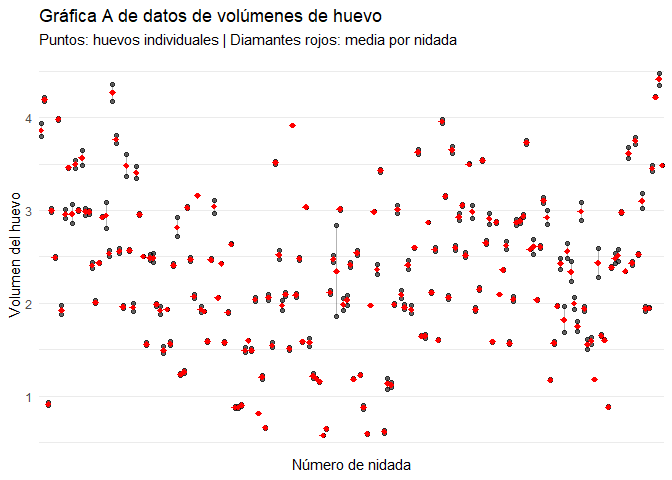
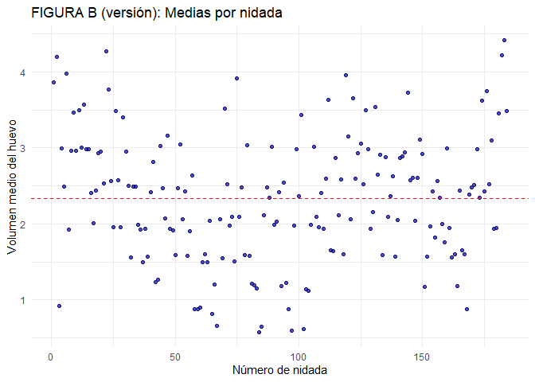

Conglomerados 2 niveles
================
Ruben Cabrera
2025-12-03

# Librerias

``` r
library(ggplot2)
library(dplyr)
```

    ## 
    ## Attaching package: 'dplyr'

    ## The following objects are masked from 'package:stats':
    ## 
    ##     filter, lag

    ## The following objects are masked from 'package:base':
    ## 
    ##     intersect, setdiff, setequal, union

``` r
#library(tidyverse)
library(gridExtra)
```

    ## 
    ## Attaching package: 'gridExtra'

    ## The following object is masked from 'package:dplyr':
    ## 
    ##     combine

``` r
#install.packages("SDaA")
library(SDaA)
```

    ## 
    ## Attaching package: 'SDaA'

    ## The following object is masked from 'package:ggplot2':
    ## 
    ##     seals

``` r
data(coots)
head(coots)
```

    ##   clutch csize length breadth    volume tmt
    ## 1      1    13  44.30   31.10 3.7957569 yes
    ## 2      1    13  45.90   32.70 3.9328497 yes
    ## 3      2    13  49.20   34.40 4.2156036 yes
    ## 4      2    13  48.70   32.70 4.1727621 yes
    ## 5      3     6  51.05   34.25 0.9317646  no
    ## 6      3     6  49.35   34.40 0.9007362  no

``` r
summary(coots)
```

    ##      clutch           csize            length         breadth     
    ##  Min.   :  1.00   Min.   : 5.000   Min.   :41.00   Min.   :28.32  
    ##  1st Qu.: 46.75   1st Qu.: 8.750   1st Qu.:47.40   1st Qu.:33.00  
    ##  Median : 92.50   Median :10.000   Median :48.55   Median :33.59  
    ##  Mean   : 92.50   Mean   : 9.554   Mean   :48.63   Mean   :33.63  
    ##  3rd Qu.:138.25   3rd Qu.:11.000   3rd Qu.:50.01   3rd Qu.:34.35  
    ##  Max.   :184.00   Max.   :13.000   Max.   :53.07   Max.   :36.25  
    ##      volume       tmt     
    ##  Min.   :0.573   no :262  
    ##  1st Qu.:1.680   yes:106  
    ##  Median :2.394            
    ##  Mean   :2.333            
    ##  3rd Qu.:2.945            
    ##  Max.   :4.481

``` r
length(unique(coots$clutch))
```

    ## [1] 184

``` r
coots %>% group_by(clutch) %>% summarise(cant=n())
```

    ## # A tibble: 184 × 2
    ##    clutch  cant
    ##     <int> <int>
    ##  1      1     2
    ##  2      2     2
    ##  3      3     2
    ##  4      4     2
    ##  5      5     2
    ##  6      6     2
    ##  7      7     2
    ##  8      8     2
    ##  9      9     2
    ## 10     10     2
    ## # ℹ 174 more rows

``` r
# Crear resumen por nidada
resumen_nidadas <- coots %>%
  group_by(clutch) %>%
  summarise(
    media = mean(volume),
    sd = sd(volume),
    min = min(volume),
    max = max(volume),
    rango = diff(range(volume)),
    cant = n()
  ) %>%
  arrange(media) %>%
  mutate(orden = row_number())

resumen_nidadas
```

    ## # A tibble: 184 × 8
    ##    clutch media      sd   min   max   rango  cant orden
    ##     <int> <dbl>   <dbl> <dbl> <dbl>   <dbl> <int> <int>
    ##  1     84 0.577 0.00627 0.573 0.582 0.00887     2     1
    ##  2     97 0.594 0.00224 0.593 0.596 0.00317     2     2
    ##  3    102 0.617 0.0181  0.604 0.630 0.0256      2     3
    ##  4     85 0.649 0.0112  0.641 0.657 0.0158      2     4
    ##  5     67 0.660 0.00493 0.657 0.664 0.00697     2     5
    ##  6     65 0.814 0.00581 0.809 0.818 0.00821     2     6
    ##  7     58 0.878 0.0116  0.870 0.886 0.0164      2     7
    ##  8     59 0.878 0.00968 0.872 0.885 0.0137      2     8
    ##  9     96 0.880 0.0254  0.862 0.898 0.0360      2     9
    ## 10    168 0.882 0.00336 0.880 0.885 0.00475     2    10
    ## # ℹ 174 more rows

``` r
# Versión 1: Puntos individuales
fig_a <- ggplot(coots, aes(x = as.factor(clutch), y = volume)) +
  geom_point(alpha = 0.6, size = 1.5) +
  geom_line(aes(group = clutch), alpha = 0.3) +
  stat_summary(fun = mean, geom = "point", 
               color = "red", size = 2, shape = 18) +
  labs(
    title = "Gráfica A de datos de volúmenes de huevo",
    subtitle = "Puntos: huevos individuales | Diamantes rojos: media por nidada",
    x = "Número de nidada",
    y = "Volumen del huevo"
  ) +
  theme_minimal() +
  theme(
    axis.text.x = element_blank(),
    axis.ticks.x = element_blank(),
    panel.grid.major.x = element_blank(),
    panel.grid.minor.x = element_blank()
  )

fig_a
```

<!-- -->

``` r
fig_b <- ggplot(resumen_nidadas, aes(x = clutch, y = media)) +
  geom_point(alpha = 0.7, size = 1.5, color = "darkblue") +
  geom_hline(yintercept = mean(resumen_nidadas$media), 
             linetype = "dashed", color = "red") +
  labs(
    title = "FIGURA B (versión): Medias por nidada",
    x = "Número de nidada",
    y = "Volumen medio del huevo"
  ) +
  theme_minimal()

fig_b
```

<!-- -->
